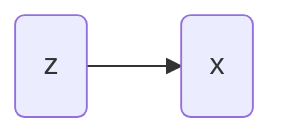
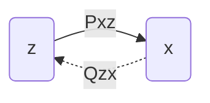
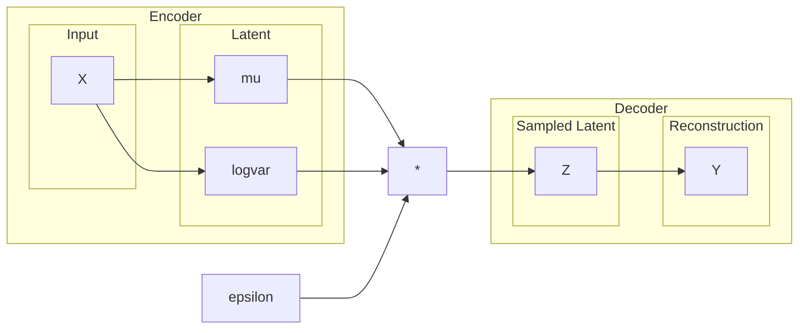

## Model Generatif

Pada umumnya, *machine learning* menghasilkan model yang dapat memprediksi informasi tertentu dari suatu data input. Tipe prediksi yang dilakukan dapat berupa klasifikasi atau regresi. Model semacam ini diberikan istilah yaitu **model diskriminatif / prediktif**.

Adapun tipe lain dari model *machine learning* yang disebut dengan **model generatif**, yang mampu menghasilkan data. Jadi, fungsinya agak berkebalikan dengan model diskriminatif. Karakteristik data yang dihasilkan oleh suatu model generatif bergantung pada data yang menjadi sumber pembelajaran bagi model tersebut.

Analogi berikut ini barangkali bisa mempermudah pemahaman model diskriminatif vs generatif. Model diskriminatif bekerja sebagaimana otak kita mengkategorisasikan benda-benda yang diobservasi. Sedangkan, model generatif bekerja seperti sedang berimajinasi, memvisuaslisasikan suatu objek dibenak kita, atau bermimpi. 

Model generatif biasanya direpresentasikan secara probabilistik. Sebuah model generatif$G$memiliki distribusi probabilitas$\mathbb{P}_G$, yang apabila dilakukan *sampling* dari distribusi tersebut, yakni$x \sim \mathbb{P}_G$, sampel$x$akan berbentuk sesuai dari karakteristik$\mathbb{P}_G$. Jika model$G$belajar dari data kumpulan gambar wajah, maka sampel$x$semestinya akan berbentuk wajah. 

Secara umum, model generatif dapat melakukan inferensi pada 3 hal:

1. **Density estimation**. Dari sebuah sampel$x$, tentukan skor probabilitas yang diberikan oleh model:$\mathbb{P}_G(x)$.
2. **Sampling**. Menghasilkan data/sampel dari dari distribusi:$x \sim \mathbb{P}_G(x)$.
3. **Unsupervised representation learning**. Mempelajari representasi fitur$\phi(x)$dari suatu data$x$.

## Pembelajaran pada Model Generatif

Untuk bisa melakukan inferensi yang diinginkan, model generatif perlu belajar dari data observasi, misalnya, sebuah dataset$\mathcal{D} = \{x_1, \ldots, x_n\}$. Pertama-tama, kita perlu menetapkan sebuah asumsi bahwa terdapat sebuah distribusi probabilitas$\mathbb{P}_\mathcal{D}$yang menjadi sumber keberadaan sampel-sampel pada dataset$\mathcal{D}$.

Model generatif$G$perlu belajar dari dataset$\mathcal{D}$agar distribusi probabilitas$\mathbb{P}_G$mendekati$\mathbb{P}_\mathcal{D}$. Untuk menyatakan pembelajaran tersebut secara formal, kita definisikan sebuah fungsi jarak$d(\mathbb{P}_G, \mathbb{P}_\mathcal{D})$yang mengukur kedekatan antara kedua distribusi probabilitas. Tujuan dari pembelajaran yang dilakukan oleh model generatif$G$yaitu meminimalkan nilai fungsi$d(\mathbb{P}_G, \mathbb{P}_\mathcal{D})$:

$$
\begin{equation}\min_G d(\mathbb{P}_G, \mathbb{P}_\mathcal{D})\end{equation}
$$

## Model Variabel Laten

Di kebanyakan permasalahan pembelajaran mesin skala besar, bentuk model yang digunakan adalah model parametrik, yaitu model yang memiliki struktur parameter tertentu dalam jumlah tetap. Model regresi linear merupakan contoh sederhana dari model parametrik, dimana parameter direpresentasikan dalam bentuk koefisien regresi yang berjumlah tetap.

Salah satu bentuk model parametrik yang dapat dimanfaatkan untuk model generatif$G$adalah model variabel laten. Model ini memiliki variabel tersembunyi$\mathbf{z}$yang dapat memicu dihasilkannya variabel data$\mathbf{x}$, sebagaimana ilustrasi di bawah ini:



Model tersebut memiliki distribusi probabilitas gabungan:

$$
\mathbb{P}(\mathbf{x}, \mathbf{z}) = \mathbb{P}(\mathbf{x} | \mathbf{z}) \mathbb{P}(\mathbf{z})
$$

dimana$\mathbb{P}(\mathbf{z})$dan$\mathbb{P}(\mathbf{x} | \mathbf{z})$merupakan distribusi probabilitas dalam bentuk tertentu yang kita definisikan sendiri. Distribusi normal (Gaussian) merupakan salah satu contoh distribusi probabilitas yang banyak digunakan.

Proses inferensi dalam menghasilkan sebuah sampel dari model variabel latent terdiri dari 2 tahap:

$$
\begin{align*}\tilde{\mathbf{z}}\sim\mathbb{P}(\mathbf{z}) \\ \tilde{\mathbf{x}} ~\sim \mathbb{P}(\mathbf{x}| \mathbf{z} = \tilde{\mathbf{z}})\end{align*}
$$

Dalam konteks model generatif, besaran$\mathbb{P}(\mathbf{x})$menjadi perhatian utama, yang dapat dihitung dengan memarginalisasi distribusi$\mathbb{P}(\mathbf{x}, \mathbf{z})$terhadap variabel$\mathbf{z}$:

$$
\mathbb{P}(\mathbf{x}) = \sum_\mathbf{z} \mathbb{P}(\mathbf{x} | \mathbf{z}) \mathbb{P}(\mathbf{z}) 
$$

Namun demikian, menghitung distribusi marginal di atas secara komputasi tidaklah mudah. Kompleksitas komputasinya berskala eksponensial terhadap pertumbuhan dimensi variabel laten$\mathbf{z}$.

Bagaimanakah dengan menghitung besaran$\mathbb{P}(\mathbf{z} | \mathbf{x})?$Secara teori besaran tersebut dapat dihitung seperti di bawah ini (ingat kembali aturan Bayes):

$$
\mathbb{P}(\mathbf{z} | \mathbf{x}) = \frac{\mathbb{P}(\mathbf{x}|\mathbf{z}) \mathbb{P}(\mathbf{z})}{\mathbb{P}(\mathbf{x})}
$$

Secara praktiknya, besaran tersebut melibatkan penghitungan penyebut distribusi marginal$\mathbb{P}(\mathbf{x})$yang sulit dihitung secara komputasi.

Jadi, pada model variabel laten besaran$\mathbb{P}(\mathbf{z})$dan$\mathbb{P}(\mathbf{x}|\mathbf{z})$dapat dihitung dengan mudah. Namun komputasi$\mathbb{P}(\mathbf{x})$dan$\mathbb{P}(\mathbf{z}|\mathbf{x})$hampir tidak mungkin untuk dijalankan.

## Variational Inference

Dikarenakan penghitungan langsung untuk$\mathbb{P}(\mathbf{z}|\mathbf{x})$hampir tidak mungkin dilakukan, kita memerlukan cara pendekatan/aproksimasi. Salah satu trik yang dapat digunakan adalah *variational inference*, yaitu memilih suatu distribusi yang simpel$\mathbb{Q}(\mathbf{z}|\mathbf{x})$untuk kita dekatkan secara analitis ke$\mathbb{P}(\mathbf{z} | \mathbf{x})$.

Jadi sekarang kita memiliki dua besaran:$\mathbb{P}(\mathbf{z}|\mathbf{x})$yang merepresentasikan model distribusi **kompleks** dan$\mathbb{Q}(\mathbf{z} | \mathbf{x})$merepresentasikan model distribusi **simpel**.

Untuk mengukur kedekatan dua distribusi probabilitas tersebut secara kuantitatif, dibutuhkan fungsi jarak seperti pada persamaan [(1)](https://app.notion.com/p/Variational-Autoencoder-8092774fb03e4b6691ca476f3f24bad1?pvs=21). Salah satu pilihan fungsi yang dapat digunakan adalah Kullback-Leibler Divergence: 

$$
\mathrm{KL}(\mathbb{Q} || \mathbb{P}) = - \sum_\mathbf{x} \mathbb{Q}(\mathbf{x})  \log \frac{\mathbb{P}(\mathbf{x})}{\mathbb{Q}(\mathbf{x})}
$$

Pembahasan terperinci mengenai KL Divergence dapat dilihat pada artikel [berikut](https://app.notion.com/p/Kullback-Leibler-Divergence-Membandingkan-Dua-Distribusi-Probabilitas-380985368ca04a94bca165eb281585a0?pvs=21).

Dengan proses aljabar kita hitung KL Divergence antara model distribusi simpel dan kompleks yang disebutkan sebelumnya.

$$
\begin{align*}\mathrm{KL}(\mathbb{Q}_{z|x} || \mathbb{P}_{z|x}) = - \sum_\mathbf{z} \mathbb{Q}(\mathbf{z} | \mathbf{x}) \log \frac{\mathbb{P}(\mathbf{z} | \mathbf{x})}{\mathbb{Q}(\mathbf{z} | \mathbf{x})} \\ = -\sum_\mathbf{z}\mathbb{Q}(\mathbf{z}|\mathbf{x})\log \frac{\mathbb{P}(\mathbf{x}, \mathbf{z})}{\mathbb{P}(\mathbf{x})\mathbb{Q}(\mathbf{z} | \mathbf{x})} \\
= -\sum_\mathbf{z}\mathbb{Q}(\mathbf{z}|\mathbf{x})\log \frac{\mathbb{P}(\mathbf{x}, \mathbf{z})}{\mathbb{Q}(\mathbf{z} | \mathbf{x})} + \sum_\mathbf{z} \mathbb{Q}(\mathbf{z} | \mathbf{x}) \log\mathbb{P} (\mathbf{x}) \\
= -\sum_\mathbf{z}\mathbb{Q}(\mathbf{z}|\mathbf{x})\log \frac{\mathbb{P}(\mathbf{x}, \mathbf{z})}{\mathbb{Q}(\mathbf{z} | \mathbf{x})} +  \log\mathbb{P} (\mathbf{x}) 
\end{align*}
$$

Perhatikan bahwa persamaan terakhir dapat disimpulkan demikian karena$\sum_\mathbf{z} \mathbb{Q}(\mathbf{z} | \mathbf{x}) = 1$. Jika kita susun ulang persamaan tersebut, akan didapatkan bentuk

$$
\begin{equation}\log \mathbb{P}(\mathbf{x}) = \mathrm{KL}(\mathbb{Q}_{z|x} \| \mathbb{P}_{z|x}) + \underbrace{\sum_\mathbf{z} \mathbb{Q}(\mathbf{z} | \mathbf{x}) \log \frac{\mathbb{P}(\mathbf{x}, \mathbf{z})}{\mathbb{Q}(\mathbf{z} | \mathbf{x})}}_{\mathrm{ELBO}(\mathbb{Q})}\end{equation}
$$

Kuantitas yang paling kanan, yang dikodifikasi dengan$\mathrm{ELBO}(\mathbb{Q})$, kita sebut sebagai **evidence lower-bound (ELBO)**.

Ingat kembali, tujuan kita adalah meminimalkan jarak antara distribusi simpel dan kompleks$\min \mathrm{KL}(\mathbb{Q}_{z|x} \| \mathbb{P}_{z|x})$. Oleh karena$\log \mathbb{P}(\mathbf{x})$pada persamaan [(2)](https://app.notion.com/p/Variational-Autoencoder-8092774fb03e4b6691ca476f3f24bad1?pvs=21) merupakan besaran yang konstan, maka problem meminimalkan KL divergence dapat dipersamakan dengan memaksimalkan evidence lower-bound:

$$
\begin{equation}\max \mathrm{ELBO}(\mathbb{Q}) = \sum_\mathbf{z} \mathbb{Q}(\mathbf{z} | \mathbf{x}) \log \frac{\mathbb{P}(\mathbf{x}, \mathbf{z})}{\mathbb{Q}(\mathbf{z} | \mathbf{x})}\end{equation}
$$

Mengapa kita perlu pindah fokus kepada besaran variational lower-bound? Ini dikarenakan besaran lainnya, yaitu$\log \mathbb{P}(\mathbf{x})$dan$\mathrm{KL}(\mathbb{Q}_{z|x} \| \mathbb{P}_{z|x})$sudah pasti tidak bisa dihitung secara langsung! Jika diperhatikan dengan seksama, trik tersebut dilakukan untuk menghindari perhitungan$\mathbb{P}(\mathbf{x})$dan$\mathbb{P}(\mathbf{x}|\mathbf{z})$.

Ada alasan tertentu$\mathrm{ELBO}(\mathbb{Q})$disebut sebagai *lower-bound*. Perhatikan bahwa nilai minimum$\mathrm{KL}(\mathbb{Q}_{z|x} \| \mathbb{P}_{z|x})=0$, sehingga pernyataan berikut ini pasti benar:

$$
\mathrm{ELBO}(\mathbb{Q}) \leq \log \mathbb{P}(\mathbf{x})
$$

yang berarti **$\mathrm{ELBO}(\mathbb{Q})$merupakan nilai batas bawah dari$\log \mathbb{P}(\mathbf{x})$**.

Sekarang kita lanjutkan pendetilan persamaan [(3)](https://app.notion.com/p/Variational-Autoencoder-8092774fb03e4b6691ca476f3f24bad1?pvs=21) sebagai berikut:

$$
\mathrm{ELBO}(\mathbb{Q}) = \sum_\mathbf{z} \mathbb{Q}(\mathbf{z}|\mathbf{x}) \log \mathbb{P}(\mathbf{x}|\mathbf{z}) + \mathbb{Q}(\mathbf{z}|\mathbf{x}) \log \frac{\mathbb{P}(\mathbf{z})}{\mathbb{Q}(\mathbf{z} | \mathbf{x})}
$$

Maka, bentuk akhir dari ELBO adalah

$$
\begin{equation}\displaystyle \mathrm{ELBO}(\mathbb{Q}) = \mathbb{E}_{\mathbf{z}\sim\mathbb{Q}(\mathbf{z}|\mathbf{x})}[\log \mathbb{P}(\mathbf{x}|\mathbf{z})] - \mathrm{KL}(\mathbb{Q}_{z|x} \|\mathbb{P}_z)\end{equation}
$$

yang secara analitis dapat dieksekusi pada komputer.

## Variational Auto-encoder (VAE)

Selanjutnya kita kaitkan model variabel laten beserta hasil dari *variational inference* persamaan [(4)](https://app.notion.com/p/Variational-Autoencoder-8092774fb03e4b6691ca476f3f24bad1?pvs=21) dengan *auto-encoder*, yang merupakan sebuah *neural networks*  yang didesain untuk merekonstruksi data. Auto-encoder dapat didefinisikan dengan sebuah fungsi$f_{\mathrm{ae}}: \mathcal{X} \rightarrow \mathcal{X}$yang merupakan komposisi dari 2 buah fungsi$\mathrm{Enc}:\mathcal{X}\rightarrow \mathcal{Z}$dan$\mathrm{Dec}:\mathcal{Z}\rightarrow\mathcal{X}$. Diberikan suatu input$\mathbf{x}\in \mathbb{R}^d$, *auto-encoder* menjalankan komputasi sebagai berikut:

-$\mathbf{z}=\mathrm{Enc}_\phi(\mathbf{x})$-$\hat{\mathbf{x}}=\mathrm{Dec}_\psi(\mathbf{z})$Variabel$\mathbf{z} \in \mathbb{R}^k$merepresentasikan kode laten atau fitur hasil kodifikasi dari input, sedangkan$\hat{\mathbf{x}} \in \mathbb{R}^d$merepresentasikan data rekonstruksi. Auto-encoder berfungsi sebagai metode *dimensionality reduction* jika$k<d$.

Kembali ke persamaan [(4)](https://app.notion.com/p/Variational-Autoencoder-8092774fb03e4b6691ca476f3f24bad1?pvs=21), kita memiliki 3 besaran:$\mathbb{P}(\mathbf{z})$,$\mathbb{P}(\mathbf{x}|\mathbf{z})$, dan$\mathbb{Q}(\mathbf{z}|\mathbf{x})$. Jika kita mendefinisikan 3 besaran tersebut dengan spesifikasi tertentu, model variabel laten akan menjadi model generatif yang disebut sebagai **variational auto-encoder (VAE) (**[Kingma and Welling ICLR 2014](https://arxiv.org/abs/1312.6114)).



<aside>
📘 **Definisi 1 - Variational Auto-encoder**
Sebuah model variabel laten dengan distribusi probabilitas gabungan$\mathbb{P}(\mathbf{x}, \mathbf{z}) = \mathbb{P}(\mathbf{x}|\mathbf{z})\mathbb{P}(\mathbf{z})$dan generator$G:\mathcal{Z}\rightarrow \mathcal{X}$merupakan variational auto-encoder apabila:

-$G(\mathbf{z}) = \mathrm{Dec}_\psi(\mathbf{z})$-$\mathbb{P}(\mathbf{z}) = \mathcal{N}(\mathbf{0}, \mathbf{1})$-$\mathbb{P}(\mathbf{x}|\mathbf{z})=\mathcal{N}(\mathrm{Dec}_\psi(\mathbf{z}), \mathbf{0})$-$\mathbb{Q}(\mathbf{z}|\mathbf{x}) = \mathcal{N}(\mathrm{Enc}_\phi(\mathbf{x}), \boldsymbol{\sigma}_q )$</aside>

Dengan mensubstitusi distribusi probabilitas sesuai definisi di atas ke persamaan [(4)](https://app.notion.com/p/Variational-Autoencoder-8092774fb03e4b6691ca476f3f24bad1?pvs=21), maka didapatkan

$$
\mathrm{ELBO}(\mathbb{Q}) = \mathbb{E}_{\mathbf{z}\sim\mathcal{N}(\mathrm{Enc}_\phi(\mathbf{x}), \boldsymbol{\sigma}_q )}[\log \mathcal{N}(\mathrm{Dec}(\mathbf{z}), \mathbf{0})] - \mathrm{KL}(\mathcal{N}(\mathrm{Enc}_\phi(\mathbf{x}), \boldsymbol{\sigma}_q )\|\mathcal{N}(\mathbf{0}, \mathbf{1}))
$$

$$
\begin{equation}\mathrm{ELBO}(\mathbb{Q}) \approx -\sum_{\mathbf{z} \sim \mathcal{N}(\mathrm{Enc}_\phi(\mathbf{x}), \boldsymbol{\sigma}_q )} \| \mathrm{Dec}_\psi(\mathbf{z}) - \mathbf{x}\|^2_2 - \mathrm{KL}(\mathcal{N}(\mathrm{Enc}_\phi(\mathbf{x}), \boldsymbol{\sigma}_q )\|\mathcal{N}(\mathbf{0}, \mathbf{1}))\end{equation}
$$

Dengan demikian, objektif dari pembelajaran VAE adalah memaksimalkan kuantitas pada persamaan (5). Cara lain dalam memandang objektif tersebut adalah meminimalkan nilai negatif dari$\mathrm{ELBO}(\mathbb{Q})$, sehingga menjadi bentuk fungsi *loss* untuk VAE:

$$
\begin{equation}\mathcal{L}(\Theta) = -\mathrm{ELBO}(\mathbb{Q})=\underbrace{\sum_{\mathbf{z} \sim \mathcal{N}(\mathrm{Enc}_\phi(\mathbf{x}), \boldsymbol{\sigma}_q )} \| \mathrm{Dec}_\psi(\mathbf{z}) - \mathbf{x}\|^2_2}_{\text{reconstruction loss}} + \underbrace{\mathrm{KL}(\cdot \| \cdot)}_{\text{regularization}}\end{equation}
$$

dimana$\Theta = \{\phi, \psi\}$merupakan parameter keseluruhan dari *auto-encoder*.

### Mekanisme Pembelajaran VAE

Sebagaimana halnya pada *neural networks/deep learning* standar, pembelajaran pada VAE merupakan proses meminimalkan fungsi *loss*$\mathcal{L}(\Theta)$. Kita menginginkan *stochastic gradient descent* dapat digunakan untuk melakukan pembaruan parameter$\Theta$secara *back-propagation* menuju nilai minimal$\mathcal{L}(\Theta)$:

$$
\Theta_t := \Theta_{t-1} + \alpha \nabla_\Theta \mathcal{L}(\Theta)
$$

Namun demikian, ada satu permasalahan yang menyebabkan back-propagation belum bisa dilakukan berdasarkan persamaan [(6)](https://app.notion.com/p/Variational-Autoencoder-8092774fb03e4b6691ca476f3f24bad1?pvs=21), yaitu keberadaan proses *sampling*$\mathbf{z} \sim \mathbb{Q}(\mathbf{z} | \mathbf{x})$. Hal ini mengakibatkan *gradient* tidak bisa dialirkan ke belakang untuk memperbarui parameter dari *encoder*.

Untuk mengatasinya digunakan suatu trik yang diistilahkan dengan **reparameterisasi**.

<aside>
💡 **Reparameterisasi** merupakan sebuah trik agar back-propagation dapat dilakukan secara penuh pada VAE. Prinsip dasarnya adalah mengubah proses *sampling* pada variabel laten menjadi suatu pendekatan:$\mathbf{z} \approx \boldsymbol{\mu}_\phi(\mathbf{x}) + \boldsymbol{\epsilon} \odot \boldsymbol{\sigma}^2_\phi(\mathbf{x})$, dimana$\boldsymbol{\epsilon}\sim\mathcal{N}(0,1)$Variabel$\boldsymbol{\mu}_\phi$dan$\boldsymbol{\sigma}_\phi$merupakan **rerata** dan **varians** yang keduanya bagian dari luaran dari sebuah *neural networks* atau model *encoder*:$[\boldsymbol{\mu}_\phi, \boldsymbol{\sigma}_\phi] = \mathrm{Enc}_\phi(\mathbf{x})$</aside>

Reparameterisasi tersebut dapat mengubah persamaan [(6)](https://app.notion.com/p/Variational-Autoencoder-8092774fb03e4b6691ca476f3f24bad1?pvs=21) menjadi:

$$
\begin{equation}\mathcal{L}(\Theta) = \underbrace{\sum_{\mathbf{x} \sim \mathbb{P}_\mathcal{D}} \| \mathrm{Dec}_\psi(\boldsymbol{\mu}_\phi + \boldsymbol{\epsilon} \odot \boldsymbol{\sigma}^2_\psi) - \mathbf{x}\|^2_2}_{\text{reconstruction loss}} + \underbrace{\mathrm{KL}(\mathcal{N}(\boldsymbol{\mu}_\phi, \boldsymbol{\sigma}_\phi )\|\mathcal{N}(\mathbf{0}, \mathbf{1}))}_{\text{regularization}}\end{equation}
$$

dimana gradient$\nabla_\Theta \mathcal{L}(\Theta)$dapat dihitung pada keseluruhan *networks* sehingga back-propagation dapat dilakukan.

Gambar di bawah ini mengilustrasikan arsitektur VAE setelah dilakukan reparameterisasi.



Terakhir, dikarenakan input pada kuantitas$\mathrm{KL}(\cdot \| \cdot)$keduanya dalam bentuk distribusi Normal, kita dapat mendeduksinya menjadi persamaan yang lebih jelas untuk diimplementasikan:

$$
\begin{equation}\mathrm{KL}(\mathcal{N}(\boldsymbol{\mu}_\phi, \boldsymbol{\sigma}_\phi )\|\mathcal{N}(\mathbf{0}, \mathbf{1})) = \frac{1}{2} \sum_{j=1}^k ( \boldsymbol{\mu}^2_\phi +  \boldsymbol{\sigma}^2_\phi - \log(\boldsymbol{\sigma}_\phi) - \mathbf{1} )_j \end{equation}
$$

Sekadar merangkum, berikut bentuk akhir fungsi *loss* dari VAE:

$$
\mathcal{L}(\Theta) = \sum_{\mathbf{x} \sim \mathbb{P}_\mathcal{D}} \| \mathrm{Dec}_\psi(\boldsymbol{\mu}_\phi + \boldsymbol{\epsilon} \odot \boldsymbol{\sigma}^2_\psi) - \mathbf{x}\|^2_2 
+ \frac{\beta}{2} \sum_{j=1}^k ( \boldsymbol{\mu}^2_\phi +  \boldsymbol{\sigma}^2_\phi - \log(\boldsymbol{\sigma}_\phi) - \mathbf{1} )_j 
$$

Terdapat tambahan konstanta$\beta$pada persamaan di atas yang berfungsi untuk mengontrol kontribusi dari kuantitas$\mathrm{KL}(\cdot \| \cdot)$terhadap keseluruhan nilai *loss*.

## Implementasi pada PyTorch

Berikut terlampir implementasi kode lengkap dari VAE dalam PyTorch dengan menggunakan dataset tulisan tangan [MNIST](https://www.kaggle.com/datasets/hojjatk/mnist-dataset):

- Training: [https://github.com/ghif/IF5281/blob/main/src/10a-vae_train.ipynb](https://github.com/ghif/IF5281/blob/main/src/10a-vae_train.ipynb)
- Inference: [https://github.com/ghif/IF5281/blob/main/src/10b-vae_predict.ipynb](https://github.com/ghif/IF5281/blob/main/src/10b-vae_predict.ipynb)

Bagian terpenting pada implementasi tersebut yaitu pada pendefinisian model dan fungsi *loss*.

```python
class VariationalAutoencoder(nn.Module):
    def __init__(self, input_size, hidden_size):
        super().__init__()

        self.hidden_size = hidden_size

        self.encoder = nn.Sequential(
            nn.Linear(input_size, hidden_size ** 2),
            nn.Tanh(),
            nn.Linear(hidden_size ** 2, hidden_size * 2),
        )

        self.decoder = nn.Sequential(
            nn.Linear(hidden_size, hidden_size ** 2),
            nn.Tanh(),
            nn.Linear(hidden_size ** 2, input_size),
            nn.Tanh(),
        )
    
    def reparameterise(self, mu, logvar):
				# only active during training mode
				# else: the encoder's output is equal to \mu
        if self.training:
            std = logvar.mul(0.5).exp_()
            eps = std.new_empty(std.size()).normal_()
            return eps.mul_(std).add_(mu)
        else:
            return mu
    
    def encode(self, x):
        mu_logvar = self.encoder(x)
        mu_logvar = mu_logvar.view(-1, 2, self.hidden_size)
        mu = mu_logvar[:, 0, :]
        logvar = mu_logvar[:, 1, :]
        z = self.reparameterise(mu, logvar)
        return z, mu, logvar
    
    def decode(self, z):
        return self.decoder(z)
        
    def forward(self, x):
        z, mu, logvar = self.encode(x)
        xr = self.decode(z)
        return xr, mu, logvar
    
def vae_loss(x_hat, x, mu, logvar, beta=1):
    rec_loss = nn.functional.mse_loss(x_hat, x, reduction="sum")
    kl_loss = 0.5 * torch.sum(mu.pow(2) + logvar.exp() - logvar - 1)

    vae_loss = rec_loss + beta * kl_loss
    return vae_loss, rec_loss, kl_loss
```

Pada implementasi di atas, model *encoder* dan *decoder* menggunakan arsitektur yang sederhana, yaitu *neural network* dengan 2 *hidden layer*. Kita dapat menyesuaikan konfigurasi arsitekturnya bergantung kebutuhan, misalnya memperbesar parameter pada *hidden layer* atau menggunakan *convolutional networks*.

```json
VariationalAutoencoder(
  (encoder): Sequential(
    (0): Linear(in_features=784, out_features=400, bias=True)
    (1): Tanh()
    (2): Linear(in_features=400, out_features=40, bias=True)
  )
  (decoder): Sequential(
    (0): Linear(in_features=20, out_features=400, bias=True)
    (1): Tanh()
    (2): Linear(in_features=400, out_features=784, bias=True)
    (3): Tanh()
  )
)
```

Fungsi **vae_loss(.)** merupakan implementasi dari$\mathcal{L}(\Theta)$pada persamaan [(9)](https://app.notion.com/p/Variational-Autoencoder-8092774fb03e4b6691ca476f3f24bad1?pvs=21).

Berikut ini visualisasi dari model generatif VAE (*decoder*) per epoch. Terlihat bagaimana hasil generasi dari VAE berkembang dari gambar yang belum berbentuk hingga ke bentuk angka-angka.

[**Gambar 4.** Visualisasi Model Generatif VAE per Epoch](media/vae_mnist.mov)

**Gambar 4.** Visualisasi Model Generatif VAE per Epoch
