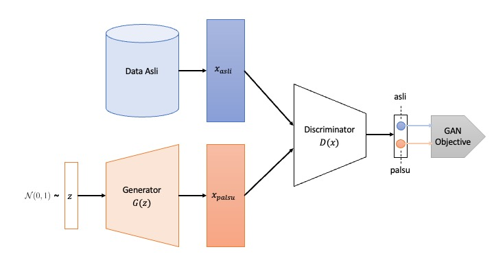

Generative Adversarial Networks (GAN) merupakan salah satu model generatif yang paling populer saat ini. GAN barangkali model generatif pertama yang benar-benar mampu menghasilkan sampel yang realistis dan berkualitas tinggi. [Yann LeCun](https://en.wikipedia.org/wiki/Yann_LeCun), salah satu peraih Turing Award 2018, sempat menyatakan bahwa “GAN merupakan ide yang paling menarik dalam 10 tahun terakhir pada Machine Learning”.

GAN pertama kali diperkenalkan oleh [Ian Goodfellow et al.](https://arxiv.org/abs/1406.2661) pada tahun 2014. Setelahnya perkembangan penelitian mengenai GAN begitu cepat, tidak hanya untuk domain gambar visual tetapi juga pada data audio dan teks.

Tujuan utama dari GAN adalah membentuk sebuah model generatif berbasis variabel laten yang kita namakan generator $G:\mathcal{Z} \rightarrow \mathcal{X}$. Model tersebut perlu menghasilkan distribusi probabilitas $\mathbb{P}_G$ yang belajar dari data $\mathcal{D}$ sehingga mampu mendekati distribusi dari data $\mathbb{P}_\mathcal{D}$. Hal ini sama dengan [Variational Autoencoder](https://app.notion.com/p/Variational-Autoencoder-8092774fb03e4b6691ca476f3f24bad1?pvs=21) (VAE) dimana peran model generatif dilakukan oleh *decoder*.

Perbedaan mendasar antara GAN dengan VAE ataupun model generatif lainnya yaitu pada cara GAN dalam mencapai tujuan. GAN memanfaatkan **mekanisme adversarial** untuk mencapai objektif

$$
\min_{G} d(\mathbb{P}_G, \mathbb{P}_\mathcal{D})
$$

dimana $d(\cdot, \cdot)$ merupakan sebuah fungsi jarak. Nanti kita akan lihat fungsi jarak tersebut didefinisikan secara implisit pada mekanisme adversarial.

## Mekanisme Adversarial

Seperti yang sempat dijelaskan, GAN memiliki sebuah *generator network* $G$ yang memetakan representasi ruang laten ke ruang data. Cara generator untuk menghasilkan sebuah sampel yang dipicu oleh variabel laten adalah sebagai berikut:

$$
\begin{aligned}\mathbf{z}\sim \mathcal{N}(0, 1) 
\\
\mathbf{x} = G(\mathbf{z})
\end{aligned}
$$

Apabila $G$ belum dilatih, tentunya ia belum mampu menghasilkan sampel yang diinginkan. 

GAN melatih generator $G$ dengan cara yang unik, yaitu memanfaatkan *network* lain yang dinamakan *adversarial network* atau *discriminator* $D:\mathcal{X}\rightarrow \mathbb{R}$.

Mengapa disebut *adversarial network*?

Jika kita artikan dalam bahasa kita sehari-hari, mekanisme adversarial menggambarkan hubungan yang memiliki konflik atau memiliki tujuan yang bertentangan. Jadi, seakan-akan *discriminator* $D$ menjadi “teman berantem” dari  *generator* $G$ untuk membuat dirinya menjadi lebih baik.

Andaikan generator $G$ berperan seperti pelukis yang dapat “memalsukan” gambar lukisan. Discriminator $D$ berperan seperti kurator yang menilai apakah suatu lukisan benar-benar berasal dari pelukis asli atau versi yang dipalsukan. GAN mencapai tujuannya apabila *discriminator* $D$ tidak lagi mampu membedakan antara yang asli dan yang palsu — saya jadi teringat film [Mencuri Raden Saleh (2022)](https://www.imdb.com/title/tt13484872/) dan [Bean (1997)](https://www.imdb.com/title/tt0118689/).

## Arsitektur GAN

Tentunya mekanisme adversarial di atas perlu kita nyatakan secara formal dalam bentuk matematis agar dapat diimplementasikan. Pertama, perlu diperjelas bahwa *discriminator*  merupakan sebuah *binary* *classifier*  berbentuk fungsi probabilitas $*D:\mathcal{X} \rightarrow [0,1]$,* dimana luaran 1 berarti ‘asli’, 0 berarti ‘palsu’. Untuk melatih *binary classifier* tersebut, cara standar yang digunakan adalah meminimalkan fungsi *loss* dalam bentuk *binary cross-entropy* sebagai berikut: 

$$
\begin{equation}\ell(D) = -y_{\mathrm{asli}} \log D(x_{\mathrm{asli}}) - (1-y_{\mathrm{palsu}}) \log (1 - D(x_{\mathrm{palsu}}))\end{equation}
$$

dimana $y_{asli}, y_{palsu}$ merupakan label yang menunjukkan keaslian/kepalsuan dari suatu sampel.

Dengan mempertimbangkan fakta-fakta berikut:

$$
\begin{aligned}x_{\mathrm{palsu}} = G(z) \\ y_{\mathrm{asli}} = 1 \\ y_{\mathrm{palsu}} = 0\end{aligned}
$$

dan $x_{\mathrm{asli}}$ ditulis menjadi $x$ serta menegasikan fungsi *loss* di atas, terbentuk sebuah fungsi objektif di bawah ini:

$$
\begin{equation}\mathcal{V}(D, G) = -\ell(D, G)= \log(D(x)) + \log(1-D(G(z)))\end{equation}
$$

Pada persamaan terakhir dapat dilihat bahwa *generator $G$ * masuk dalam perhitungan.

Kita dapat visualisasikan proses pembentukan fungsi objektif di atas dengan diagram arsitektur di bawah ini:



**Gambar 1.** Arsitektur GAN

Untuk melatih *generator* dan *discriminator* tentunya kita membutuhkan sejumlah sampel $x \sim \mathbb{P}_{\mathcal{D}}(x)$ dan $z\sim\mathcal{N}(0,1)$. Dengan demikian persamaan [(2)](https://app.notion.com/p/Generative-Adversarial-Networks-3828fa45b4db43e1a04dbcfb28eab79b?pvs=21) menjadi

$$
\begin{equation}\displaystyle \mathcal{V}(D, G)= \underbrace{\mathbb{E}_{x\sim \mathbb{P}_{\mathcal{D}}(x)}\left[ \log(D(x))\right]}_{\mathrm{data}} + \underbrace{\mathbb{E}_{z\sim \mathcal{N}(0, 1)}\left[\log(1-D(G(z))) \right]}_{\mathrm{model}}\end{equation}
$$

yang merupakan bentuk akhir fungsi objektif **dari GAN.

Bagaimanakah problem optimisasi pada GAN?

Ingat kembali **mekanisme adversarial: discriminator $D$ mencoba untuk menjadi *classifier* yang baik dalam membedakan sampel asli atau palsu. Hal ini ekuivalen dengan memaksimalkan nilai fungsi $\mathcal{V}(D, G).$ Di sisi lain, *generator* $G$ selalu berusaha untuk menghasilkan sampel palsu yang sangat mirip dengan yang asli untuk mengelabui *discriminator* $D$. Ini berarti sama dengan meminimalkan nilai fungsi $\mathcal{V}(D, G)$.

Dengan demikian, problem optimisasi pada GAN merupakan problem *minimax*:

$$
\begin{equation}
\min_{G} \max_{D} \mathcal{V}(D, G)
\end{equation}
$$

Problem optimisasi di atas dapat diselesaikan dengan *back-propagation*. Jika optimisasi berjalan dengan baik, semestinya nilai optimum fungsi objektif $\mathcal{V}(D,G)$ berada di sekitar 0.5, yaitu pertengahan antara nilai asli dan palsu.

## Minimax mampu menghasilkan model generatif

Sekilas mungkin belum terlalu jelas hubungan optimisasi [(4)](https://app.notion.com/p/Generative-Adversarial-Networks-3828fa45b4db43e1a04dbcfb28eab79b?pvs=21) dengan terbentuknya model generatif yang menghasilkan sampel seperti data yang dipelajari. Dengan kata lain, apakah optimisasi (4) berimplikasi $\mathbb{P}_G \approx \mathbb{P}_{\mathcal{D}}$.

Sekarang kita coba lihat sisi lain dari fungsi objektif persamaan [(3)](https://app.notion.com/p/Generative-Adversarial-Networks-3828fa45b4db43e1a04dbcfb28eab79b?pvs=21). Pada besaran yang dilabel sebagai “*model*” kita modifikasi agar mengobservasi sampel langsung dari ruang data. Kita awali dengan asumsi bahwa generator $G$ memiliki *inverse* $G^{-1}:\mathcal{X} \rightarrow \mathcal{Z}$. Dengan asumsi tersebut kita dapat melakukan deduksi sebagai berikut:

$$
\begin{aligned}
z=G^{-1}(x) \\
dz = (G^{-1})^\prime(x) dx
\end{aligned}
$$

Lalu kita substitusi kuantitas yang berkaitan dengan $z$ pada persamaan (3):

$$
\begin{aligned}\displaystyle \mathcal{V}(D, G)= \mathbb{E}_{x\sim \mathbb{P}_{\mathcal{D}}(x)}\left[ \log(D(x))\right] + \mathbb{E}_{z\sim \mathcal{N}(0, 1)}\left[\log(1-D(G(z))) \right]
\\
= \int_x \mathbb{P}_\mathcal{D}(x) \log(D(x)) dx + \int_z \mathbb{P}_Z(z) \log(1 - D(G(z))) dz 
\\
= \int_x \mathbb{P}_\mathcal{D}(x) \log(D(x)) dx + \int_x \mathbb{P}_Z(G^{-1}(x)) \log(1 - D(x)) (G^{-1}(x))^\prime dx
\\
= \int_x \mathbb{P}_\mathcal{D}(x) \log(D(x)) dx + \int_x \mathbb{P}_G(x) \log(1 - D(x)) dx
\end{aligned}
$$

Selanjutnya kita menganalisa tujuan akhir dari fungsi $\mathcal{V}(D, G)$ dalam 2 tahapan.

### 1. Memaksimalkan $\mathcal{V}(D,G)$ terhadap discriminator $D$ Tahap pertama adalah dengan mencari nilai maksimum $\mathcal{V}(D,G)$ terhadap perubahan pada discriminator $D$. Dalam hal ini kita “bekukan” generator $G$.

$$
\begin{equation}\max_D \int_x \mathcal{U}(D) = (\mathbb{P}_\mathcal{D}(x) \log(D(x))+\mathbb{P}_G(x)\log(1-D(x)) )dx\end{equation}
$$

Untuk mencari nilai ekstrem $\mathcal{V}(D,G)$, gunakan turunan parsial $\frac{\partial \mathcal{V}(D, G)}{\partial D} = 0$. 

$$
\frac{\partial \mathcal{V}(D, G)}{\partial D} = \frac{\mathbb{P}_D(x)}{D(x)} - \frac{P_G(x)}{1-D(x)} = 0
$$

Dengan demikian kita mendapatkan persamaan untuk discriminator $D(x)$ yang memaksimalkan fungsi objektif, yakni:

$$
\begin{equation}D^*(x)=\frac{\mathbb{P}_\mathcal{D}(x)}{\mathbb{P}_G(x) + \mathbb{P}_\mathcal{D}(x)}\end{equation}
$$

### 2. Meminimalkan $\mathcal{V}(D, G)$ terhadap generator $G$ Tahap kedua adalah dengan mencari nilai minimum $\mathcal{V}(D, G)$. Kita mulai dengan mensubstitusikan $D(x)$ pada persamaan [(5)](https://app.notion.com/p/2f98147a03564c8291a9094ef384b5b3?pvs=21) dengan nilai ekstrim [(6)](https://app.notion.com/p/Generative-Adversarial-Networks-3828fa45b4db43e1a04dbcfb28eab79b?pvs=21):

$$
\mathcal{C}(G) = \int_x \mathbb{P}_\mathcal{D}(x) \log(\frac{\mathbb{P}_\mathcal{D}(x)}{\mathbb{P}_G(x)  + \mathbb{P}_\mathcal{D}(x)}) + \mathbb{P}_G(x)\log(\frac{\mathbb{P}_G(x)}{\mathbb{P}_G(x) + \mathbb{P}_\mathcal{D}(x)}) dx
$$

Dengan melakukan sedikit modifikasi, persamaan di atas dapat dinyatakan dengan kuantitas [Kullback-Leibler Divergence](https://app.notion.com/p/Kullback-Leibler-Divergence-Membandingkan-Dua-Distribusi-Probabilitas-380985368ca04a94bca165eb281585a0?pvs=21):

$$
\mathcal{C}(G) = \int_x (\mathbb{P}_\mathcal{D}(x) \log(\frac{\mathbb{P}_\mathcal{D}(x)}{0.5(\mathbb{P}_G(x)  + \mathbb{P}_\mathcal{D}(x)})) + \mathbb{P}_G(x)\log(\frac{\mathbb{P}_G(x)}{0.5(\mathbb{P}_G(x) + \mathbb{P}_\mathcal{D}(x)}))) dx - \log(4)

$$

$$
\mathcal{C}(G)=\mathrm{KL}(\mathbb{P}_\mathcal{D}(x) \| 0.5(\mathbb{P}_G(x)+\mathbb{P}_\mathcal{D}(x))) + \mathrm{KL}( \mathbb{P}_G(x) \| 0.5(\mathbb{P}_G(x) + \mathbb{P}_\mathcal{D}(x))) - \log(4)
$$

Dengan sifat $\mathrm{KL}(\cdot \| \cdot) >=0$, kita dapat menyimpulkan bahwa

$$
\min_G \mathcal{C}(G) = -\log(4)
$$

dikarenakan semua kuantitas $\mathrm{KL}(\cdot \| \cdot)$ bernilai 0.

Implikasi lain dari fakta tersebut yaitu

$$
\begin{aligned}\mathrm{KL}(\mathbb{P}_\mathcal{D}(x) \| 0.5 (\mathbb{P}_G(x) + \mathbb{P}_\mathcal{D}(x)) = 0 \\
\implies \mathbb{P}_\mathcal{D}(x) = 0.5(\mathbb{P}_G(x) + \mathbb{P}_\mathcal{D}(x)) \\
\implies \mathbb{P}_\mathcal{D}(x) = \mathbb{P}_G(x)
\end{aligned}
$$

Terbukti bahwa mekanisme adversarial pada GAN secara teoritis mampu **menghasilkan model generatif dengan** **distribusi probabilitas  yang dengan distribusi probabilitas data!**

## Implementasi GAN pada PyTorch

Implementasi GAN berikut ini ditulis berdasarkan artikel “Unsupervised Representation Learning with Deep Convolutional Generative Adversarial Networks” [[Radford et al. ICLR 2016](https://arxiv.org/abs/1511.06434)] atau dikenal dengan DCGAN. Artikel tersebut barangkali kajian pertama yang menujukkan keberhasilan GAN dalam menghasilkan data visual yang berkualitas cukup tinggi. Pada kajian-kajian sebelumnya, proses pembelajaran GAN dianggap tidak stabil dan sulit untuk memproduksi luaran sampel yang konsisten dan layak. Dengan menggunakan arsitektur model tertentu, yakni *convolutional networks*, beserta menetapkan konfigurasi parameter pembelajaran yang tepat, DCGAN mampu mencapai kestabilan hingga level tertentu.

Berikut kode lengkap proses *training* dan *inference* dari DCGAN. Disarankan menggunakan GPU untuk percepatan proses *training*.

- [https://github.com/ghif/IF5281/blob/main/src/11a-dcgan_train.ipynb](https://github.com/ghif/IF5281/blob/main/src/11a-dcgan_train.ipynb)
- [https://github.com/ghif/IF5281/blob/main/src/11b-dcgan_infer.ipynb](https://github.com/ghif/IF5281/blob/main/src/11b-dcgan_infer.ipynb)

Adapun beberapa hal yang perlu dipahami yaitu sebagai berikut.

### Model Generator dan Discriminator

Baik model generator $G$ dan discriminator $D$, DCGAN menggunakan *convolution layer* secara penuh — tidak melibatkan *fully-connected layer* dan juga *pooling layer* yang pada umumnya terdapat pada convolutional networks.

![**Gambar 2**. Model DCGAN [Radford et al. ICLR2016]](media/Screen_Shot_2023-06-01_at_20.12.23.png)

**Gambar 2**. Model DCGAN [Radford et al. ICLR2016]

Berikut cara mendefinisikan arsitektur DCGAN pada PyTorch.

```python
# custom weights initialization called on netG and netD
def weights_init(m):
    classname = m.__class__.__name__
    if classname.find("Conv") != -1:
        nn.init.normal_(m.weight.data, 0.0, 0.02)
    elif classname.find("BatchNorm") != -1:
        nn.init.normal_(m.weight.data, 1.0, 0.02)
        nn.init.zeros_(m.bias.data)

## Model Definition ##
class Generator(nn.Module):
    def __init__(self, nz, ngf, nc, ngpu=0):
        super().__init__()

        self.ngpu = ngpu

        self.network = nn.Sequential(
            # Input is Z, going into a convolution
            nn.ConvTranspose2d(nz, ngf * 8, 4, 1, 0, bias=False),
            nn.BatchNorm2d(ngf * 8),
            nn.ReLU(inplace=True),

            # state size: (ngf * 8) x 4 x 4
            nn.ConvTranspose2d(ngf * 8, ngf * 4, 4, 2, 1, bias=False),
            nn.BatchNorm2d(ngf * 4),
            nn.ReLU(inplace=True),

            # state size: (ngf * 4) x 8 x 8
            nn.ConvTranspose2d(ngf * 4, ngf * 2, 4, 2, 1, bias=False),
            nn.BatchNorm2d(ngf * 2),
            nn.ReLU(inplace=True),

            # state size: (ngf * 2) x 16 x 16
            nn.ConvTranspose2d(ngf * 2, ngf, 4, 2, 1, bias=False),
            nn.BatchNorm2d(ngf),
            nn.ReLU(inplace=True),

            # state size: (ngf) x 32 x 32
            nn.ConvTranspose2d(ngf, nc, 4, 2, 1, bias=False),
            nn.Tanh()
            # state size: (nc) x 64 x 64
        )
    
    def forward(self, input):
        if input.is_cuda and self.ngpu > 1:
            output = nn.parallel.data_parallel(self.network, input, range(self.ngpu))
        else:
            output = self.network(input)
        return output

class Discriminator(nn.Module):
    def __init__(self, nz, ndf, nc, ngpu=0):
        super().__init__()
        self.ngpu = ngpu
        self.network = nn.Sequential(
            # input is (nc) x 64 x 64
            nn.Conv2d(nc, ndf, 4, 2, 1, bias=False),
            nn.LeakyReLU(0.2, inplace=True),

            # state size: (ndf) x 32 x 32
            nn.Conv2d(ndf, ndf * 2, 4, 2, 1, bias=False),
            nn.BatchNorm2d(ndf * 2),
            nn.LeakyReLU(0.2, inplace=True),

            # state size: (ndf * 2) x 16 x 16
            nn.Conv2d(ndf * 2, ndf * 4, 4, 2, 1, bias=False),
            nn.BatchNorm2d(ndf * 4),
            nn.LeakyReLU(0.2, inplace=True),

            # state size: (ndf * 4) x 8 x 8
            nn.Conv2d(ndf * 4, ndf * 8, 4, 2, 1, bias=False),
            nn.BatchNorm2d(ndf * 8),
            nn.LeakyReLU(0.2, inplace=True),

            # state size: (ndf * 8) x 4 x 4
            nn.Conv2d(ndf * 8, 1, 4, 1, 0, bias=False),
            nn.Sigmoid()
        )

    def forward(self, input):
        if input.is_cuda and self.ngpu > 1:
            output = nn.parallel.data_parallel(self.network, input, range(self.ngpu))
        else:
            output = self.network(input)
        return output.view(-1, 1).squeeze(1)

## Model Initialization ##
# Generator
netG = Generator(NZ, NGF, NC, ngpu=NGPU).to(DEVICE)
netG.apply(weights_init)

if pretrained_gen_model_path is not None:
  netG.load_state_dict(torch.load(pretrained_gen_model_path))
print(netG)

# Discrminator
netD = Discriminator(NZ, NDF, NC, ngpu=NGPU).to(DEVICE)
netD.apply(weights_init)
if pretrained_dis_model_path is not None:
  netD.load_state_dict(torch.load(pretrained_dis_model_path))
print(netD)
```

### Mekanisme Pembelajaran

Implementasi pembelajaran mengikuti langkah analisis [*minimax*](https://app.notion.com/p/Generative-Adversarial-Networks-3828fa45b4db43e1a04dbcfb28eab79b?pvs=21) seperti yang dijelaskan sebelumnya, yang terdiri dari 2 tahap: 1) $\max_D \mathcal{V}(D,G)$ dan 2) $\min_G \mathcal{V}(D, G)$.

```python
## Step 1: Update D network by maximizing V(D, G) ##
# Train with real image
netD.zero_grad()
real_cpu = X.to(DEVICE)
batch_size = real_cpu.size(0)
label = torch.full(
    (batch_size,), real_label,
    dtype=real_cpu.dtype, 
    device=DEVICE
)

output = netD(real_cpu)
errD_real = criterion(output, label)
errD_real.backward()
D_x = output.mean().item()

# Train with fake image
noise = torch.randn(batch_size, NZ, 1, 1, device=DEVICE)
fake = netG(noise)
label.fill_(fake_label)
output = netD(fake.detach())
errD_fake = criterion(output, label)
errD_fake.backward()
D_G_z1 = output.mean().item()

errD = errD_real + errD_fake
optimizerD.step()

## Step 2: Update G network by minimizing V(D, G) ##
netG.zero_grad()
label.fill_(real_label) # assign "real" labels for "fake" images
output = netD(fake)
errG = criterion(output, label)
errG.backward()
D_G_z2 = output.mean().item()
optimizerG.step()
```

Perhatikan bahwa trik untuk mengaplikasikan mekanisme adversarial pada kode di atas yaitu dengan cara memberikan label untuk sampel asli dengan label “palsu” pada tahap ke-2: $\min_G \mathcal{V}(D, G)$.

Luaran dari generator $G$ selama proses pembelajaran dengan menggunakan dataset [CIFAR-10](https://www.cs.toronto.edu/~kriz/cifar.html) dapat kita lihat pada visualisasi berikut:

<video controls preload="metadata" width="100%"><source src="media/dcgan_train_vid.mp4" type="video/mp4">Your browser does not support embedded video.</video>
