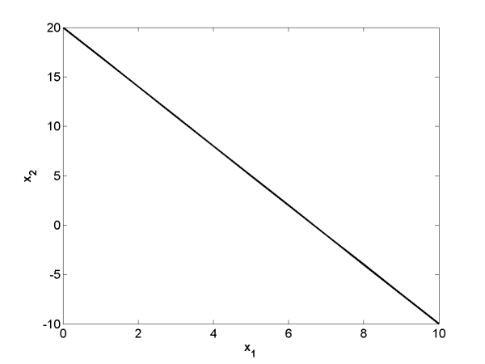
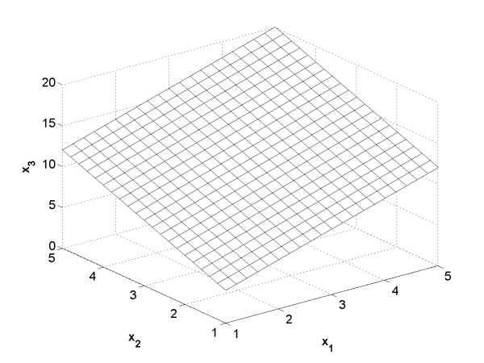
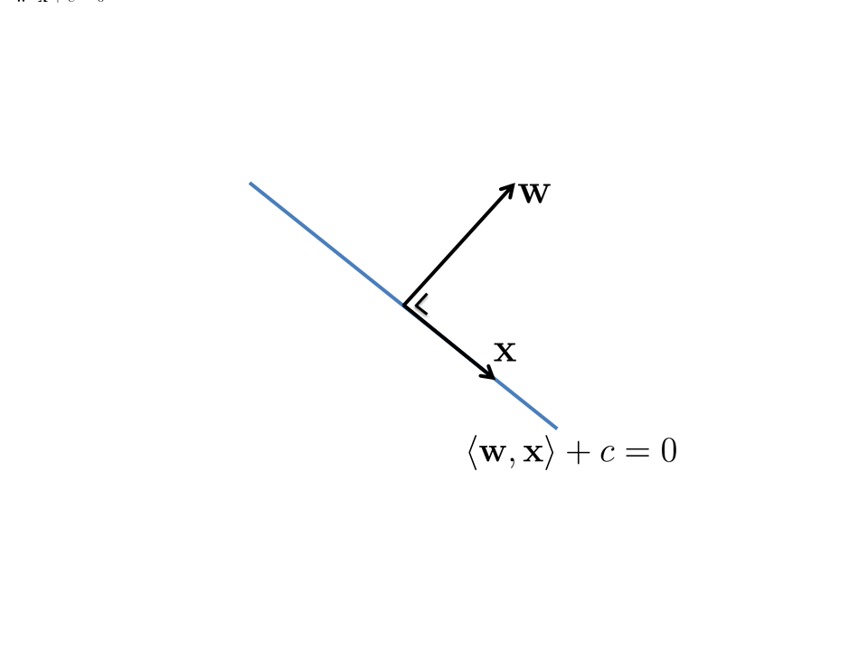
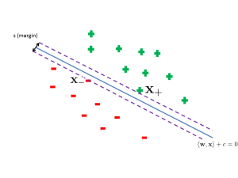
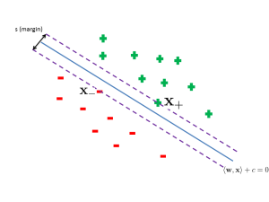
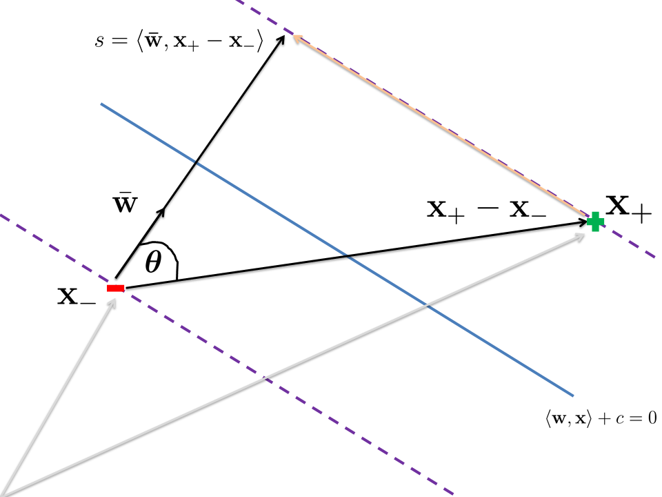
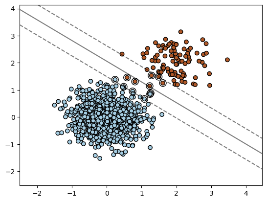
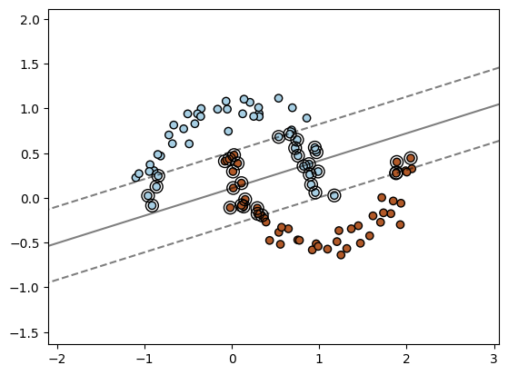
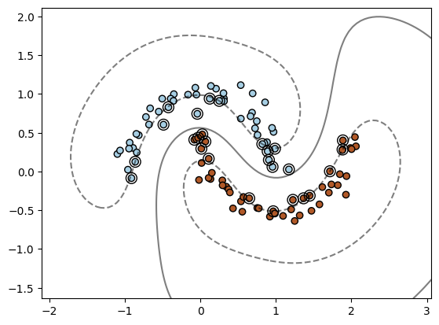

Support Vector Machines (SVM) merupakan  salah satu algoritma pembelajaran mesin yang pernah menjadi paling populer di masanya. Ketenaran SVM membuat neural networks agak terlupakan pada tahun 1990 - 2000an, sebelum neural networks dengan wajah baru bernama deep learning mengambil kembali singgasana sebagai raja machine learning.

Pada masa sumber daya komputasi dan data masih dalam skala kecil, SVM merupakan salah satu algoritma paling efektif dalam membentuk sebuah model supervised learning. Di tambah lagi SVM memiliki landasan teori yang kuat dan dapat dibuktikan validitasnya secara matematis.  

Di sini akan kita bahas konsep dasar algoritma SVM secara matematis dan intuitif hingga implementasi sederhana dengan menggunakan Python.

## Hyperplane

Hyperplane merupakan generalisasi dari garis lurus (pada ruang 2D) atau bidang datar (ruang 3D), yaitu bidang datar berdimensi$d$. Pastinya sulit untuk memvisualisasikan hyperplane$d>3$dibenak kita.

Gambar 1: Hyperplane 2D (garis)

Gambar 2: Hyperplane 3D (bidang datar)

Dalam notasi matematis, hyperplane dapat ditulis sebagai berikut:

$$
w_1 x_1 + \cdots + w_d x_d + c = 0
$$

$$
\implies \sum_{j=1}^d w_j x_j + c = 0 \implies \langle \mathbf{w}, \mathbf{x} \rangle + c = 0
$$

Untuk$d=2$akan didapatkan tampilan visual seperti pada Gambar 1 dan$d=3$pada Gambar 2.

Secara intuitif, dilihat dari sudut pandang geometris hubungan antara vektor$\mathbf{w}$,$\mathbf{x}$, dan hyperplane (dalam 2D) dapat diilustrasikan sebagai berikut:

Gambar 4: Hyperplane, vektor w dan x

Dari gambar tersebut, dapat dilihat bahwa vektor$\mathbf{w}$selalu tegak lurus dengan hyperplane. Mengapa? Silakan dibuktikan sendiri 🙂

*Hint*: geser hyperplane pada Gambar 4 ke titik (0, 0) lalu gunakan definisi ortogonalitas dari$\langle \mathbf{w}, \mathbf{x} \rangle$.

## Ide Dasar: Maximum Margin

Sekarang kita akan bahas ide pokok dari SVM, yang dikenal dengan istilah *maximum margin*. Kita awali bagaimana *decision rule*  dan margin pada SVM dibentuk. 

### Decision Rule

Kita fokuskan pada pemecahan problem klasifikasi biner, yaitu mengidentifikasi apakah suatu sampel berlabel positif (’+’) atau negatif (’-’),$f: \mathbb{R}^d \rightarrow \{-1, +1\}$.

SVM memanfaatkan *hyperplane* dalam menentukan *decision rule*. Misalkan$g(\mathbf{x}) = \langle \mathbf{w}, \mathbf{x} \rangle + b$merupakan *hyperplane, decision rule* untuk klasifikasi biner sebagai berikut:

$$
f(\mathbf{x}) = 
\begin{cases} 
+1, \text{ jika } g(\mathbf{x}) \geq 0 \\ 
-1, \text{ jika } g(\mathbf{x}) < 0
\end{cases}

$$

### Margin

Problem yang ingin dipecahkan SVM adalah mencari bentuk dan posisi *hyperplane*$g(\mathbf{x})$yang dapat menghasilkan model klasifikasi terbaik berdasarkan observasi data$D = \{ \mathbf{x}^{(i)}, y^{(i)} \}_{i=1}^n$. SVM memanfaatkan konsep *margin,* yaitu **semacam area disekitar *hyperplane* yang dibatasi oleh titik data terdekat atau *support vectors*. Ukuran margin ini akan digunakan secara eksplisit untuk menentukan *hyperplane* terbaik. 

Gambar-gambar dibawah ini mengilustrasikan perbedaan ukuran margin yang dihasilkan dari perbedaan kemiringan dari *hyperplane*.

Gambar 5: non-maximum margin

Gambar 6: maximum margin

Hubungan antara *support vectors*, yaitu titik positif dan negatif terdekat ($\mathbf{x}^*_+$dan$\mathbf{x}^*_-$) beserta *hyperplane* membentuk area seperti “jalan” apabila kita tarik garis-garis tepi melewati kedua titik tersebut dan sejajar dengan *hyperplane*. Secara eksplisit garis-garis tepi tersebut dapat didefinisikan dengan 

$$
g(\mathbf{x}^*_+) = \langle \mathbf{w}, \mathbf{x}^*_+ \rangle + c = 1 \\
g(\mathbf{x}^*_-) = \langle \mathbf{w}, \mathbf{x}^*_- \rangle + c = -1
$$

Margin merupakan “lebar jalan” yang dibatasi oleh kedua garis tepi. Untuk mendefinisikan margin secara matematis, kita memanfaatkan proyeksi ortogonal dari support vectors ke vektor satuan$\bar{\mathbf{w}}$, yang merupakan vektor normal dari *hyperplane.* 

Gambar 7: Hubungan vektor data positif dan negatif vs margin

Di bawah ini merupakan bentuk persamaan dari margin:

$$
s = \langle \bar{\mathbf{w}}, \mathbf{x}^*_+ - \mathbf{x}^*_- \rangle \\

$$

Jika kita rinci, persamaan di atas akan berakhir ke bentuk yang relatif sederhana:

$$
s = \langle \frac{\mathbf{w}}{ \| \mathbf{w} \|}, \mathbf{x}^*_+ - \mathbf{x}^*_- \rangle \\
= \frac{1}{\| \mathbf{w} \|} \left( \langle \mathbf{w}, \mathbf{x}^*_+ \rangle + \langle \mathbf{w}, - \mathbf{x}^*_- \rangle \right) \\
= \frac{1}{\| \mathbf{w} \|} \left( 1 - c + 1 + c\right) \\
= \frac{2}{\| \mathbf{w} \|}

$$

Terlihat bahwa persamaan margin berkaitan erat dengan *hyperplane*, yaitu *inverse* dari panjang vektor nomal dari *hyperplane*.

Dengan adanya margin yang didefinisikan melalui 2 garis tepi di atas, kita dapat menuliskan ulang *decision rule* menjadi seperti ini:

$$
f(\mathbf{x}) = 
\begin{cases} 
+1, \text{ jika } (\langle \mathbf{w}, \mathbf{x}_+ \rangle + b)\geq 1 \\ 
-1, \text{ jika } (\langle \mathbf{w}, \mathbf{x}_+ \rangle  + b) \leq -1
\end{cases}

$$

Dengan fakta bahwa$y \in \{-1, +1 \}$, kondisi dari persamaan diatas dapat disederhanakan menjadi:

$$
y(\langle \mathbf{w}, \mathbf{x}\rangle + b) \geq 1
$$

### Problem Optimisasi (*Training*)

Tujuan utama dari SVM adalah memaksimalkan besaran margin$s$. Jika diinterpretasikan dalam problem optimisasi secara intuitif kita dapatkan:

$$
\max \frac{2}{\| \mathbf{w}\|} \implies \min \frac{1}{2} \| \mathbf{w} \| \implies \min \frac{1}{2} \| \mathbf{w} \|^2
$$

Terlihat bahwa memaksimalkan margin ekuivalen dengan meminimalkan panjang vektor normal$\mathbf{w}$.

Lebih lengkapnya kita dapat tulis sebagai problem optimisasi dengan batasan (*constrained optimization*) sebagai berikut:

$$
\min_{\mathbf{w}, b} \frac{1}{2} \| \mathbf{w} \|^2 \text{ subject to } y^{(i)}(\langle \mathbf{w}, \mathbf{x}^{(i)}\rangle + b) \geq 1 \\
i = 1, \ldots, n
$$

dimana$D = \{ \mathbf{x}^{(i)}, y^{(i)} \}_{i=1}^n$merupakan sampel data. 

Kita coba selesaikan problem optimisasi di atas. Dengan memanfaatkan Lagrange multipliers, persamaan optimisasi tersebut dapat menjadi bentuk tanpa batasan (*unconstrained optimization*):

$$
\min_{\mathbf{w}, b} \left\{ L(\mathbf{w}, b) =  \frac{1}{2} \| \mathbf{w} \|^2 - \sum_{i=1}^{n} \alpha_i (y^{(i)}(\langle \mathbf{w}, \mathbf{x}^{(i)}\rangle + b) - 1) \right\}
$$

dimana$\alpha_i \geq 0$.

Kita cari nilai optimum dari parameter$\mathbf{w}, b$dengan turunan parsial$\frac{\partial L}{ \partial \mathbf{w}} = 0$dan$\frac{\partial L}{ \partial b} = 0$sehingga didapatkan:

$$
\frac{\partial L}{ \partial \mathbf{w}} = \mathbf{w} - \sum_{i=1}^n \alpha_i y^{(i)} \mathbf{x}^{(i)} = 0 \\
\implies \mathbf{w}^* = \sum_{i=1}^n \alpha_i y^{(i)} \mathbf{x}^{(i)}
$$

$$
\frac{\partial L}{\partial b} = - \sum_{i=1}^{n} \alpha_i y^{(i)} = 0
$$

Jika kita substitusikan balik$\mathbf{w}^*$ke persamaan Lagrange$L(\mathbf{w}, b)$didapatkan:

$$
\min_{\boldsymbol{\alpha}} \left\{ L(\boldsymbol{\alpha}) = \sum_{i=1}^n \alpha_i - \sum_{i=1}^n \sum_{j=1}^n \alpha_i \alpha_j y^{(i)} y^{(j)} \langle \mathbf{x}^{(i)}, \mathbf{x}^{(j)}\rangle \right\}\\
\text{ subject to } \alpha_i \geq 0, \sum_{i=1}^{n} \alpha_i y^{(i)} = 0
$$

Dengan mengubah persamaan di atas menjadi notasi matriks-vektor,$L(\alpha)$dapat ditulis menjadi:

$$
\min_{\boldsymbol{\alpha}} \left\{ L(\boldsymbol{\alpha}) = - \mathbf{z}^\top G \mathbf{z} + \| \boldsymbol{\alpha} \|_1 \right \} \\
\text{ subject to } \boldsymbol{\alpha} \succeq 0, \langle \boldsymbol{\alpha}, \mathbf{y} \rangle = 0
$$

dimana$\mathbf{z}, \boldsymbol{\alpha}, \mathbf{y} \in \mathbb{R}^n$, dan$z_i = \alpha_i y^{(i)}$, serta$\mathbf{G} \in \mathbb{R}^{n \times n}$merupakan matriks yang berisi dot-product dari seluruh pasangan sampel, yang dikenal dengan sebutan *Gram Matrix:*

$$
\begin{equation}
\mathbf{G} = 
\begin{pmatrix}
\langle \mathbf{x}^{(1)} \mathbf{x}^{(1)} \rangle & \langle \mathbf{x}^{(1)} \mathbf{x}^{(2)} \rangle & \cdots & \langle \mathbf{x}^{(1)} \mathbf{x}^{(n)} \rangle \\
\langle \mathbf{x}^{(2)} \mathbf{x}^{(1)} \rangle & \langle \mathbf{x}^{(2)} \mathbf{x}^{(2)} \rangle & \cdots & \langle \mathbf{x}^{(2)} \mathbf{x}^{(n)} \rangle \\
\vdots & \vdots & \ddots & \vdots \\
\langle \mathbf{x}^{(n)} \mathbf{x}^{(1)} \rangle & \cdots & \cdots &\langle \mathbf{x}^{(n)} \mathbf{x}^{(n)} \rangle
\end{pmatrix}
\end{equation}
$$

Problem optimisasi bentuk terakhir dapat diselesaikan dengan *Quadratic Programming* (QP) yang diluar dari jangkauan pembahasan di sini. Pada akhirnya QP akan menghasilkan parameter optimal$\boldsymbol{\alpha}^*$.

### Inference

Diketahui suatu sampel di luar data training$\mathbf{x}_u$, inferensi pada SVM sama dengan menjalankan komputasi model linear pada umumnya:

$$
f_{\mathbf{w}^*, b}(\mathbf{x}_u) = \langle \mathbf{w}^*, \mathbf{x}_u \rangle + b
$$

Dengan fakta bahwa$\mathbf{w}^* = \sum_{i=1}^n \alpha^*_i y^{(i)} \mathbf{x}^{(i)}$, persamaan inferensi di atas dapat ditulis menjadi

$$
\begin{equation}
f_{\boldsymbol{\alpha}^*, b} (\mathbf{x}_u) = \sum_{i=1}^n \alpha_i y^{(i)} \langle \mathbf{x}^{(i)}, \mathbf{x}_u \rangle + b
\end{equation}
$$

Keseluruhan proses di atas merupakan suatu algoritma yang dinamakan dengan ***linear SVM***.

## Menuju Dunia Non-Linear dengan Fungsi Kernel

Algoritma *linear SVM* yang sudah dijelaskan sebelumnya memiliki keterbatasan fundamental yaitu tidak mampu mengatasi permasalahan yang berkarakteristik non-linear, yakni linear SVM hanya mampu menghasilkan *decision boundary* yang baik pada situasi kumpulan sampel yang *linearly separable*.

Pada Gambar 8 di bawah (kasus *linearly separable*), dapat diamati bahwa linear SVM dapat memisahkan kelompok data dengan cukup baik, bahkan untuk situasi jumlah sampel positif dan negatif yang tidak seimbang (*imbalanced data*). 

Namun pada struktur sampel berbentuk ‘bulan sabit’ yang non-linearly separable (Gambar 9), *hyperplane* yang terbentuk tidak mampu benar-benar memisahkan kedua kelompok data.

Gambar 8: Linearly Separable

Gambar 9: Non-linearly Separable

Agar bisa menangani situasi non-linear, kita memerlukan suatu fungsi transformasi terhadap data input ke dalam ruang lain dimana hasil transformasinya memiliki karakteristik *linearly separable*.

### Fungsi Transformasi Non-Linear dan Kernel

Pertama-tama, kita definisikan suatu fungsi transformasi non-linear dari data input menjadi representasi lain yang kita namakan dengan feature (*feature transformation)*.

$$
\phi: \mathcal{X} \rightarrow \mathcal{H}
$$

dimana$\mathcal{X}$merupakan ruang input dan$\mathcal{H}$merupakan ruang representasi/feature yang berdimensi lebih tinggi:$\dim(\mathcal{H}) >> \dim(\mathcal{X})$.

Dengan memetakan data input ke bentuk representasi/*feature* pada ruang berdimensi lebih tinggi$\mathcal{H}$, kita mengharapkan representasi hasil pemetaan tersebut bersifat *linearly separable*.

Gambar 10 di bawah ini mengilustrasikan transformasi non-linear dari data 2D ke ruang 3D,$\phi:\mathbb{R}^2\rightarrow \mathbb{R}^3$, dimana struktur dari kelompok data pada ruang 3D menjadi dapat dipisahkan.

)](media/0_ngkO1BblQXnOTcmr.webp)

Gambar 10: Ilustrasi transformasi data ke dimensi yang lebih tinggi (sumber: [https://towardsdatascience.com/understanding-the-kernel-trick-e0bc6112ef78](https://towardsdatascience.com/understanding-the-kernel-trick-e0bc6112ef78))

Contoh fungsi transformasi lain yang agak lebih kompleks adalah sebagai berikut:$\phi:\mathbb{R}^3 \rightarrow \mathbb{R}^9$$$
\begin{equation}
\mathbf{x} = \begin{bmatrix} x_1 \\ x_2 \\ x_3\end{bmatrix} \rightarrow \phi(\mathbf{x}) = \begin{bmatrix} x_1 x_1 \\ x_1 x_2 \\ x_1 x_3 \\ x_2 x_1 \\ x_2 x_2 \\ x_2 x_3 \\ x_3 x_1 \\ x_3 x_2 \\ x_3 x_3\end{bmatrix}
\end{equation}
$$

Semakin tinggi dimensi dari representasi yang dihasilkan oleh fungsi transformasi$\phi$, semakin besar pula kemungkinan mendapatkan struktur data yang *linearly separable*. Namun ada harga yang mesti dibayar, yaitu kompleksitas komputasi. 

Pada contoh di atas, terdapat$3^2 = 9$komputasi perkalian untuk input berdimensi$3$. Jika input memiliki dimensi$d$, maka kompleksitas komputasi dari$\phi$seharga$O(d^2)$. Hal tersebut tentunya menjadi tidak praktis jika input memiliki dimensi yang besar. 

### Trik Kernel

Di pembahasan mengenai *linear SVM* sebelumnya, kita melihat ada suatu kesamaan terkait ekspresi matematis antara fase *training* [(1)](https://app.notion.com/p/Support-Vector-Machines-Penjelasan-Matematis-dan-Intuitif-ba646d48d8004858a16897cbb1d4dbd3?pvs=21) dan *inference* [(2)](https://app.notion.com/p/Support-Vector-Machines-Penjelasan-Matematis-dan-Intuitif-ba646d48d8004858a16897cbb1d4dbd3?pvs=21), yaitu vektor input$\mathbf{x}$tidak pernah berdiri sendiri, melainkan selalu bersanding dengan input lainnya dalam bentuk *dot product*:$\langle \mathbf{x}, \mathbf{z} \rangle$. Dengan memanfaatkan fungsi transformasi$\phi:\mathcal{X}\rightarrow \mathcal{Y}$, kita definisikan fungsi kernel$k: \mathcal{X} \times \mathcal{X} \rightarrow \mathbb{R}$:

$$
\begin{equation}
k(\mathbf{x}, \mathbf{z}) = \langle \phi(\mathbf{x}), \phi(\mathbf{z}) \rangle
\end{equation}
$$

Dengan demikian, kita dapat menulis ulang ekspresi matematika yang digunakan pada linear SVM menjadi:

**Matriks Gram**

$$
\begin{equation}
\mathbf{G} = 
\begin{pmatrix}
k(\mathbf{x}^{(1)}, \mathbf{x}^{(1)}) & k( \mathbf{x}^{(1)}, \mathbf{x}^{(2)} )& \cdots & k(\mathbf{x}^{(1)}, \mathbf{x}^{(n)})\\
k(\mathbf{x}^{(2)}, \mathbf{x}^{(1)}) & k(\mathbf{x}^{(2)}, \mathbf{x}^{(2)}) & \cdots & k(\mathbf{x}^{(2)}, \mathbf{x}^{(n)}) \\
\vdots & \vdots & \ddots & \vdots \\
k(\mathbf{x}^{(n)}, \mathbf{x}^{(1)} ) & \cdots & \cdots &k(\mathbf{x}^{(n)}. \mathbf{x}^{(n)} )
\end{pmatrix}
\end{equation}
$$

**Persamaan Inferensi**

$$
\begin{equation}
f_{\boldsymbol{\alpha}^*, b} (\mathbf{x}_u) = \sum_{i=1}^n \alpha_i y^{(i)} k( \mathbf{x}^{(i)}, \mathbf{x}_u ) + b
\end{equation}
$$

Dengan ekspresi di atas, kita telah mengkonversi *linear* SVM menjadi *non-linear* SVM.

Lalu, apa keistimewaan penggunaan fungsi kernel$k(\cdot, \cdot)$dibandingkan fungsi transformasi$\phi(\cdot)$? Jawabannya adalah komputasi fungsi kernel jauh lebih efisien atau kompleksitasnya tidak bertumbuh mengikuti dimensi input$\mathbf{x}$. Trik inilah yang populer dengan istilah *kernel trick*!

Sebagai ilustrasi, kita simulasikan perhitungan fungsi kernel$k(\mathbf{x}, \mathbf{z}) = \langle \phi(\mathbf{x}), \phi(\mathbf{z}) \rangle$dengan menggunakan fungsi transformasi pada persamaan [(3)](https://app.notion.com/p/Support-Vector-Machines-Penjelasan-Matematis-dan-Intuitif-ba646d48d8004858a16897cbb1d4dbd3?pvs=21):

$$
k(\mathbf{x}, \mathbf{z}) = \langle \phi(\mathbf{x}), \phi(\mathbf{z}) \rangle
\\
 = x_1 x_1 z_1 z_1 + x_1 x_2 z_1 z_2 + x_1 x_3 z_1 z_3 + x_2 x_1 z_2 z_1 + x_2 x_2 z_2 z_2 + x_2 x_3 z_2 z_3 + x_3 x_1 z_3 z_1 + x_3 x_2 z_3 z_2 + x_3 x_3 z_3 z_3 \\
= \sum_{i=1}^3 \sum_{j=1}^3 x_i x_j z_i z_j \\
= \sum_{i=i}^3 x_i z_i \sum_{j=1}^3 x_j z_j \\
= (\langle \mathbf{x}, \mathbf{z} \rangle)^2

$$

Dengan sedikit manipulasi aljabar, ternyata fungsi kernel di atas tidak memerlukan perhitungan$\phi(\cdot)$secara eksplisit, hanya bergantung pada *dot product* antara$\mathbf{x}$dan$\mathbf{z}$. Hal ini berimplikasi pada kompleksitas komputasi fungsi kernel di atas menjadi$O(d)$dimana$d$merupakan dimensi dari input — bandingkan dengan kompleksitas komputasi$\phi(\cdot)$sebesar$O(d^2)$.

### Bentuk Fungsi Kernel

Dari pembahasan sebelumnya, sebenarnya kita sudah mengidentifikasi 2 jenis fungsi kernel:

- **Linear**:$k(\mathbf{x}, \mathbf{z}) = \langle \mathbf{x}, \mathbf{z} \rangle$- **Polinomial**:$k(\mathbf{x}, \mathbf{z}) = (\langle \mathbf{x}, \mathbf{z} + c\rangle)^p$, yang merupakan generalisasi dari bentuk$(\langle \mathbf{x}, \mathbf{z} \rangle)^2$Adapun beberapa contoh fungsi kernel lain yang sering digunakan:

- **Gaussian / Radial Basis Function (RBF)**:$k(\mathbf{x}, \mathbf{z}) = \exp( - \gamma \| \mathbf{x} - \mathbf{z} \|^2)$- **Laplace RBF**:$k(\mathbf{x}, \mathbf{z}) = \exp \left(- \frac{\| \mathbf{x} - \mathbf{z} \|}{\sigma} \right)$- **Sigmoid**:$k(\mathbf{x}, \mathbf{z}) = \tanh(\alpha \langle \mathbf{x}, \mathbf{z} \rangle + c)$dan sebagainya.

Interpretasi lain dari fungsi kernel adalah sebagai ukuran kesamaan antar 2 representasi vektor atau fungsi similaritas. Semakin tinggi nilai$k(\mathbf{x}, \mathbf{z})$berarti semakin dekat hubungan antara$\mathbf{x}$dan$\mathbf{z}$.

Contoh-contoh fungsi kernel di atas merupakan kernel yang valid, yaitu fungsi kernel yang terasosiasi dengan fungsi transformasi$\phi:\mathcal{X} \rightarrow \mathcal{H}$tertentu:$k(\phi(\mathbf{x}), \phi(\mathbf{z}))$.

Jadi, syarat agar algoritma non-linear SVM dapat bekerja yaitu menggunakan fungsi kernel yang valid. Lalu, bagaimana memastikan validitas dari suatu fungsi kernel$k(\cdot, \cdot)$tanpa harus mengetahui fungsi transformasi$\phi(\cdot)$? 

Secara singkat, jawaban dari pertanyaan di atas sudah dijawab melalui [Teori Mercer](https://ai-master.gitbooks.io/kernel-svm/content/mercers-theorem.html), yaitu cukup dengan memastikan matriks Gram$G_{ij} = [k(\mathbf{x}^{(i)}, \mathbf{x}^{(j)})]$, yang dibentuk oleh kernel$k(\cdot, \cdot)$dan sampel input$\{ \mathbf{x}^{(1)}, \ldots, \mathbf{x}^{(n)}\}$, bersifat *positive, semi-definite (PSD).*

Mari kita buktikan. 

Matriks$\mathbf{G} \in \mathbb{R}^{n \times n}$bersifat PSD jika memenuhi kondisi:

$$
\mathbf{z}^\top \mathbf{G} \mathbf{z} \geq0
$$

untuk vektor sebarang$\mathbf{z} \in \mathbb{R}^n$. Dengan mengasumsikan keberadaan$\phi(\cdot)$, maka

$$
\mathbf{z}^\top \mathbf{G} \mathbf{z} = \sum_{i} \sum_j z_i G_{ij} z_j = \sum_{i} \sum_j z_i \langle \phi(\mathbf{x}^{(i)}, \mathbf{x}^{(j)})\rangle z_j \\
= \sum_i \sum_j z_i \sum_k \phi_k(\mathbf{x}^{(i)}) \phi_k(\mathbf{x}^{(j)})z_j \\
= \sum_k \sum_i z_i \phi_k(\mathbf{x}^{(i)}) \sum_j z_j \phi_k(\mathbf{x}^{(j)}) = \sum_k \left(\sum_i z_i \phi_k(\mathbf{x}^{(i)}) \right)^2 \geq 0
$$

### Non-linear SVM

Kita kembali lagi kepada contoh struktur data ‘bulan sabit’ pada [Gambar 9](https://app.notion.com/p/Support-Vector-Machines-Penjelasan-Matematis-dan-Intuitif-ba646d48d8004858a16897cbb1d4dbd3?pvs=21) dimana linear SVM tidak mampu menghasilkan *decision boundary* yang tepat. Dengan menggunakan kernel Radial Basis Function (RBF):$k(\mathbf{x}, \mathbf{z}) = \exp  \left( - \gamma \| \mathbf{x} - \mathbf{z} \|^2 \right)$, didapatkan *decision boundary* non-linear seperti ini:

Gambar 11: Non-linear SVM dengan kernel RBF

## Implementasi

Kode implementasi yang mensimulasikan SVM untuk menyelesaikan problem klasifikasi serta menghasilkan beberapa grafik di atas dapat ditemukan di:

[https://github.com/ghif/IF6080/tree/main/4-svm](https://github.com/ghif/IF6080/tree/main/4-svm)
