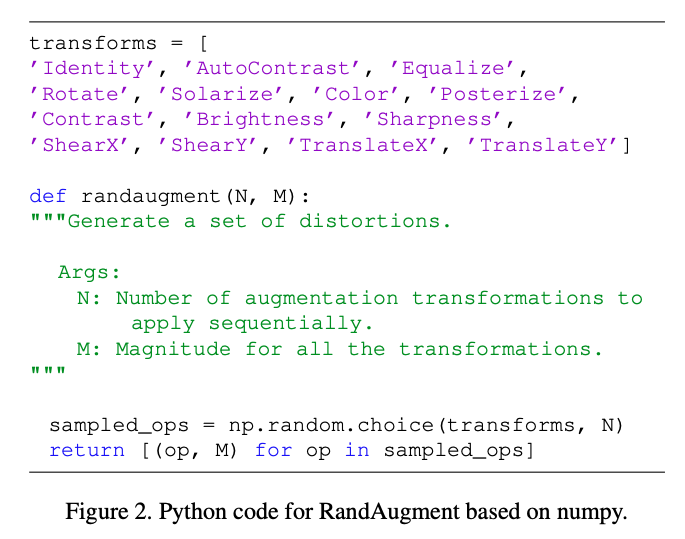
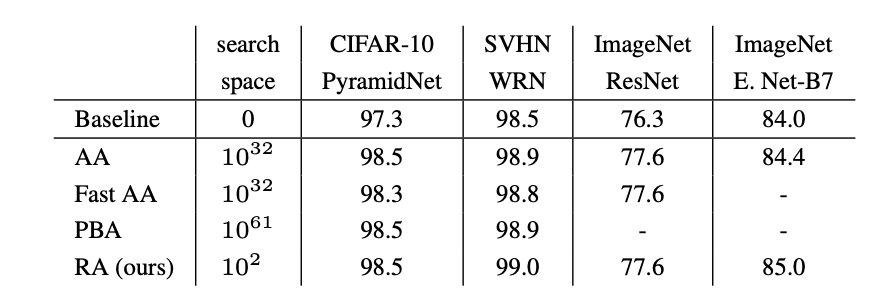
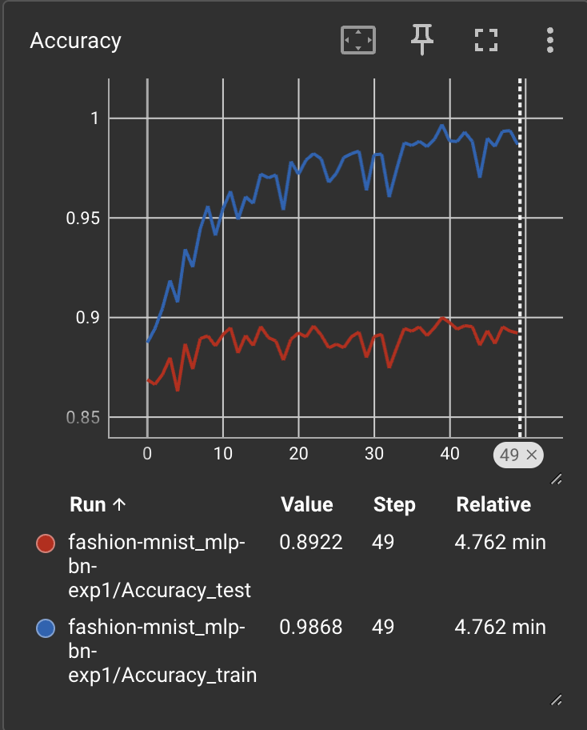
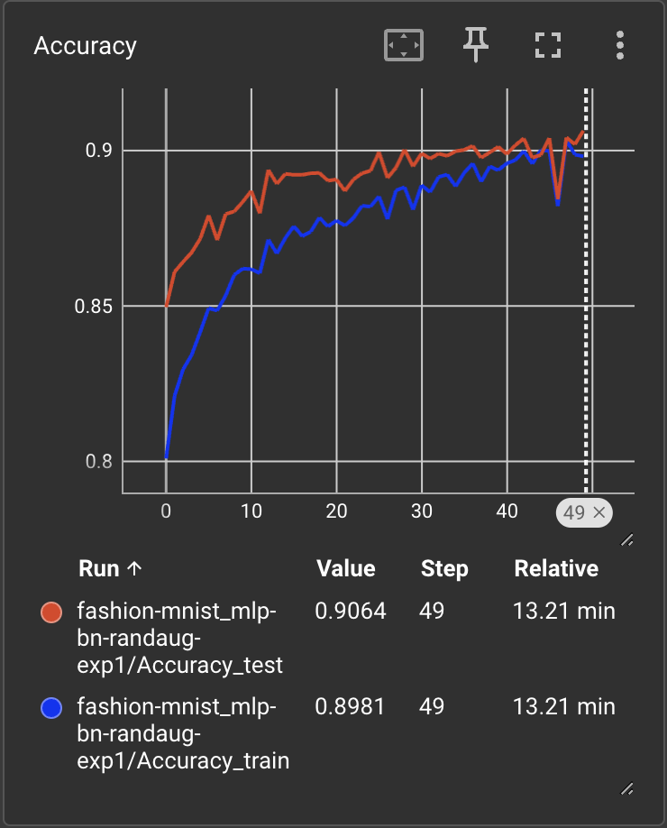
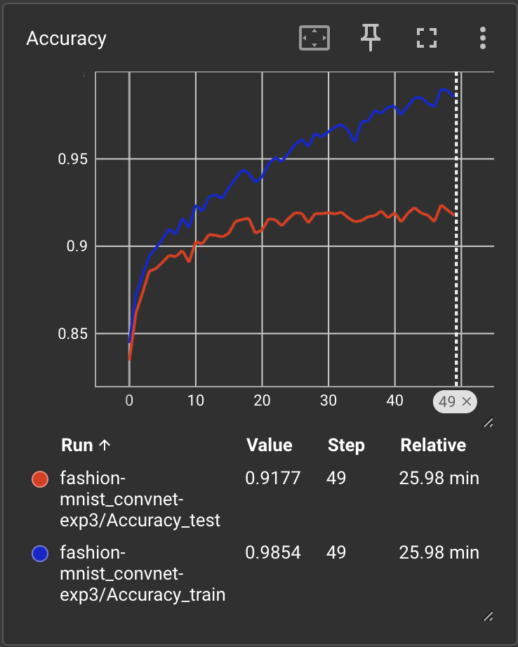
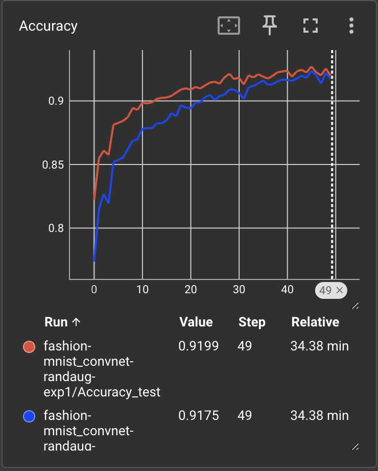

## Augmentasi Data

Salah satu cara populer dan efektif untuk mereduksi efek *overfitting* pada model klasifikasi berbasis *machine learning* adalah augmentasi data (*data augmentation*), yaitu memperbesar variasi dari data atau fitur tanpa harus mengoleksi tambahan data secara manual. Pada data citra, hal ini dapat dilakukan dengan melakukan berbagai transformasi citra.

Secara matematis, augmentasi data diperoleh dengan mengaplikasikan fungsi transformasi$\tau_\alpha: \mathcal{X} \rightarrow \mathcal{X}$terhadap citra input$x \in \mathcal{X}$:

$$
\tilde{x} = \tau_\alpha(x)
$$

dimana indeks$\alpha$merepresentasikan berbagai jenis transformasi. Pada domain citra,$\alpha$merupakan salah satu dari fungsi-fungsi manipulasi standar pada citra seperti rotasi, translasi, dilatasi, dan sebagainya. Jenis transformasi biasanya ditentukan secara spesifik oleh *domain expert* yang dianggap paling sesuai untuk membangun model klasifikasi pada domain tersebut.

Mendesain fungsi transformasi citra untuk melakukan augmentasi data terkadang cukup kompleks dan memerlukan pemahaman cukup mendalam terhadap karakteristik citra. Akhir-akhir ini terdapat beberapa percobaan untuk menangani hal tersebut secara otomatis, dimana kita menyerahkan kepada algoritma untuk mendesain fungsi transformasi yang paling optimal.

Salah satu metode yang dapat melakukan otomatisasi pemilihan fungsi transformasi adalah [AutoAugment](https://openaccess.thecvf.com/content_CVPR_2019/papers/Cubuk_AutoAugment_Learning_Augmentation_Strategies_From_Data_CVPR_2019_paper.pdf), yang memanfaatkan *reinforcement learning (RL)* untuk mempelajari kombinasi berbagai jenis transformasi beserta besaran (magnitude) dari transformasi yang paling optimal berdasarkan performa akurasi pada data validasi. Namun demikian, metode ini menambah kompleksitas pelatihan secara keseluruhan yang cukup signifikan dikarenakan adanya tambahan proses *reinforcement learning.*

## RandAugment

Untuk mengurangi kompleksitas otomatisasi pemilihan fungsi transformasi, dirancanglah [RandAugment](https://proceedings.neurips.cc/paper_files/paper/2020/file/d85b63ef0ccb114d0a3bb7b7d808028f-Paper.pdf) yang merupakan kasus khusus dari AutoAugment. RandAugment menghilangkan proses *reinforcement learning* untuk pemilihan kombinasi fungsi transformasi,  digantikan dengan pemilihan acak secara uniform.

Secara garis besar, algoritma RandAugment diilustrasikan pada kode Python di bawah ini. RandAugment memiliki N=14 fungsi transformasi yang dapat dipilih secara acak untuk tiap *batch* pelatihan. Dengan kata lain, peluang suatu fungsi transformasi akan terpilih sebagai bagian dari augmentasi yaitu 1/14. Nilai *magnitude* M diberikan secara konstan berdasarkan pengamatan empiris terhadap performa data validasi. 



Pada papernya dilaporkan bahwa RandAugment mampu menghasilkan performa yang setara atau bahkan lebih baik dibandingkan dengan AutoAugment dan beberapa metode augmentasi lainnya, dengan komputasi yang jauh lebih sederhana.



## Eksperimen

Kita lakukan percobaan sendiri untuk menguji efektifitas dari RandAugment. Dataset yang digunakan adalah [Fashion MNIST](https://github.com/zalandoresearch/fashion-mnist) yang dibuat oleh Zalando. Dataset ini memiliki karakteristik yang serupa dengan MNIST handwritten digit: 10 kelas objek yang terdiri dari 60,000 data latih dan 10,000 data uji. Kelas-kelas tersebut merepresentasikan objek *fashion* seperti *T-shirt*, *Trouser*, *Bag*, *Angkle boot* dan sebagainya.


### Konfigurasi Pelatihan

Pada percobaan ini kita membandingkan 2 model *neural networks* yang diimplementasikan dengan menggunakan [PyTorch](https://pytorch.org/) versi 2.1.0.

**MLP**: 3-layer neural networks dengan batch normalization

```bash
NeuralNetwork(
  (flatten): Flatten(start_dim=1, end_dim=-1)
  (linear_relu_stack): Sequential(
    (0): Linear(in_features=784, out_features=512, bias=True)
    (1): BatchNorm1d(512, eps=1e-05, momentum=0.1, affine=True, track_running_stats=True)
    (2): ReLU()
    (3): Linear(in_features=512, out_features=512, bias=True)
    (4): BatchNorm1d(512, eps=1e-05, momentum=0.1, affine=True, track_running_stats=True)
    (5): ReLU()
    (6): Linear(in_features=512, out_features=10, bias=True)
  )
)
```

**ConvNet**: convolutional networks sederhana (2 convolution → 1 max-pooling → 1 dense layer)

```bash
ConvNet(
  (convnet): Sequential(
    (0): Conv2d(1, 32, kernel_size=(3, 3), stride=(1, 1), padding=(1, 1))
    (1): MaxPool2d(kernel_size=2, stride=2, padding=0, dilation=1, ceil_mode=False)
    (2): Conv2d(32, 64, kernel_size=(3, 3), stride=(1, 1), padding=(1, 1))
    (3): ReLU()
    (4): MaxPool2d(kernel_size=2, stride=2, padding=0, dilation=1, ceil_mode=False)
    (5): Flatten(start_dim=1, end_dim=-1)
    (6): Linear(in_features=3136, out_features=128, bias=True)
    (7): ReLU()
    (8): Linear(in_features=128, out_features=10, bias=True)
  )
)
```

Kedua model tersebut dilatih pada mesin Apple M1 mode CPU menggunakan konfigurasi yang sama:

- Epochs: 50
- Batch Size: 128

### Implementasi RandAugment

Pada PyTorch sudah tersedia *library* bawaan untuk melakukan RandAugment, yaitu menggunakan modul `torchvision.transforms.v2`:

```python
import torchvision.transforms as transforms

...
train_transform = transforms.Compose(
    [
        transforms.ToTensor(),
        transforms.v2.RandAugment(), # implementasi RandAugment
    ]
)

inference_transform = transforms.Compose(
    [
        transforms.ToTensor(),
    ]
)

# Download training data from open datasets.
train_data = datasets.FashionMNIST(
    root=DATADIR,
    train=True,
    download=True,
    transform=train_transform,
)

test_data = datasets.FashionMNIST(
    root=DATADIR,
    train=False,
    download=True,
    transform=inference_transform,
)
```

Modul `torchvision.transforms.v2` merupakan versi terkini yang menyediakan berbagai fungsi transformasi data citra yang lebih lengkap dan memiliki komputasi yang lebih efisien dibandingkan versi 1. 

### Hasil Percobaan

Berikut ini merupakan ringkasan dari hasil percobaan yang dilakukan:

| **Model** | **Train Accuracy (%)** | **Test Accuracy (%)** | **CPU Training Time (mins)** | **Epochs** | **Batch Size** |
| --- | --- | --- | --- | --- | --- |
| MLP  | 98.68 | 89.22 | 4.77 | 50 | 128 |
| ConvNet | 98.54 | 91.77 | 23.54 | 50 | 128 |
| **MLP  + RandAugment** | 90.95 | 90.93 | 15.57 | 50 | 128 |
| **ConvNet + RandAugment** | 91.75 | 91.99 | 34.38 | 50 | 128 |



MLP 



MLP + RandAugment



ConvNet



ConvNet + RandAugment

Dapat dilihat bahwa RandAugment memberikan efek kenaikan akurasi pada data uji dibandingkan tanpa augmentasi, baik pada **MLP** maupun **ConvNet**. Rentang performa antara data latih dan data uji pun jauh lebih dekat pada pelatihan dengan RandAugment, yang menujukkan bahwa berkurangnya *overfitting.*

Perhatikan pula akurasi pada data latih dengan menggunakan RandAugment menjadi lebih rendah bahkan di bawah akurasi pada data uji, akibat dari data latih yang menjadi lebih kompleks. Kemungkinan besar akurasi pada data latih dapat ditingkatkan dengan menggunakan model yang lebih besar dan/atau menampah epoch pelatihan. 

Kelemahan dengan menggunakan RandAugment adalah adanya tambahan waktu pelatihan (*overhead*) dikarenakan berbagai operasi transformasi citra yang terjadi *on-the-fly*. Overhead ini dapat dikurangi apabila komputasinya menggunakan GPU.

Demikian catatan singkat mengenai pengaruh augmentasi data pada klasifikasi citra sederhana. Implementasi kode lengkap dari percobaan di atas dapat diakses di [https://github.com/ghif/pytorch-poc/blob/main/1-fmnist_classification.ipynb](https://github.com/ghif/pytorch-poc/blob/main/1-fmnist_classification.ipynb).
