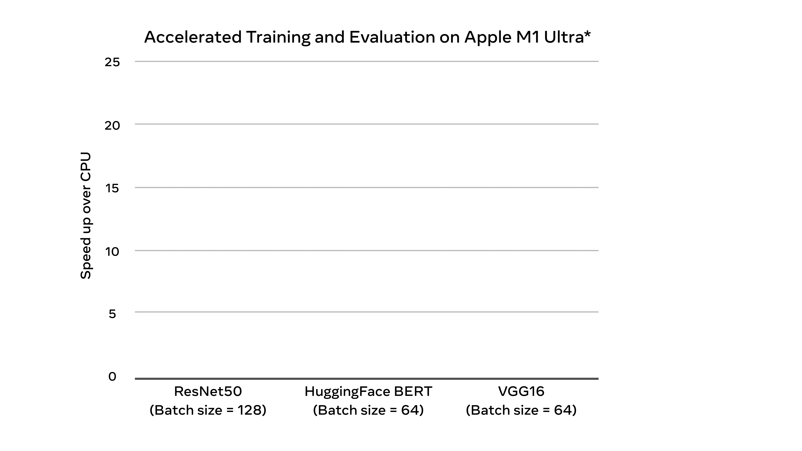
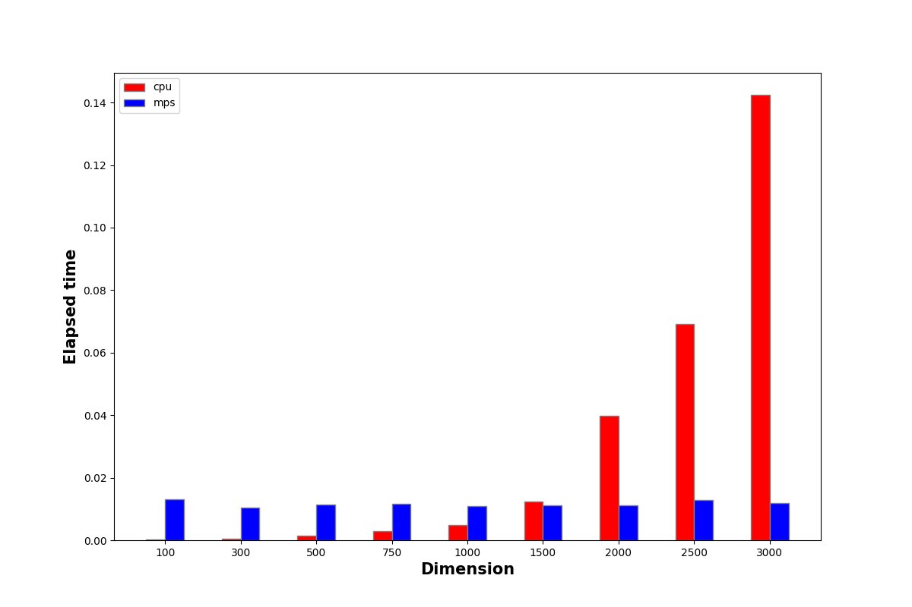

Inti dari algoritma/komputasi *deep learning* merupakan rangkaian operasi aljabar matriks dan vektor. Operasi aljabar akan semakin efisien apabila dieksekusi secara paralel. Inilah yang coba dieksploitasi oleh berbagai perangkat keras seperti GPU dan TPU untuk mengakselerasi komputasi *deep learning*.

Pada tahun 2020, Apple mengeluarkan Silicon atau System-on-a-chip (SoC) seri “M” produksi sendiri yang mengintegrasikan berbagai komponen penyusun komputer pada satu IC. SoC tersebut merupakan pengganti dari perangkat komputasi berbasis Intel yang selama ini digunakan pada seluruh produk Apple. 

Untuk seri M1 Pro, Silicon tersebut dilengkapi dengan GPU (14 - 16 cores) dan juga Neural engine (16 cores) yang merupakan komponen-komponen khusus dirancang untuk mengoptimalkan komputasi paralel — seri-seri di atasnya memliki spesifikasi yang lebih tinggi. Tentunya ini kabar gembira bagi para tukang oprek AI pengguna Mac OS. 

## Metal Performance Shaders (MPS)

Kekuatan komputasi perangkat keras GPU tidak serta merta langsung bisa dinikmati tanpa keberadaan semacam *driver* atau API framework. Apple sekaligus menyediakan API framework yang dinamai [Metal Performance Shaders (MPS)](https://developer.apple.com/documentation/metalperformanceshaders/) untuk memanfaatkan sumber daya komputasi paralel pada SoC seri M. Hal ini seperti hubungan antara GPU dari NVIDIA dengan Cuda framework.

Sejak tahun 2022, PyTorch mulai versi 1.12 akhirnya dilengkapi dengan [backend MPS](https://pytorch.org/blog/introducing-accelerated-pytorch-training-on-mac/). Hal ini memungkinkan graf komputasi PyTorch untuk dipetakan pada MPS Graph yang mengoptimalkan komputasi pada GPU dan Neural engine. Ketika pertama kali launching, dilaporkan bahwa PyTorch dengan MPS mampu mempercepat pelatihan berbagai model *deep learning* hingga ~8x lipat dibandingkan dengan CPU.



## PyTorch dengan MPS

Per Desember 2023, PyTorch sudah mencapai versi 2.1.2 dimana sudah terjadi banyak peningkatan optimisasi komputasi MPS. Untuk dapat menggunakan backend MPS cukup dengan instalasi / *upgrade* dengan cara standar:

```bash
# MPS acceleration is available on MacOS 12.3+
pip3 install --upgrade torch torchvision torchaudio
```

Kode di bawah ini mengecek dan mengidentifikasi keberadaan *device “*mps*”* pada PyTorch — device “cpu” akan otomatis terpilih apabila “mps” tidak tersedia:

```python
device = (
		"mps"
    if torch.backends.mps.is_available()
    else "cpu"
)
```

## Komputasi Sederhana pada CPU vs MPS

Saya coba membandingkan kecepatan komputasi antara CPU dengan MPS pada mesin Apple M1 Pro, dimulai dengan skenario komputasi sederhana perkalian matriks-vektor berikut ini.

```python
m = 3000 # vector / matrix dimension
a_cpu = torch.rand(m, device="cpu")
B_cpu = torch.rand((m, m), device="cpu")
a_mps = torch.rand(m, device="mps")
B_mps = torch.rand((m, m), device="mps")

print("[vec @ mat] cpu: ", timeit.timeit(lambda: B_cpu @ a_cpu, number=100))
print("[vec @ mat] mps: ", timeit.timeit(lambda: B_mps @ a_mps, number=100))
```

Kode di atas menginstansiasi 2 vektor dan matriks masing-masing pada device “cpu” dan “mps” dimana $m$ mendefinisikan dimensi dari vektor dan matriks tersebut: $\mathbf{a} \in \mathbb{R}^m$, $\mathbf{B}\in \mathbb{R}^{m \times m}$. Kemudian dilakukan operasi perkalian matriks dan vektor $\mathbf{B} \mathbf{a}$.

Dengan mencoba beberapa nilai dimensi $m$, didapatkan grafik waktu komputasi terhadap dimensi berikut ini:



CPU vs MPS

Perhatikan bahwa komputasi dengan CPU masih lebih cepat untuk dimensi matriks dan vektor relatif kecil, <1500. Hal ini kemungkinan *overhead* penulisan data ke memori GPU membutuhkan waktu lebih lama dibandingkan eksekusi komputasi itu sendiri.

Efisiensi dengan MPS mulai terasa ketika dimensi ≥1500. Pada dimensi 3000, kecepatan MPS jauh melebihi CPU hingga ~12x lipat!

## Deep Learning pada CPU vs MPS

Sekarang kita bandingkan kecepatan komputasi training dan inference dari 2 model standar, yaitu **MLP** dan **ConvNet**.

**MLP**: 3-layer neural networks dengan batch normalization

```bash
NeuralNetwork(
  (flatten): Flatten(start_dim=1, end_dim=-1)
  (linear_relu_stack): Sequential(
    (0): Linear(in_features=784, out_features=512, bias=True)
    (1): BatchNorm1d(512, eps=1e-05, momentum=0.1, affine=True, track_running_stats=True)
    (2): ReLU()
    (3): Linear(in_features=512, out_features=512, bias=True)
    (4): BatchNorm1d(512, eps=1e-05, momentum=0.1, affine=True, track_running_stats=True)
    (5): ReLU()
    (6): Linear(in_features=512, out_features=10, bias=True)
  )
)
```

**ConvNet**: convolutional networks sederhana (2 convolution → 1 max-pooling → 1 dense layer)

```bash
ConvNet(
  (convnet): Sequential(
    (0): Conv2d(1, 32, kernel_size=(3, 3), stride=(1, 1), padding=(1, 1))
    (1): MaxPool2d(kernel_size=2, stride=2, padding=0, dilation=1, ceil_mode=False)
    (2): Conv2d(32, 64, kernel_size=(3, 3), stride=(1, 1), padding=(1, 1))
    (3): ReLU()
    (4): MaxPool2d(kernel_size=2, stride=2, padding=0, dilation=1, ceil_mode=False)
    (5): Flatten(start_dim=1, end_dim=-1)
    (6): Linear(in_features=3136, out_features=128, bias=True)
    (7): ReLU()
    (8): Linear(in_features=128, out_features=10, bias=True)
  )
)
```

Untuk menyederhanakan percobaan, proses pelatihan hanya dilakukan sebanyak 1 epoch dengan ukuran *batch* 128.

Di bawah ini potongan kode perbandingan CPU vs MPS untuk 2 model tersebut. Selengkapnya dapat dilihat di repositori [https://github.com/ghif/pytorch-poc/blob/main/check_mps_speed.py](https://github.com/ghif/pytorch-poc/blob/main/check_mps_speed.py).

```python
...
# Initialize model
model = M.MLP(c, dx1, dx2, 512, num_classes)
# model = M.ConvNet(c, dx1, dx2, num_classes=num_classes)
print(model)

for device in ["cpu", "mps"]:    
    print(f"\n Measuring performance on \"{device}\" device")
    print(f"Check training time ...")
    loss_fn = nn.CrossEntropyLoss()
    optimizer = torch.optim.Adam(model.parameters(), lr=3e-4)
    checkpoint_dir = os.path.join(MODEL_DIR, "fashion-mnist")

    if not os.path.exists(checkpoint_dir):
        os.makedirs(checkpoint_dir)

    checkpoint_path = os.path.join(checkpoint_dir, f"{MODEL_SUFFIX}.pth")

    history = T.fit(
        model, 
        train_dataloader, 
        test_dataloader, 
        loss_fn, 
        optimizer, 
        n_epochs=EPOCHS, 
        checkpoint_dir=checkpoint_dir,
        model_name=MODEL_SUFFIX, 
        writer=writer,
        device=device
    )
    
    elapsed_time_train = np.sum(history["train_times"])
    print(f"Training elapsed time ({device}): {elapsed_time_train:.4f} s")

    start_t = process_time()
    with torch.no_grad():
        model = model.to(device)
        for X, y in train_dataloader:
            X, y = X.to(device), y.to(device)
            y_pred = model(X)

    elapsed_time_pred = process_time() - start_t
    print(f"Inference elapsed time ({device}): {elapsed_time_pred:.4f} s")
```

Berikut rekapitulasi waktu komputasi dari masing-masing model:

|  |  | **MLP** | **ConvNet** |
| --- | --- | --- | --- |
| **CPU** | **Training Time (sec)** | 5.1287 | 43.4797 |
|  | **Inference Time (sec)** | 1.7861 | 20.1203 |
| **MPS** | **Training Time (sec)** | 3.9633 | 3.0873 |
|  | **Inference Time (sec)** | 1.6530 | 1.8024 |

Jelas terlihat manfaat efisiensi yang dihasilkan oleh MPS dibandingkan dengan CPU, terutama pada saat menggunakan arsitektur *convolution —* waktu pelatihan MPS 14x lebih cepat dibandingkan CPU!
