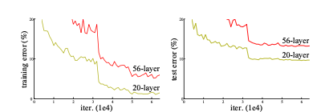
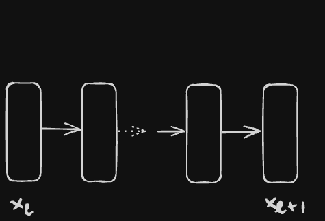
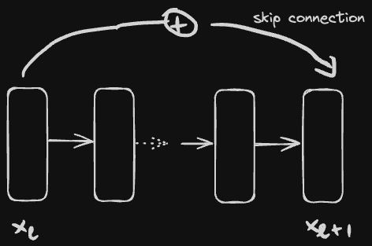
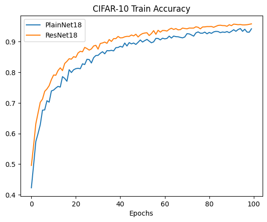

*Deep residual networks* (ResNet) merupakan suatu arsitektur model *deep learning* yang bisa dikatakan menjadi fenomena pada *computer vision* (terutama problem rekognisi objek) sejak diperkenalkan pada akhir 2015 ([He et al. 2015](https://arxiv.org/abs/1512.03385)). ResNet memungkinkan *deep learning* dilatih dengan arsitektur yang benar-benar “*deep*” (lebih dari 30 layer) dengan peningkatan performa yang signifikan. 

Pada masa itu, sebelum ResNet diperkenalkan ada fenomena menarik yang ditemukan pada deep learning, yaitu semakin mendalam suatu arsitektur model deep learning tidak berarti semakin bagus pula hasil pelatihannya. Gambar yang diambil dari paper (He et al. 2015) di bawah ini mengindikasikan efek tersebut: model standar *convolutional networks* dengan layer lebih banyak (56-layer) memiliki performa yang lebih buruk dibandingkan model yang lebih kecil (20-layer).



Performa model standar convolutional networks 56-layer lebih buruk dibandingkan model 20-layer

Jika kita perhatikan tren grafik *training vs test error,* model 56-layer sudah pasti tidak mengalami *overfitting*. Dengan demikian, model 56-layer memang gagal untuk dilatih dengan baik, kemungkinan besar dikarenakan terjadinya problem [*vanishing gradient*](https://en.wikipedia.org/wiki/Vanishing_gradient_problem): **informasi *gradient* yang menghilang ketika *backpropagation* sehingga tidak efektif tersampaikan ke layer-layer yang dekat dengan input.

## Skip Connection

*Residual networks* mencoba menjawab permasalahan *vanishing gradient* melalui modifikasi arsitektur model dengan menambahkan *skip connection*: koneksi yang menghubungkan 2 layer yang berjauhan secara langsung dengan melompati beberapa layer di antaranya. Pada *skip connection* hanya merepresentasikan operasi penjumlahan antara kedua layer tersebut, tidak ada tambahan parameter / bobot.

Dua gambar di bawah ini mengilustrasikan perbedaan antara model deep learning standar dengan model dengan *skip connection*. 



Plain Block



Residual Block

Kumpulan layer yang dinaungi oleh *skip connection* dapat kita sebut sebagai satuan *residual block*. Jika kita tumpuk beberapa *residual block*, maka menghasilkan *residual networks*. 

Untuk memudahkan pembandingan, model *deep learning* standar kita namakan sebagai *plain networks*  yang terdiri dari *block* tanpa *skip connection.*

## Residual Block

Secara matematis sebuah *residual block* dapat didefinisikan dengan persamaan:

$$
x_l = x_{l-1} + \mathcal{R}_{\theta_{l-1}}(x_{l-1})
$$

dimana$\mathcal{R}_\theta(x)$merepresentasikan fungsi non-linear berparameter$\theta$yang disebut sebagai *residual* (dari sinilah asal muasal penamaan *residual networks*), yang bisa saja terdiri dari beberapa tumpukan layer linear atau convolutional disertai dengan fungsi aktivasi.

Residual merupakan konsep yang sudah tidak asing baik di statistik/machine learning maupun di pengolahan citra (*image processing*). Pada statistik, residual diinterpretasikan sebagai selisih antara nilai observasi dan prediksi. Pada pengolahan citra, residual dapat dipahami sebagai fungsi koreksi dari citra *noise* ke citra asli (contoh: *image denoising*, *deblurring*, dsb).

Sebagai perbandingan, *plain block* (blok yang digunakan deep learning standar tanpa *skip connection*) dapat ditulis dengan persamaan:

$$
x_l = \mathcal{P}_{\theta_{l-1}}(x_{l-1})
$$

## Intuisi matematis kemampuan Residual Networks menangani *vanishing gradient*

 *Skip connection* mampu memitigasi efek *vanishing gradient* ketika dilatih dengan *backpropagation*. Secara matematis ini ternyata bisa diekspresikan.

Pertama-tama, kita definisikan fungsi *loss* dalam konteks *supervised learning*$\mathcal{E}: \mathcal{Y} \times \mathcal{Y}$yang mengukur *loss* antara target$\mathcal{y}$dan prediksi$\hat{y} = f_\Theta(x)$:

$$
\mathcal{E}(y, f_\Theta(x))
$$

Misalkan$f_\Theta$merupakan *neural networks* dengan total layer sebanyak$L$. *Backpropagation* untuk memperbarui parameter pada layer$l$(dimana$l << L$) dihitung menggunakan *gradient* yang didapatkan dari *chain rule*:

$$
\begin{equation}
\frac{\partial \mathcal{E}}{\partial x_l} = \frac{\partial \mathcal{E}}{\partial x_L} \frac{\partial x_L}{\partial x_l}
\end{equation}
$$

### Plain block tidak imun terhadap *vanishing gradient*

Jika$f_\Theta$tersusun dari kumpulan *plain blocks,* secara rekursif kita dapat tuliskan ekspresi matematis di bawah ini:

$$
f_\Theta(x) = x_L = \mathcal{P}_{\theta_{L-1}}(x_{L-1})
$$

$$
x_L = (\mathcal{P}_{\theta_{L-1}} \circ \mathcal{P}_{\theta_{L-2}} \circ \cdots \circ \mathcal{P}_{\theta_{l+1}} \circ \mathcal{P}_{\theta_l})(x_l)
$$

sehingga bentuk *chain rule* dari persamaan (1) menjadi

$$
\frac{\partial \mathcal{E}}{\partial x_l} =
\frac{\partial \mathcal{E}}{\partial x_{L}} \frac{\partial x_L}{\partial x_{L-1}} \cdots\frac{\partial x_{l+1}}{\partial x_{l}}
$$

Sekarang kita perhatikan secara intuitif bagaimana *vanishing gradient* bisa terjadi. Asumsikan semua turunan partial dari *block*$L$hingga ke bawahnya memiliki nilai 0.1. Dengan demikian, 

$$
\frac{\partial x_L}{\partial x_{L-1}} \cdots\frac{\partial x_{l+1}}{\partial x_{l}} = (0.1) * ... * (0.1) = (0.1)^{L-l}
$$

Anggap$L = 100$dan$l=2$. Dengan mudah kita simpulkan bahwa efek multiplikatif tersebut menghasilkan angka yang sangat kecil, yaitu$(0.1)^{98}$. Inilah yang disebut sebagai *vanishing gradient*.

### Residual block dalam mengatasi vanishing gradient

Dengan menggunakan *residual block,*$f_\Theta$menjadi *residual networks* yang secara rekursif dapat diekspresikan sebagai berikut:

$$
f_\Theta(x) = x_L = x_{L-1} + \mathcal{R}_{\theta_{L-1}}(x_{L-1})
$$

$$
x_L = x_{L-2} + \mathcal{R}_{\theta_{L-2}}(x_{L-2}) + \mathcal{R}_{\theta_{L-1}}(x_{L-1}) \\
= x_l + \sum_{i=l}^{L-1} \mathcal{R}_{\theta_i}(x_i)
$$

*Gradient* berdasarkan *chain rule* jadi berbentuk

$$
\frac{\partial \mathcal{E}}{\partial x_l} =
\frac{\partial \mathcal{E}}{\partial x_{L}} \left(1 +  \frac{\partial}{\partial x_l} \sum_{i=l}^{L-1}\mathcal{R}(x_i) \right)
$$

Dengan adanya efek aditif, nilai$\frac{\partial}{\partial x_l} \sum_{i=l}^{L-1}\mathcal{R}(x_i)$akan lebih lambat “menghilang”. Selain itu, *gradient* pada *block* paling atas$L$memberikan pengaruh langsung terhadap *block*$l$. 

Dengan demikian, *residual networks* lebih imun terhadap *vanishing gradient* dibandingkan *plain networks*!

## Implementasi

Pada PyTorch, *residual block* dapat kita definisikan sebagai *class* di bawah ini. Dalam 1 *block* terdiri beberapa 2 layer convolution dengan rangkaian: CONV —> BatchNorm —> ReLU —> CONV —> BatchNorm, mengikuti strategi yang dijelaskan pada paper ([He et al. 2015](https://arxiv.org/abs/1512.03385)).

```python
class ResidualBlock(nn.Module):
    def __init__(
        self, 
        in_channels: int,
        out_channels: int,
        stride: int = 1,
        expansion: int = 1,
        downsample: nn.Module = None
    ):
        super().__init__()
        # Multiplicative factor for the subsequent conv2d layer's output channels.
        # It is 1 for ResNet18 and ResNet34.
        self.expansion = expansion
        self.downsample = downsample
        self.conv1 = nn.Conv2d(
            in_channels, 
            out_channels, 
            kernel_size=3, 
            stride=stride, 
            padding=1,
            bias=False
        )
        self.bn1 = nn.BatchNorm2d(out_channels)
        self.relu = nn.ReLU()
        self.conv2 = nn.Conv2d(
            out_channels, 
            out_channels*self.expansion, 
            kernel_size=3, 
            padding=1,
            bias=False
        )
        self.bn2 = nn.BatchNorm2d(out_channels*self.expansion)

    def forward(self, x: Tensor) -> Tensor:
        identity = x
        out = self.conv1(x)
        out = self.bn1(out)
        out = self.relu(out)
        out = self.conv2(out)
        out = self.bn2(out)
        if self.downsample is not None:
            identity = self.downsample(x)
        out += identity
        out = self.relu(out)
        return  out
```

Fungsi berikut ini digunakan untuk menyusun rangkaian *residual blocks*:

```python
def make_residual_layer(
    block: Type[ResidualBlock],
    in_channels: int,
    out_channels: int,
    blocks: int,
    expansion: int = 1,
    stride: int = 1
) -> nn.Sequential:
    """
    This method is used to build the `layer1` to `layer4` of the ResNet.
    Each layer can contain multiple 'ResidualBlock'.

    Args:
        block (Type[ResidualBlock]): The type of ResidualBlock to use.
        out_channels (int): The number of output channels of the first ResidualBlock.
        blocks (int): The number of ResidualBlock to stack together.
        stride (int, optional): The stride of the first ResidualBlock. Defaults to 1.
    """
    downsample = None
    if stride != 1:
        """
        This should pass from `layer2` to `layer4` or 
        when building ResNets50 and above. Section 3.3 of the paper
        Deep Residual Learning for Image Recognition
        (https://arxiv.org/pdf/1512.03385v1.pdf).
        """
        downsample = nn.Sequential(
            nn.Conv2d(
                in_channels, 
                out_channels*expansion,
                kernel_size=1,
                stride=stride,
                bias=False 
            ),
            nn.BatchNorm2d(out_channels * expansion),
        )
    layers = []
    layers.append(
        block(
            in_channels, out_channels, stride, expansion, downsample
        )
    )
    in_channels = out_channels * expansion
    for i in range(1, blocks):
        layers.append(block(
            in_channels,
            out_channels,
            expansion=expansion
        ))
    return nn.Sequential(*layers)
```

Secara keseluruhan, pembentukan arsitektur model Residual Networks (ResNet) dilakukan dengan cara sebagai berikut:

```python
class ResNet(nn.Module):
    def __init__(
        self, 
        img_channel: int, 
        num_layers: int,
        block: Type[ResidualBlock],
        num_classes: int = 10
    ) -> None:
        super().__init__()
        if num_layers == 18:
            # The following `layers` list defines the number of `ResidualBlock` 
            # to use to build the network and how many basic blocks to stack
            # together.
            layers = [2, 2, 2, 2]
            self.expansion = 1
        
        self.in_channels = 64
        # All ResNet (18 to 152) contain a Conv2d => BN => ReLU for the first layers
        # Here, kernel size is 7.
        self.conv1 = nn.Conv2d(
            img_channel,
            self.in_channels,
            kernel_size=7, 
            stride=2, 
            padding=3,
            bias=False
        )
        self.bn1 = nn.BatchNorm2d(self.in_channels)
        self.relu = nn.ReLU(inplace=True)
        self.maxpool = nn.MaxPool2d(kernel_size=3, stride=2, padding=1)

        self.layer1 = self._make_layer(block, 64, layers[0])
        self.layer2 = self._make_layer(block, 128, layers[1], stride=2)
        self.layer3 = self._make_layer(block, 256, layers[2], stride=2)
        self.layer4 = self._make_layer(block, 512, layers[3], stride=2)
        
        self.avgpool = nn.AdaptiveAvgPool2d((1, 1))
        self.fc = nn.Linear(512 * self.expansion, num_classes)

    def _make_layer(
        self, 
        block: Type[ResidualBlock],
        out_channels: int,
        blocks: int,
        stride: int = 1
    ) -> nn.Sequential:
        downsample = None
        if stride != 1:
            """
            This should pass from `layer2` to `layer4` or 
            when building ResNets50 and above. Section 3.3 of the paper
            Deep Residual Learning for Image Recognition
            (https://arxiv.org/pdf/1512.03385v1.pdf).
            """
            downsample = nn.Sequential(
                nn.Conv2d(
                    self.in_channels, 
                    out_channels*self.expansion,
                    kernel_size=1,
                    stride=stride,
                    bias=False 
                ),
                nn.BatchNorm2d(out_channels * self.expansion),
            )
        layers = []
        layers.append(
            block(
                self.in_channels, out_channels, stride, self.expansion, downsample
            )
        )
        self.in_channels = out_channels * self.expansion
        for i in range(1, blocks):
            layers.append(block(
                self.in_channels,
                out_channels,
                expansion=self.expansion
            ))
        return nn.Sequential(*layers)
    
    def forward(self, x: Tensor) -> Tensor:
        x = self.conv1(x)
        x = self.bn1(x)
        x = self.relu(x)
        x = self.maxpool(x)

        x = self.layer1(x) 
        x = self.layer2(x)
        x = self.layer3(x)
        x = self.layer4(x)

        # The spatial dimension of the final layer's feature map should be (7, 7) for all ResNets.
        # print("Dimension of the final layer's feature map: ", x.shape)

        x = self.avgpool(x)
        x = torch.flatten(x, 1)
        logits = self.fc(x)

        return logits
```

## Eksperimen

Kita coba buktikan secara empiris apakah *Residual Networks* memang lebih imun dibandingkan dengan *Plain Networks*.

Kita lakukan pelatihan model rekognisi objek citra dengan menggunakan dataset [CIFAR-10](https://www.cs.toronto.edu/~kriz/cifar.html), yang terdiri dari kumpulan citra berwarna 50,000 data latih dan 10,000 data uji, berdimensi 32x32. CIFAR-10 memiliki 10 kelas objek: *airplane, automobile, bird, cat, deer, dog, frog, horse, ship, truck*.

Kita definiskan 2 model *neural networks* yang keduanya memiliki jumlah layer yang sama (18 layer) yang berarti ukuran parameternya juga sama.

- **PlainNet18**: neural networks standar tanpa *skip connection*
- **ResNet18**: *residual networks*

Kali ini kita hanya bandingkan akurasi pelatihan antara kedua model tersebut.

Lebih lengkapnya dapat dilihat pada repositori kode: [https://github.com/ghif/pytorch-poc/blob/main/2-cifar_classification.py](https://github.com/ghif/pytorch-poc/blob/main/2-cifar_classification.py)



Residual Networks menghasilkan akurasi pelatihan lebih tinggi 

Hasilnya? Pelatihan dengan `epoch 100` dan `batch size 128` menunjukkan bahwa **ResNet18 memiliki akurasi yang lebih superior dibandingkan PlainNet18**. Terbukti bahwa *Residual Networks* mampu mengatasi *vanishing gradient* lebih baik dibandingkan model standar.

Saya dan tim pernah mengembangkan solusi *deep learning* untuk *face animation* yang sebelumnya dipakai diberbagai *project* film. Model yang digunakan juga berbasis *residual networks.*

[https://www.youtube.com/watch?v=39W4eGjMFiA](https://www.youtube.com/watch?v=39W4eGjMFiA)
