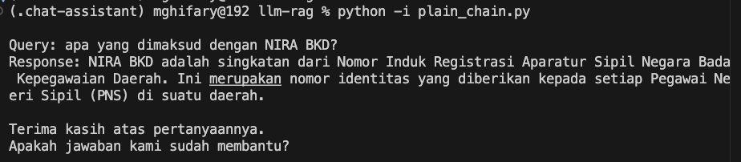
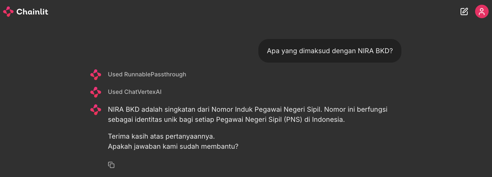
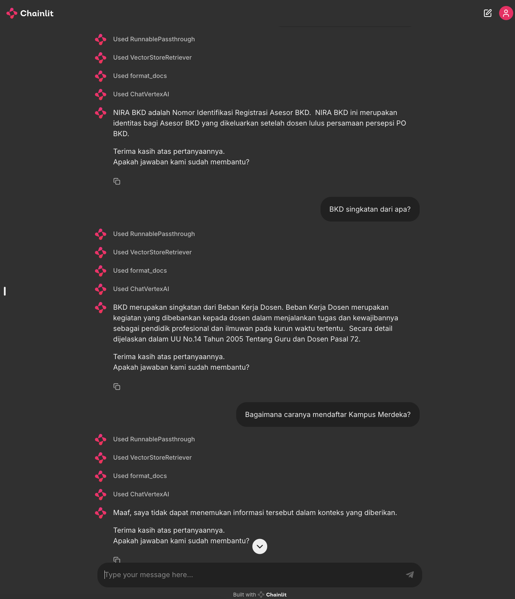

Large Language Model (LLM) merupakan model AI yang menjadi fenomena baru pada 1-2 tahun ke belakang, terutama ketika aplikasi ChatGPT dari OpenAI dirilis pada akhir 2022. Kehadiran LLM menjadikan populernya istilah generative AI, yaitu AI yang memiliki kemampuan menghasilkan konten atau informasi tekstual berkualitas tinggi seperti layaknya hasil penalaran manusia. Beberapa contoh LLM yang hadir sebagai produk digital saat ini antara lain Generative Pretrained Transformers (GPT) dari OpenAI, Llama dari Meta, Bard serta Gemini dari Google, dan sebagainya. 

Dalam menghasilkan konten, LLM memproses masukan teks yang diberikan oleh manusia. Yang menjadikannya luar biasa adalah kemampuannya memahami teks dalam bahasa alami / percakapan sehari-hari. Hal ini memungkinkan interaksi antar manusia dan AI menjadi lebih lancar dan natural: kita berikan instruksi dalam bahasa alami (*prompt*), lalu mesin AI akan menghasilkan jawaban yang relevan.

Kita pun dapat merekayasa instruksi sedemikian rupa untuk mendapat respon spesifik dari LLM. Seperti halnya dalam pemrograman konvensional, semakin jelas instruksi yang diberikan maka semakin tepat pula luarannya. Dengan memanfaatkan LLM, bahasa percakapan sehari-hari menjadi dapat berfungsi seperti bahasa pemrograman. Teknik merekayasa instruksi ini bahkan sudah ada istilahnya: *prompt engineering*.

Kemampuan generatif yang dimiliki LLM membuka berbagai peluang kemudahan dalam membuat aplikasi. Salah satunya adalah kemudahan dalam membuat *chatbot* tanya-jawab.

## LangChain: Kerangka kerja pembuatan aplikasi berbasis LLM

Wujud dari LLM pada dasarnya berupa kumpulan matriks dan vektor yang tersimpan dalam sebuah file yang besar. Diperlukan suatu alat pemrograman yang memungkinkan LLM menjadi sebuah “mesin inferensi” yang handal.

Salah satu alat pemrograman yang dapat digunakan adalah [LangChain](https://www.langchain.com/): sebuah kerangka kerja pemrograman yang mengabstraksikan proses inferensi dan penalaran dari LLM beserta komponen-komponen pendukungnya sehingga memudahkan untuk melakukan *prompt engineering*, pembuatan prototipe aplikasi hingga memproduksinya. LangChain saat ini dapat diakses dalam 2 bahasa: Javascript dan Python.

](media/5d7KfRriC6zji11ZFnwLotdqcHQ.svg)

Sumber: [https://www.langchain.com/](https://www.langchain.com/)

Kekuatan utama LangChain adalah kemudahan dalam mengimplementasikan inferensi LLM dalam bentuk rantai penalaran (*Chain of Thoughts*). Sebuah proses inferensi **input —> LLM —> output** dianggap sebagai sebuah *chain*. Dengan merangkai kumpulan *chain* dengan konfigurasi tertentu, kita berarti memprogram inferensi LLM untuk menyelesaikan masalah tertentu.

Selain itu, LangChain dengan mudah dapat menghubungkan LLM dengan konteks pengetahuan dari berbagai sumber: *prompt instruction, few shot examples, external documents*, dan sebagainya. LangChain juga menyediakan API untuk mengakses berbagai jenis LLM seperti GPT dari OpenAI atau Gemini dari Google.

Berikut ini contoh sederhana implementasi *chain* yang memungkinkan untuk bertanya-jawab dengan LLM (gemini-1.5-flash) dalam bahasa pemrograman Python. 

```python
from langchain_google_vertexai import ChatVertexAI
from langchain_core.prompts import PromptTemplate
from langchain_core.runnables import RunnablePassthrough
from langchain_core.output_parsers import StrOutputParser

STANDARD_SYSTEM_PROMPT = """You are an assistant for question-answering tasks. \
Always answer in Bahasa Indonesia.\
If you don't know the answer, just say that you don't know, don't try to make up an answer.\
Use three sentences maximum and keep the answer concise. \
Always say the following sentences at the end of the answer: \

\n
Terima kasih atas pertanyaannya.
Apakah jawaban kami sudah membantu? \

Question: {question}

Helpful Answer:
"""

# Use gemini-1.5-flash as the LLM
llm = ChatVertexAI(
	model_name="gemini-1.5.-flash", # LLM from Google Gemini
)

prompt = PromptTemplate.from_template(STANDARD_SYSTEM_PROMPT)

# Define a chain
chain = (
	{"question": RunnablePassthrough()} 
	| prompt | self.llm | StrOutputParser()
)

# Test the Q&A bot
query = "apa yang dimaksud dengan NIRA BKD?"
ai_msg = chain.invoke({
	"question": query
})
print(f"Response: {ai_msg}")
```



Bagian terpenting pada kode di atas adalah pendefinisian `chain` yang ditulis dalam bentuk ekspresi yang disebut sebagai LangChain Expression Language (LCEL).  LCEL merangkai berbagai komponen secara sekuensial dengan operator pipe `|`. Selain itu, LCEL mendukung beberapa fungsi out-of-the-box seperti *streaming*, *parallelism*, dan *logging*.

Perhatikan bahwa salah satu komponen pada `chain` di atas adalah *prompt*.

Kita dapat dengan mudah membuat prototipe web UI berbasis LangChain dengan menggunakan [chainlit](https://chainlit.io/). Contoh lengkap implementasi integrasi LangChain dan chainlit dapat dilihat di [https://github.com/ghif/llm-rag/blob/main/app_plain.py](https://github.com/ghif/llm-rag/blob/main/app_plain.py), dengan menjalankan:

```bash
chainlit run app_plain.py
```



## **Retrieval Augmented Generation (RAG)**

Pada contoh di atas, LLM menjawab respon pertanyaan atau *prompt* “apa yang dimaksud dengan NIRA BKD?” tanpa mengetahui konteks spesifik terhadap topik yang ditanyakan. Sebagai informasi, “NIRA BKD” merupakan topik terkait layanan dosen. Dalam hal ini, dapat dikatakan LLM mengalami “halusinasi” dengan memberikan jawaban terkait topik yang lain.

Kita dapat menambahkan informasi eksternal (dalam bentuk dokumen tekstual seperti pdf, docx, halaman web, dan sebagainya) untuk memberikan tambahan konteks pada *prompt*. Idealnya, konteks yang ditambahkan harus sedekat mungkin dengan pertanyaan. Teknik *prompt engineering* dengan menambahkan konteks melalui pengambilan informasi yang relevan (*retrieval*) ini disebut sebagai Retrieval Augmented Generation (RAG).

Gambar di bawah ini mengilustrasikan RAG dimana adanya proses *retrieval* untuk setiap pertanyaan yang diberikan sebelum membentuk *prompt* yang menjadi input bagi LLM.

](media/rag_retrieval_generation-1046a4668d6bb08786ef73c56d4f228a.png)

Sumber: [https://python.langchain.com/docs/use_cases/question_answering/](https://python.langchain.com/docs/use_cases/question_answering/)

Bagaimana proses pengambilan informasi (*retrieval*) ini dilakukan?

Secara umum teknik yang digunakan serupa dengan teknik mesin pencari (*search engine*): mengambil beberapa dokumen atau informasi yang paling dekat dengan pertanyaan (*query*). Proses *retrieval* akan lebih praktis dilakukan jika dokumen dan query tekstual tersebut direpresentasikan dalam vektor. Jadi, langkah-langkah umum untuk membangun mekanisme retrieval ini yaitu:

<aside>
💡 1. Bentuk *database* kumpulan dokumen dalam bentuk vektor (*vector store*)
2. Pada saat *prompting*,
     a. Ubah teks query menjadi vektor.
     b. Ambil sejumlah $k$ dokumen yang relevan dari *vector store*.
     c. Masukan $k$ dokumen tersebut menjadi bagian dari konteks pada *prompt*.

</aside>

](media/Screenshot_2024-01-12_at_09.37.29.png)

Sumber: [https://www.deeplearning.ai/short-courses/advanced-retrieval-for-ai/](https://www.deeplearning.ai/short-courses/advanced-retrieval-for-ai/)

Langkah-langkah di atas dapat diimplementasikan dengan kerangka kerja LangChain. Di bawah ini merupakan contoh implementasi RAG dengan menambahkan konteks dari dokumen PDF mengenai layanan dosen: [https://pusatinformasi.sister.kemdikbud.go.id/hc/en-gb/article_attachments/21355255621273](https://pusatinformasi.sister.kemdikbud.go.id/hc/en-gb/article_attachments/21355255621273).

### Pemrosesan dokumen

Langkah pertama, informasi teks diekstraksi dari PDF dengan menggunakan `PyMuPDFLoader`. Lalu teks tersebut dipecah-pecah lagi menjadi kumpulan sub-string (*chunking*) dengan menggunakan *text splitter* `RecursiveCharacterTextSplitter`. Terdapat parameter `chunk_size` (panjang karakter pada sub-string ) dan `chunk_overlap` (jumlah karakter yang overlap pada substring terdekat) yang dapat mempengaruhi hasil akhir respon dari LLM.

Ada berbagai metode untuk melakukan *chunking:* [https://python.langchain.com/docs/modules/data_connection/document_transformers/](https://python.langchain.com/docs/modules/data_connection/document_transformers/).

```python
from langchain_community.document_loaders import PyMuPDFLoader
from langchain.text_splitter import RecursiveCharacterTextSplitter

# Load and extract text documents from a pdf file
loader = PyMuPDFLoader(<path-to-pdf>)
docs = loader.load()

# Split documents into chunks
text_splitter = RecursiveCharacterTextSplitter(
    chunk_size=750,
    chunk_overlap=100,
)
chunks = text_splitter.split_documents(docs)
```

### **Pembentukan dan Pemanfaatan Vector Store**

Selanjutnya, *chunks* yang sudah terbentuk dapat dianggap sebagai kumpulan *documents* yang perlu disimpan di *database* yang kita sebut dengan *vector store*. Kumpulan chunks tersebut akan dikonversi terlebih dahulu sebagai *array of vectors*.

Konversi dari teks ke vektor dapat menggunakan model *deep learning* yang disebut sebagai *embedding model*. Salah satu contohnya adalah `text-embedding-004` milik Google Vertex AI: [https://cloud.google.com/vertex-ai/generative-ai/docs/embeddings/get-text-embeddings](https://cloud.google.com/vertex-ai/generative-ai/docs/embeddings/get-text-embeddings).  Solusi open source seperti [sentence transformers](https://huggingface.co/sentence-transformers) juga dapat digunakan sebagai alternatif.

Selanjutnya, vektor-vektor hasil konversi tersebut disimpan dalam *vector store*.  Pilihan yang dapat digunakan adalah `Chroma`.

Dengan menggunakan LangChain, konversi teks ke vektor beserta pembuatan *vector store* dapat dilakukan dengan mengeksekusi satu fungsi di bawah ini.

```python
from langchain_community.vectorstores import Chroma
from langchain_google_vertexai import VertexAIEmbeddings

# Create a vectorstore and save it into disk
vectorstore = Chroma.from_documents(
    documents=chunks, 
    embedding=VertexAIEmbeddings(model="text-embedding-004"),
    persist_directory="db",
    collection_name="vstore_vertexai"
)
```

Di bawah ini merupakan contoh melakukan *information retrieval* pada *vector store* yang sudah tersimpan di *disk*, mengambil 4 dokumen yang dianggap terdekat dengan *query*.  Bagian terpenting adalah fungsi `db.as_retriever()` yang melakukan pencarian dan peringkatan (*ranking*) serta mengkonversi balik representasi vektor menjadi teks. Algoritma yang dipilih adalah [Maximal Marginal Relevance (MMR)](https://www.cs.cmu.edu/~jgc/publication/The_Use_MMR_Diversity_Based_LTMIR_1998.pdf) yang menyeimbangkan relevansi (*relevance*) dan keragaman (*diversity*) dari dokumen yang diambil. Aspek keragaman ini cukup penting untuk mengurangi redundansi dari informasi yang terpilih.

Secara matematis, algoritma  MMR dapat dinyatakan dengan

$$
\mathrm{MMR} = \arg \max_{d_i \in R \setminus S} \left[ \lambda (\mathrm{Sim}_1 (d_i, q)) - (1 - \lambda) \max_{d_j \in S} \mathrm{Sim}_2 (d_i, d_j) \right]
$$

dimana $\lambda \in [0, 1]$ merupakan parameter yang mengontrol relevansi dan keragaman dari hasil pencarian, $q$ merupakan vektor *query* dan $\{ d_i\}_{i=1}^n$ merupakan himpunan vektor *document* pada *vector store.*

```python
from langchain_community.vectorstores import Chroma
from langchain_google_vertexai import VertexAIEmbeddings

embedding_function = VertexAIEmbeddings(model="text-embedding-004")

db = Chroma(
    persist_directory="db",
    collection_name="vstore_vertexai", 
    embedding_function=embedding_function
)

retriever = db.as_retriever(search_type="mmr") # use Maximal Marginal Relevance algorithm

query = "apa yang dimaksud dengan BKD?"
print(f"\nQuery: {query}\n")
response = retriever.get_relevant_documents(query)

for i, res in enumerate(response):
    print("\n")
    print(f"[{i}] Doc: {res.page_content}")
print(f"Number of response: {len(response)}
```

```
[0] Doc: 3. Kementerian/Lembaga Mitra
4. Seluruh Asesor BKD
5. Seluruh Dosen PTN/PTS/dan KL Mitra
Sehubungan dengan upaya penyelesaian kendala teknis pengelolaan SISTER BKD, bersama ini kami 
sampaikan Soal Sering Ditanya (SSD) SISTER BKD untuk melengkapi Buku Panduan Sister BKD yang 
telah diluncurkan pada tanggal 11 Oktober 2022.
Besar harapan kami, SISTER BKD dapat diterapkan sesuai Pedoman Operasional Beban Kerja Dosen 
Tahun 2021.
Atas perhatian dan kerja sama yang baik, kami ucapkan terima kasih.

[1] Doc: Periode BKD? 
Jawab: 
Silahkan Pengelola BKD melakukan tahapan sebagai berikut: 
1. Klik tombol aksi untuk melihat detail dari periode kegiatan 
2. Memastikan detail periode kegiatan BKD telah dilengkapi 
3. Klik tombol simpan jika perubahn telah sesuai 
 
38. Bagaimana cara Pengelola BKD PTN mengubah periode BKD? 
Jawab: 
Silahkan Pengelola BKD melakukan tahapan sebagai berikut: 
1. Klik tombol aksi untuk mengubah periode kegiatan

[2] Doc: ilmuwan pada kurun waktu tertentu. Secara detail di jelaskan dalam UU 
No.14 Tahun 2005 Tentang Guru dan Dosen Pasal 72. 
 
2. Apakah yang dimaksud Asesor BKD? 
Jawab: 
Seseorang yang ditugaskan untuk menilai laporan kinerja dosen setiap 
semesternya sesuai dengan pedoman operasional BKD yang berlaku. 
 
3. Apakah yang dimaksud NIRA BKD? 
Jawab: 
Nomor Identifikasi Registrasi Asesor BKD 
 
4. Bagaimana cara untuk menjadi Asesor BKD? 
Jawab:

[3] Doc: 3. Memastikan admin BKD telah membuat periode BKD 
 
User Asesor BKD 
 
21. Apakah perbedaan Asesor BKD Internal dan Asesor BKD Eksternal? 
Jawab: 
Asesor Internal merupakan penilai laporan LKD BKD yang berasal dari 
dari perguruan tinggi yang sama dengan asesi.  
Asesor Eksternal merupakan penilai laporan LKD BKD yang berasal dari 
perguruan tinggi yang berbeda dengan asesi.  
 
22. Bagaimana cara jika Asesor BKD lupa password di SISTER BKD? 
Jawab:
Number of response: 4
```

## Tanya-Jawab dengan RAG

Tinggal satu lagi aspek penting tersisa untuk membuat bot tanya-jawab yang dapat memahami konteks berdasarkan informasi eksternal, yaitu *prompt engineering*. 

Pertama-tama, kita definisikan struktur  *prompt template* seperti di bawah ini.

```python
PROMPT_TEMPLATE = """
You are an assistant for question-answering tasks. \
Always answer in Bahasa Indonesia.\
If you don't know the answer, just say that you don't know, don't try to make up an answer. \
Use three sentences maximum and keep the answer as concise as possible. \
Always say the following sentences at the end of the answer: \

\n
Terima kasih atas pertanyaannya. 
Apakah jawaban kami sudah membantu?

Use only the pieces of context below to answer the question at the end. \

{context}

Question: {question}

Helpful Answer:
"""
```

Terdapat dua *placeholders/variables* pada teks *prompt template* di atas yaitu 

`{context}` : tempat menaruh hasil pencarian dokumen yang relevan terhadap *query*

`{question}`: tempat menaruh *query* yang dimasukkan pengguna

Selanjutnya, kita bentuk objek dari *prompt* berdasarkan *template* di atas dan definisikan *chain* yang menghubungkan seluruh komponen: 

*query → information retrieval (context) → prompt → LLM → response* 

```python

from langchain_core.prompts import PromptTemplate
from langchain_core.runnables import RunnablePassthrough
from langchain_core.output_parsers import StrOutputParser

def format_docs(docs):
		# Concatenate all retrieved documents in a string format
    return "\n\n".join(doc.page_content for doc in docs)

qa_prompt = PromptTemplate.from_template(PROMPT_TEMPLATE)
rag_chain = (
    {"context": retriever | format_docs, "question": RunnablePassthrough()}
    | qa_prompt
    | self.llm
    | StrOutputParser()
)

rag_chain.invoke(query)
query = "apa yang dimaksud dengan NIRA BKD?"
ai_msg = rag_chain.invoke({
	"question": query
})
```

Implementasi lengkap bot tanya-jawab dengan LangChain dan Chainlit dapat dilihat di [https://github.com/ghif/llm-rag/blob/main/app.py](https://github.com/ghif/llm-rag/blob/main/app.py) dan dijalankan dengan perintah:

```bash
chainlit run app.py
```

Di bawah ini tangkapan layar percakapan antara pengguna dan bot tanya-jawab dengan menggunakan RAG. Dapat dilihat bahwa respon-respon dari bot sesuai dengan konteks yang diberikan. Perhatikan pula ketika ada pertanyaan yang diluar topik, yaitu tentang “kampus merdeka”, bot tidak berhalusinasi atau tidak memberikan respon diluar konteks yang diberikan.



## Penutup

Catatan ini hanya menjelaskan implementasi sederhana dari bot tanya-jawab berbasis LLM dalam bentuk prototipe. Untuk dapat digunakan pada level *production,* beberapa hal yang perlu dipertimbangkan adalah sebagai berikut:

- **Scalable vector store**: Diperlukan implementasi dan *deployment* yang menjamin skalabilitas dari *information retrieval* untuk dokumen dalam jumlah besar.
- **Appropriate prompt design and engineering**: Prompt perlu didesain agar memberikan respon yang sesuai dengan kriteria UX.
- **Quality Assurance**: Perlu dilakukan pengujian yang komprehensif untuk memastikan respon dari AI bot memiliki akurasi dan relevansi sesuai dengan kriteria dan meminimalisir halusinasi.
- **Language-specific LLM**: Perlu LLM yang lebih mengerti domain bahasa yang digunakan. Sejauh ini `gemini-1.5-flash` cukup baik memahami Bahasa Indonesia, namun belum tentu ini merupakan pilihan yang terbaik.
