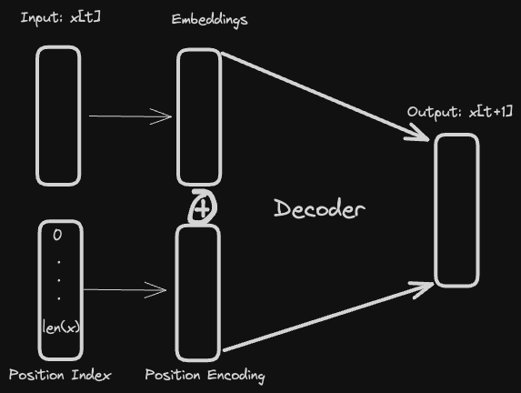
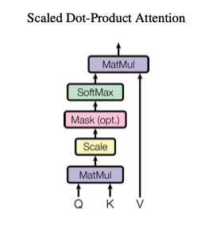
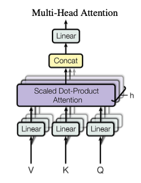
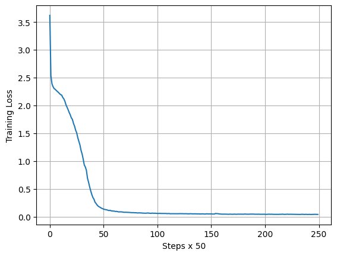

*Transformer* ([Vaswani et al. 2017](https://proceedings.neurips.cc/paper/2017/file/3f5ee243547dee91fbd053c1c4a845aa-Paper.pdf)) merupakan arsitektur *deep learning* yang menjadi fondasi utama berbagai Large Language Models (LLM) yang ada saat ini. Arsitektur *transformer* berbasis mekanisme matematis yang diimplementasikan dalam bentuk lapisan arsitektur model yang dinamakan dengan *attention* ([Bahdanau et al. 2015](https://arxiv.org/pdf/1409.0473.pdf)) yang pertama kali diperkenalkan untuk kebutuhan Neural Machine Translation (NMT). 

Mekanisme *attention* mencoba untuk memperbaiki kekurangan pada model sekuensial berbasis *recurrent networks* agar dapat “mengingat” informasi yang lebih panjang — *recurrent networks* memiliki keterbatasan untuk menghubungkan konteks informasi yang sudah agak berjauhan.  Selain itu, *recurrent networks* dikenal sulit untuk dilatih dikarenakan pengaliran informasi yang cukup kompleks, terutama adanya komunikasi antar *hidden layers*.

*Transformer* merupakan model sekuensial tanpa *recurrent layers*, hanya mengandalkan mekanisme *attention* pada arsitekturnya. Maka dari itu, paper yang pertama kali membahas Transformer berjudul [“Attention is all you need”](https://proceedings.neurips.cc/paper_files/paper/2017/file/3f5ee243547dee91fbd053c1c4a845aa-Paper.pdf). Transformer dan mekanisme *attention* dapat dikatakan inovasi yang paling signifikan saat ini di dunia *machine learning* modern. Oleh karena itu, perlu untuk memahami Transformer lebih dalam dengan cara mengimplementasikannya dari nol agar benar-benar dapat mengapresiasi kekuatan dari model ini.

## Model Bahasa Bigram

Sebelum masuk ke pembahasan Transformer, kita mulai dari pembahasan model bahasa yang paling sederhana: model Bigram.

Model bahasa merupakan model prediktif sekuensial yang biasanya dimodelkan secara matematis dengan probabilitas bersyarat:

$$
P_{\theta}(w | h)
$$

dimana$w$merupakan token berikutnya (dapat berupa karakter, kata, sub-frasa, dsb) dan$h$merupakan histori dari token-token sebelumnya.

Perhatikan contoh kalimat di bawah ini yang tersusun dari$w$dan$h$dimana **token didefinisikan sebagai karakter**.

$$
\underbrace{\text{kalau sampai waktuku ku mau tak seorang kan}\text{ } \text{meray}}_{h} \underbrace{\text{u}}_{w}
$$

Misalkan terdapat sebuah model bahasa yang dilatih dengan teks di atas, maka$P_\theta(w="u"|h="kalau ... meray")$akan memberikan nilai probabilitas yang tinggi.

Jika didetailkan,$h$terdiri dari kumpulan token$w_1, \ldots, w_{n-1}$dan$w=w_n$sehingga model bahasa dapat ditulis sebagai

$$
P_\theta(w_n | w_{1:n-1})
$$

Model di atas disebut sebagai model$n$-gram — terdapat sejumlah$n$buah token pada probabilitas bersyarat.

Kita dapat melakukan aproksimasi terhadap model$n$-gram dengan asumsi Markov — probabilitas token berikutnya hanya bergantung pada 1 token sebelumnya.

$$
P_\theta(w_n | w_{1:n-1}) \approx P_\theta(w_n | w_{n-1})
$$

Dikarenakan hanya terdapat 2 token pada model aproksimasi, model tersebut disebut dengan **model Bigram**.

### Pengolahan Teks

Dataset yang digunakan pada percobaan kali ini adalah [`chairilanwar.txt`](https://github.com/ghif/tiny-gpt/blob/main/data/chairilanwar.txt) yang merupakan kumpulan puisi karya Chairil Anwar, penyair Indonesia tersohor pada zamannya. Dataset ini dikumpulkan dari halaman web [https://titikdua.net/puisi-chairil-anwar/](https://titikdua.net/puisi-chairil-anwar/) dengan sedikit pembersihan teks. Total jumlah karakter pada teks tersebut sebanyak 37970, yang dapat dikategorikan sebagai dataset berukuran kecil.

Teks-teks puisi tersebut akan diproses menjadi sekuens karakter dikarenakan model Bigram yang nantinya akan dilatih merupakan model berbasis karakter.

### Konversi Karakter ke Bilangan Bulat

Pekerjaan pertama yang dilakukan adalah mengkonversi representasi teks menjadi bilangan bulat. Hal ini dikarenakan model bahasa berbasis *deep learning* hanya dapat beroperasi pada representasi numerik. Secara formal kita membutuhkan fungsi enkodifikasi$f_\mathrm{encode}$yang memetakan teks$\mathcal{T}$menjadi bilangan bulat$\mathcal{Z}$.

$$
f_\mathrm{encode}: \mathcal{T} \rightarrow \mathcal{Z}
$$

Kode di bawah ini membaca data dalam format `txt` lalu mendefinisikan 2 buah fungsi lambda:

- `encode`: mengkonversi karakter menjadi bilangan bulat
- `decode`: mengkonversi balik dari bilangan bulat menjadi karakter

```python
# Read text from file
datapath = "chairilanwar.txt"
with open(datapath, "r", encoding="utf-8") as f:
	text = f.read()

print(f"Length of text: {len(self.text)} characters")

# The unique characters in the file
chars = sorted(list(set(text)))
vocab_size = len(chars)
print("".join(chars))
print(vocab_size)

# Create a mapping from characters to integers
stoi = { ch:i for i, ch in enumerate(chars) }
itos = { i:ch for i, ch in enumerate(chars) }
encode = lambda s: [stoi[c] for c in s] # take a string, output a list of integers
decode = lambda l: "".join([itos[i] for i in l]) # take a list of integers, output a string
```

Kode tersebut juga menghasilkan *vocabulary* yang merupakan kumpulan karakter unik penyusun keseluruhan teks — pada kasus ini hanya berjumlah 65 karakter. Untuk teks yang lebih panjang dan elemen terkecil pada sekuens didefinisikan sebagai “kata” atau “token” biasanya akan menghasilkan *vocabulary* yang lebih besar.

Di bawah ini merupakan contoh hasil eksekusi fungsi `encode` dan `decode`.

```bash
>>> ids = encode("kalau")
>>> print(ids)
[49, 39, 50, 39, 59]
>>> orig_text = decode(ids)
>>> print(orig_text)
kalau
>>>
```

### Pembentukan *batch* data

Dengan adanya fungsi `encode`, kita dapat memiliki sekuens keseluruhan data teks dalam bentuk bilangan bulat: 

$$
z = f_\mathrm{encode}(\text{original-text})
$$

Namun demikian, model bahasa akan dilatih dengan data teks yang dikelompokkan dalam sekuens-sekuens kecil yang dinamakan dengan *batch* yang terdiri dari pasangan sekuens input dan output. Sebuah *batch* secara matematis dapat direpresentasikan dengan himpunan

$$
\mathcal{B} = \{ (x_1, y_1), (x_2, y_2), \ldots, (x_B, y_B) \}
$$

dimana pasangan sekuens$(x_b, y_b)$berbentuk

$$
x_b = z^{(b)}_{t:t+T} \\
y_b = z^{(b)}_{t+1:t+T+1}
$$

dengan besaran$T$sebagai panjang total sekuens pada suatu *batch*.

Perhatikan bahwa konfigurasi pasangan sekuens di atas menunjukkan karakteristik model bahasa Bigram:$x_b(t) = z(t)$$y_b(t) = z(t+1)$Implementasi dari pembentukan *batch* dapat dilihat pada kode berikut:

```python
def get_batch(data, batch_size=4, block_size=8):
    """
    Generate a batch of data of inputs x and target y

    Args:
        data (torch.tensor): (N,) full encoded text in integers
        batch_size (int): number of samples in a batch
        block_size (int): number of time steps in a sequence
    
    Returns:
        x (torch.tensor): (batch_size, block_size) input sequence
        y (torch.tensor): (batch_size, block_size) output sequence
    """
    
    ix = torch.randint(len(data) - block_size, (batch_size,))
    x = torch.stack([data[t:t+block_size] for t in ix])
    y = torch.stack([data[t+1:t+block_size+1] for t in ix])
    return x, y
```

Sebagai contoh, berikut ini *batch* yang dihasilkan secara acak dengan ukuran *batch*$B=4$(`batch_size`) dan panjang sekuens$T=8$(`block_size`).

```bash
>>> xb, yb = get_batch(data, batch_size=4, block_size=8)
>>> xb
tensor([[53, 56, 43,  1, 58, 46, 39, 52],
        [ 0, 35, 46, 39, 58,  5, 57,  1],
        [ 1, 63, 53, 59, 56,  1, 61, 39],
        [51, 43, 58, 46,  1, 42, 53, 52]])
>>> yb
tensor([[56, 43,  1, 58, 46, 39, 52,  1],
        [35, 46, 39, 58,  5, 57,  1, 58],
        [63, 53, 59, 56,  1, 61, 39, 63],
        [43, 58, 46,  1, 42, 53, 52, 43]])
```

### Pembentukan vektor *embeddings*

Bilangan bulat yang merepresentasikan karakter hanyalah sebuah bilangan tanpa makna. Angka bilangan dari suatu karakter tidak menggambarkan hubungan dengan karakter lain. Pada model bahasa, keterhubungan antar elemen (karakter/token/kata) sangat penting adanya. Secara intuitif, misalnya, kata “langit” dan “biru” memiliki keterhubungan yang lebih dekat dibandingkan kata “langit” dan “pasta”. Kita memerlukan representasi yang dapat menangkap keterhubungan tersebut.

Salah satu trik yang dapat dilakukan adalah dengan melakukan transformasi representasi bilangan bulat ke ruang vektor yang disebut dengan *embeddings*. 

$$
f_{\theta_{emb}}: \mathcal{Z} \rightarrow \mathbb{R}^d
$$

Fungsi *embeddings* tersebut dapat dibentuk secara manual oleh pakar manusia ataupun secara otomatis berdasarkan pembelajaran dari data. Pada kasus ini kita akan membentuknya melalui pembelajaran dari data, dimana fungsi *embeddings* merupakan bagian dari arsitektur *neural networks* pada model Bigram.

Arsitektur dari fungsi *embeddings* dapat didefinisikan sebagai sebuah *dense layer* dengan fungsi aktivasi linear.

### Pembentukan *positional encoding*

Pada data sekuensial, informasi mengenai posisi dari suatu elemen menjadi penting untuk dipertimbangkan. Posisi tersebut biasa dinyatakan sebagai indeks dari karakter/token/kata, seperti ilustrasi berikut:

$$
\underbrace{\text{kalau}}_{0} \text{ } \underbrace{\text{sampai}}_{1} \text{ } \underbrace{\text{waktuku}}_{2}
$$

Informasi indeks tersebut perlu secara eksplisit diimplementasikan menjadi suatu fungsi yang disebut dengan *positional encoding*:

$$
f_{\theta_{\mathrm{posenc}}} : \mathcal{Z} \rightarrow \mathbb{R}^d
$$

Seperti halnya fungsi vektor *embeddings*, parameter fungsi *positional encoding* merupakan bagian dari arsitektur model dan akan dilatih dari data. Namun demikian, input dari fungsi *positional encoding* harus berupa indeks statis (contoh: [0, 1, 2, 3, 4]) yang tidak tergantung dari nilai bilangan bulat dari teks original.

### Implementasi model Bigram sederhana

Elemen terakhir yang dibutuhkan untuk dapat membuat model Bigram secara lengkap adalah sebuah *decoder* yang memetakan kembali representasi vektor *embeddings* menjadi bilangan bulat yang terasosiasi pada karakter tertentu.

$$
f_{\theta_{decoder}}: \mathbb{R}^d \rightarrow \mathcal{Z}
$$

Arsitektur dari fungsi *decoder* juga dapat didefinisikan sebagai sebuah *dense layer.* Namun demikian, fungsi aktivasi yang digunakan adalah fungsi [*softmax](https://app.notion.com/p/Percepatan-Komputasi-Deep-Learning-pada-Apple-Silicon-M-9cda26681fa249ce9a791aecb79b6ded?pvs=21)* dimana indeks dari elemen terbesar pada vektor luaran merupakan representasi angka dari suatu karakter.

Lebih jelasnya, misalkan$\mathbf{v} \in \mathbb{R}^d$merupakan vektor *embeddings* dan$\mathbf{p} \in \mathbb{R}^d$merupakan *positional encoding*. Fungsi *decoder* pertama-tama memetakan ke representasi vektor$\mathbf{z} \in \mathbb{R}^{|v|}$dimana$|v|$merupakan ukuran *vocabulary,* lalu mengambil indeks yang menunjuk kepada nilai terbesar dari$\mathrm{softmax}(\mathbf{z}):$$$
{z} = \mathbf{W}(\mathbf{v} + \mathbf{p}) \\
\mathrm{softmax}(\mathbf{z}) = \frac{\exp(z_i)}{\sum_{j=1}^{|v|} \exp(z_j)} \\
f_{\theta_{decoder}} = \arg \max \mathrm{softmax}(\mathbf{z})
$$

Perpaduan antara fungsi *embeddings* dan fungsi *decoder* di atas membentuk sebuah arsitektur model yang disebut dengan ***decoder-only architecture***.



Mengapa disebut *decoder-only*? Ini dikarenakan model hanya melakukan dekodifikasi elemen berikutnya dari satu jenis data sekuens. 

Pada konteks yang berbeda, terdapat arsitektur model yang disebut sebagai arsitektur *encoder-decoder* yang memproses dan menyelaraskan 2 data sekuens yang berbeda, misalnya pada problem translasi (sekuens 1: Inggris, sekuens 2: Indonesia) — tidak kita bahas pada tulisan ini.

Di bawah ini merupakan implementasi model Bigram dengan arsitektur *decoder-only* dalam Python dengan menggunakan library PyTorch. 

```python
import torch.nn as nn
from torch.nn import functional as F

class SimpleBigram(nn.Module):
		def __init__(self, vocab_size, n_embed, device="cpu"):
				"""
        Args:
            vocab_size (int): size of the vocabulary
            n_embed (int): dimension of the embedding
        """
        super().__init__()
				self.device = device

        self.token_embedding_table = nn.Embedding(vocab_size, n_embed)
				self.position_embedding_table = nn.Embedding(block_size, n_embed)
        self.lm_head = nn.Linear(n_embed, vocab_size)

    def forward(self, idx, targets=None):
				"""
        Args:
            idx (torch.tensor): (B, T) array of indices in the current context
            targets (torch.tensor, default None): (B, T) array of indices for the next token for computing the loss function
        
        Returns:
            logits (torch.tensor): (B, T, vocab_size) array of logits
            loss (torch.tensor): scalar loss value if targets is not None, otherwise None
        """
        # idx and targets are both (B, T) tensor of integers
        B, T = idx.shape
        tok_emb = self.token_embedding_table(idx) # (B, T, C)
				pos_emb = self.position_embedding_table(torch.arange(T, device=self.device)) # (T, C)
        x = tok_emb + pos_emb # (B, T, C)
        logits = self.lm_head(x) # (B, T, vocab_size)

        if targets is None:
            loss = None
        else:
            B, T, C = logits.shape
            pred = logits.view(B*T, C)
            groundtruth = targets.view(B*T)        
            loss = F.cross_entropy(pred, groundtruth)

        return logits, loss

		@torch.no_grad()
    def generate(self, idx, max_new_tokens):
        """
        Generate new tokens/characters given an input

        Args:
            idx (torch.tensor): (B, T) array of indices in the current context
            max_new_tokens (int): maximum number of new tokens to generate
        Returns:
            idx (torch.tensor): (B, T+max_new_tokens) array of indices in the current context
        """
        self.eval()

        idx = idx.to(self.device)
        
        # idx is (B, T) array of indices in the current context
        for _ in range(max_new_tokens):
            # crop idx to the last block_size tokens
            idx_cond = idx[:, -self.block_size:]
            # Predict
            logits, loss = self(idx_cond)
            # Focus only on the last time step
            logits = logits[:, -1, :] # becomes (B, C)
            # Apply softmax to get probabilities
            probs = F.softmax(logits, dim=-1) # (B, C)
            # Sample from the distribution
            idx_next = torch.multinomial(probs, num_samples=1) # (B, 1)
            # Append sampled index to the running sequence
            idx = torch.cat((idx, idx_next), dim=1)  # (B, T+1)

        self.train()    
        return idx
```

Sebagai tambahan, fungsi `generate()` melakukan prediksi karakter berikutnya diberikan karakter sebelumnya untuk membentuk suatu sekuens teks.

Model *decoder-only* diatas dilatih dengan menggunakan *backpropagation*. Berikut potongan kode pelatihan model dengan *backpropagation* beserta konfigurasi *hyper-parameters* terkait:

```python
.
.
.
# Constants / hyper-parameters
VOCAB_SIZE = 65 # size of vocabolary (|v|)
BLOCK_SIZE = 8 # sequence length (T)
BATCH_SIZE = 4 
N_EMBED = 64 # embeddings dimension

LEARNING_RATE = 3e-4
MAX_ITERS = 5000 # number of max training steps
EVAL_ITERS = 5
DEVICE = "cpu"

# Define Bigram model
model = SimpleBigram(
    VOCAB_SIZE,
    BLOCK_SIZE,
    N_EMBED
)

# Define optimizer
optimizer = torch.optim.AdamW(model.parameters(), lr=LEARNING_RATE)

val_loss = 99999
train_loss = 99999

print(f"Using device: {DEVICE}")

# Train model per data batch with backprop
for step in range(MAX_ITERS):
    # Sample a batch of data
    xb, yb = dp.get_batch(train_data, batch_size=BATCH_SIZE, block_size=BLOCK_SIZE)
    xb = xb.to(DEVICE)
    yb = yb.to(DEVICE)

    start_t = process_time()

    # Predict and evaluation training loss
    logits, loss = model(xb, yb)

    # Backprop
    optimizer.zero_grad(set_to_none=True)
    loss.backward()
    optimizer.step()

		elapsed_t = process_time() - start_t

		# Monitor training progress
    if step % EVAL_INTERVAL == 0:
        start_t = process_time()
        train_loss = estimate_loss(model, train_data, eval_iters=EVAL_ITERS)
        val_elapsed_t = process_time() - start_t
        print(f"Step-{step+1}/{MAX_ITERS} [elapsed time: {elapsed_t:.5f}secs (train), {val_elapsed_t:.5f}secs (val)]: train loss={train_loss:.4f}")
.
.
.
```

Di bawah ini merupakan perbandingan teks yang dihasilkan setelah 1 langkah vs 4981 langkah pelatihan *backprop.* Dapat dilihat bahwa setelah langkah 4981 model Bigram mulai mencoba membentuk teks seperti kata-kata bahasa Indonesia, namun tentunya masih jauh dari bahasa Indonesia yang baik dan benar, apalagi seperti gaya tulisan Chairil Anwar 🙂.

```
Step-1/5000 [elapsed time: 0.13592secs (train), 0.00752secs (val)]: train loss=4.5809, validation loss=99999.0000
Saved PyTorch Model State to models/bigram_chairilanwar_v2.pth

pred_str: 
e:WFtDkib!.R–2tgsa….CefBNiydx…bl-nWi
Nf”f”;Aj
G01Sf4e! CoII,T”0DoJCdP)FiH-yhD;sWOIK-nWmrs4…Seog&zMJc

...

Step-4981/5000 [elapsed time: 0.00251secs (train), 0.00553secs (val)]: train loss=2.3034, validation loss=99999.0000
Saved PyTorch Model State to models/bigram_chairilanwar_v2.pth

pred_str: 
OGENahulurnya ku yahurnta!

Dakidal kamamandangit memerastan
Meop t bupa
DInaka atan bApa tu ba meri
```

Implementasi lengkap dari pelatihan model Bigram di atas dapat dilihat di [`train_bigram.py`](https://github.com/ghif/tiny-gpt/blob/main/train_bigram.py) .

## Transformer

Dari percobaan model Bigram sederhana sebelumnya, terlihat jelas bahwa kita membutuhkan model bahasa yang lebih canggih untuk mempelajari sekuens teks karya Chairil Anwar. Transformer merupakan pilihan terbaik saat ini untuk membangun model sekuensial. 

Kunci utama dari model Transformer adalah mekanisme *attention* yang menyusun arsitektur model secara berlapis-lapis. Transformer sama sekali tidak menggunakan operasi *recurrent* atau pun *convolution* yang biasanya menjadi operasi utama pada model sekuensial.

)](media/Screenshot_2024-02-10_at_17.19.33.png)

Arsitektur Transformer (Sumber: [Vaswani et al. 2017](https://proceedings.neurips.cc/paper_files/paper/2017/file/3f5ee243547dee91fbd053c1c4a845aa-Paper.pdf))

Secara umum, Transformer menggabungkan 3 ide besar pada arsitekturnya:

1. Mekanisme *attention*
2. Residual connection
3. Layer normalization

Kita akan bahas satu per satu.

### Mekanisme *Attention*

Mekanisme *attention* mencoba meniru bagaimana kita menaruh perhatian pada area-area tertentu untuk memahami objek visual atau kata-kata tertentu pada kalimat untuk mencerna makna dari suatu informasi. Kemampuan atensi membuat manusia dapat memahami informasi secara efisien.

 [@mensweardog](https://www.instagram.com/mensweardog/?hl=en))](media/shiba-example-attention.png)

Shiba Inu memakai baju pria (sumber: [https://lilianweng.github.io/posts/2018-06-24-attention/, foto asli diambil dari](https://lilianweng.github.io/posts/2018-06-24-attention/) [@mensweardog](https://www.instagram.com/mensweardog/?hl=en))

Perhatikan gambar anjing Shiba Inu di atas. Dengan memfokuskan perhatian di bagian-bagian tertentu pada tampak fisik Shiba Inu (mata, hidung, telinga) kita dapat mengidentifikasi dengan cepat bahwa gambar tersebut merupakan Shiba Inu. Pakaian yang digunakan oleh Shiba Inu tidak penting dalam identifikasi objek — tanpa adanya wajah Shiba Inu ada kemungkinan kita keliru dalam mengidentifikasi objek jika hanya melihat pakaiannya!

Begitu pula pada pola perhatian di suatu kalimat tekstual. Ketika mendengar atau melihat kata “makan”, maka perhatian akan lebih terfokus kepada “jenis makanan” tertentu dibandingkan dengan “jenis warna”. 

)](media/Untitled.png)

Suatu kata “memperhatikan” kata lain pada kalimat yang sama (Sumber: [https://lilianweng.github.io/posts/2018-06-24-attention/](https://lilianweng.github.io/posts/2018-06-24-attention/))

Secara matematis, mekanisme *attention* yang paling sederhana dapat diinterpretasikan sebagai skor *alignment* antar 2 elemen (karakter/token/kata) yang menggambarkan tingkat perhatian.

Misalkan terdapat sebuah sekuens sepanjang$T$dalam representasi *embeddings*:

$$
Z = \{ \mathbf{z}_1, \mathbf{z}_2, \ldots, \mathbf{z}_T \}
$$

dimana$\mathbf{z}_i \in \mathbb{R}^d$merupakan vektor *embeddings* ke-$i$. Kita dapat tulis sekuens tersebut dalam bentuk matriks$\mathbf{Z} \in \mathbb{R}^{d \times T}$:

$$
\mathbf{Z} = 
\begin{bmatrix}
\vert & \vert & & \vert \\
\mathbf{z}_1 & \mathbf{z}_2 & \cdots & \mathbf{z}_T \\
\vert & \vert & & \vert 
\end{bmatrix} \in \mathbb{R}^{d \times T}
$$

Skor *alignment* dari 2 buah *embeddings* dirumuskan dengan:

$$
\alpha_{ij} = \mathrm{align}(\mathbf{z}_i, \mathbf{z}_j)
$$

Mempertimbangkan seluruh elemen pada sekuens, skor *alignment* dapat ditulis dengan sebuah matriks *attention*$\mathbf{A} \in \mathbb{R}^{T \times T}$:

$$
\mathbf{A} = \begin{bmatrix}
\alpha_{11} & \alpha_{12} & \cdots & \alpha_{TT} \\
\alpha_{21} & \alpha_{22} & \cdots & \alpha_{2T} \\
\vdots & \vdots & \ddots & \vdots \\
\alpha_{T1} & \alpha_{T2} & \cdots  & \alpha_{TT}
\end{bmatrix}
$$

Perhatikan bahwa pembentukan matriks$\mathbf{A}$hanya menggunakan satu sekuens yaitu$Z$, dimana penghitungan *alignment* menggunakan elemen pada dirinya sendiri:$\mathbf{z}_i, \mathbf{z}_j \in Z, \forall i,j = 1, \ldots, T$. Jenis mekanisme *attention* tersebut disebut sebagai **self-attention**.

Mekanisme *attention* juga dapat dibentuk dari dua sekuens yang berbeda. Misalkan terdapat sekuens lain,$S = \{ \mathbf{s}_1, \mathbf{s}_2, \ldots, \mathbf{s}_U \}$, skor *alignment* dihitung dengan menggunakan sekuens$Z$dan$S$:

$$
\alpha_{ij} = \mathrm{align}(\mathbf{z}_i, \mathbf{s}_j)
$$

untuk$i=1, \ldots, T$dan$j=1, \ldots, U$. Kumpulan dari skor *alignment* tersebut akan membentuk matriks *attention*$\mathbf{A} \in \mathbb{R}^{T \times U}$. *Attention* jenis ini disebut dengan **cross-attention**.

Di bawah ini contoh visualisasi dari matriks$\mathbf{A}$berjenis *cross-attention*. Dapat dilihat bahwa matriks *attention* memiliki karakteristik serupa dengan matriks korelasi.

)](media/Untitled 1.png)

Contoh matriks *cross-attention* (Sumber: [Bahdanau et al. 2015](https://arxiv.org/pdf/1409.0473.pdf))

Selanjutnya, matriks *attention*$\mathbf{A}$digunakan untuk menghasilkan representasi *hidden*/*latent* yang juga dalam bentuk vektor. Hal tersebut dapat dilakukan dengan menghitung matriks dot-product yang menghasilkan matriks *hidden:*

$$
\mathbf{H} = \mathbf{Z} \mathbf{A}
$$

Matriks$\mathbf{H}$berdimensi$d \times T$dengan mekanisme **self-attention** atau berdimensi$d \times U$dengan mekanisme **cross-attention**.

### *Attention Head: Query, Key, Value*

Satu hal penting yang belum dibahas sebelumnya adalah bagaimana menghitung skor *alignment$\alpha_{ij} = \mathrm{align}(\cdot, \cdot)$* yang membentuk matriks *attention*$\mathbf{A}$. Arsitektur Transformer berbasis *self-attention* sebagai bahan dasar penyusun model, dimana matriks *attention*$\mathbf{A}$dibentuk dengan menggunakan cara khusus, yang menjadi inovasi utama dari paper (Vaswani et al. 2017).

Cara khusus tersebut yaitu menggunakan mekanisme semacam *lookup-table* sebagai bagian dari arsitektur model*,* yaitu terdapat elemen **Query**, **Key, Value (QKV).** Jadi, pada arsitektur Transformer seakan-akan ada proses *information retrieval* yang terjadi: “temukan **Key** yang mirip dengan **Query**, lalu kembalikan nilai **Value”.**

Keseluruhan elemen QKV diimplementasikan dengan transformasi linear. Lebih jelasnya, kita definisikan 3 matriks transformasi linear yang masing-masing berasosiasi dengan Query, Key, dan Value:$\mathbf{W}_q \in \mathbb{R}^{d \times d_q} \\
\mathbf{W}_k \in \mathbb{R}^{d \times d_k} \\
\mathbf{W}_v \in \mathbb{R}^{d \times d_v}$Ketiga matriks tersebut menjadi bagian dari parameter model yang akan dilatih dengan *backpropagation*. Dikarenakan mekanisme yang digunakan adalah *self-attention*, maka kita dapat samakan seluruh dimensi dari$d_q, d_k, d_v$menjadi satu nilai$d_h$. Kita istilahkan dimensi tersebut sebagai *head size*. 

Komputasi transformasi linear tersebut menghasilkan 3 luaran:

$$
\mathbf{Q} = \mathbf{W}^\top_q \mathbf{Z} \\
\mathbf{K} = \mathbf{W}^\top_k \mathbf{Z} \\
\mathbf{V} = \mathbf{W}^\top_v \mathbf{Z}
$$

dimana$\mathbf{Q}, \mathbf{K}, \mathbf{V} \in \mathbb{R}^{d_h \times T}$.

Sekarang kita dapat definisikan skor *alignment* atau matriks *self-attention$\mathbf{A} \in \mathbb{R}^{T \times T}$.* Transformer memanfaatkan **Scaled Dot-Product Attention** yang dirumuskan dengan:

$$
\mathbf{A} = \mathrm{softmax}\left(\frac{\mathbf{Q}^\top \mathbf{K}}{\sqrt{d_h}}\right)
$$

Terakhir, matriks *attention*$\mathbf{A}$digunakan sebagai bobot dari matriks *value*$\mathbf{V}$untuk menghasilkan representasi *hidden/latent* yang dinamakan sebagai **attention head**:

$$
\mathrm{Head}(\mathbf{Z}) = \mathbf{H} = \mathbf{V} \mathbf{A}
$$

Secara keseluruhan, komputasi di atas diilustrasikan pada diagram berikut:



Dengan menggunakan PyTorch, seluruh operasi *attention head* dapat diimplementasikan menjadi sebuah `class` yang mengekstensi `nn.Module`:

```python
class Head(nn.Module):
    """ one head of self-attention """

    def __init__(self, n_embed, head_size, block_size):
        super().__init__()
        self.key = nn.Linear(n_embed, head_size, bias=False)
        self.query = nn.Linear(n_embed, head_size, bias=False)
        self.value = nn.Linear(n_embed, head_size, bias=False)
        self.register_buffer("tril", torch.tril(torch.ones(block_size, block_size)))

    def forward(self, x):
        k = self.key(x) # (B, T, head_size)
        q = self.query(x) # (B, T, head_size)

        B, T, head_size = k.shape

        # compute attention scores ("alignment")
        A = q @ k.transpose(-2, -1) * head_size ** -0.5 # (B, T, head_size) @ (B, head_size, T) -> (B, T, T)
        A = A.masked_fill(self.tril[:T, :T] == 0, float('-inf')) # (B, T, T)
        A = F.softmax(A, dim=-1) # (B, T, T)

        # perform the weighted aggregation of the values
        v = self.value(x) # (B, T, head_size)
        H = A @ v # (B, T, head_size)
        return H
```

### *Multi-Head Attention*

Untuk membuat model yang kompleks, mengandalkan hanya 1 attention head biasanya tidak cukup. Terkadang dibutuhkan “banyak kepala” (**multi-head attention**) agar bisa memecahkan suatu masalah yang sulit  🙂.

Hal tersebut diimplementasikan dengan membuat beberapa *attention heads* secara paralel lalu menggabungkannya. Di atas penggabungkan *heads* tersebut ditambahkan juga sebuah transformasi linear.

$$
\mathrm{MultiHead}(\mathbf{Q}, \mathbf{K}, \mathbf{V}) = \mathbf{W}_c  \mathrm{Concat}(\mathrm{Head}_1, \ldots, \mathrm{Head}_{h}) 
$$

dimana$h$merupakan jumlah total *heads* dan$\mathbf{W}_c \in \mathbb{R}^{d \times d}$merupakan matriks proyeksi hasil penggabungkan beberapa attention *heads* yang menjadi bagian dari parameter model yang akan dilatih. Perhatikan bahwa dimensi vektor hasil penggabungan *heads* harus sama dengan dimensi vektor *embeddings*:$h \times d_h = d$.

Komputasi Multi-Head Attention ditunjukkan pada gambar dan kode implementasi di bawah ini.



```python
class MultiHeadAttention(nn.Module):
    """ Multiheads of self-attention in parallel """

    def __init__(self, n_embed, num_heads, head_size, block_size):
        super().__init__()
        self.heads = nn.ModuleList([Head(n_embed, head_size, block_size) for _ in range(num_heads)])
        self.proj = nn.Linear(n_embed, n_embed)

    def forward(self, x):
        out = torch.cat([h(x) for h in self.heads], dim=-1)
        out = self.proj(out)
        return out
```

### Position-wise Feed-Forward Networks

Keberadaan Multi-Head Attention memungkinkan Transformer untuk menangkap informasi tersembunyi yang lebih kompleks. Namun demikian, operasi dari masing-masing *attention head* berjalan secara independen sehingga belum sepenuhnya menangkap informasi secara global.

Transformer menambah satu lapisan operasi lagi yang perlu dijalankan setelah Multi-Head Attention dengan tujuan untuk memodelkan keterhubungan antar *attention heads* dan juga mengurangi pengaruh *overfitting*. Trik yang dilakukan adalah dengan mengimplementasikan **position-wise feed-forward networks**, yang merupakan neural networks standar dengan 2 layer:

$$
\mathrm{FFN}(\mathbf{x}) = \underbrace{\max(0, \mathbf{W}_1 \mathbf{x} + \mathbf{b}_1)}_{\mathrm{ReLU}}\mathbf{W}_2 + \mathbf{b}_2
$$

Perhatikan bahwa layer pertama menggunakan fungsi aktivasi non-linear, yaitu ReLU.

Implementasi kode dengan PyTorch ditunjukkan pada `class` berikut:

```python
class Feedforward(nn.Module):
    """ A simple MLP with non-linear activation"""
    def __init__(self, n_embed):
        super().__init__()
        self.net = nn.Sequential(
            nn.Linear(n_embed, 4 * n_embed),
            nn.ReLU(),
            nn.Linear(4 * n_embed, n_embed), # projection layer
        )

    def forward(self, x):
        return self.net(x)
```

### Attention Block: penambahan Residual Connection dan Layer Normalization

Sejauh ini kita sudah memiliki 2 layer utama pada Transformer: Multi-Head Attention (MHA) dan Position-wise Feed-Forward Networks (FFN). Untuk memudahkan pengelolaan implementasi kode, *pipeline* komputasi MHA —> FFN dapat dibungkus menjadi sebuah `class` yang disebut dengan **attention block:**

```python
class Block(nn.Module):
    """ A Transformer block """

    def __init__(self, n_embed, num_heads, block_size):
        super().__init__()
        head_size = n_embed // num_heads
        self.mha = MultiHeadAttention(n_embed, num_heads, head_size, block_size)
        self.ffn = Feedforward(n_embed)

    def forward(self, x):
        x = self.mha(x)
        x = self.ffn(x)
        return x
```

Pendefinisian *block* ini juga memudahkan implementasi ke depan apabila kita memerlukan lebih dari  1 *block* yang membentuk tumpukan (*stack*), sebagaimana yang ditunjukkan di bawah ini:

```python
blocks = nn.Sequential(*[Block(n_embed, num_heads, block_size) for _ in range(n_layer)])
```

Terakhir, Transformer menambahkan 2 operasi lagi yang sifatnya komplementer untuk meningkatkan efektifitas pelatihan model dan tidak terkait langsung dengan mekanisme *attention*, yaitu

- **Residual connection** ([He et al. 2015](https://arxiv.org/abs/1512.03385)): menghindari problem *vanishing gradient —* pembahasan terkait dapat dibaca di [catatan ini](https://app.notion.com/p/Deep-Residual-Networks-dalam-Menangani-Vanishing-Gradient-11be866cb8134de78144bb0a1939a658?pvs=21).
- **Layer normalization** ([Ba et al. 2016](https://arxiv.org/pdf/1607.06450v1.pdf)): mempercepat konvergensi pelatihan dengan melakukan normalisasi pada nilai aktivasi beberapa layer.

Untuk menambahkan 2 operasi tersebut, kita dapat melakukan sedikit modifikasi pada `class Block`:

 

```python
class Block(nn.Module):
    """ A Transformer block """

    def __init__(self, n_embed, num_heads, block_size):
        super().__init__()
        head_size = n_embed // num_heads
        self.mha = MultiHeadAttention(n_embed, num_heads, head_size, block_size)
        self.ffn = Feedforward(n_embed)
				self.ln1 = nn.LayerNorm(n_embed) # LayerNorm for Multi-Head Attention
				self.ln2 = nn.LayerNorm(n_embed) # LayerNorm for Position-wise FFN

    def forward(self, x):
        x = x + self.mha(self.ln1(x)) # Residual connection (Add) & LayerNorm
        x = x + self.ffn(self.ln2(x)) # Residual connection (Add) & LayerNorm
        return x
```

### Menyatukan semuanya —> Transformer

Sebagai penutup, kita implementasikan `class Transformer` yang memanfaatkan seluruh operasi yang sudah dibahas sebelumnya.

```python
class Transformer(nn.Module):
    def __init__(self, vocab_size, block_size, n_embed, n_layer, num_heads, device="cpu"):
        super().__init__()

        self.device = device
        self.block_size = block_size

        self.token_embedding_table = nn.Embedding(vocab_size, n_embed)
        self.position_embedding_table = nn.Embedding(block_size, n_embed)
        self.blocks = nn.Sequential(*[Block(n_embed, num_heads, block_size) for _ in range(n_layer)]) # attention blocks
        self.ln_f = nn.LayerNorm(n_embed) # final layer norm
        self.lm_head = nn.Linear(n_embed, vocab_size) # language model head

    def forward(self, idx, targets=None):
        B, T = idx.shape
        tok_emb = self.token_embedding_table(idx) # (B, T, C)
        pos_emb = self.position_embedding_table(torch.arange(T, device=self.device)) # (T, C)
        x = tok_emb + pos_emb # (B, T, C)
        x = self.blocks(x) # (B, T, C)
        x = self.ln_f(x) # (B, T, C)
        logits = self.lm_head(x) # (B, T, vocab_size)

				if targets is None:
            loss = None
        else:
            B, T, C = logits.shape
            pred = logits.view(B*T, C)
            groundtruth = targets.view(B*T)        
            loss = F.cross_entropy(pred, groundtruth)

        return logits, loss
```

Jika dibandingkan dengan implementasi kode model Bigram sederhana sebelumnya: [`class SimpleBigram`](https://app.notion.com/p/Membuat-model-teks-generatif-Chairil-Anwar-dari-nol-dengan-Transformer-4007db06dd164415b0bf0f696ab99efa?pvs=21) , Transformer hanya menambahkan beberapa baris kode terkait **attention blocks** dan **layer normalization**.

## Eksperimen

Dengan menggunakan dataset yang sama dengan sebelumnya (`chairilanwar.txt`), kita latih model Transformer dengan konfigurasi pelatihan sebagai berikut:

```python
# -- Hyperparameters ---
BATCH_SIZE = 64 # number of samples per batch
BLOCK_SIZE = 256 # number of characters/tokens per sequence
N_EMBED = 384 # dimensionality of the input embeddings
NUM_HEADS = 6 # number of paralel attention heads
N_LAYER = 6 # number of attention layers

LEARNING_RATE = 3e-4
MAX_ITERS = 5000
# ----------------------
```

Konfigurasi tersebut menghasilkan arsitektur Transformer dengan jumlah parameter sebanyak ~10 juta. Sebagai perbandingan, jumlah tersebut masih ~12.5x lebih kecil dibandingkan model terkecil GPT-3 yang dibahas pada paper dari tim OpenAI ([Brown et al. 2020](https://arxiv.org/pdf/2005.14165.pdf)).

 “Language models are few-shot learners”)](media/Screenshot_2024-02-12_at_21.00.21.png)

Ukuran dan konfigurasi  arsitektur GPT-3 (Sumber: [Brown et al. 2020](https://arxiv.org/pdf/2005.14165.pdf) “Language models are few-shot learners”)

Implementasi lengkap pelatihan model Transformer pada data teks Chairil Anwar dapat dilihat di [https://github.com/ghif/tiny-gpt/blob/main/train_transformer.py](https://github.com/ghif/tiny-gpt/blob/main/train_transformer.py).

Pelatihan dilakukan sebanyak 5000 langkah penyesuaian parameter model dalam kurun waktu sepanjang ~35 menit dengan menggunakan mode Metal Performance Shader (MPS) pada komputer Appla M1 Pro — sekitar ~8 jam apabila menggunakan mode CPU. Angka *training loss* di langkah-langkah pelatihan terakhir berkisar di ~0.04.



Dengan melihat prediksi teks yang dihasilkan di langkah pelatihan 4981 di bawah ini, tampak tulisan yang dihasilkan mulai meniru teks karya Chairil Anwar 🙂.

```
Step-1/5000 [elapsed time: 2.82424secs (train), 0.32589secs (val)]: train loss=3.6193, validation loss=99999.0000
Saved PyTorch Model State to models/transformer_chairilanwar_v7.pth

pred_str: 
e: a Dkiba.R–2tusan.CeaBNiy aiblUa: 
N tva;Uj
a01hJ4e! aGId,Tc 7oJada,UiHeihn;s4U KNnWmrs4…KeagO.dJc
.
.
.
Step-4981/5000 [elapsed time: 0.37657secs (train), 0.31856secs (val)]: train loss=0.0433, validation loss=99999.0000
Saved PyTorch Model State to models/transformer_chairilanwar_v7.pth

pred_str: 
Orang menyebut satu nama jaya
Mengingat kerjanya dan jasa

Melecut supaya terus ini padanya

Tapi me
```

Mari kita lihat hasil prediksi teks yang agak panjang (hingga 500 karakter) diberikan suatu input (*prompt*) dengan mengeksekusi kode berikut:

```python
prompt = "kalau sampai waktuku"
input_idx = torch.tensor([chproc.encode(prompt)], dtype=torch.long)
input_str = chproc.decode(input_idx[0].tolist())
print(f"input_str: {input_str}")    

pred_idx = model.generate(input_idx, 500)
pred_str = chproc.decode(pred_idx[0].tolist())

print(f"pred_str: {pred_str}")
```

```
input_str: kalau sampai waktuku
pred_str: kalau sampai waktuku
‘Ku mau tak seorang‘kan merayu
Tidak juga kau

Tak perlu sedu sedan itu

Aku ini binatang jalang
Dari kumpulannya terbuang

Biar peluru menembus kulitku
Aku tetap meradang menerjang

Luka dan bisa kubawa berlari
Berlari
Hingga hilang sepedih peri

Dan aku akan lebih tidak perduli
Aku mau hidup seribu tahun lagi

Maret 1943

Baca teks dan makna puisi “Aku” karya Chairil Anwar di sini.

SEMANGAT*

Kalau sampai waktuku
kutahu tak seorang ‘kan merayu
Tidak juga kau

Tak perlu sedu sedan itu!

Aku i
```

Kita coba contoh *prompt* yang lain: “taman hati” dimana frasa tersebut tidak terdapat pada data latih `chairilanwar.txt`.

```
input_str: taman hati
pred_str: taman hatiku? –
Apa hanya angin lalu?

Lagu lain pula
Menggelepar tengah malam buta

Ah…!!!

Segala menebal, segala mengental
Segala tak kukenal….

Selamat tinggal…!!

12 Juli 1943

MULUTMU MENCUBIT DI MULUTKU*

Mulutmu mencubit di mulutku
Menggelegak benci sejenak itu
Mengapa merihmu tak kucekik pula
Ketika halus-perih kau meluka??

12 Juli 1943

DENDAM

Berdiri tersentak
Dari mimpi aku bengis dielak

Aku tegak
Bulan bersinar sedikit tak nampak

Tangan meraba ke bawah bantalku
Keris berkarat kugenggam di
```

Respon yang dihasilkan masih cukup masuk akal 🙂

## Penutup

Seluruh percobaan dan konten implementasi yang dihasilkan pada catatan ini dapat ditemukan di repositori kode [https://github.com/ghif/tiny-gpt/](https://github.com/ghif/tiny-gpt/tree/main).

Catatan ini merupakan hasil pembelajaran implementasi GPT yang dijelaskan pada video tutorial [Andrej Karpathy — Let's build GPT: from scratch, in code, spelled out](https://www.youtube.com/watch?v=kCc8FmEb1nY). Bagi saya, tutorial tersebut merupakan materi terbaik untuk mempelajari Transformer. Sangat direkomendasikan untuk mengikuti dan mencoba langsung tutorial tersebut.
