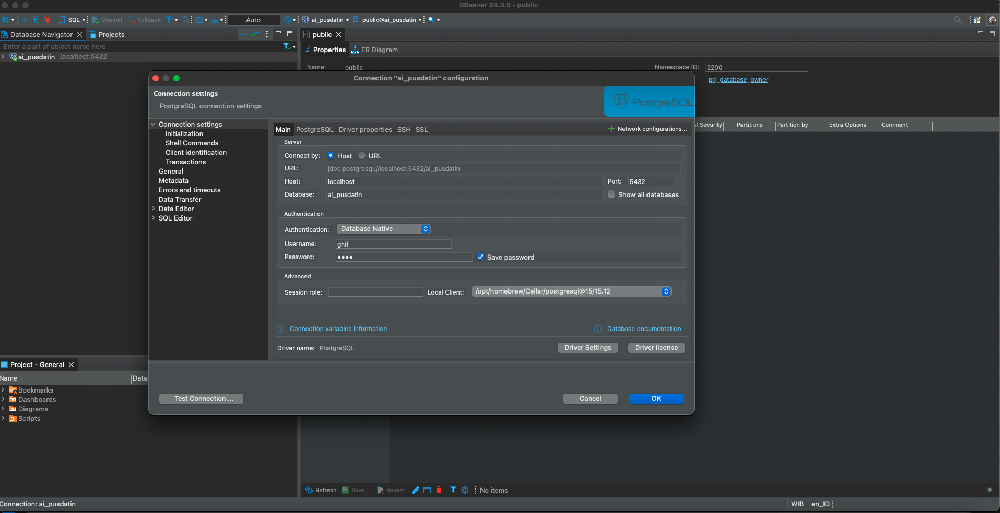

PostgreSQL, often referred to as Postgres, is a powerful, open-source relational database management system (RDBMS) known for its robustness, scalability, and extensibility. Originally developed in the 1980s at UC Berkeley, PostgreSQL has since evolved into one of the most reliable databases used by developers, enterprises, and organizations worldwide. It supports SQL standards advanced indexing techniques, full-text search, JSON processing, and ACID compliance, making it an excellent choice for both transactional and analytical workloads. With its strong community support and continuous development, PostgreSQL remains a top choice for modern applications that require high performance and flexibility.

Compared to commercial databases like Oracle Database, Microsoft SQL Server, and IBM Db2, PostgreSQL offers a cost-effective solution without licensing fees while still providing enterprise-level features. Unlike Oracle, which requires expensive licensing and complex tuning, PostgreSQL is highly configurable and benefits from a strong open-source community. While SQL Server is tightly integrated with Microsoft products and optimized for Windows environments, PostgreSQL is cross-platform and supports a broader range of extensions. IBM Db2, known for its robustness in large-scale enterprise applications, offers strong analytics and AI integration, but PostgreSQL competes well with its ability to handle both OLTP and OLAP workloads efficiently. With the growing support for vector similarity search (PGVector) and NoSQL-like JSONB storage, PostgreSQL continues to be a viable alternative to commercial RDMS solutions, especially for business seeking flexibility, performance, and lower operational cost.

With the rise of Retrieval-Augmented Generation (RAG) in generative AI applications, PostgreSQL is also a viable solution for handling vector-based similarity searches through the **PGVector** extension. PGVector allows PostgreSQL to store and query high-dimensional embeddings, making it suitable for AI-powered search, recommendation systems, and chatbots that require contextual memory retrieval. By integrating PGVector, PostgreSQL can efficiently perform k-nearest neighbor (k-NN) searches, approximate nearest neighbor, and cosine similarity calculations, which are essentials for retrieving relevan information from large document corpora.

PostgreSQL can be installed on macOS using Homebrew, which simplifies the installation and management of software packages. Below are the steps to set up PostgreSQL 15 on macOS:

### **Step 1: Install PostgreSQL 15**

Run the following command in the Terminal:

```bash
brew install postgresql@15
```

Once the installation is complete, you can check the installed version by running:

```bash
postgres --version
```

### Step 3: Start PostgreSQL Service

After installation, start the PostgreSQL service:

```bash
brew services start postgresql@15
```

To check if PostgreSQL is running, use:

```bash
brew services list
```

If needed, we can stop PostgreSQL with:

```bash
brew services stop postgresql@15
```

### Step 4: Access PostgreSQL

PostgreSQL provides a command-line tool called `psql` to interact with the database. To access the PostgreSQL shell, run

```bash
psql postgres
```

To display the list of existing databases, type:

```bash
\l
```

```
                                            List of databases
   Name    |  Owner   | Encoding | Collate | Ctype | ICU Locale | Locale Provider |   Access privileges   
-----------+----------+----------+---------+-------+------------+-----------------+-----------------------
 postgres  | mghifary | UTF8     | C       | C     |            | libc            | 
 template0 | mghifary | UTF8     | C       | C     |            | libc            | =c/mghifary          +
           |          |          |         |       |            |                 | mghifary=CTc/mghifary
 template1 | mghifary | UTF8     | C       | C     |            | libc            | =c/mghifary          +
           |          |          |         |       |            |                 | mghifary=CTc/mghifary
(3 rows)

~
~
~
~
~
~
(END)
```

To exit psql, type:

```bash
\q
```

### Step 5: Create a New Database and User

To create a new database, run:

```sql
CREATE DATABASE mydatabase;
```

To create a new user with a password:

```sql
CREATE USER myuser WITH ENCRYPTED PASSWORD 'mypassword';
```

Grant privileges to the user:

```sql
GRANT ALL PRIVILEGES ON DATABASE mydatabase TO myuser;
```

After the new user and database are created, we can access that database with the following command:

```bash
psql -U myuser -d mydatabase;
```

### Step 6: Access Postgres DB through DBeaver

Instead of using `psql`, managing Postgres DBs is much easier through GUI tools. For example, we can use **DBeaver,** a free and open-source database management tool that supports PostgreSQL. Follow these steps to set up DBeaver and connect it to our PostgreSQL database:

1. Install DBeaver

Download and install DBeaver Community Edition from the official website:

👉 [https://dbeaver.io/download/](https://dbeaver.io/download/)

1. Open DBeaver and Create a New Connection
    - Launch DBeaver.
    - Click “New Database Connection” (or go to File > New > Database Connection).
    - From the list of database drivers, select **PostgreSQL** and click **Next**.
2. Enter Connection Details

In the Database Connection Settings window, enter the fllowing details:

- Host: [localhost](http://localhost) (or any PostgreSQL’s remote server address)
- Port: 5432 (default PostgreSQL port)
- Database: mydatabase (replace with the actual database name)
- Username: myuser
- Password: mypassword

Click **Test Connection** to verify the connection is successful. If the test is successful, click **Finish**.



1. Manage The Database

Once connected, we can:

- Browse tables, schemas, and data.
- Run SQL queries using the SQL Editor (`Cmd + Enter` to execute).
- Export/import data.
- Manage users and roles.

### Step 7: Uninstall PostgreSQL (If Needed)

If we need to remove PostgreSQL:

```sql
brew uninstall postgresql@15
```

### **Conclusion**

PostgreSQL 15 is now installed and running on your macOS. We can use `psql` to interact with the database, create users, and manage your databases. If you’re working on development projects, consider using GUI tools like **pgAdmin,** **DBeaver,** or **PostgreSQL extension in VSCode** for easier database management.
