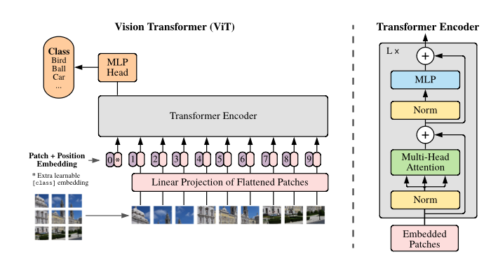
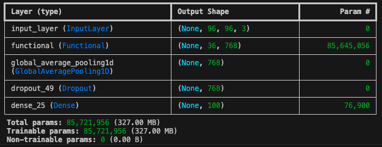
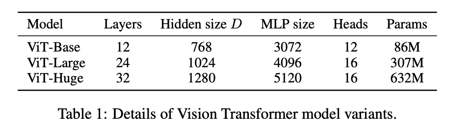
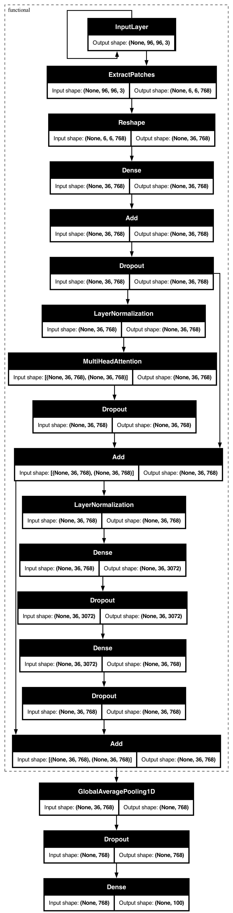
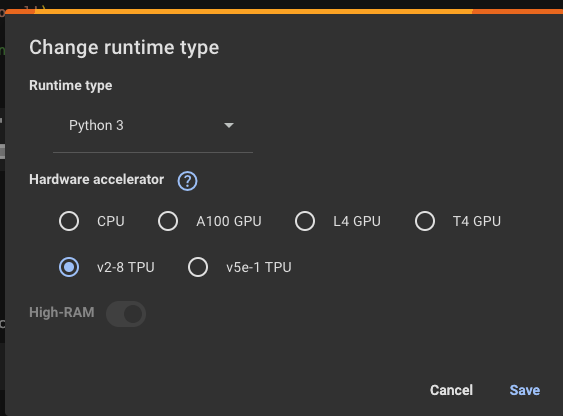
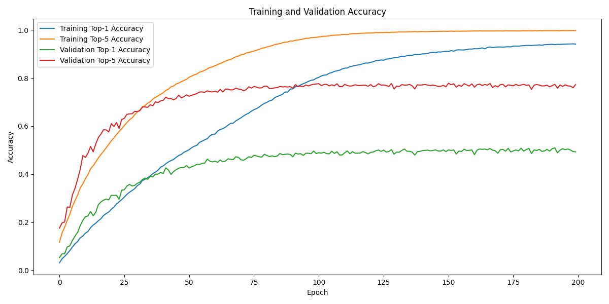
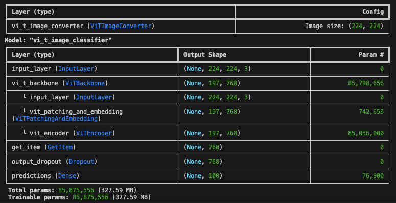
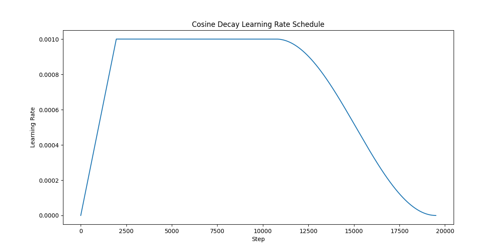

Arsitektur Transformer ([Vaswani et al. 2017](https://arxiv.org/pdf/1706.03762)) telah menjadi fenomena pada bidang AI, melahirkan berbagai model fondasi (*foundational models*) terutama untuk generative AI. Arsitektur ini merevolusi pendekatan pemecahan masalah dengan memanfaatkan *attention mechanism* ([Bahdanau et al. 2015](https://arxiv.org/pdf/1409.0473)) dalam ranah pemrosesan bahasa alami (Natural Language Processing/NLP). Namun, sebelum tahun 2020, penerapan Transformer di bidang Computer Vision (CV) belum mencapai keberhasilan yang serupa seperti di NLP — model-model berbasis convolution networks masih mendominasi ranah CV. 

Vision Transformer (ViT) ([Dosovitskiy et al. 2021](https://arxiv.org/pdf/2010.11929)) dirancang untuk menjadi solusi bagi permasalahan di Computer Vision, hanya dengan mengandalkan *attention mechanism* / tanpa menggunakan lapisan *convolution*. ViT terinspirasi dari skalabilitas pelatihan Transformer  — performa arsitektur Transformer dapat terus meningkat seiring penambahan data latih, lebih baik dibandingkan *sequence model* lainnya, e.g., *recurrent networks*. 

ViT bukan yang pertama dalam mengajukan ide untuk mengganti *convolution*  sepenuhnya dengan *attention mechanism*. Terdapat beberapa percobaan sebelumnya yang melakukan hal tersebut ([Ramachandran et al. 2019,](https://arxiv.org/pdf/1906.05909) [Wang et al. 2020](https://arxiv.org/pdf/2003.07853)), namun terkendala kompleksitas komputasi dikarenakan desain mekanisme *attention*  yang lebih kompleks dibandingkan Transformer versi awal. ViT mencoba kembali lagi ke mekanisme *attention* yang lebih simpel. Dengan beberapa trik khusus, ViT mampu menawarkan performa yang setara atau lebih baik dibandingkan model berbasis *convolution*.

Pada paper ([Dosovitskiy et al. 2021](https://arxiv.org/pdf/2010.11929)), dilaporkan hasil evaluasi untuk pemecahan problem klasifikasi objek, bahwa ViT memiliki performa agak sedikit dibawah ResNet (model state-of-the-art berbasis convolution) jika jumlah data latih berukuran medium, misalnya seperti pada dataset ImageNet dengan sampel gambar sebanyak ~1 juta. Namun pada kasus dengan data latih yang lebih banyak (14 - 300 juta), ViT memiliki performa lebih baik dibandingkan ResNet. Hal ini secara empiris membuktikan hipotesis skalabilitas pelatihan dari ViT dibandingkan model berbasis *convolution*.

Artikel ini membahas implementasi arsitektur dan pelatihan ViT dengan menggunakan Keras 3.

## Arsitektur Vision Transformer (ViT)

Agak berbeda dengan model asal Transformer yang berbentuk *encoder-decoder* karena dirancang untuk dilatih secara *self-supervised* pada data sekuensial,  ViT merupakan model *encoder-only* yang dilatih secara *supervised.* Namun, arsitektur *encoder* ViT sangat mirip dengan encoder pada Transformer*,* yaitu tersusun dari beberapa blok lapisan yang didalamnya terdapat *multi head attention*.



Perbedaan lainnya adalah bagaimana input diproses. Desain Transformer secara natural cocok untuk memproses data sekuensial seperti teks, namun tidak serta merta cocok untuk data gambar. ViT mengakalinya dengan memecah gambar menjadi kotak-kotak kecil (diistilahkan sebagai *patches*), misalnya berukuran 16 x 16 untuk tiap patch, yang dianggap sebagai token untuk diproses pada lapisan berikutnya.

Tidak hanya itu, tiap-tiap patch akan diasosiasikan dengan informasi indeks posisi, untuk secara eksplisit menyatakan bahwa, misalnya, “*patch* A berada di posisi  ke-1”.

Secara umum, arsitektur ViT tersusun dari operasi-operasi berikut:

1. **Patch Extractor**: memecah gambar menjadi kotak-kotak kecil (*patches*)
2. **Patch Encoder**: mengkonversi *patch* menjadi *embeddings* melalui proyeksi linear yang hasilnya diasosiasikan dengan informasi posisi (*position embedding*)
3. **Encoder Block**: blok lapisan utama pada ViT yang terdiri dari Multi-Head Attention (MHA) dan Multi-Layer Perceptron (MLP) secara berulang.
4. **Classification Head**: lapisan paling atas yang terkoneksi dengan label supervisi.

Kita akan bedah satu-persatu.

### I. Patch Extractor

Untuk membagi suatu gambar jadi kotak-kotak kecil, kita dapat memanfaatkan fungsi `keras.ops.image.extract_patches` . Cukup untuk memberitahu seberapa besar dimensi *patch* yang diharapkan (`patch_size`), fungsi tersebut akan mengembalikan himpunan *patches.*

Misalnya kita masukkan `patch_size=16` dengan `image_dimension=224`, maka fungsi tersebut akan memberikan patches sejumlah `image_dimension / patch_size = 224 / 16 = 14`.

Kemudian, tiap patch yang bentuk aslinya berupa matriks 2D dikonversi menjadi vektor 1D. Sebuah vektor *patch* memiliki dimensi `d = patch_size * patch_size * 3`. Rangkaian operasi secara lengkap dapat dilihat pada fungsi `extract_patches` berikut.

```python
def extract_patches(images, patch_size):
    """
    Extract patches from a batch of images.

    Args:
        images (Tensor): A batch of images with shape (batch_size, height, width, channels).
        patch_size (int): The size of the patches to be extracted.
    Returns:
        Tensor: The extracted patches.
    """
    (_, height, width, channels) = ops.shape(images)
    num_patches_h = height // patch_size
    num_patches_w = width // patch_size
    patches = ops.image.extract_patches(
        images,
        size=patch_size
    )
    patches = keras.layers.Reshape((num_patches_h * num_patches_w, patch_size * patch_size * channels))(patches)
    return patches
```

### II. Patch Encoder

Langkah ini mengkonversi *patch* menjadi vektor lain melalui proyeksi linear untuk membentuk sebuah *embedding*. Misalkan terdapat sebuah patch pada posisi ke-$t$:$\mathbf{x}_p^{(t)} \in \mathbb{R}^d$, *embedding* dari patch tersebut,$\mathbf{z}_p^{(t)} \in \mathbb{R}^k$, didapatkan dengan:

$$
\mathbf{z}_p^{(t)} = \mathbf{W}_p \mathbf{x}_p^{(t)}
$$

dimana$\mathbf{W}_p \in \mathbb{R}^{k \times d}$merupakan bagian dari parameter yang akan dilatih. Pada implementasi dimensi$k$akan dibuat sama dengan dimensi$d$.

Kemudian, *embedding* dari patch akan dikombinasikan dengan *position embedding$\mathbf{z}_t^{(t)} \in \mathbb{R}^k$:*

$$
\mathbf{z}_t^{(t)} = \mathrm{Embedding}(t)
$$

yang berfungsi sebagai identifier bahwa suatu patch berada diposisi tertentu.

Hasil akhir dari *patch embeddings* berupa:

$$
\mathbf{z} = \mathbf{z}_p^{(t)} + \mathbf{z}_t^{(t)}
$$

Sebagai catatan, pada paper ([Dosovitskiy et al. 2021](https://arxiv.org/pdf/2010.11929)) juga mengkombinasikan *embeddings* dari informasi kelas / kategori (*class embeddings*). Untuk kemudahan implementasi kita abaikan dulu hal tersebut.

```python
def encode_patches(patch, num_patches, projection_dim):
    """
    Encode a single image patch.

    Args:
        patch (Tensor): A single image patch with shape (patch_dim).
        num_patches (int): Number of patches the image is divided into.
        projection_dim (int): Dimension of the projection space.
    Returns:
        Tensor: The encoded patch.
    """
    positions = ops.expand_dims(
        ops.arange(start=0, stop=num_patches, step=1), axis=0
    )
    projection = layers.Dense(units=projection_dim)(patch)
    position_embedding = layers.Embedding(
        input_dim=num_patches, output_dim=projection_dim
    )(positions)
    return projection + position_embedding
```

### III. ViT Encoder Block

Blok lapisan ini merupakan bagian paling krusial pada ViT. Secara umum, Encoder Block ini terdiri dari 2 sub-block utama:

1. Multi Head Attention (MHA): lapisan yang tersusun dari mekanisme *self-attention* yang diduplikasi sebagaimana halnya pada (Vaswani et al. 2017).
2. Multi Layer Perceptron (MLP): lapisan penutup dari blok yang berisi MLP sederhana.

Blok ini juga memanfaatkan *skip connection* yang diadopsi dari ResNet (He et al. 2016), dan juga menggunakan *layer normalization* dan *dropout* sebagai regularisasi untuk mengurangi *overfitting*.

Skeleton dari arsitektur blok ini secara matematis dapat dinyatakan sebagai berikut:$h = \mathrm{LayerNorm}(z) \\
h = \mathrm{MultiHeadAttention}(h) \\
h = \mathrm{Dropout}(x) \\
h = h + z \\
y = \mathrm{LayerNorm}(h) \\
y = \mathrm{MLP}(y) \\
y = y + h$Fungsi di bawah ini mengimplementasikan arsitektur blok tersebut.

```python
def encoder1d_block(inputs, num_heads, hidden_dim, mlp_dim, attention_dropout_rate, dropout_rate):
    """
    Create an Encoder 1D block.
    Args:
        inputs (Tensor): Input tensor.
        num_heads (int): Number of attention heads.
        hidden_dim (int): Hidden dimension of the feedforward network.
        mlp_dim (int): Hidden dimension of the MLP block.
        attention_dropout_rate (float): Dropout rate for the attention layer.
        dropout_rate (float): Dropout rate for the block.
    Returns:
        Output tensor.
    """
    # Layer normalization 1
    h = layers.LayerNormalization(epsilon=1e-6)(inputs)

    key_dim = hidden_dim // num_heads

    # Multi Head Attention layer
    h = layers.MultiHeadAttention(
        num_heads=num_heads,
        key_dim=key_dim,
        dropout=attention_dropout_rate
    )(h, h)

    # Dropout
    h = layers.Dropout(dropout_rate)(h)

    # Skip connection 1
    h = h + inputs

    # MLP block
    y = layers.LayerNormalization(epsilon=1e-6)(h)
    y = mlp_block(y, mlp_dim, dropout_rate)
    
    # Skip connection 2
    y = y + h
    
    return y
```

Encoder Block kemudian ditumpuk berlapis-lapis sesuai kebutuhan sejumlah `num_layers`. Sebagai contoh, salah satu versi model ViT yang dibahas oleh ([Dosovitskiy et al. 2021](https://arxiv.org/pdf/2010.11929)) yaitu model “**ViT-Base”** dimana `num_layers = 12`.

```python
def vit_encoder(inputs, num_layers, num_heads, hidden_dim, mlp_dim, attention_dropout_rate, dropout_rate):

    x = layers.Dropout(dropout_rate)(inputs)
    for _ in range(num_layers):
        x = encoder1d_block(
            x, num_heads, hidden_dim, mlp_dim, attention_dropout_rate, dropout_rate
        )
    return x
```

Lapisan-lapisan arsitektur yang telah dibahas sebelumnya dapat dienkapsulasi menjadi sebuah *backbone*.

```python
def vit_backbone(image_shape, patch_size, num_layers, num_heads, mlp_dim, attention_dropout_rate, dropout_rate):
    """
    Create a Vision Transformer backbone.

    Args:
        image_shape (tuple): Shape of the images after resizing and augmentation.
        patch_size (int): Size of the patches.
        num_layers (int): Number of encoder layers.
        num_heads (int): Number of attention heads.
        mlp_dim (int): Hidden dimension of the MLP block.
        attention_dropout_rate (float): Dropout rate for the attention layer.
        dropout_rate (float): Dropout rate for the block.
    Returns:
        Vision Transformer backbone (keras.Model).
    """
    num_patches = (image_shape[0] // patch_size) * (image_shape[1] // patch_size)
    hidden_dim = patch_size * patch_size * 3

    inputs = keras.Input(shape=image_shape)
    patches = extract_patches(inputs, patch_size)
    encoded_patches = encode_patches(patches, num_patches, hidden_dim)

    y = vit_encoder(
        encoded_patches, num_layers, num_heads, hidden_dim, mlp_dim, attention_dropout_rate, dropout_rate
    )
    return keras.Model(inputs=inputs, outputs=y)
```

### IV. Classification Head

Terakhir, kita perlu hubungkan arsitektur *backbone* ke lapisan penutup, yaitu lapisan kelas / kategori, agar siap untuk pelatihan tersupervisi. Kita dapat menggunakan Functional API pada Keras 3 (termasuk menggunakan `keras.Model`) untuk membentuk arsitektur ViT secara lengkap.

```python
def vit_classifier(image_shape, patch_size, num_layers, num_heads, mlp_dim, attention_dropout_rate, dropout_rate, num_classes):
    """
    Create a Vision Transformer classifier using ViT Backbone.

    Args:
        image_shape (tuple): Shape of the images after resizing and augmentation.
        patch_size (int): Size of the patches.
        num_layers (int): Number of encoder layers.
        num_heads (int): Number of attention heads.
        mlp_dim (int): Hidden dimension of the MLP block.
        attention_dropout_rate (float): Dropout rate for the attention layer.
        dropout_rate (float): Dropout rate for the block.
        num_classes (int): Number of output classes.
    Returns:
        Vision Transformer classifier (keras.Model).
    """
    backbone = vit_backbone(
        image_shape=image_shape,
        patch_size=patch_size,
        num_layers=num_layers,
        num_heads=num_heads,
        mlp_dim=mlp_dim,
        attention_dropout_rate=attention_dropout_rate,
        dropout_rate=dropout_rate
    )
    inputs = backbone.inputs
    features = backbone(inputs)
    h = layers.GlobalAveragePooling1D()(features)
    h = layers.Dropout(dropout_rate)(h)
    logits = layers.Dense(num_classes, dtype="float32")(h)

    return keras.Model(inputs=inputs, outputs=logits)
```

Berikut ini merupakan contoh instansiasi arsitektur yang mirip dengan versi ViT-Base yang memiliki ~86 juta parameter, yang siap digunakan untuk klasifikasi objek dengan dimensi gambar (32, 32, 3) dan jumlah kategori sebanyak 100.

```python
classifier_model = vit_classifier(
    image_shape=(96, 96, 3),
    patch_size=16,
    num_layers=12,
    num_heads=12,
    mlp_dim=3072,
    attention_dropout_rate=0.1,
    dropout_rate=0.1,
    num_classes=100
)
```





Berikut ini merupakan visualisasi arsitektur model ViT dengan hanya 1 layer Encoder Block (`num_layers = 1`) sekadar untuk penyederhanaan visualisasi.



## Pelatihan ViT pada dataset CIFAR100

Kita akan melatih model ViT dari nol dengan menggunakan dataset CIFAR100. Percobaan ini tidak untuk mereplikasi hasil CIFAR100 yang dilaporkan oleh ([Dosovitskiy et al. 2021](https://arxiv.org/pdf/2010.11929)) karena di sana merupakan hasil dari *finetuning*, dimana ViT sudah dilakukan pralatih (*pretraining*) dengan dataset yang jauh lebih besar.

Pelatihan dijalankan via fungsi Keras `fit()` dengan menggunakan optimisasi `AdamW`,  `batch_size=128` dan `epochs=200`.

```python
# setup training and evaluation data (train_dataset, test_dataset)
...
...
optimizer = keras.optimizers.Adam(
    learning_rate=conf.LEARNING_RATE,
    weight_decay=conf.WEIGHT_DECAY,
    global_clipnorm=1.0
)

vit_model.compile(
    optimizer=optimizer,
    loss=keras.losses.SparseCategoricalCrossentropy(from_logits=True),
    metrics=[
        keras.metrics.SparseCategoricalAccuracy(name="accuracy"),
        keras.metrics.SparseTopKCategoricalAccuracy(5, name="top-5-accuracy"),
    ],
)

# Checkpoint callback
checkpoint_filepath = f"models/{MODEL_PREFIX}_cifar100.weights.h5"

checkpoint_callback = keras.callbacks.ModelCheckpoint(
    checkpoint_filepath,
    monitor="val_accuracy",
    save_best_only=True,
    save_weights_only=True,
)

history = vit_model.fit(
    train_dataset,
    epochs=conf.EPOCHS,
    validation_data=test_dataset,
    callbacks=[checkpoint_callback],
)
```

Kita gunakan mesin komputasi GPU yang ada di Google Colab.

### **Google Colab**

Sekilas tentang Google Colab (terutama yang versi Pro), kita dapat memanfaatkan beberapa fasilitas sebagai berikut:

- 100 compute units per bulan: akan expired setelah 90 hari
- Pilihan GPU lebih cepat dan memori lebih besar dibandingkan versi gratis
- Terminal yang terkoneksi dengan VM

Saat ini terdapat beberapa pilihan *hardware accelerator*:



Berikut spesifikasi lebih rinci dari masing-masing *hardware accelerator*:

| **Mesin** | **Spesifikasi** |
| --- | --- |
| T4 GPU | Arsitektur: Turing
Jumlah GPU: 1 
Memori: 16 GB GDDR6
Kegunaan: 
- Performa komputasi sekitar 8.1 TFLOPS (FP32), mendukung *mixed precision* (FP16, Tensor Cores).
- Cocok untuk pelatihan deep learning skala menengah.
- Banyak digunakan untuk inference karena efisiensi daya yang baik. |
| L4 GPU | Arsitektur: Ada Lovelace (khusus untuk *inference* dan *video processing*)
Jumlah GPU: 1
Memori: 24 GB GDDR6
Kegunaan:
- Performa komputasi sekitar 22-24 TFLOPS (FP32).
- Sangat baik untuk inference large model, pengolahan video, dan juga fine-tuning model berukuran sedang-besar. |
| A100 GPU | Arsitektur: Ampere
Jumlah GPU: 1 
Memori: 40 GB HBM2
Kegunaan: 
- Performa komputasi hingga 19.5 TFLOPS (FP32), dan jauh lebih tinggi jika memanfaatkan Tensor Cores (BF16/FP16).
- Ideal untuk training model besar seperti Transformers (BERT, GPT, dsb).
- Memiliki memori GPU yang cukup besar sehingga mengurangi risiko *out-of-memory* (OOM) saat training. |
| TPU v2-8 | Arsitektur: TPU Generasi 2
Kapasitas: 
- Satu TPU node memiliki 8 core TPU (sering disebut v2-8).
- Setiap TPUP v2-8 umumnya dilengkapi 128 GB HBM secara total
Kegunaan:
- Performa komputasi sekitar 180 TFLOPS (BF16) per TPU v2-8.
- Cocok untuk melatih deep learning berskala menengah hingga besar, terutama menggunakan TensorFlow dan JAX
- Sangat cepat untuk pelatihan transformer-based models dengan library yang mendukung TPU. |
| TPU v5-1 | Arsitektur: TPU Generasi 5e (generasi lebih baru dari v2-8, varian hemat biaya dan fleksibel)
Kapasitas:
- Memiliki opsi skala core berbeda, di Colab mungkin hanya 1 core.
- Memori per core lebih rendah dibandingkan v2-8 jika hanya 1 core.
Kegunaan:
- Lebih efisien dari sisi biaya dan daya.
- Cocok untuk pelatihan model skala kecil-menengah dan *inference.* |

### **Mode Mixed Precision**

Pada umumnya pelatihan model *deep learning* menggunakan angka dan operasi dengan presisi floating point 32 bit.  Untuk mempercepat proses pelatihan, kita dapat memanfaatkan mode *mixed precision*, yaitu memadukan penggunaan floating point presisi lebih rendah 16-bit (BF16/FP16) dan 32-bit (FP32). 

Mesin akselerator modern saat ini seperti Google TPU dan NVIDIA GPU memiliki perangkat keras yang didesain khusus untuk presisi 16-bit (BF16/FP16). Tambahan kecepatan yang didapatkan dengan memanfaatkan *mixed precision* dapat mencapai hingga 3x pada GPU dan 60% pada TPU. 

Pada Keras 3, mixed precision dapat diaktifkan dengan mengeksekusi perintah berikut pada awal program sebelum membuat arsitektur model:

```python
# On NVIDIA GPU or Apple M Chip
keras.mixed_precision.set_global_policy("mixed_float16") 
# or
# On Google TPU
keras.mixed_precision.set_global_policy("mixed_bfloat16")
```

### Evaluasi Hasil Pelatihan

Hasil pelatihan dalam metrik top-1-accuracy dan top-5-accuracy dapat dilihat pada grafik dan tabel berikut, dengan mode *mixed precision*.



|  | **Top-1 Accuracy (%)** | **Top-5 Accuracy (%)** | **Xent Loss** |
| --- | --- | --- | --- |
| **Train** | 98.34 | 99.98 | 0.05 |
| **Test** | 49.30 | 77.28 | 4.06 |

Terlihat bahwa ViT berhasil dilatih dengan performa pada data latih mencapai akurasi (top-1) sebesar 98.34%, namun performa pada data test masih agak jauh di bawah itu (49.30%). Tentunya ini hasil yang tidak kompetitif — sebagai perbandingan, ResNet50V2 mampu mencapai akurasi pada data tes yang sama hingga 67%. Ada kemungkinan model ViT masih mengalami overfitting pada CIFAR100. Beberapa hal yang dapat dilakukan untuk mengurangi overfitting misalnya, memperbesar pengaruh regularisasi, e.g., rasio Dropout diperbesar, menggunakan data augmentation yang lebih kompleks, dan sebagainya.

Sekadar mengecek pengaruh mode *mixed precision* terhadap kecepatan waktu pelatihan, berikut perbandingannya dengan mode full FP32 dan dengan menggunakan mesin komputasi yang berbeda (Apple M4 vs A100 GPU di Google Colab)

|  | **Apple M4** | **A100 GPU (Colab)** |
| --- | --- | --- |
| **FP32** | ~1300 ms | ~ 293 ms |
| **Mixed Precision** | ~1000 ms | ~187 ms |

Jelas terlihat komputasi di Colab dengan mesin A100 GPU jauh lebih cepat dibandingkan Apple M4, dan juga terlihat peningkatan kecepatan dengan memanfaatkan *mixed precision*.

Kode sumber lengkap untuk eksperimen di atas dapat ditemukan di [https://github.com/ghif/vit-keras3/blob/main/train_cifar100.py](https://github.com/ghif/vit-keras3/blob/main/train_cifar100.py).

## Finetuning dengan Menggunakan ViT

Kita dapat memanfaatkan model ViT yang sudah melalui tahap pralatih (*pretraining*) pada dataset berukuran besar, yang selanjutnya dapat dilakukan *finetuning* untuk menyelesaikan problem klasifikasi yang lain. Pendekatan ini dikenal dengan istilah *transfer learning*, dimana model yang sudah dilatih untuk suatu pekerjaan tertentu di awal (*upstream task*) akan ditransfer kemampuannya untuk pekerjaan lain yang terkait (*downstream task*).

Sebagai contoh, model ViT dapat dipralatih pada dataset [ImageNet](https://www.image-net.org/), lalu akan digunakan untuk klasifikasi objek pada CIFAR100. ViT hasil pralatih sudah tersedia secara publik di Internet dan dapat dengan mudah diakses melalui [Keras Hub](https://keras.io/keras_hub/).

Secara umum, langkah-langkah yang perlu dipersiapkan untuk finetuning adalah sebagai berikut:

**1. Memuat (*load*) model  ViT pralatih**

Dengan menggunakan `keras-hub` , model backbone ViT yang sudah dipralatih dapat diakses via 1 baris kode — contoh di bawah memuat model versi “ViT-Base” yang dipralatih dari dataset ImageNet.

```python
import keras_hub

backbone = keras_hub.models.Backbone.from_preset("vit_base_patch16_224_imagenet")
```

**2. Memodifikasi *Classification Head***

ViT hasil pralatih dari ImageNet memiliki jumlah kategori/kelas sebanyak 1000. Sedangkan untuk diaplikasikan pada CIFAR100, terdapat jumlah kategori sebesar 100 dengan semantik yang berbeda.

Oleh karena itu, kita perlu mengganti layer terakhir dari ViT yang terhubung ke kategori. Melalui Keras Hub kita dapat memanfaatkan API `keras_hub.models.ViTImageClassifier`.

```python
# Get the preprocessor
preprocessor = keras_hub.models.ViTImageClassifierPreprocessor.from_preset(
    "vit_base_patch16_224_imagenet"
)

# Setup ViT model with the new Classification Head
image_classifier = keras_hub.models.ViTImageClassifier(
    backbone=backbone,
    num_classes=num_classes,
    preprocessor=preprocessor,
)

# visualize the architecture
image_classifier.summary(expand_nested=True) 
```



Dari tangkapan layar di atas, terlihat lapisan terakhir pada ViT, `predictions (Dense)`, sudah memiliki dimensi 100, sama dengan jumlah kategori pada CIFAR100.

**3. Melatih model dengan Classification Head yang baru**

Model ViT dengan Classification Head yang baru siap dilatih dengan mekanisme *finetuning* pada dataset CIFAR100. Berbeda dengan yang digunakan pada percobaan pelatihan dari nol sebelumnya, metode optimisasi yang digunakan adalah Stochastic Gradient Descent (`SGD`) dengan `momentum=0.9`. 

Perbedaan lainnya adalah nilai `learning_rate` dibuat dinamis, perlahan-lahan berkurang dengan mengikuti penjadwalan (*scheduling*) dengan mekanisme ***cosine decay** —* kecepatan pembaruan parameter semakin berkurang seiring bertambahnya langkah pelatihan mengikuti pola fungsi *cosine*. Hal ini untuk menjaga kestabilan atau menghindari osilasi yang tinggi pada proses pelatihan bobot model di fase tengah ke akhir. Grafik di bawah ini mengilustrasikan pola *cosine decay*:



Perhatikan pada grafik tersebut, bahwa efek *cosine decay* baru dimulai setelah langkah > 10000. Dari langkah awal hingga langkah ke ~2000an,  pola`learning_rate` naik secara linear, lalu dilanjutkan dengan stagnasi pada nilai tertentu hingga langkah ke ~11000an. Efek ini dinamakan dengan ***warm up***, dalam rangka menjaga kestabilan pelatihan di fase awal untuk mengimbangi efek nilai bobot yang diinisialisasi secara acak.

Berikut implementasi finetuning model ViT dengan penjadwalan *cosine decay + warmup* terhadap `learning_rate`.

```python
def lr_warmup_cosine_decay(
    global_step,
    warmup_steps,
    hold=0,
    total_steps=0,
    target_lr=1e-3,
):
    # Cosine decay
    learning_rate = (
        0.5
        * target_lr
        * (
            1
            + ops.cos(
                math.pi
                * ops.convert_to_tensor(
                    global_step - warmup_steps - hold, dtype="float32"
                )
                / ops.convert_to_tensor(
                    total_steps - warmup_steps - hold, dtype="float32"
                )
            )
        )
    )

    warmup_lr = target_lr * (global_step / warmup_steps)

    if hold > 0:
        learning_rate = ops.where(
            global_step > warmup_steps + hold, learning_rate, target_lr
        )

    learning_rate = ops.where(global_step < warmup_steps, warmup_lr, learning_rate)
    return learning_rate

class WarmUpCosineDecay(schedules.LearningRateSchedule):
    def __init__(self, warmup_steps, total_steps, hold, target_lr=1e-2):
        super().__init__()
        self.target_lr = target_lr
        self.warmup_steps = warmup_steps
        self.total_steps = total_steps
        self.hold = hold

    def __call__(self, step):
        lr = lr_warmup_cosine_decay(
            global_step=step,
            total_steps=self.total_steps,
            warmup_steps=self.warmup_steps,
            target_lr=self.target_lr,
            hold=self.hold,
        )
        return ops.where(step > self.total_steps, 0.0, lr)
    
lr_schedule = WarmUpCosineDecay(
    target_lr=conf.LEARNING_RATE,
    warmup_steps=int(0.1 * total_steps),
    total_steps=total_steps,
    hold=int(0.45 * total_steps)
)

# Finetune the classifier with SGD optimizer
optimizer = keras.optimizers.SGD(
    learning_rate=lr_schedule,
    momentum=0.9,
    global_clipnorm=1.0

)

image_classifier.compile(
    optimizer=optimizer,
    loss=keras.losses.SparseCategoricalCrossentropy(from_logits=True),
    metrics=[
        keras.metrics.SparseCategoricalAccuracy(name="accuracy"),
        keras.metrics.SparseTopKCategoricalAccuracy(5, name="top-5-accuracy"),
    ],
)

# Checkpoint callback
checkpoint_filepath = f"models/{MODEL_PREFIX}_cifar100.weights.h5"
checkpoint_callback = keras.callbacks.ModelCheckpoint(
    checkpoint_filepath,
    monitor="val_accuracy",
    save_best_only=True,
    save_weights_only=True,
)

# Finetune the classifier
history = image_classifier.fit(
    train_dataset,
    epochs=conf.EPOCHS,
    validation_data=test_dataset,
    callbacks=[checkpoint_callback],
)

loss, accuracy, top_5_accuracy = image_classifier.evaluate(train_dataset)
print(f"Train loss: {loss}")
print(f"Train accuracy: {round(accuracy * 100, 2)}%")
print(f"Train top 5 accuracy: {round(top_5_accuracy * 100, 2)}%")

loss, accuracy, top_5_accuracy = image_classifier.evaluate(test_dataset)
print(f"Test loss: {loss}")
print(f"Test accuracy: {round(accuracy * 100, 2)}%")
print(f"Test top 5 accuracy: {round(top_5_accuracy * 100, 2)}%")
```

Sedikit catatan tambahan, proses *finetuning* di sini dilakukan dengan membekukan (*freeze*) bobot dari lapisan *backbone*. Artinya, bobot yang diperbarui hanya pada lapisan Classification Head.

```python
backbone.trainable = False
```

Hal ini dilakukan untuk menyederhanakan komputasi. Proses *finetuning* pada dasarnya bisa  diberlakukan untuk memperbarui seluruh bobot pada model.

### Hasil Percobaan Finetuning

Berikut performa yang didapatkan oleh model ViT hasil finetuning dengan data CIFAR100 setelah melalui `50 epochs`.

|  | **Top-1 Accuracy (%)** | **Top-5 Accuracy (%)** | **Xent Loss** |
| --- | --- | --- | --- |
| **Train** | 89.04 | 98.23 | 0.39 |
| **Test** | 85.20 | 96.85 | 0.97 |

Top-1 Accuracy berhasil mencapai angka 85.20%, jauh di atas angka hasil pelatihan model ViT dari nol sebelumnya (49.30%).

Implementasi secara lengkap dapat dilihat di [https://github.com/ghif/vit-keras3/blob/main/finetune_cifar100.py](https://github.com/ghif/vit-keras3/blob/main/finetune_cifar100.py).

## Penutup

Dalam artikel ini, telah dibahas secara komprehensif tentang implementasi Vision Transformer (ViT) dengan Keras 3, mulai dari pemrosesan awal berupa ekstraksi patch, encoding patch dengan penambahan position embedding, hingga encoder block yang mengintegrasikan mekanisme Multi Head Attention dan MLP. Pembahasannya juga meliputi teknik penyederhanaan komputasi seperti mixed precision dan juga strategi fine-tuning untuk memanfaatkan model yang telah dipralatih pada dataset besar. Dari hasil eksperimen klasifikasi objek pada dataset CIFAR100, strategi finetuning mampu menghasilkan performa ViT yang kompetitif dibandingkan pelatihan dari nol.
