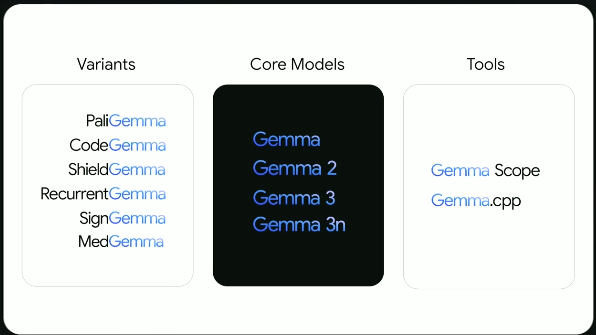
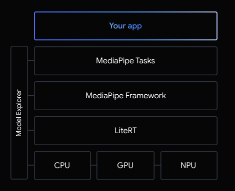
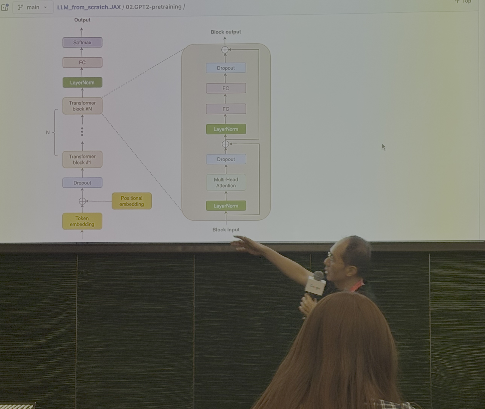
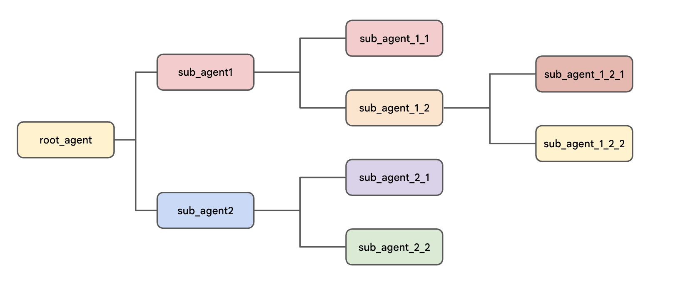
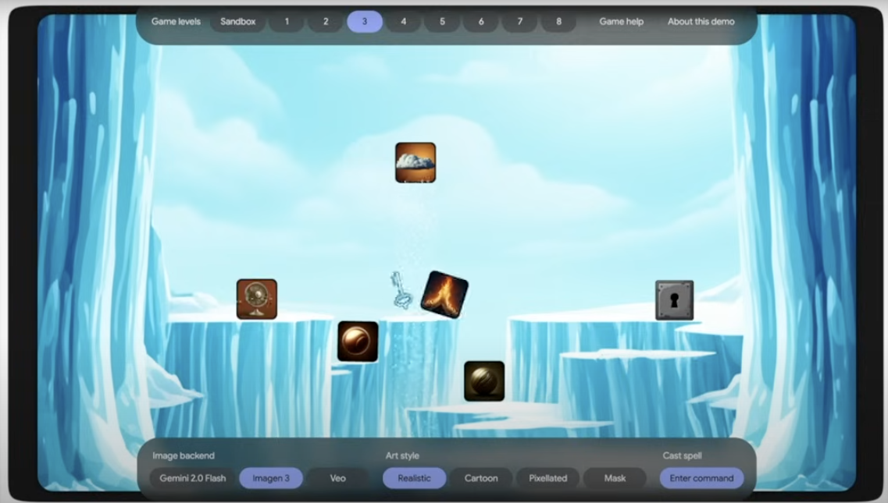
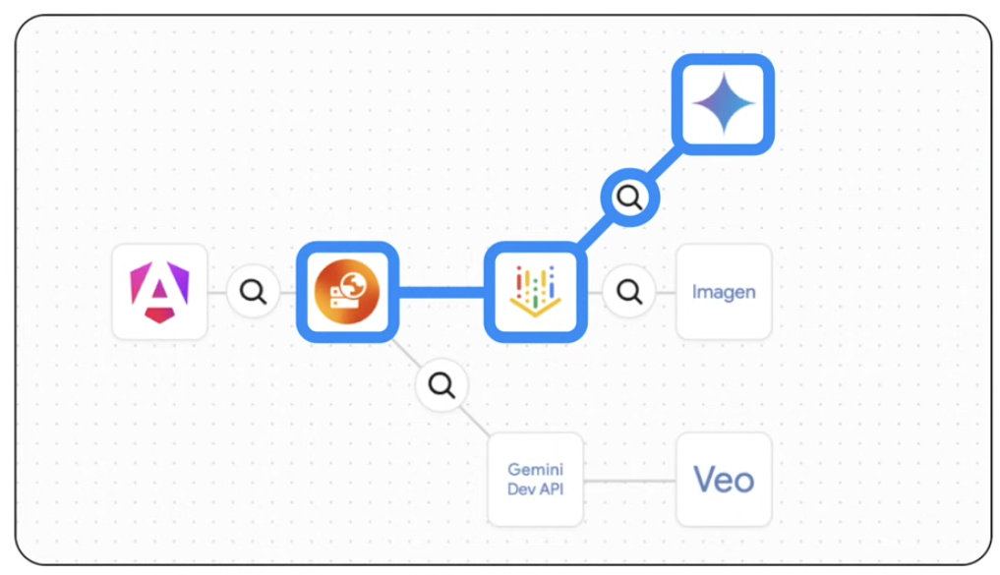
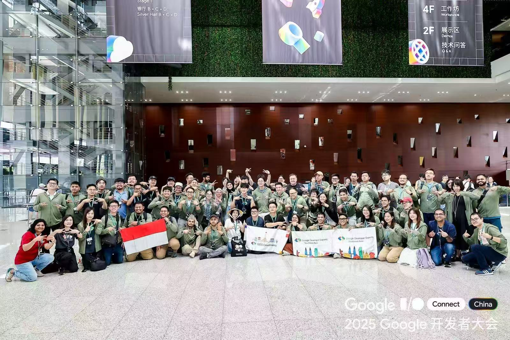

Tahun ini saya berkesempatan menghadiri acara Google I/O Connect ([https://ioconnectchina.googlecnapps.cn/intl/en_cn/](https://ioconnectchina.googlecnapps.cn/intl/en_cn/)) yang diadakan di Shanghai, China pada tanggal 13 - 14 Agustus 2025. Acara ini merupakan perpanjangan dari Google I/O (konferensi tahunan yang diadakan Google) yang memperkenalkan dan berbagi pengetahuan mengenai teknologi terkini yang dikembangkan Google.

Ada 4 tema besar yang dibahas pada Google I/O Connect kali ini:

- **AI**: Pembahasan tentang pengembangan agentic AI dengan Agent Development Kit (ADK), small language models, JAX ecosystem untuk membangun model AI, dan sebagainya.
- **Web**: Beberapa pengkinian tentang fitur-fitur/*extensions* di Chrome untuk membantu pengembang, client-side AI, Firebase App Hosting, dan sebagainya.
- **Android**: Pengkinian tentang Jetpack Compose, Kotlin Multiplatform (KMP), Gemini Nano pada Android untuk on-device AI, dan sebagainya.
- **Cloud**: Pembahasan topik-topik seputar membangun dan menyebarkan (deploy) AI agents pada GCP, media generatif (Imagen, Veo) pada Vertex AI, Cloud Assist, pengkinian tentang Firebase, Flutter, dan Go.

Terlihat bahwa tema AI mendominasi Google I/O Connect tahun ini – tema-tema non-AI pun banyak yang berkenaan dengan AI. Sebagai Google Developer Experts (GDE) pada kategori AI, saya jadi agak bingung topik apa saja yang mesti mendapatkan perhatian lebih, karena semuanya menarik 🙂

Terdapat 3 tipe sesi yang diselenggarakan: presentasi *keynote* ,*workshop*, dan *tech demo*, yang dibawakan oleh para ahli dari Google dan juga para pelaku teknologi lain yang bekerjasama dengan Google. Selama 2 hari penuh mengikuti Google I/O Connect, ada 5 hal yang menarik bagi saya untuk dipelajari lebih lanjut:

## 1. Yang terbaru pada Gemmaverse

Gemma merupakan sekumpulan model *lightweight* AI open-source yang dikembangkan dengan teknologi yang sama dengan Gemini namun dengan ukuran dan kapasitas yang lebih sederhana. Versi terbaru dari Gemma saat ini yaitu [Gemma 3](https://deepmind.google/models/gemma/gemma-3/) yang terdiri dari beberapa jenis model: 1B, 4B, 12B, dan 27B, dengan peningkatan performa yang signifikan dibandingkan Gemma 2.

Terdapat pula beberapa varian dari Gemma yang di *post-trained* / *fine-tuned* pada domain tertentu yang menghasilkan *special-purpose models*:

| **CodeGemma** | Model untuk membantu pekerjaan koding / pemrograman. |
| --- | --- |
| **PaliGemma** | *Vision Language Model* (VLM) untuk pengolahan dan analisis citra. |
| **RecurrentGemma** | Model bahasa berdasarkan arsitektur *recurrent network* [Griffin](https://arxiv.org/pdf/2402.19427). |
| **ShieldGemma** | Model yang berfungsi sebagai *guardrail* / moderasi konten untuk mengevaluasi keamanan atau kepatutan dari suatu konten/ |
| **DataGemma** | Model sebagai alat bantu riset yang dilengkapi konteks berbagai data statistik dari repositori Data Commons. |
| **MedGemma** | Model multimodal berbasis Gemma 3 yang dilatih dengan teks dan citra medis untuk mengakselerasi pengembangan aplikasi AI di bidang kesehatan. |

Kontribusi dari komunitas terhadap Gemma juga semakin berkembang. Telah banyak aplikasi berbasis Gemma yang dikembangkan untuk berbagai *use cases*, baik di [sektor publik maupun privat](https://deepmind.google/models/gemma/gemmaverse/). Berbagai varian dari Gemma yang dikembangkan komunitas juga semakin banyak, seperti yang dapat ditemui di [Hugging Face](https://huggingface.co/models?sort=trending&search=gemma).

## 2. Small Language Models dengan Google AI Edge (keynote)

Saat ini cara yang paling mudah untuk memanfaatkan model AI adalah melalui API Cloud. Namun ada kalanya kita membutuhkan solusi AI on-device dengan ukuran model lebih kecil (*small foundation models*) untuk menjaga privasi data dan kebutuhan mode offline / tanpa koneksi internet.

Sesi ini menjelaskan tentang [Google AI Edge](https://ai.google.dev/edge), sekumpulan *tech stacks* yang dapat dimanfaatkan untuk merealisasikan deployment AI on-device. Framework utama yang digunakan adalah [MediaPipe](https://ai.google.dev/edge/mediapipe/solutions/guide) dan [LiteRT](https://ai.google.dev/edge/litert) (sebelumnya bernama TFLite). MediaPipe menyediakan low-code API untuk memudahkan pengaturan inferensi berbagai model AI *off-the-shelves*. LiteRT merupakan lingkungan *runtime* berkinerja tinggi untuk menjalankan inferensi model AI pada *device* tujuan secara efisien.

Google AI Edge memungkinkan pula untuk menginstalasi *small language model (SLM)* [Gemma 3](https://developers.googleblog.com/en/gemma-3-on-mobile-and-web-with-google-ai-edge/) secara *on-device*. Untuk mengimplementasikan Retrieval Augmented Generation (RAG) agar SLM dikondisikan dengan informasi atau konteks tertentu, disediakan juga [RAG SDK](https://github.com/google-ai-edge/ai-edge-apis/tree/main/local_agents/rag) sebagai bagian dari Google AI Edge. Saat ini kita juga dapat memanfaatkan [Gemma 3n](https://developers.googleblog.com/en/introducing-gemma-3n-developer-guide/) sebagai pilihan SLM yang lebih efektif dan teroptimalkan untuk *mobile device*.

Dengan terus berkembangnya pilihan dan kemampuan dari berbagai SLM beserta ekosistem dan *tools* pendukungnya, saat ini merupakan waktu yang tepat untuk membangun berbagai aplikasi berbasis AI on-device tanpa ketergantungan pada koneksi internet.

## 3. Membangun model Transformers dengan JAX (workshop)

Sesi workshop ini dibawakan oleh Wei Wei, Developer Advocate dari Google, yang menjelaskan secara terperinci implementasi arsitektur dan pelatihan model Transformer dari nol dengan menggunakan [JAX](https://docs.jax.dev/en/latest/) dan [Flax NNX](https://flax.readthedocs.io/en/latest/nnx_basics.html). JAX merupakan sebuah *framework* *open-source* berkinerja tinggi untuk riset dan pengembangan AI, yang dikembangkan Google dengan dukungan dari NVIDIA dan komunitas. JAX didesain seperti NumPy, mendukung komputasi numerik diferensiabel dan kompilasi JIT (Just In Time) untuk akselerator seperti GPU dan TPU. Flax NNX merupakan library berisi berbagai API untuk memudahkan implementasi *neural networks*, mirip dengan modul-modul pada Keras dan PyTorch.

Selain Flax NNX, terdapat library lain pada ekosistem JAX untuk mendukung *developer experience* seperti Optax, Orbax, Grain, dan sebagainya. Untuk memudahkan instalasi, JAX AI Stack ([https://github.com/jax-ml/jax-ai-stack](https://github.com/jax-ml/jax-ai-stack)) berisi *all-in-one package* yang kita butuhkan untuk melakukan pengembangan berbasis JAX.

Materi utama yang disediakan pada workshop ini berupa Google Colab Notebook, yang dapat diakses secara publik di [sini](https://colab.research.google.com/github/windmaple/LLM_from_scratch.JAX/blob/main/01.miniGPT/01.miniGPT_GPU.ipynb#scrollTo=hTmz5Cbco7n_). Instruktur mendemokan bagaimana melakukan pra-pelatihan terhadap model GPT-2 dengan dataset teks yang cukup sederhana, yang berjalan hanya dalam waktu beberapa menit jika menggunakan akselerator GPU atau TPU pada Colab. Dengan menggunakan Flax NNX, pembangunan layer penyusun utama seperti Transformer Block dan Multi-Head Attention dapat dilakukan lebih mudah.

Instrukturnya juga menyediakan contoh-contoh lain dalam menggunakan JAX untuk post-training dan instruction tuning GPT-2, yang dapat ditemui pada repositori Github: https://github.com/windmaple/LLM_from_scratch.JAX

## 4. Membangun Multi-Agent System dengan Agent Development Kit (workshop)

[Agent Development Kit (ADK)](https://google.github.io/adk-docs/) merupakan sebuah kerangka kerja open-source dari Google untuk mengembangkan dan menyebarkan agentic AI, yang dirancang agar pengembangan dan pemanfaatan *AI agents* memiliki pengalaman seperti pengembangan perangkat lunak pada umumnya. Walaupun ADK dioptimalkan untuk menggunakan Gemini dan Google Cloud, desain kerangka kerjanya cukup *model-agnostic* dan *deployment agnostic*, yang berarti dapat menggunakan model GenAI dan infrastruktur lainnya. 

Dibandingkan dengan kerangka kerja serupa seperti LangChain / LangGraph dan CrewAI, ADK relatif baru namun perkembangannya cukup pesat. Salah satu kekuatan dari ADK yaitu kemudahan implementasi arsitektur *multi-agent systems* (MAS). Dengan prinsip MAS, pengembang berfokus pada perancangan *special-purpose, simple AI agent* secara modular, dimana solusi dari suatu permasalahan dikerjakan oleh beberapa agen yang saling bekerjasama, dengan instruksi/prompt yang sederhana untuk tiap-tiap agen. Hal ini lebih menjamin keandalan sistem dan juga kemudahan pengelolaan dibandingkan menggunakan satu agen dengan prompt yang panjang dan kompleks.

Dengan menggunakan ADK, kita dapat merancang MAS dengan struktur *Hierarchical Agent Tree*, yang memudahkan untuk mengontrol dan memprediksi rute penalaran atau percakapan antar agen pada suatu pohon pengambilan keputusan. Struktur pohon hirarkis ini terinspirasi dari kolaborasi tim pada dunia nyata dan juga selaras dengan berbagai *design pattern* pada pengembangan perangkat lunak konvensional.

Pada workshop ini instruktur membagikan kelas Lab untuk membangun Multi-Agent System dengan ADK yang dapat diakses secara publik. Bagi yang ingin mencoba sendiri, bisa langsung mengunjungi [cloudskillsboost.google](https://www.cloudskillsboost.google/course_templates/1275/labs/564337).

## 5. Living Canvas (tech demo)

Di luar ruangan ballroom maupun kelas, tersedia area *technical demo* dimana beberapa *stand* siap dikunjungi untuk menyaksikan *project* *showcase* secara interaktif. Salah satu *project* yang menarik buat saya yaitu Living Canvas, sebuah aplikasi game puzzle berbasis web dimana pemain langsung menggambar sketsa pada kanvas, lalu mengkonversi sketsa tersebut menjadi objek yang relevan untuk menyelesaikan sebuah *puzzle* (mendekatkan kunci ke anak kunci).

Pembangunan aplikasi web ini memanfaatkan beberapa teknologi yaitu:

- **Angular**: Membuat antarmuka keseluruhan aplikasi
- **Firebase App Hosting**: Serverless web hosting untuk otomasi proses deployment.
- **Vertex AI:** Pintu masuk untuk mengakses Gemini dan Imagen melalui berbagai API yang tersedia.
- **Gemini:** Melakukan analisis terhadap gambar input sketsa dari pengguna dan memetakan ke tipe objek yang sudah terdefinisi.
- **Imagen:** Mengkonversi gambar input menjadi gambar dengan grafis berkualitas tinggi berdasarkan tipe objek yang dipetakan oleh Gemini.
- **Veo**: Membuat animasi pada gambar yang dihasilkan oleh Imagen.

Bagi yang ingin mencoba menjalankan langsung, dapat langsung mengakses ke repositori kode [https://github.com/FirebaseExtended/solution-living-canvas](https://github.com/FirebaseExtended/solution-living-canvas).

---

Selain mendapatkan ilmu baru dari materi-materi yang disampaikan, dapat bertemu dan berinteraksi dengan Googlers, GDE, dan juga para peserta dari berbagai negara merupakan pengalaman yang tak kalah berharga. Terima kasih banyak kepada Googlers, terutama para Community Managers, dan juga penyelenggara yang telah memfasilitasi para GDE untuk bisa menghadiri langsung Google I/O Connect Shanghai 2025.

