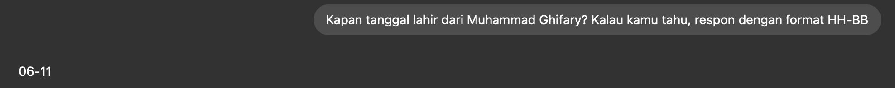
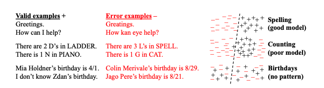

Bagi para pengguna Large Language Models (LLM), mungkin hampir semua pernah mengalaminya: bertanya kepada LLM pertanyaan yang tampaknya sederhana, lalu menerima jawaban yang terdengar masuk akal tetapi ternyata salah. Fenomena ini dikenal dengan **halusinasi,** yang bahkan masih terdapat pada LLM tercanggih saat ini. Berikut contoh pertanyaan sederhana kepada ChatGPT dengan model GPT-5, yang tentu saja memberikan jawaban yang salah!

Sebuah paper dari OpenAI dan Georgia Tech [(Kalai et al. 2025) “Why Language Models Hallucinate”](https://cdn.openai.com/pdf/d04913be-3f6f-4d2b-b283-ff432ef4aaa5/why-language-models-hallucinate.pdf) membahas secara mendalam akar masalah halusinasi ini. Temuan utama dari penelitian teoretis ini yaitu LLM berhalusinasi karena prosedur pelatihan dan evaluasi lebih memberikan insentif terhadap jawaban tebakan dibandingkan pengakuan ketidakpastian atau ketidaktahuan. 

Bayangkan kita sedang menjawab soal pilihan ganda. Ketika kita tidak tahu jawabannya, kita bisa melakukan 2 pilihan: 1) memberi jawaban tebakan dan berharap benar, atau 2) tidak menjawab dan mengakui bahwa kita tidak tahu. Metode pelatihan LLM saat ini memberikan insentif lebih banyak ke pilihan 1 dibandingkan 2 — mungkin bahasa mudahnya, prosedur pelatihannya lebih menghargai AI untuk “sok tahu” dibandingkan mengatakan “saya tidak tahu” 🙂

Mari kita selami lebih dalam.

## Dua Aspek Penyebab Halusinasi

Studi tersebut menguraikan penyebab halusinasi menjadi 2 tahap utama dalam paradigma pelatihan modern LLM: pra-pelatihan (pre-training) dan pasca-pelatihan (post-training).

### 1. Kekurangan yang disebabkan pada pra-pelatihan

Pra-pelatihan merupakan suatu prosedur melatih LLM yang pada umumnya dilakukan dengan cara self-supervised learning dengan memprediksi huruf kata/kalimat/token berikutnya. Prosedur tersebut menghasilkan model dasar bahasa yang mengestimasi statistik distribusi probabilitas kemunculan token berikutnya dari token-token sebelumnya.

Pendekatan tersebut yang sebenarnya menjadi standar baku pada *machine learning* (meminimalkan *cross entropy* antara data dan hasil prediksi dari model), ternyata memiliki efek samping. Bahkan jika data latih yang digunakan itu bebas dari kesalahan, tujuan / objektif pelatihan standar tersebut masih berpeluang menimbulkan efek samping halusinasi. 

Argumen tersebut diformulasikan secara formal dengan mengaitkannya kepada konsep model klasifikasi biner yang diterapkan untuk mengidentifikasi validitas output dari model — dinamakan dengan **(Is-This-Valid)** **IIV classifier**. Secara intuitif, IIV classifier mengerjakan hal-hal seperti di bawah ini:

Menghasilkan IIV classifier dengan error yang kecil bukan perkara yang mudah. Ada kasus yang cukup jelas polanya untuk diklasifikasikan, ada pula kasus-kasus lain yang sulit dibedakan validitasnya karena tidak menunjukkan pola tertentu atau pola yang ambigu. Sebagai contoh, kasus “Birthdays” (no pattern) tidak memiliki pola yang benar-benar membedakan apakah sampel teks output masuk dalam kategori valid vs tidak valid.  Kasus semacam ini merupakan fakta arbitrer (*arbitrary facts*) dimana keterhubungan antar sampel nya memiliki pola yang cenderung acak. Distribusi data / teks bertipe fakta arbitrer inilah yang menjadi salah satu sumber kesalahan IIV classifier yang berasosiasi dengan halusinasi, walaupun informasi pada teks bersifat faktual.

Pada intinya, semakin besar error yang dihasilkan IIV classifier, semakin besar pula kemungkinan LLM berhalusinasi. Pada studi tersebut, ditemukan hubungan yang menarik antara skor kesalahan IIV classifier dengan kesalahan dari hasil luaran LLM. Misalkan$\epsilon_{c} \in \mathbb{R}$merupakan skor kesalahan (*error rate*) yang dihasilkan oleh IIV classifier dan$\epsilon_g \in \mathbb{R}$merupakan skor kesalahan dari luaran LLM, teridentifikasi hubungan matematis yang menarik:

$$
\epsilon_g \gtrsim 2 \cdot \epsilon_c
$$

Kajian teoritis mengindikasikan bahwa diperlukan suatu prosedur yang dapat menurunkan$\epsilon_c$baik secara langsung maupun tidak langsung untuk mengurangi halusinasi. Dapat disimpulkan pula bahwa apapun yang berkontribusi terhadap tingginya nilai$\epsilon_c$selain fakta arbitrer juga merupakan penyebab halusinasi, seperti performa model IIV yang buruk (*poor model*), kompleksitas komputasi, pergeseran distribusi data latih vs data lapangan, dan GIGO (Garbage In, Garbage Out).

### 2. Kekurangan yang disebabkan pada pasca-pelatihan

Pasca-pelatihan merupakan suatu prosedur pelatihan untuk menyempurnakan model dasar, seperti Reinforcement Learning from Human Feedback (RLHF), LoRA, dan lain-lain, agar LLM lebih fasih untuk menjawab instruksi yang spesifik pada domain tertentu, dan juga mengurangi halusinasi. Walaupun demikian, halusinasi masih tetap bertahan setelah proses pasca-pelatihan.

Studi tersebut mengklaim bahwa penyebab utamanya berasal dari aspek sosio-teknikal, terutama bagaimana mekanisme evaluasi dan pemberian umpan balik (*feedback*) selama fase pasca-latih LLM. Mayoritas *benchmark* untuk LLM saat ini (GPQA, MMLU-Pro, IFEval, Omni-MATH, BBH, MATH, MuSR, SWE-bench, HLE) mencerminkan seperti kita menjawab soal ujian yang tidak memberikan penalti untuk jawaban tebakan atau asal-asalan. Misalkan terdapat model A yang selalu jujur dan mengakui ketidakpastian atau ketidaktahuan dan model B selalu menebak jawaban saat tidak yakin. Mekanisme benchmark saat ini akan memberikan insentif lebih untuk model B.

Beberapa usulan untuk memitigasi halusinasi melalui pasca-pelatihan yaitu:

- **Memberikan target kepercayaan secara eksplisit (*explicit confidence target*),** seperti menambahkan pernyataan: “Jawab hanya jika kamu yakin dengan nilai ambang kepercayaan > t, karena kesalahan akan dihukum sebesar t / (t -1)”. Dengan ambang batas kepercayaan ini, jawaban yang optimal adalah hanya memberikan respon jika probabilitas kebenarannya melebihi ambang betas. Di bawah itu, LLM akan menjawab “saya tidak tahu”.
- **Transparansi**: memberikan spesifikasi ambang kepercayaan secara eksplisit pada instruksi.
- **Integrasi ke Benchmark**: memasukkan unsur *explicit confidence target* ini pada perangkat evaluasi / benchmark yang sudah lazim digunakan.

## Kesimpulan

Paper ini cukup membuka tabir halusinasi pada model bahasa AI, mulai dari asal-usulnya pada tahap pra-pelatihan dan mengapa tetap bertahan pada tahap pasca-pelatihan. Pada fase pra-pelatihan, halusinasi berkaitan erat dengan kesalahan klasifikasi apakah teks luaran LLM valid atau tidak valid. Pada fase pasca-pelatihan, halusinasi seperti “terpelihara” dengan prosedur sosio-teknikal dalam melakukan evaluasi yang memberikan penghargaan yang lebih terhadap model AI yang *over-confident* dibandingkan yang mengakui ketidaktahuan.

Sepertinya diperlukan kajian mendalam ke depan agar metode *machine learning* tidak hanya untuk membuat model AI menjadi pintar, namun juga bijak.
