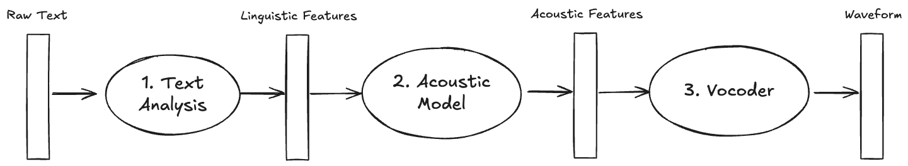
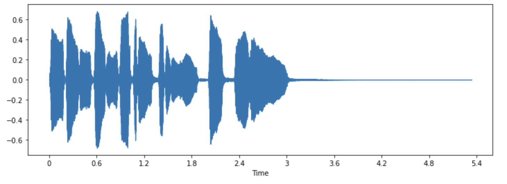
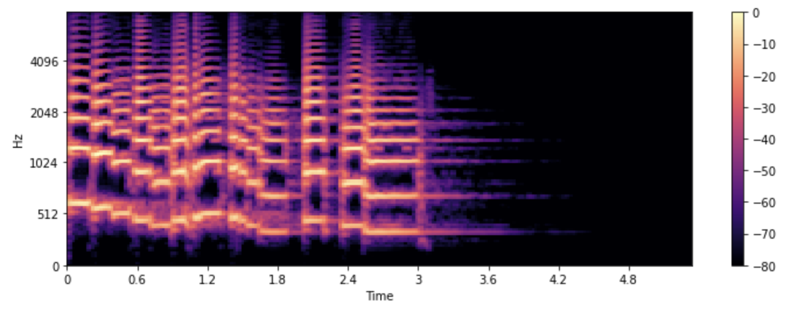
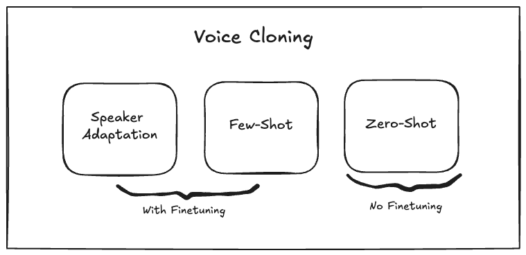
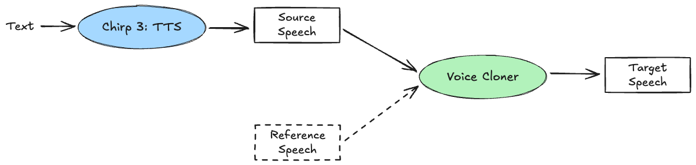
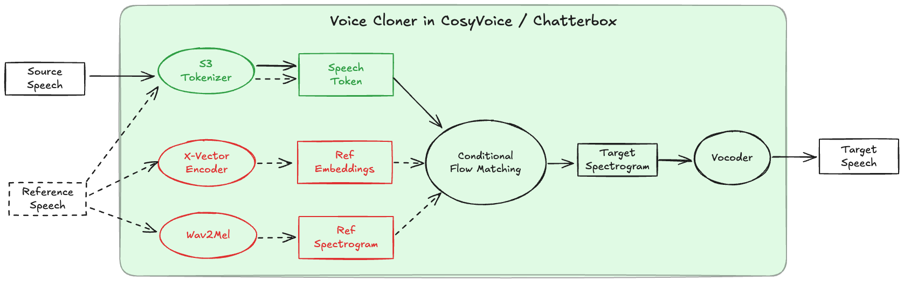
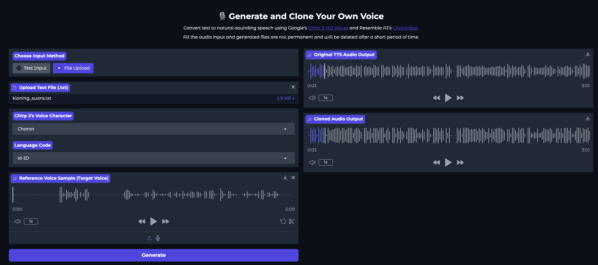

For a while now, I’ve wanted to create more educational content, both in writing and in audio-visual forms. So far, my written/static content is holding up pretty well, but when it comes to audio-visual, I’ve been stuck. I feel that inertia creeping in: recording myself speaking, doing the audio/video editing, and all that extra overhead.

May be I can stretch my creative comfort zone by sticking to what I’m comfortable at — writing — and then letting AI take care the audio-visual part. I picture an animated digital character that looks like me, speaking in my natural voice, all triggered by a simple textual script.

To make that vision real, some generative AI tools would be needed:

- **Text-to-speech:** generate realistic speech from text.
- **Voice cloning / conversion**: make the speech sound like my voice.
- **Visual character generation**: create a visual character or avatar from text prompt.
- **Audio-to-animation:** animate a talking face in sync with the speech.

These days, there are already many no-code AI tools available out there that can do these things. For examples, [ElevenLabs](https://elevenlabs.io/) (for TTS and voice cloning), [MidJourney](https://www.midjourney.com/home), [Nano Banana](https://aistudio.google.com/models/gemini-2-5-flash-image), [Veo](https://aistudio.google.com/models/veo-3) (for visual image or video generation), [HeyGen](https://www.heygen.com/), [Dreamface](https://tools.dreamfaceapp.com/) (for face lip sync / animation). Many content creators have shown the way to do so. 

Since I’m also curious about how the machinery works behind the scenes, not just using the tools, I want to explore the with-code approach (though I may try the full flow with no-code too). In this article, I’m going to start by delving into more details on the voice side (TTS and voice cloning). Let’s dive in.

## Text-to-Speech

Have you ever had your phone read an article to you or heard audiobooks? That’s Text-to-Speech (TTS) in action, the tech that turns written text into spoken words. TTS has come a long way — from flat, robotic voices to ones that can whisper, pause, emphasize, or sound emotional. It’s everywhere now: voice assistants, screen readers, podcasts, navigation, etc.

TTS also has a long history, dating back to the early 20th century in the analog era. Here’s a brief overview of its evolution:

### Early beginnings (pre-1970s)

Some of the earliest work was in analog / mechanical / signal-processing devices. For instance, [Bell Labs’ Voder](https://www.youtube.com/watch?v=5hyI_dM5cGo) (Voice Operating Demonstrator) in the 1930s was a machine that could produce recognizable speech by manually controlling parameters. Later, devices like the [vocoder](https://archive.ll.mit.edu/publications/journal/pdf/vol03_no2/3.2.1.vocoder.pdf) were developed for speech coding and synthesis.

In the 1950s - 60s, formant synthesis was introduced: modeling the human vocal tract and resonant frequencies (formants), then generating speech via parametric methods. While not very natural or expressive, it was very flexible and didn’t need huge memory or huge databases of recorded speech.

### Rule-based and concatenative approaches (1970s-1990s)

As computers became more powerful, TTS system began to include linguistic rules: text analysis (tokenization, phonemes), prosody rules (intonation, duration, stress). An early example is Klatt’s speech synthesizer (KlattTalk), developed in the 1980s. DECtalk (1983-84) is another landmark: a commercial system that used rule-based (source-filter) methods, and could be customized in terms of speech rate, pitch, etc.

Over time, methods that concatenated actual recorded speech segments (diphones, units, larger segments) became popular. These used large speech databases. The idea is that recorded speech pieces have the natural prosody and timbre, so stitching them can give more natural speech. Early systems like those in the 1990s, and commercial systems (e.g., AT&T Natural Voices) used these ideas.

### Statistical and hybrid methods (2000s)

In the 2000s, TTS moved toward statistical modeling: Hidden Markov Models (HMMs) for acoustic modeling, duration prediction, etc. Furthermore, hybrid systems that combined unit selection (concatenative) with statistical models to smooth prosody, control variation, etc. These improved intelligibility and were more robust.

Tools like Festival (Univ of Edinburgh), Flite, FreeTTS, etc., made TTS more accessible for research and smaller applications. Also, datasets started to grow.

### Neural TTS era (2015-present)

A major breakthrough has come following the deep learning explosion. DeepMind’s WaveNet (2016) introduced raw-waveform autoregressive modeling, conditioned on linguistic features, and achieved naturalness significantly higher than earlier concatenative or parametric models. It could model multiple speakers and switch between them.

Systems like Tacotron, Tacotron2, Transformer-based TTS, FastSpeech, etc., simplified the pipeline by reducing manual feature engineering (text front-end, prosody models) and enabling better expressivity. Also improvements in speed/latency, allowing practical deployment.

More recently, TTS has seen diffusion-based models, neural vocoders, and focused work on controllable TTS: being able to adjust style, emotion, pitch, speaking rate etc. Surveys such as “Towards Controllable Speech Synthesis in the Era of Large Language Models” give a taxonomy of these methods. Another survey discusses the use of diffusion models (acoustic model, vocoder, end-to-end) like in “A Survey on Audio Diffusion Models: Text to Speech Synthesis”.

## Modern TTS Pipeline

Modern TTS has evolved far beyond robotic-sounding voices of the past. Today, it can produce speech nearly indistinguishable from a human speaker. It typically involves 3 main stages:

1. **Text Analysis:** The input text is normalized (e.g., numbers —> words, punctuation —> pauses) and converted into phonemes or linguistic representations.
2. **Acoustic Modeling:** A neural model predicts mel-spectrograms — visual representations of sound frequency over time — which capture the tonal and rhythmic qualities of speech.
3. **Vocoder:** Another neural model converts the spectrogram into a raw audio waveform.



Figure 1: Modern TTS Pipeline

By harnessing the power of neural networks, recent advancements have simplified the TTS pipeline into a 2-stage approach. Some methods skip the explicit acoustic modeling step altogether — letting deep vocoders generate waveforms directly from linguistic features such as WaveNet ([Oord et al., 2016](https://arxiv.org/pdf/1609.03499)), Parallel WaveNet ([Oord et al., 2017](https://arxiv.org/pdf/1711.10433)), DeepVoice 1 ([Arik et al., 2017](https://arxiv.org/pdf/1702.07825)), DeepVoice 2 ([Arik et al., 2017](https://arxiv.org/pdf/1705.08947)), or HiFi-GAN ([Kong et al. 2020](https://arxiv.org/pdf/2010.05646)). Others take a different route, using a single deep acoustic model to produce Mel-Spectrograms straight from text, as seen in systems like DeepVoice 3, TransformerTTS ([Li et al., 2019](https://arxiv.org/pdf/1809.08895)), FastSpeech 1 ([Ren et al., 2019](https://arxiv.org/pdf/1905.09263)), or FastSpeech 2 ([Ren et al., 2022](https://arxiv.org/pdf/2006.04558)), which is a dominant approach recently. Another branch of work even attempts to solve the TTS task in an end-to-end manner such as WaveGrad 2 ([Chen et al., 2021](https://arxiv.org/pdf/2106.09660)), FastDiff ([Huang et al., 2022](https://arxiv.org/pdf/2204.09934)).

### Mel-Spectrograms

When we talk about how machines “understand” sound, we need a way to translate raw audio — a constantly changing waveform — into something that algorithms can process and learn from. That’s where the **Mel-spectrogram** comes in.

A spectrogram is like a visual fingerprint of sound. It shows how the energy (or intensity) of different frequencies changes over time. Imagine slicing an audio signal into tiny chunks and measuring how much of each frequency is present in each slice. Stack those slices together, and we get a heatmap-like image — bright areas show strong frequencies, and darker ones show weaker ones.

The Mel-spectrogram takes this one step further by mimicking how humans actually perceive sound. Instead of spacing frequencies evenly, it uses the Mel scale, which is nonlinear — humans are more sensitive to pitch changes at lower frequencies than at higher ones. This means the Mel-spectrogram captures sound in a way that’s much closer to how we hear it.

In modern TTS, Mel-spectrograms are the key intermediate representation. After a model predicts the Mel-spectrogram from text, another component — often a neural vocoder like WaveNet, HiFi-GAN, or WaveRNN — takes that “image of sound” and turns in back into smooth, natural audio. We can think of it like this: the Mel-spectrogram is the blueprint, and the vocoder is the voice speaker that brings it to life.





Figure 2: An example of waveform and its mel-spectrogram representations

## Voice Cloning

Speech synthesis becomes even more fascinating and useful when it can mimic a real person’s unique voice. Imagine this: you record yourself speaking for a few seconds, then type any sentence you want — and boom, it’s spoken back in your own voice. Voice cloning / conversion is turning that into reality. It’s one of the cooler (and also ethically complex) branches of speech AI.

Voice cloning can be understood as an extension of TTS systems, where the synthesized voice is personalized to match a specific individual. Achieving this requires careful modification of the acoustic modeling or, possibly, vocoder components to capture the unique vocal characteristics of the target speaker. However, the definition of voice cloning itself has varied across research efforts. ([Azzuni and Saddik, 2025](https://arxiv.org/abs/2505.00579)) proposed a more structured taxonomy that clarifies its various forms:

1. **Voice Cloning**: Replicating a specific person’s voice using a TTS system
2. **Speaker Adaptation**: Fine-tuning a pre-trained TTS model to replicate a specific user’s voice using limited data.
3. **Few-shot Voice Cloning**: A special case of speaker adaptation, where the amount of data or reference audio is much smaller — typically from just a few seconds up to a maximum of 5 minutes.
4. **Zero-shot Voice Cloning:** Adapting speaker’s voice without model finetuning at all, which is more challenging but highly desirable for real-world scalability and flexibility.



Figure 3: Taxonomy of Voice Cloning

## Building a Simple TTS with Voice Cloning

As part of my personal content creation toolkit, I want to build a lightweight TTS that can run locally on my machine or on a cheap cloud environment like Google Colab. To begin, I utilize [Chirp 3](https://cloud.google.com/text-to-speech/docs/chirp3-hd) to generate speech directly from scripted text. 

Chirp 3 represents Google’s recent generation of its neural speech models, offering both Speech-to-Text (ASR / transcription) and Text-to-Speech (TTS) with high-definition voice synthesis. It is available through Google Cloud / Vertex AI, supporting a large number of pre-defined voices (~248 distinct voices) across many languages (~31 locales), each crafted to deliver realism and emotional expressiveness. 

Although technical documentation about Chirp’s underlying architecture remains limited, it likely to follow the neutral TTS pipeline described earlier, with some modifications or advancements.

Chirp 3 also provides voice cloning via its [Instant Custom Voice](https://cloud.google.com/text-to-speech/docs/chirp3-instant-custom-voice) feature. However, since this capability is still in private preview, I opted to use another solution for the voice cloning process borrowed from an open-source model.

The overall pipeline can be illustrated as follows:



Figure 4: TTS with Voice Cloning

In this setup, the voice cloning module functions as a post-processing step, where it receives two audio inputs (source and reference speech) and generates a target speech output that conveys the linguistic content of the source while adopting the vocal characteristics of the reference. 

### Applying Chirp 3 TTS

Using the Chirp 3 API to implement TTS is quite straightforward with the Python client libraries, as shown in the [documentation](https://docs.cloud.google.com/text-to-speech/docs/chirp3-hd). Below is a sample function demonstrating how to use the Google Cloud Text-to-Speech API to generate an MP3 audio file given the input text, a voice character and language code. The generated audio is referred as the source speech, as illustrated in Figure 4. 

```python
from google.cloud import texttospeech_v1beta1 as texttospeech
from google.api_core.client_options import ClientOptions

...

def generate_speech(text, voice="Leda", language_code="id-ID"):
    """
    Generate speech using Google's Chirp 3 Text-to-Speech API

    Args:
        text (str): The text to be synthesized.
        voice (str): The name of the voice to use (e.g., "Leda", "Charon").
        language_code (str): The language code for the voice (e.g., "id-ID" for Indonesian, "en-US" for English).
    Returns:
        audio_content (bytes): The synthesized speech audio in MP3 format.
        temporary_file_name (str): The filename of the synthesized audio.
        
    """
    # Obtain default credentials and create an authorized session
    voice_name = f"{language_code}-Chirp3-HD-{voice}"
    voice = texttospeech.VoiceSelectionParams(
        name=voice_name,
        language_code=language_code,
    )

    # Initialize the TTS client with the specified API endpoint
    client = texttospeech.TextToSpeechClient(
        client_options=ClientOptions(api_endpoint=API_ENDPOINT)
    )

    # Perform the text-to-speech request on the text input with the selected
    # voice parameters and audio file type
    response = client.synthesize_speech(
        input=texttospeech.SynthesisInput(text=text),
        voice=voice,
        audio_config=texttospeech.AudioConfig(
            audio_encoding=texttospeech.AudioEncoding.MP3
        ),
    )

    # Create a temporary MP3 file
    audio_content = response.audio_content

    with tempfile.NamedTemporaryFile(delete=False, suffix=".mp3") as tmp_file:
        tmp_file.write(audio_content)
    
    schedule_cleanup(tmp_file.name)
    return audio_content, tmp_file.name
```

### Zero-shot Voice Cloning

Since I don’t yet have access to the voice cloning feature of Chirp 3, I explored other solutions—particularly in the open-source space. It would be ideal to leverage zero-shot voice cloning, since it requires no extra training or fine-tuning.

I ended up trying two open-source projects for voice cloning: [OpenVoice](https://github.com/myshell-ai/OpenVoice) and [Chatterbox](https://github.com/resemble-ai/chatterbox). After several trial generating target speeches, I found that Chatterbox produces more personalized and natural results. It turns out many of Chatterbox’s voice-cloning components are borrowed or derived from [CosyVoice](https://github.com/FunAudioLLM/CosyVoice), another cool open-source voice cloning tool.

To understand zero-shot voice cloning, think of it as disentangling “what is said” (**content**) from “how it’s said” (**style**). The content represents the *what —* the main message we want to deliver — while style captures the *how —* the prosody (pitch, stress, rhythm, loudness, pause duration, etc) and timbre/color/identity of the voice. Voice cloning succeeds when it preserves the content from the source speech and the style from a reference speech, then merge both to generate a new target voice that reflects the reference’s style speaking the source’s content.

In CosyVoice, the “what to say” aspect of speech is captured through **S3 (Supervised Semantic Speech) tokenization**. This module, built on an ASR encoder, transforms raw audio into semantic tokens that encapsulate phonetic and linguistic information — essentially, the verbal content of the utterance. 

The “how-to-stay” part is constructed from a blend of several complementary representations of the reference speech:

- **X-vector embeddings:** These are compact numerical vectors derived from raw audio that capture a speaker’s unique vocal identity ([Snyder et al., 2018](https://www.danielpovey.com/files/2018_icassp_xvectors.pdf)). They encode speaker-specific features like vocal tract characteristics, speaking style, accent, and other prosodic elements that make each person’s voice distinctive.
- **Reference spectrogram: H**igh-resolution mel-spectrograms that preserve fine-grained acoustic details of the target speaker’s voice, including pitch contours and format structures that define timbre and tonal quality.



Figure 5: Zero-shot voice cloning in CosyVoice / Chatterbox

Once both the content and style representations are prepared, **Conditional Flow Matching (CFM)** is used to synthesize the target spectrogram ([Lipman et al. 2023](https://arxiv.org/pdf/2210.02747), [Mehta et al. 2024](https://arxiv.org/pdf/2309.03199)). The X-vectors and reference mel-spectrograms act as conditioning signals, guiding the model on whose voice to generate and how it should sound. During generation, the CFM model aligns these signals to produce speech that naturally mimics the target speaker’s tone and rhythm (see Figure 5). Finally, a **vocoder** converts the resulting mel-spectrogram into a high-quality waveform — examples of the vocoder are such as HiFi-GAN ([Kong et al., 2020](https://arxiv.org/pdf/2010.05646)) or HiFTNet ([Li et al., 2023](https://arxiv.org/pdf/2309.09493)). Figure 5 illustrates the complete process of the voice cloning implemented in CosyVoice or Chatterbox.

The following Python class implements the voice cloning process:

```python
from pathlib import Path

import librosa
import torch
from huggingface_hub import hf_hub_download
from safetensors.torch import load_file
from models.s3gen import S3Gen

S3_SR = 16_000
S3GEN_SR = 24_000

# Hugging Face repo ID for the pre-trained models
REPO_ID = "ResembleAI/chatterbox"

class VoiceCloner:
    ENC_COND_LEN = 6 * S3_SR
    DEC_COND_LEN = 10 * S3GEN_SR

    def __init__(
        self,
        s3gen: S3Gen,
        device: str,
        ref_dict: dict=None,
    ):
        self.sr = S3GEN_SR
        self.s3gen = s3gen
        self.device = device
        
        if ref_dict is None:
            self.ref_dict = None
        else:
            self.ref_dict = {
                k: v.to(device) if torch.is_tensor(v) else v
                for k, v in ref_dict.items()
            }

    @classmethod
    def from_local(cls, ckpt_dir, device) -> 'VoiceCloner':
        ckpt_dir = Path(ckpt_dir)
        
        # Always load to CPU first for non-CUDA devices to handle CUDA-saved models
        if device in ["cpu", "mps"]:
            map_location = torch.device('cpu')
        else:
            map_location = None
            
        ref_dict = None
        if (builtin_voice := ckpt_dir / "conds.pt").exists():
            states = torch.load(builtin_voice, map_location=map_location)
            ref_dict = states['gen']

        s3gen = S3Gen()
        s3gen.load_state_dict(
            load_file(ckpt_dir / "s3gen.safetensors"), strict=False
        )
        s3gen.to(device).eval()

        return cls(s3gen, device, ref_dict=ref_dict)

    @classmethod
    def from_pretrained(cls, device) -> 'VoiceCloner':
        # Check if MPS is available on macOS
        if device == "mps" and not torch.backends.mps.is_available():
            if not torch.backends.mps.is_built():
                print("MPS not available because the current PyTorch install was not built with MPS enabled.")
            else:
                print("MPS not available because the current MacOS version is not 12.3+ and/or you do not have an MPS-enabled device on this machine.")
            device = "cpu"
            
        for fpath in ["s3gen.safetensors", "conds.pt"]:
            local_path = hf_hub_download(repo_id=REPO_ID, filename=fpath)

        return cls.from_local(Path(local_path).parent, device)

    def set_target_voice(self, wav_fpath):
        ## Load reference wav
        s3gen_ref_wav, _sr = librosa.load(wav_fpath, sr=S3GEN_SR)
        s3gen_ref_wav = s3gen_ref_wav[:self.DEC_COND_LEN]
        self.ref_dict = self.s3gen.embed_ref(s3gen_ref_wav, S3GEN_SR, device=self.device)

    def generate(
        self,
        audio,
        target_voice_path=None,
    ):
        if target_voice_path:
            self.set_target_voice(target_voice_path)
        else:
            assert self.ref_dict is not None, "Please `prepare_conditionals` first or specify `target_voice_path`"

        with torch.inference_mode():
            audio_16, _ = librosa.load(audio, sr=S3_SR)
            audio_16 = torch.from_numpy(audio_16).float().to(self.device)[None, ]

            s3_tokens, _ = self.s3gen.tokenizer(audio_16)
            wav, _ = self.s3gen.inference(
                speech_tokens=s3_tokens,
                ref_dict=self.ref_dict,
            )
            wav = wav.squeeze(0).detach().cpu().numpy()
        return torch.from_numpy(wav).unsqueeze(0)
```

This class is a high-level wrapper that simplifies voice cloning by:

- Loading pre-trained models from [Hugging Face](https://huggingface.co/ResembleAI/chatterbox/tree/main) provided by ResembleAI’s Chatterbox.
- Converting any audio to match a target speaker’s voice.
- Handling different audio sample rates automatically.
- Managing device placement (CPU, GPU, MPS).

### Result Examples

To showcase the workflow, I built a simple prototype using Gradio as an interactive interface for generating both synthetic speech and its cloned version.



The following is the result example from the prototype.

**Source Text (Bahasa Indonesia)**

> Halo semuanya. Selamat datang di demo text-to-speech menggunakan Google Chirp 3 dan voice cloning menggunakan Chatterbox. Silakan coba dengan teks buatanmu sendiri!
> 

**Source Speech (Chirp 3)**

[source_speech.mp3](media/source_speech.mp3)

**Reference Speech**

[ref_speech.wav](media/ref_speech.wav)

**Target Speech (Voice Cloning with Chatterbox)**

[target_speech.wav](media/target_speech.wav)

As illustrated above, the system first synthesizes a base voice from the Google’s Chirp 3 TTS. Then, using the reference audio, the voice cloner reproduces the same utterance in the voice of the reference speaker — capturing both their tone and speaking style while retaining the original content.

All source codes, including scripts for inference and UI prototype, are available in my Github repository: [https://github.com/ghif/tts-vc](https://github.com/ghif/tts-vc).
