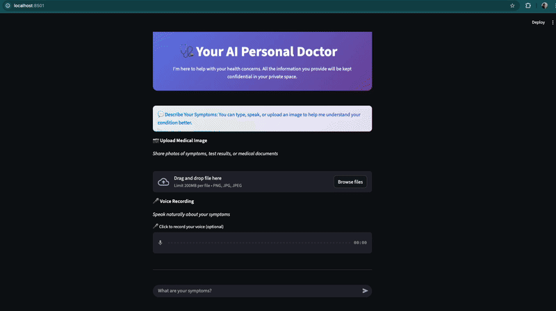
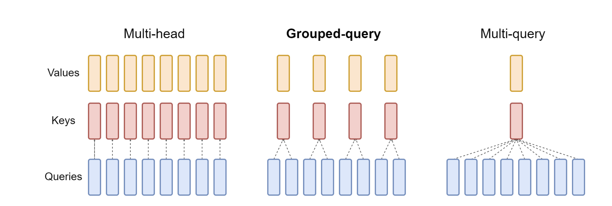
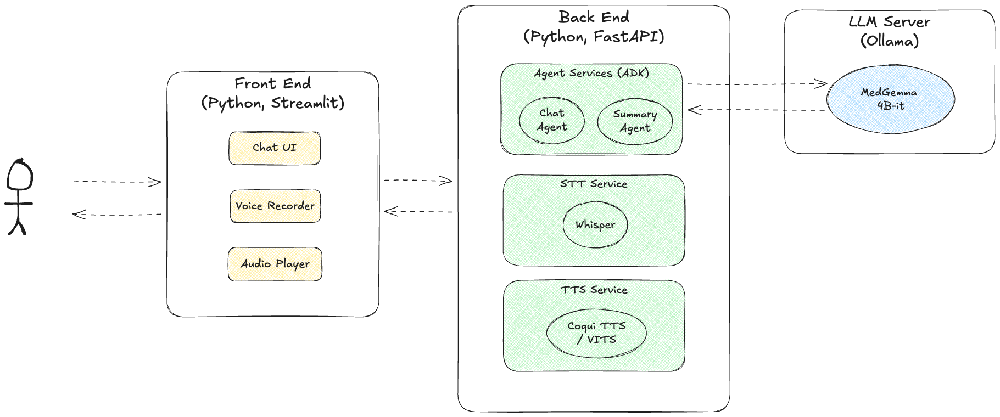
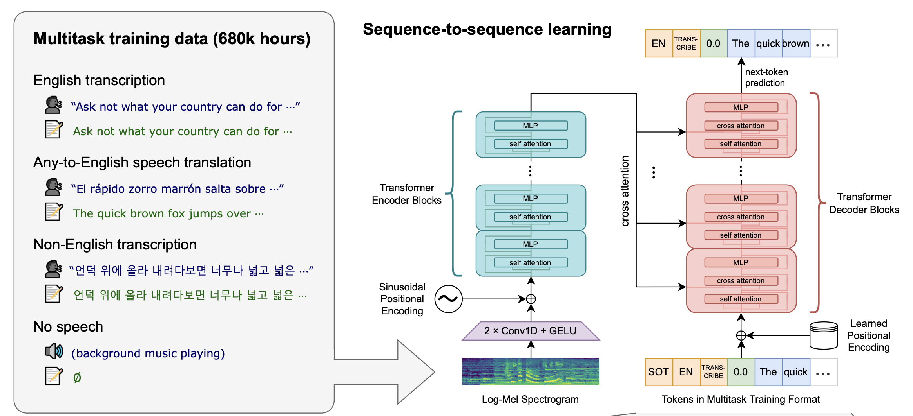
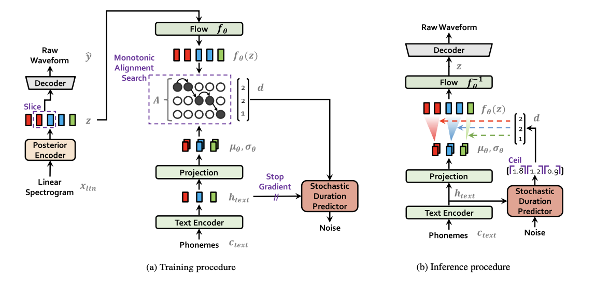
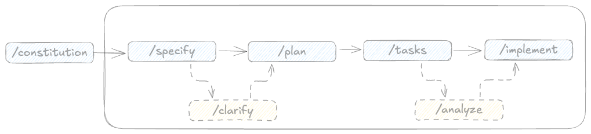

In the rapidly evolving landscape of AI, healthcare is frontier where the promise of AI meets real-world impact. Enter [MedGemma](https://deepmind.google/models/gemma/medgemma/), a model family developed by Google DeepMind, designed specifically to understand and interpret both medical text and images. Built on the robust foundation of the Gemma 3 architecture ([Gemma team, 2025](https://arxiv.org/abs/2503.19786)), MedGemma represents a significant step toward giving developers and clinicians the tools to build healthcare-oriented AI applications.

Perhaps most importantly, MedGemma opens the door for accessible, locally-deployable health AI systems. With open-model availability and modular design, developers can run it on private infrastructure, maintain control of sensitive health data, and build customized workflows for triage, patient intake, or image-based diagnostics — rather than relying purely on cloud-based black-box models. 

In this article, I’ll walk you through how we can build a simple AI healthcare assistant that runs entirely on our own local machine — thanks to MedGemma’s accessibility and domain-specialized power.

## Personal AI Doctor Web App

The personal AI doctor I built is just a simple web-app prototype featuring a conversational UI that supports both chat and voice commands. It runs entirely on a local machine without any Internet connection. Users can also upload images alongside particular instructions for the virtual doctor to perform medical image analysis. The system can respond to user prompts with text and, optionally, speech output, as illustrated in Figure 1.



Figure 1: Personal AI Doctor Demo

The prototype is fully written in Python, comprising frontend and backend services. The frontend implements the user interface components, while all relevant AI models will be served in backend services, comprising:

- Large multimodal model (MedGemma-4B)
- Voice-to-text model (Whisper)
- Text-to-Speech (VITS through Coqui TTS)

## MedGemma as The Foundation Model

MedGemma is a collection of open-model variants developed by Google DeepMind specifically optimized for medical-domain tasks involving both text and images. Built on the underlying architecture of the Gemma 3 family, it brings healthcare-focused capabilities into a freely accessible model ecosystem. 

MedGemma currently comes in two variants: a 4B-parameter multimodal version (capable of ingesting medical images + text) and a 27B-parameter text-only (and/or multimodal) version.  The multimodal variant uses an image encoder, SigLIP ([Zhai et al., 2023](https://arxiv.org/pdf/2303.15343)), which was pre-trained on a large corpus of de-identified medical imager (e.g., chest X-rays, dermatology photos, pathology pictures).

Because MedGemma inherits the capabilities of Gemma 3 (multimodality, long context, efficient architecture), developers can build healthcare applications that have strong baseline performance and benefit from the engineering work behind Gemma 3. Therefore, to further understand MedGemma, it’s worth understanding Gemma 3’s architecture in more details.

### Gemma 3

Gemma 3 is the base models for MedGemma sized from ~1B parameters up to ~27B parameters. Its design goals are as follows:

- **Multimodal:** Support for text + image (and implicitly more modalities) in a unified model.
- **Long-context:** Large context ****windows (e.g., 128 K tokens for many variants) so it can process long documents, chats, context spans.
- **Multilingual:** Wide language support (over 140 languages mentioned) so global use is possible.
- **Efficiency / deployability:** Built so that the models can reasonably run a single GPU/accelerator rather than requiring massive clusters.

The following is the illustration of Gemma 3’s architecture:

)](media/image.png)

Figure 2: Gemma 3’s architecture ([https://developers.googleblog.com/en/gemma-explained-whats-new-in-gemma-3/](https://developers.googleblog.com/en/gemma-explained-whats-new-in-gemma-3/))

In shorts, 

- Gemma 3 uses a decoder-only transformer architecture (i.e., the standard LLM style) but augmented for multimodal input (text + image) via a vision encoder.
- It integrates a SigLIP vision encoder (or variant) to process images into a fixed sequence of “soft tokens” that then feed into the transformer.
- The attention mechanism is optimized for long-context usage achieved via a hybrid local/global attention scheme (5 local sliding-window layers with window size ~1024 tokens, then 1 global attention layer) to reduce KV-cache burden.
- Architectural changes to attention, e.g., Grouped-Query Attention (GQA), and replacing previous “soft-capping” mechanisms with a QK-norm (normalisation on $Q \times K$ for better scaling / stability.

### A bit deeper on Gemma 3’s attention mechanism

The efficiency of LLMs depends heavily on their attention mechanism — the component responsible for how each token in a sequence interacts with every other. As models scale, memory and latency during inference become major bottlenecks. To address this, researches on attention mechanism have evolved from the classic Multi-Head Attention (MHA) to more efficient forms such as Multi-Query Attention (MQA) and Grouped-Query Attention (GQA).



Figure 3: Illustration of the difference among popular attention mechanisms — Gemma 3 utilizes Grouped Query Attention.

Let’s unpack the differences.

**Multi-Head Attention (MHA)**

In standard MHA, each attention heads has its own set of queries, keys, and values. This design allows every head to learn different contextual relationships — for example, one head might focus on syntactic roles while another captures semantic associations. However, the drawback is redundancy: since heads maintain separate keys and values, storing and accessing them during inference becomes expensive in both memory and compute. 

**Multi-Query Attention (MQA)**

To make inference faster, Multi-Query Attention simplifies the structure: each head still has its own queries, but all heads share a single set of keys and values. This drastically reduces the amount of data that needs to be cached during generation (important for autoregressive decoding). With fewer KV pairs to store and retrieve, inference becomes much master and memory usage drops. 

**Grouped-Query Attention (GQA)**

GQA is a hybrid approach that balances the efficiency and expressiveness. 

Instead of giving each head its own KV pair (as in MHA) or sharing them across all heads (as in MQA), GQA divides attention heads into groups. Each group of query heads shares one set of keys and values. For instance, if there are 16 attention heads and 4 groups, each group of 4 heads will share a KV set.

This grouping reduces the KV cache size (like MQA) but still retains some diversity across groups (like MHA). The result is nearly the same inference speed and memory efficiency as MQA, but with better accuracy and representational capacity.

The following table summarizes the differences among those three approaches.

| **Feature** | **Multi-Head** | **Multi-Query** | **Grouped-Query** |
| --- | --- | --- | --- |
| **Keys/Values per Head** | Separate | Shared (1 for all) | Shared within groups |
| **Memory Usage** | High | Low | Moderate-Low |
| **Inference Speed** | Slowest | Fastest | Nearly fastest |
| **Representation Diversity** | Highest | Lowest | Balanced |

Gemma 3, like other modern lightweight foundation models (e.g., Gemma 2, Mistral, and LLaMA 3), adopts Grouped-Query Attention because it provides the best balance between performance and resource efficiency — crucial for both local deployment and scalable serving.

During training, GQA allows the model to maintain rich multi-head representation learning. During inference, it reduces the KV cache size (which directly impacts memory usage when generating long sequences). This makes it particularly suitable for consumer hardware (like Apple M-series chips) and edge inference frameworks (like Ollama or vLLM).

## Personal Doctor System

### LLM Serving

To serve MedGemma locally, **Ollama** is utilized as the inference engine — an open source LLM serving tool. I chose Ollama for its simplicity to setup large language models on consumer hardware with limited number of users — in fact, it’s only me at the moment 🙂. For a production-scale system with large number of users, vLLM might be a better choice.

For this prototype, I use a specific quantized version of MedGemma to balance performance and resource usage. The system relies on the `amsaravi/medgemma-4b-it:q6` model, which is a 4-billion parameter, instruction-tuned variant quantized to 6-bits. This compression allows the model to run smoothly even on machines with limited VRAM without significantly sacrificing reasoning capabilities.

To set up the model, execute the following commands in your terminal:

```bash
# Pull the specific 6-bit quantized MedGemma model
ollama pull amsaravi/medgemma-4b-it:q6

# Run the model to start the local inference server
ollama run amsaravi/medgemma-4b-it:q6
```

### Architecture

To ensure the simplicity, the entire architecture follows a standard frontend-backend pattern implemented in Python. The frontend leverages **Streamlit** to deliver a streamlined conversational UI prototype, while the backend orchestrates a suite of services housing the AI models.



Figure 4: Components of AI Personal Doctor 

Interaction with MedGemma is managed through the **Agent Development Kit (ADK)** framework, which established a dual-agent pattern:

- `chat_agent`: Handles direct user prompts and generates text responses.
- `summary_agent`: Activated specifically when the “Play Audio Summary” is triggered.

Defining the agent’s role and profile is intuitive with ADK. The code snippet below demonstrates how to configure an agent using MedGemma—served locally via Ollama—as its central “brain”.

```python
from google.adk.agents import Agent
from google.adk.models.lite_llm import LiteLlm

model_name = "ollama_chat/amsaravi/medgemma-4b-it:q6"
model = LiteLlm(model=model_name)

chat_agent = Agent(
    model=model,
    name="medical_chat_service",
    description="An agent that answers medical queries, optionally with images.",
    instruction="""You are a helpful medical assistant. 
    Answer the user's questions accurately and concisely. Always answer in English.
    If an image is provided, analyze it in the context of the medical question.
    """
)

summary_agent = Agent(
    model=model,
    name="medical_summary_service",
    description="An agent that summarizes medical advice into concise paragraphs..",
    instruction="""
    You are an expert medical summarizer. 
    Your goal is to summarize the provided medical advice into a concise, single paragraph. 
		Ensure the summary flows naturally when read aloud. 
		YOU MUST USE periods (.) and commas (,) to create natural pauses. 
	  DO NOT use other punctuation marks like question marks (?), exclamation marks (!), colons (:), or semicolons (;). 
		Keep the summary focused on the key medical advice and safety instructions.
    """
)
```

For audio processing and synthesis, the system employs the **Whisper** library for Speech-to-Text (STT) and utilizes **Coqui TTS** (implemented via PyTorch) for Text-to-Speech (TTS) generation.

## Voice Command Capability (STT Service)

To improve user interactiveness, it will be more handful if users can talk directly with the AI assistant rather than typing only, just like in ChatGPT or Gemini applications. To allow this capability, we can use a speech-to-text (STT) or automatic speech recognition (ASR) model to transcribe user’s speech into text, which will then be processed by MedGemma. 

One of the most capable open-source ASR models is [Whisper](https://github.com/openai/whisper) developed by OpenAI ([Radford et al. 2022](https://arxiv.org/pdf/2212.04356)). It is an innovative STT focused on achieving robust speech recognition via large-scale weak supervision. Its primary distinguishing factor is the immense scale of its training data and resulting robustness:

- **Massive data scale:** Whisper was scaled up to 680,000 hours of labeled audio data, which includes weak supervision like multilingual and multitask supervision (see Figure 5 below).
- **Focus on zero-shot transfer**: The system aims to work reliably “out of the box” in a broad range of environments without requiring supervised fine-tuning for every new deployment distribution.
- **Superior robustness:** Whisper exhibits fundamentally different robustness properties; the best zero-shot Whisper models approach human accuracy and robustness when evaluated across various datasets.



Figure 5: Whisper leverages a seq2seq Transformer model trained on many different speech processing tasks, including multilingual speech recognition, speech translation, spoken language identification, and voice activity detection.

OpenAI offers several variants of the Whisper model to balance speed and accuracy, ranging from **tiny** (39M parameters) to **large** (1550M parameters), as well as the optimized **turbo** model (809M). Depending on the hardware constraints and accuracy requirements, we can select the appropriate size.

Here is a code example demonstrating how to implement audio transcription using Whisper in Python:

```python
import whisper

model = whisper.load_model("turbo")
...
result = model.transcribe(audio_file_path) # transcribe text from an audio file
```

## Voice Synthesis (TTS Service)

To elevate the user experience beyond simple text display, we can give our AI system a voice. It needs a functionality to synthesize speech from text. For this, I utilize Coqui TTS, a popular open-source deep learning toolkit designed to run advanced speech synthesis models directly on local hardware. While the company behind Coqui has sadly ceased operations, the library remains a powerful, community-maintained tool.

Coqui TTS offers a wide registry of pretrained deep learning models, making it easy to find the right fit for our needs. In this setup, I selected the VITS model (specifically `tts_models/en/ljspeech/vits`). VITS (Variational Inference with adversarial learning for end-to-end Text-to-Speech) is a parallel, end-to-end architecture known for generating highly natural sounding audio ([Kim et al. 2021](https://arxiv.org/abs/2106.06103)).

Unlike traditional TTS pipelines that require two separate stages — generating acoustic features (like mel-spectrograms) first, and then using a vocoder to create the waveform — VITS unifies these processes. It employs a Variational Autoencoder (VAE) to connect these modules through latent variables, allowing for efficient, high-fidelity waveform generation in a single framework.



Figure 6: Training and inference mechanism of VITS

Functionally, VITS employs Monotonic Alignment Search (MAS) during the training phase to automatically eliminate the alignment between the input text phonemes and the target speech, removing the need for external aligners — Figure 6 shows the difference between the training and inference phases of VITS. Because the model is non-autoregressive, it allows for parallel sampling, which significantly improves synthesis speed compared to sequential models. 

The following code snippet illustrates the utilization of VITS model through Coqui TTS.

```python
import torch
from TTS.api import TTS # Importing Coqui TTS
...

device = "cuda" if torch.cuda.is_available() else "cpu"
model_name = "tts_models/en/ljspeech/vits" # Using a VITS model
tts = TTS(model_name).to(device)

text = " ... "
tts.tts_to_file(text=text, file_path=file_path)
```

## Spec-Driven Development with Spec Kit (Optional)

I’ve marked this section as “optional” because we don’t have to adopt this approach (Spec-Driven Development) when building the complete application — we could simply follow conventionally way of application development. I’m including it mainly out of curiosity on trying a new productivity tool.

To build the complete system locally, I use [Spec Kit](https://github.com/github/spec-kit) — an open-source toolkit that enables Spec-Driven Development (SDD), essentially extending CLI-driven AI agents into a more structured workflow. It’s a bit like the freedom of “vibe coding”, but with much more control and editability through clearly defined specifications. With Spec Kit, we begin with the specification first, and let the code follow — keeping product requirements, intentions, and architecture front and center. The unified source empowers both AI assistants and developers to implement features with consistent outcomes.

For me, adopting this approach has been a breakthrough. While many “vibe-coding” tools can spin off in unpredictable directions, Spec Kit introduces the right amount of structure and guardrails. It allows developers to collaborate more effectively especially with product managers / owners, align with real software-development phases, and retain control—even while harnessing AI capabilities.



Figure 7: Spec-Driven Development Life Cycle with Spec

Figure 7 illustrates the life cycle steps in SDD. In general, within the workflow we will:

1. **Define the “what”**: Using the `/speckit.specify` command, we describe the feature in plain English — what we want to build, and why — without worrying about the tech stack yet. Outputs: `spec.md`
2. **Plan the “how”**: With `/speckit.plan` , we pick the architecture, libraries, database, and overall structure. This step translates the spec into a technical implementation blueprint. Outputs: `plan.md`, `quickstart.md`, `research.md`, `data-model.md`, `contracts/openapi.json`.
3. **Break into tasks & implement**: Use `/speckit.tasks` to split the plan into actionable slices, then let `/speckit.implement` (with AI assistants or our team) generate the code. Specs remain alive and authoritative through process. Outputs: [`tasks.md`](http://tasks.md) and your generated codes.

The `/speckit.constitution` step is mostly static — you’ll probably only need to run it once at the very beginning. Think of it as setting the guiding principles: it defines the ground rules for what the AI should or shouldn’t do in subsequent steps. The real iterative action happens between `/speckit.specify` and `/speckit.implement`, where ideas evolve into actual features. Each time we run  `/speckit.specify`, it spins up a new Git branch — just like when we’re introducing a quite major  change to the application.

It is worth noting that the `/speckit.clarify`, which is an optional step, is useful to clarify the initially generated specification, involving a human-in-the-loop workflow for detailing some information or reducing ambiguity.

Under the hood, SpecKit relies on an AI code assistant tool as the core engine such as GitHub Copilot, Gemini CLI, Claude Code, Codex CLI, Cursor, and so on. I use [Gemini CLI](https://github.com/google-gemini/gemini-cli) for my main AI code assistant in this entire project.

## Conclusion

We have walked through a simple, complete pipeline of building a sovereign healthcare AI—from serving **MedGemma** locally with **Ollama** to enabling speech interaction via **Whisper** and **Coqui TTS**.

While this prototype highlights the potential of the **MedGemma** 4B model, the possibilities for expansion are vast. You could extend the agents to handle actual medical records, fine-tune the TTS voice for a more empathetic persona, or deploy the system on an edge device for portability. The tools for building private, powerful AI are now in your hands—it’s time to build something that protects as much as it assists.

The complete code implementation of this prototype is available on GitHub:  [https://github.com/ghif/personal-doctor](https://github.com/ghif/personal-doctor).
