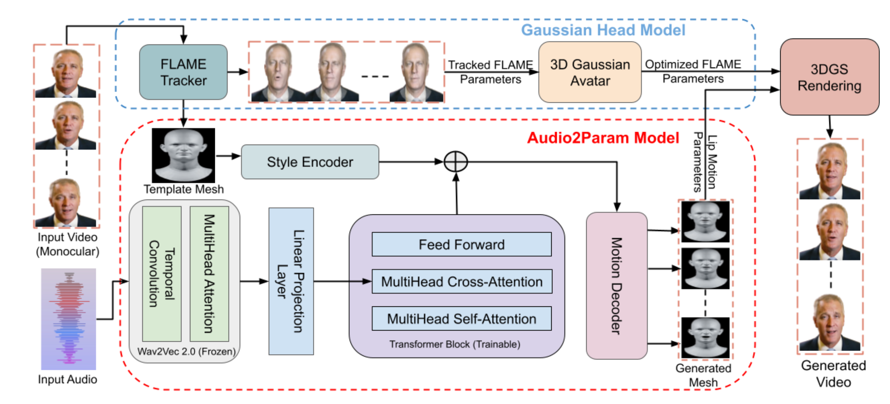
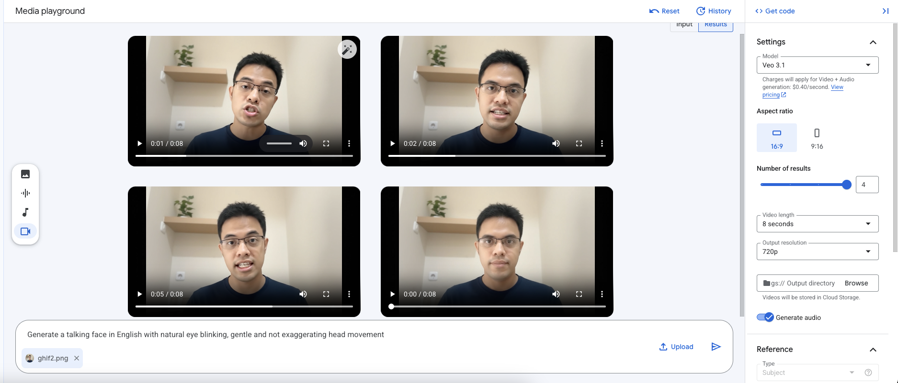

In my previous article, we explored how to [synthesize and clone our own voices from text](https://app.notion.com/p/Demystifying-Text-to-Speech-and-Voice-Cloning-for-Content-Creation-28ea59d3736080e3a53eec790a2b2797?pvs=21). That tool was a crucial first step, allowing us to create multimedia content with a personalized voice without ever stepping in front of a microphone. 

But, of course, a voice in the void is not a character. To generate a complete Digital Human / Character, we need the missing piece: Audio-Driven Talking Face Generation. This is actually a large piece of cutting-edge AI research work on its own. The goal is to take static images and a purely audio file, and merge them into a video where the face not only moves naturally but lip-syncs perfectly to the speech. 

Talking practicality to the next level, we can now start with nothing more than a single face portrait and let the machine handle the heavy lifting — a capability known as "One-shot Audio-Driven Talking Face Generation."

In this article, I will discuss some research advancements of audio-driven talking face, then walk you through the practical steps of building an educational video starring a digital human, using the latest advancements in generative AI.

## State of Audio-Driven Talking Faces

Crossing the "Uncanny Valley"—generating a digital face indistinguishable from a human—has been the "boss level" of computer graphics for decades. However, the last few years have seen the industry make a massive leap from "significant progress" to "solved problem."

For a long time, the standard approach was simple **lip synchronization**: essentially gluing a moving mouth onto a static face. If you followed the early explosion of “talking head” AI, you likely remember models like Wav2Lip ([Prajwal et al. 2020](https://arxiv.org/pdf/2008.10010)). While they were technically impressive at matching phonemes to mouth shapes, the results were often unsettling — the mouth moved perfectly, but the eyes were dead and the head was frozen. It was accurate, but robotic.

Research from 2024 through 2025 has rewritten the playbook. We are no longer just syncing lips: we are generating holistic facial dynamics. Here is the breakdown of how AI avatars woke up.

### **Beyond The Lips**

The biggest shift in the past years has been the move from “lip-sync” to “life-sync”.

Defining this new era are heavyweights like Microsoft’s VASA-1 ([Xu et al., 2024](https://arxiv.org/abs/2404.10667)) and Alibaba’s EMO ([Tian et al. 2024](https://arxiv.org/abs/2402.17485)). Both utilize Diffusion Models — the same tech behind image generators like Midjourney — but apply it to complex, full-video motion. 

EMO takes a “brute force” approach. Instead of relying on 3D face models or landmarks, it was trained on over 250 hours of diverse footage — including people singing and shouting — to learn the direct relationship between sound and motion. The result? Avatars that can sing opera or rap with full emotional intensity.

In contrast, MuseTalk ([Zhang et al. 2025](https://arxiv.org/pdf/2410.10122)) took a similar logic, but used Generative Adversarial Networks (GAN) and borrowed “inpainting” idea on the mouth region alone. This strategy trades between the fidelity of generated video and the speed of inference.

### **Need for Speed: 3D Gaussian Splatting**

While diffusion models make high-quality videos, they are slow. Generating a few seconds of video can take minutes of compute time. That’s not suitable for a live video chat.

Enter 3D Gaussian Splatting (3DGS) ([Kerbl et al., 2023](https://arxiv.org/abs/2308.04079)). With this approach, we leverage an explicit 3D representation to represent a face as a cloud of millions of 3D blobs (Gaussians) that can be rendered instantly, instead of traditional 3D meshes.

The first wave of audio-driven 3DGS, such as GaussianTalker ([Cho et al., 2024](https://arxiv.org/pdf/2404.16012v2)) and TalkingGaussian ([Li et al., 2024](https://arxiv.org/pdf/2404.15264)), used “end-to-end” architectures. They utilized tri-plane representations to map audio signals directly to 3D deformations. While they achieved visual fidelity comparable to diffusion models, they suffered from a flaw: temporal instability. Because these models often generated frames independently or relied on imperfect tracking, the avatars exhibited visible “wobbling” artifacts, flickering, and inconsistent lip synchronization.

To reduce the “wobble”, recent methods turned to “hybrid” architectures. They anchor the unstable, free-floating Gaussians to rigorous 3D geometry — specifically 3D Morphable Models (3DMM) like FLAME ([Li et al. 2017](https://dl.acm.org/doi/pdf/10.1145/3130800.3130813)). A key innovation here was GaussianAvatars ([Qian et al., 2024](https://arxiv.org/pdf/2312.02069)), which explicitly binds 3D Gaussians to the triangles of a FLAME mesh. By initializing Gaussian blobs based on mesh vertices and normals, and back-propagating for each triangle, the rendering becomes robust against tracking inaccuracies. This geometric constraint effectively stabilizes the avatar, preventing the chaotic drifting of facial features often observed in purely end-to-end approaches. However, that method has not covered the animation generation driven by speech audio.

The latest research, GaussianHeadTalk ([Agarwal et al., 2025](https://arxiv.org/pdf/2512.10939)), builds on GaussianAvatars by animating these anchored avatars directly from speech. Instead of mapping instantaneous audio cues to immediate pixel deformations, these models use Transformer architectures to capture long-range semantic information and dependencies within the speech signal. This allows the system to predict smooth, consistent parameters for the 3DMM scaffold rather than acting on a disjointed frame-by-frame basis. The result is a generation pipeline capable of producing "wobble-free," temporally consistent talking heads with precise lip-sync at real-time speeds exceeding 45 FPS.



Architecture of GaussianHeadTalk (Agarwal et al. 2025)

### **Micro-Details: Sighs, Laughs, and Blinks**

A face that never blinks is terrifying. A face that talks without taking a breath feels fake. The latest research, specifically a model called KeyFace ([Bigata et al., 2025](https://arxiv.org/pdf/2503.01715)), focuses on Non-Speech Vocalizations (NSVs). Standard models ignore sounds like laughter, sighs, or yawns. KeyFace actually listens for them. If the audio has a sigh, the avatar’s shoulders might drop and the head might lower.

Other models like ManiTalk ([Fang et al., 2024](https://link.springer.com/article/10.1007/s00371-024-03490-4)) now treat blinking as a controllable feature, letting creators decide if an avatar should have a “nervous blink” or a “sleepy stare”.

### **Commercial Showdown**

Some commercial products have improved their capabilities along the line. [NVIDIA ACE](https://developer.nvidia.com/ace-for-games) is building the engine for gamers. Their [Audio2Face](https://developer.nvidia.com/blog/nvidia-open-sources-audio2face-animation-model/) tech does not just make a video; it generates 3D geometry that game developers can drop into VFX or game dev tools such as Autodesk Maya and Unreal Engine 5.

Synthesia has launched [Express-1 and Express-2](https://www.technologyreview.com/2025/09/04/1123054/synthesias-ai-clones-are-more-expressive-than-ever-soon-theyll-be-able-to-talk-back/), moving away from static avatars to “digital actors” that can perform scripts with semantic awareness — meaning they are aware of what they are saying, not just the sounds they are making.

[HeyGen](https://app.heygen.com/) has also provided their “Interactive Avatar” product, allowing for sub-200ms latency response that feel like a real Zoom call.

---

In this deep dive, we are going hands-on with MuseTalk (https://github.com/TMElyralab/MuseTalk). We will explore how to leverage this tool for audio-driven face animation that is fast enough to run on a single commercial GPU and simple enough to set up —  no need to involve complex 3D assets.

## The Workflow at a Glance

Creating a convincing talking head isn’t just one button press: it is a pipeline. Here is the workflow we will cover:

1. **Speech script preparation:** Crafting the narrative
2. **Voice synthesis and cloning:** Generating the audio driver
3. **Initial video generation:** Bringing the static image to life (blinking, head movement)
4. **Voice dubbing/face reenactment:** The final lip-syncing using MuseTalk 

---

### Step 1: Speech Script Preparation

The first step is to prepare the content. For a digital human to be engaging, the script needs to be compeling. For the demonstration, I have written a short educational narrative about “World Models” — an emerging topic in AI community that moves beyond standard Large Language Models (LLMs).

The following is the script example for 1 - 2 minute speech — and, of course, I ask an LLM (Gemini) for helping me copywriting 🙂 :

```
Stop calling them chatbots. That era is over. The new trend isn't just about Language Models anymore; it’s about World Models.

Here is the difference. An LLM predicts the next word in a sentence. A World Model predicts the next second of reality. It understands 3D space, gravity, and consequence. Here are the big players building the Matrix.

First, meet the Dreamer: Genie 3 from Google DeepMind. This isn't just a video generator; it is an interactive game engine. You can actually grab a controller and play inside the video it creates. It generates the world and the gameplay in real-time. It is essentially an infinite holodeck.

Second, the Architect: Marble from World Labs. Most AI video is like a hallucination; it warps and shifts. Marble creates solid, persistent 3D worlds. You can take a photo of a room, and Marble turns it into a 3D asset you can actually edit and walk around in. This gives AI true Spatial Intelligence.

Finally, the Engineers: NVIDIA Cosmos and PAN from MBZUAI. These are the brains for robots. They don't just see video; they understand physics. They allow robots to preview the future, simulating what happens if they drop a cup or crash a car before they actually do it.

Genie dreams it, Marble builds it, and NVIDIA simulates the physics. We are moving from AI that writes about the world, to AI that lives in it. Which is scarier to you: An infinite game, or a robot that can predict the future? Let me know in the comments.
```

### Step 2: Voice Synthesis and Cloning

With the script ready, we need a voice. Instead of recording this myself, I used my custom Text-to-Speech (TTS) and Voice Cloning pipeline: [https://github.com/ghif/tts-vc](https://github.com/ghif/tts-vc). This allows for rapid iteration — if want to change a sentence later, I don’t need to re-record audio.

Using Chirp 3 as the TTS backbone, this results in a clean, high-quality audio file that captures the cadence and tone of the script, which is critical because this audio waveform will literally “drive” the animation of the face expressions in the final step.

[ghif_worldmodels.mp3](media/ghif_worldmodels.mp3)

### Step 3: Initial Video Generation

I start with a single portrait of my own face. Technically, we could apply lip-sync to a static face image directly. However, it only drives the mouth moves, but the rest of the face feels dead and robotic.

To achieve more lifelike result, we first need to convert our single static image into a “silent video” where the character is blinking, breathing, and slightly moving their head. This provides a natural canvas for the lip-synching model to work on.

- **Tools Used:** Google Veo (for high-fidelity image-to-video generation) and Nano Banana (optional, if you want a first-pass editing of the portrait).
- **Process:** I fed the static portrait into Veo with aspect ratio 16:9 using a prompt

```
Generate an animated face video of this portrait with natural and gentle eye blinking as well as minimal head movement. Don't make it talk.
```

This generated a ~8-second video clip of the character looking alive, but silent.



### Step 4: Voice Dubbing / Face Reenactment (MuseTalk)

Now for the magic. We have the **audio** (Step 2) and the **video** (Step 3). We need to fuse them. 

For this, I utilized MuseTalk, a state-of-the-art high quality lip synchronization model from Tencent. Unlike older GAN-based models (like Wav2Lip) which often produce blurry mouth regions, or diffusion model-based approaches that are typically much slower, MuseTalk uses a Latent Space Inpainting technique: [https://github.com/TMElyralab/MuseTalk](https://github.com/TMElyralab/MuseTalk).

How it works:

**A. Face detection:** The model detects the face in our silent video.

**B. Audio feature extraction:** It analyzes the audio file, breaking it down into phonetic features (Whisper’s features).

**C. Latent inpainting:** Instead of generating pixels from scratch, it masks out the mouth region of the video and “inpaints” the correct lip shape for that specific milliseconds of audio directly in the latent space — a compressed representation of the image induced by a pretrained Variational Autoencoder (VAE) encoder.

**D. Reconstruction:** It decodes the result back into high-resolution video frames through a pretrained VAE decoder.

)](media/Screenshot_2025-12-12_at_12.00.39.png)

Illustration of MuseTalk’s framework ([Zhang et al. 2025](https://arxiv.org/abs/2410.10122))

This technique can runs at 30fps+ on modern commercial GPUs, making it one of the most efficient ways to generate high-fidelity talking faces. I ran the entire MuseTalk inference process using [Vertex AI Workbench](https://docs.cloud.google.com/vertex-ai/docs/workbench/introduction) with NVIDIA L4 GPU.

To run it smoothly on a Workbench’s jupyter notebook/terminal, I made a minor adjustment in the installation process described in the original [README](https://github.com/TMElyralab/MuseTalk):

```bash
# Step 1: Create a new conda environment in a persistent directory (under /home/jupyter/)
conda create -p /home/jupyter/envs/MuseTalk python==3.10 -y

# Step 2: Activate the new environment
conda activate /home/jupyter/envs/MuseTalk

# Step 3: Clone the MuseTalk's source code and go to the root directory
git clone https://github.com/TMElyralab/MuseTalk.git
cd MuseTalk

# Step 4: Install all required libraries
pip install -r requirements.txt
pip install --no-cache-dir -U openmim
mim install "mmcv==2.0.1"
mim install "mmdet==3.1.0"
mim install --no-build-isolation "mmpose==1.1.0"

# Step 5: Remove huggingface-hub and gdown libraries inside download_weights.sh to avoid library's version conflicts
# Open download_weights.sh file and delete lines associated with huggingface-hub and gdown.

# Step 6: Download all the model's weights
sh ./download_weights.sh

# Step 7: Configure the test.yaml to specify the inputs and run the inference script
sh ./inference.sh v1.5 normal
```

[FFmpeg](https://www.ffmpeg.org/) is also needed to process the video and audio. Here’s how to install ffmpeg in a persistent directory of the Workbench’s instance.

```bash
# Go to home directory
cd ~

# Create a "bin" directory
mkdir -p ~/bin

# Download the source
wget https://johnvansickle.com/ffmpeg/releases/ffmpeg-release-amd64-static.tar.xz -O ~/ffmpeg-static.tar.xz

# Extract the source files to "bin"
tar -xf ~/ffmpeg-static.tar.xz -C ~/bin/

# Embed the path to the PATH env variable
echo 'export PATH="$HOME/bin/ffmpeg-7.0.2-amd64-static:$PATH"' >> ~/.bashrc

# Activate the new PATH
source ~/.bashrc

# Go back to conda env
conda activate /home/jupyter/envs/MuseTalk
```

## Final Content

By combining a thoughtful script, cloned voice, AI-generated video motion, and MuseTalk’s precision lip-syncing, we get a final video that crosses the uncanny valley.

An example of full generated video with minor post-editing can be seen below. 

[https://www.youtube.com/watch?v=GIsw39CROow](https://www.youtube.com/watch?v=GIsw39CROow)

Another example with a different speech script:

[https://www.youtube.com/watch?v=mrQnMZWh-3Q](https://www.youtube.com/watch?v=mrQnMZWh-3Q)
