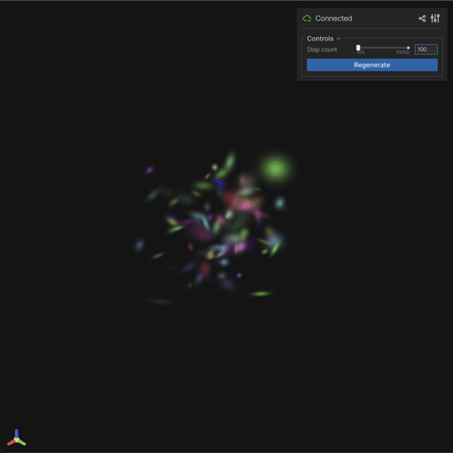
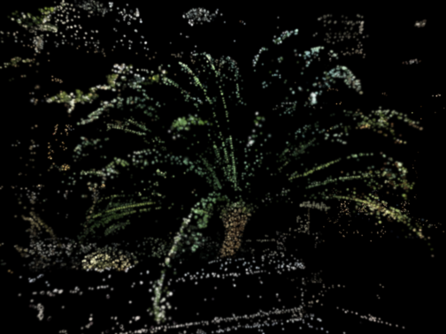

For decades, the fundamental atom of computer graphics has been the [Triangle representation](https://en.wikipedia.org/wiki/Triangle_mesh), the simplest 2D shape that can define a flat surface requiring only 3 points (vertices) in 3D space. From the original Doom game to the latest Unreal Engine 5 demo, we build 3D digital worlds by stitching together rigid polygons. But reality isn’t made of hard edges and vertices; it is fuzzy, complex, and volumetric.

In 2020, Neural Radiance Fields (NeRFs) promised a solution, using AI to ‘dream’ photorealistic scenes ([Mildenhall et al., 2020](https://arxiv.org/pdf/2003.08934)). But they came with a heavy cost: agonizingly slow rendering speeds — previously I wrote a [technical article about NeRFs as well](https://app.notion.com/p/Implementing-Neural-Radiance-Fields-NeRF-with-Keras-3-213a59d373608018884dee4a00a79273?pvs=21).

Enter 3D Gaussian Splatting (3DGS). Released in 2023, this technique threw out the neural networks and brought back an old 90s concept — point-based rasterization — supercharged with modern optimization, the same engine as in deep learning ([Kerbl et al. 2023](https://arxiv.org/pdf/2308.04079)). The result? Photorealism that rivals NeRFs, but renders at a blistering 100+ FPS on consumer hardware.

In this article, we’ll look under the hood to see how millions of fuzzy 3D ellipsoids / Gaussian ‘blobs’ instead of Triangle are rewriting the rules of 3D rendering. We’ll also explore how a full pipeline of 3DGS can be implemented with [JAX](https://docs.jax.dev/en/latest/), an open source framework developed by Google that is designed for high-performance numerical computing and large-scale machine learning. 

### From Rigid Triangles to Fuzzy Blobs

To understand why 3DGS is revolutionary, we must look at how it defines space.

In a traditional Triangle Mesh, an object is a hollow shell. To render a cat, you stretch a “skin” of texture over a wireframe skeleton. It works great for solid surfaces like walls or cars, but it fails at complex, thin, or semi-transparent structures. Have you ever noticed how video game hair often looks like stiff strips of paper? That is the limitation of the Triangle.

3DGS abandons the shell. Instead, it treats the world as a **volumetric cloud**.

Imagine a point cloud, but instead of tiny, single-pixel dots, every point is a 3D ellipsoid (a stretched sphere). We call these “Gaussians.” Each Gaussian is defined not just by a position, but by a set of learnable parameters that describe its existence in space.

If the Triangle is a piece of origami paper, the Gaussian is a soft, colored snowball.

)](media/Screenshot_2026-01-13_at_11.39.23.png)

Figure 1: Illustration of Multi-View Scene Reconstruction with 3D Gaussian Splatting taken from ([Choi et al. 2025](https://arxiv.org/pdf/2506.12727))

3DGS can enable a new class of product features that were previously impossible due to the “quality vs speed” trade-off. Previously, if a product needed photorealism, it used pre-rendered video (non-interactive). If it needed interactivity, it used polygon meshes (often lacking photorealism for complex materials). 3DGS bridges this gap.

Here are the specific functionalities in real-world products that can be enabled by 3DGS:

**1. Next-Gen E-Commerce: "The Unscannable Product" Viewer**

Traditional photogrammetry (Meshes) fails drastically when scanning objects with **transparency, refraction, thin structures, or high reflectivity**. This limits 3D product views to matte objects like shoes or furniture.

- **The Enabled Functionality:** An interactive web viewer for **jewelry, perfume bottles, fluffy apparel, and complex electronics**.
- **Why 3DGS?**
    - **Refraction/Reflection:** 3DGS captures view-dependent effects (shiny diamonds sparkle as you rotate the view) because it uses Spherical Harmonics.
    - **Fuzzy Details:** It captures the individual strands of a mohair sweater or the bristles of a toothbrush, which would otherwise be a flat texture on a blobby mesh.

**2. Real Estate & Tourism: The "Cinematic" Virtual Tour**

Current virtual tours (like Matterport) often rely on 360° panoramas. You can jump from point A to point B, but you cannot "walk" smoothly between them. Mesh-based navigations often look like low-poly video games.

- **The Enabled Functionality:** **6-Degrees-of-Freedom (6DoF) Walkthroughs** on mobile devices. Users can fly a drone path through a hotel suite or walk through a house museum with photorealistic lighting preservation.
- **Why 3DGS?**
    - **Lighting Baking:** 3DGS bakes the complex bounce lighting of a room into the scene. Mirrors work correctly (reflecting the room), and windows show the actual view outside, rather than a flat white texture.
    - **Mobile Performance:** Unlike NeRFs, which kill mobile batteries, optimized 3DGS (like Luma AI or Spline) can render at 60fps on iPhones.

**3. Telepresence: The Photorealistic Avatar**

Video conferencing has looked the same for 15 years (2D grid). VR avatars (like Meta's Horizon) look cartoonish because rendering realistic skin and hair on a mesh is computationally heavy.

- **The Enabled Functionality:** **Holographic Telepresence**. A system where you see the other person in full 3D volume, with realistic hair movement and clothing wrinkles, viewable from different angles in a VR/AR headset.
- **Why 3DGS?**
    - **Hair & Eyes:** These are the hardest parts of a human to render. 3DGS handles the thin geometry of hair and the wetness of eyes naturally.
    - **GaussianAvatar:** Technologies like *GaussianAvatar* bind splats to a skeleton, allowing for real-time animation of a photorealistic human scan.

**4. VFX & Virtual Production: Instant Background Plates**

In film production, creating a digital twin of a movie set for "Virtual Production" (LED walls) usually takes weeks of manual modeling and texturing by artists.

- **The Enabled Functionality:** **Rapid Set Digitization**. A drone flies over a location (e.g., a forest or city street), and within 20 minutes, a Director can scout that location in VR or use it as a background plate for a car chase scene.
- **Why 3DGS?**
    - **Training Speed:** A 3DGS scene trains in minutes, not days.
    - **Unstructured Environments:** It excels at organic nature (trees, bushes, dirt) which are notoriously difficult and expensive to model by hand with polygons.

**5. Automotive: The Interactive Configurator**

Car configurators usually rely on heavy ray-tracing (cloud streaming) or simplified WebGL meshes (loss of quality).

- **The Enabled Functionality:** **Real-time Ray-Tracing Quality on Web**. A user can inspect a car's metallic paint flakes, the leather stitching, and the glass headlights in a browser without lag.
- **Why 3DGS?**
    - **Anisotropic Splats:** The "squashed" shape of Gaussians is perfect for representing the metallic sheen of car paint and the sharp specular highlights on the bodywork.

**6. Robotics & Sim: Simulation Environments**

Robots need to train in simulators. Mesh simulators are "too clean"—they don't have the visual noise, dust, and lighting artifacts of the real world, leading to the "Sim-to-Real gap."

- **The Enabled Functionality:** **Digital Twin Simulation**. A robot can train navigation inside a 3DGS scan of a warehouse that is visually indistinguishable from the real warehouse.
- **Why 3DGS?**
    - It captures the "messiness" of the real world (wires hanging down, reflective puddles on the floor) that confuses robot sensors, providing better training data than hand-made CAD models.

### Anatomy of a Gaussian

The fundamental building block of the 3DGS representation is the 3D Gaussians / Ellipsoids. Unlike isotropic points or voxels used in previous explicit methods, 3D Gaussians are anisotropic, meaning they can be stretched and scaled along independent axes. This anisotropy is crucial for modeling surface geometry efficiently: a single flat Gaussian can represent a large patch of a wall, while thin, elongated Gaussians can represent wires or hair strands.

Mathematically, a 3D Gaussian is defined by a mean position $\mathbf{\mu}$ and a covariance matrix $\mathbf{\Sigma}$. The influence of the Gaussian at any point $\mathbf{p}$ in 3D space is given by the standard multivariate Gaussian distribution:

$$
\begin{equation}G(\mathbf{p}) = \exp(-\frac{1}{2} (\mathbf{p} - \boldsymbol{\mu})^\top \mathbf{\Sigma}^{-1} (\mathbf{p} - \boldsymbol{\mu}))\end{equation}
$$

However, directly optimizing the covariance matrix $\boldsymbol{\Sigma} \in \mathbb{R}^{3 \times 3}$ is problematic because it must remain **positive semi-definite** to represent a valid physical ellipsoid. To enforce this constraint during gradient descent optimization, (Kerbl et al. 2023) proposes decomposing $\boldsymbol{\Sigma}$ into a scaling matrix $\mathbf{S} \in \mathbb{R}^{3 \times 3}$ and a rotation matrix $\mathbf{R} \in \mathbb{R}^{3 \times 3}$:

$$
\begin{equation} \boldsymbol{\Sigma} = \mathbf{R} \mathbf{S} \mathbf{S}^\top \mathbf{R}^\top \end{equation}
$$

Here, $\mathbf{S}$ is a diagonal matrix representing the scaling factors along the three axes, and $\mathbf{R}$ is a rotation matrix constructed from a unit quaternion $\mathbf{q} \in \mathbb{R}^4$. This decomposition allows the optimizer to adjust the size and orientation of the splats independently, enabling the representation to “flatten” along surfaces and align with geometric structures effectively.

Quaternions are critical for efficient optimization. Unlike $3 \times 3$ rotation matrices, which break and shear when modified by gradient descent, quaternions maintain valid rotations without requiring expensive correction algorithms like Gram-Schmidt.

So, the optimization utilizes quaternions representing the blob pose. To convert it into its corresponding $3 \times 3$ rotation matrix, the following rule can be applied: for a unit quaternion $\mathbf{q} = w + xi + yj + zk$, where $w$ is the scalar (real) part and $x, y, z$ are the vector (imaginary) parts, the corresponding $3 \times 3$ rotation matrix is:

$$
\mathbf{R} = \begin{bmatrix}
1 - 2(y^2 + z^2) & 2(xy - wz) & 2(xz + wy) \\
2(xy + wz) & 1 - 2(x^2 + z^2) & 2(yz - wx) \\
2(xz - wy) & 2(yz + wx) & 1 - 2(x^2 + y^2)
\end{bmatrix}
$$

Technically, 3D Gaussian blobs can be generated randomly by initializing the mean (a single point coordinate) and covariances. In standard practice, however, 3D Gaussian blobs are almost never generated randomly for complex real-world scenes. Instead, the pipeline relies heavily on **Structure-from-Motion (SfM)** algorithms, most notably COLMAP ([Schönberger et al. 2016](https://openaccess.thecvf.com/content_cvpr_2016/papers/Schonberger_Structure-From-Motion_Revisited_CVPR_2016_paper.pdf)). Before training begins, COLMAP analyzes the input images to calculate camera poses and generates a sparse point cloud of the scene. Each valid point in this cloud serves as the initial “seed” for a Gaussian blob — the point’s location becomes the Gaussian’s mean $\mu$, while its scale and opacity are initialized to generic low values. This provides the optimizer with a rough geometric scaffold, preventing it from getting stuck in local minima which frequently happens if training starts from random noise.

The following is the JAX code snippet implementing the 3D Gaussian blob data structure. 

```python
import jax.numpy as jnp
import chex

@chex.dataclass
class Gaussians:
    means: jnp.ndarray  # (N, 3)
    scales: jnp.ndarray  # (N, 3)
    quaternions: jnp.ndarray  # (N, 4)
    opacities: jnp.ndarray  # (N, 1)
    sh_coeffs: jnp.ndarray  # (N, K, 3) where K is num SH coefficients

def init_gaussians_from_pcd(points: jnp.ndarray, colors: jnp.ndarray):
    """
    Initialize Gaussians from a point cloud.

    Args:
        points: (N, 3)
        colors: (N, 3) in [0, 1]
    Returns:
        gaussians: Gaussians dataclass
    """
    num_points = points.shape[0]
    
    # Position: mean of the point cloud
    means = points
    
    # Scales: log of the distance to the nearest neighbors
    # Initialized to a small value (approx 0.05m)
    scales = jnp.full((num_points, 3), -3.0) 
    
    # Rotations: identity quaternions [1, 0, 0, 0]
    quaternions = jnp.tile(jnp.array([1.0, 0.0, 0.0, 0.0]), (num_points, 1))
    
    # Opacities: inverse sigmoid of 0.5 = 0.0
    opacities = jnp.full((num_points, 1), 0.0) 
    
    # SH Coefficients (DC term only)
    # SH_DC = (R - 0.5) / 0.28209
    sh_dc = (colors - 0.5) / 0.28209479177387814
    sh_coeffs = jnp.zeros((num_points, 16, 3)) # Degree 3 SH -> 16 coefficients
    sh_coeffs = sh_coeffs.at[:, 0, :].set(sh_dc)
    
    return Gaussians(
        means=means,
        scales=scales,
        quaternions=quaternions,
        opacities=opacities,
        sh_coeffs=sh_coeffs
    )
```

Here we use the `@chex.dataclass` decorator for the structure due to several reasons: 

- **JIT compatibility (Pytree registration)**: In JAX, functions are often transformed using `jax.jit`, `jax.vmap`, or `jax.grad`. These transformations require that any data passed into them be a “Pytree” (a container of JAX arrays). A standard Python `dataclass` is not a Pytree by default. If we try to pass it to a JIT-compiled function, JAX won’t know hot to “look inside” it to find the arrays. `@check.dataclass` automatically registers the class as a JAX Pytree. This allows us to pass the Gaussians object directly into JIT-compiled functions as if it were a simple tuple or dictionary.
- **Immutability**: `@check.dataclass` are immutable by default (similar to `frozen=True` in standard dataclasses). JAX’s functional programming model relies on pure functions and immutable data.
- **Ease of optimization**: Because it’s a Pytree, we can use JAX’s gradient transformations directly on the object. For example:

```python
def loss_fn(gaussians):
	# compute loss ...
	return loss

# This works because Gaussians is a chex.dataclass (Pytree). The resulting grads grads will have the same structure as the Gaussians class, containing gradients for means, scales. etc.
grads = jax.grad(loss_fn)(gaussians)
```

Note that there are two attributes that have not been introduced before: `opacities` and `sh_coeefs`. Those are needed from the rendering through rasterization that will be explained in the next section.

Below is the function to compute the covariance matrix $\mathbf{\Sigma}$ from the quaternion $\mathbf{q}$ of $N$ Gaussian blobs. Here we employ JAX vectorizing map (`jax.vmap`) to allow more efficient batched computation.

```python
def get_covariance_3d(scales: jnp.ndarray, quaternions: jnp.ndarray):
    """
    Computes 3D covariance matrix from scales and quaternions.
    Σ = R S S^T R^T

    Args:
        scales: (N, 3)
        quaternions: (N, 4)
    Returns:
        covariance: (N, 3, 3)
    """
    # Normalize quaternions
    q = quaternions / jnp.linalg.norm(quaternions, axis=-1, keepdims=True)
    
    # Rotation matrix from quaternion
    r = q[:, 0]
    x = q[:, 1]
    y = q[:, 2]
    z = q[:, 3]
    
    R = jnp.stack([
        jnp.stack([1 - 2*y**2 - 2*z**2, 2*x*y - 2*r*z, 2*x*z + 2*r*y], axis=-1),
        jnp.stack([2*x*y + 2*r*z, 1 - 2*x**2 - 2*z**2, 2*y*z - 2*r*x], axis=-1),
        jnp.stack([2*x*z - 2*r*y, 2*y*z + 2*r*x, 1 - 2*x**2 - 2*y**2], axis=-1)
    ], axis=-2)
    
    # Scaling matrix
    s = jnp.exp(scales)
    S = jax.vmap(lambda x: jnp.diag(x))(s) # "Vectorize" operation. Since s has shape (N, 3), vmap applies the diag function to each of the N rows independently so that the operation becomes much more efficien
    
    # M = R S
    M = R @ S
    
    # Σ = M M^T
    Sigma = M @ M.transpose(0, 2, 1)
    
    return Sigma
```

The figures below illustrate the initialization of Gaussian blobs: random generation vs extraction from SfM.



Figure 2: 3D Gaussian splats/blobs generated randomly



Figure 3: 3D Gaussian splats induced by point clouds extracted from Structure-from-Motion (COLMAP)

### Rendering through Rasterization: From 3D Cloud to 2D Image

A defining characteristic of photorealistic rendering is the ability to capture non-Lambertian effects—how the appearance of a surface changes based on the viewing angle (e.g., specular highlights on metal, the sheen of silk). Now that we have a scene populated with millions of initialized 3D Gaussians, we need to render them.

This is where 3DGS diverges sharply from NeRFs. Instead of shooting rays backwards from the camera into the scene (ray marching), 3DGS utilizes **Forward Rasterization**. It takes the existing 3D data and “pushes” it onto the 2D screen, similar to how standard game engines render triangles. 3DGS moves away from the neural decoding of color used in NeRF. Instead, each Gaussian stores a set of coefficients for Spherical Harmonics.

SHs serve as a basis function for representing functions on the surface of a sphere. By storing higher-order SH coefficients (typically up to degree 3, resulting in 16 coefficients per color channel), 3DGS can approximate complex view-dependent lighting effects directly. During rendering, the viewing direction vector is used to evaluate the SH functions, producing a specific RGB color for that angle. This explicit storage contributes to the high memory footprint of 3DGS but eliminates the need for expensive MLP inference during the render pass.

Here is the step-by-step mathematical flow.

1. **The 2D Projection / Viewing Transformation (World —> Camera)**

First, we transform the geometry relative to the camera. If the camera moves forward, the Gaussians effectively move backward.

For the position mean $\mu$, this is a standard matrix multiplication using the camera view matrix $\mathbf{W}$ (pose):

$$
\boldsymbol{\mu}_{\mathrm{cam}} = \mathbf{W}^\top \boldsymbol{\mu}
$$

However, transforming the covariance matrix $\boldsymbol{\Sigma}$ — the shape of the blob — is trickier. Because perspective projection is non-linear (objects shrink as the get further away), we cannot simply rotate the covariance.

To solve this, we use a linear approximation: **Jacobian of the affine projection** ($\mathbf{J}$). This matrix encodes how 3D space compresses into 2D space based on the camera’s focal length $f_x, f_y$ and the point’s depth $z$.

**The projection equation:** we compute the new 2D covariance $\boldsymbol{\Sigma}_{\mathrm{2D}}$ by “sandwiching” the 3D covariance between the transformation matrices:

$$
\mathbf{\Sigma}_{\mathrm{2D}} = \mathbf{J} \mathbf{W} \mathbf{\Sigma} \mathbf{W}^\top \mathbf{J}^\top
$$

- $\mathbf{\Sigma}$: The original $3 \times 3$ shape of the blob
- $\mathbf{W}$: The $3 \times 3$ rotation matrix of the camera
- $\mathbf{J}$: The $2 \times 3$ Jacobian approximation

The result, $\mathbf{\Sigma}_{\mathrm{2D}}$, is a $2 \times 2$ covariance matrix that describes a flat 2D Ellipse on your screen. If the calculated size of this 2D splat is smaller than a single pixel, we usually discard it to save performance.

The code snippet below implements the 2D projection of 3D Gaussian blobs given camera parameters using JAX:

```python
def project_gaussians(gaussians: Gaussians, camera: Camera):
    """
    Project 3D Gaussians to 2D splats.

    Args:
        gaussians: Gaussians dataclass
        camera: Camera dataclass 
    Returns:
        means2D: 2D means of the projected splats
        cov2D: 2D covariance of the projected splats
        radii: Radii of the projected splats
        valid_mask: Valid mask for the projected splats
        z: Depth of the projected splats
    """
    means3D = gaussians.means
    scales = gaussians.scales
    quats = gaussians.quaternions
    
    # 1. Transform means
    means3D_homo = jnp.concatenate([means3D, jnp.ones((means3D.shape[0], 1))], axis=-1)
    means_cam = (means3D_homo @ camera.W2C.T)[:, :3]
    
    x, y, z = means_cam[:, 0], means_cam[:, 1], means_cam[:, 2]
    
    # 2. Filter 
    valid_mask = z > 0.01
    
    # 3. Covariance
    cov3D = get_covariance_3d(scales, quats)
    
    # 4. Project to 2D
    # Jacobian of the perspective transformation
    J = jnp.zeros((means3D.shape[0], 2, 3))
    J = J.at[:, 0, 0].set(camera.fx / z)
    J = J.at[:, 0, 2].set(-camera.fx * x / (z**2))
    J = J.at[:, 1, 1].set(camera.fy / z)
    J = J.at[:, 1, 2].set(-camera.fy * y / (z**2))
    
    W_rot = camera.W2C[:3, :3]
    
    def project_single_cov(c3d, j_mat):
        return j_mat @ W_rot @ c3d @ W_rot.T @ j_mat.T
    
    cov2D = jax.vmap(project_single_cov)(cov3D, J)
    # Add a small bias for numerical stability (low pass filter)
    cov2D = cov2D.at[:, 0, 0].add(0.3)
    cov2D = cov2D.at[:, 1, 1].add(0.3)
    
    # 5. Means 2D
    means2D = jnp.stack([
        camera.fx * x / z + camera.cx,
        camera.fy * y / z + camera.cy
    ], axis=-1)
    
    # 6. Radii for tile interaction
    det = cov2D[:, 0, 0] * cov2D[:, 1, 1] - cov2D[:, 0, 1]**2
    trace = cov2D[:, 0, 0] + cov2D[:, 1, 1]
    mid = trace / 2.0
    term = jnp.sqrt(jnp.maximum(mid**2 - det, 0.0))
    lambda1 = mid + term
    max_eigen = lambda1 
    radii = jnp.ceil(3.0 * jnp.sqrt(max_eigen))
    
    return means2D, cov2D, radii, valid_mask, z
```

1. **Sorting (The Depth Problem)**

Since we are blending transparent blobs, order matters, i.e., Red behind Blue $\neq$ Blue behind Red. Once all Gaussians are projected to 2D, the engine performs a Global Sort based on their depth ($z$ -value) relative to the camera. In the official CUDA implementation, this uses a highly optimized GPU Radix Sort.

- **Input**: Unsorted list of 2D splats
- **Output**: List of indices sorted from closest to furthest.

1. **Tile-based Rasterization**

A 4K screen has 8 million pixels. A scene might have 4 million Gaussians. A naive loop (for every pixel —> check every Gaussian) would be 8M $\times$ 4M operations. That is impossible.

3DGS uses a tiled approach, similar to modern GPU rasterizers:

- The screen is divided into $16 \times 16$ pixel tiles.
- Identify which tiles a Gaussian overlaps with.
- Each tile creates a generic “list” of Gaussians that touch it.

Now, a pixel only needs to check the Gaussians in its specific tile list, reducing complexity drastically.

1. **Alpha Blending (The Compositing Equation)**

This is the final step of the rendering: color calculation. For a single pixel, we iterate through the sorted Gaussians in its tile.

The color $C$ of a pixel is computed using standard **front-to-back composition**:

$$
\begin{equation} C=\sum_{i \in N} \mathbf{c}_i \alpha_i \prod_{j=1}^{i-1} (1 - \alpha_j) \end{equation}
$$

Let’s break down the terms:

- $c_i$: The **color** of the $i$ -th Gaussian (from Spherical Harmonics)
- $\alpha_i$: The **effective opacity**. This combines the learned opacity $\sigma$ with the Gaussian falloff distance $G$ from the center of the blob:

$$
\alpha_i = \sigma_i \cdot G(\mathbf{p})
$$

(*Pixels at the center of the blob are opaque; pixels at the edge are transparent)*

- $\prod(1-\alpha_i)$: The **transmittance**$T$. This represents “how much light has not been blocked yet.”

The **optimization (early stopping)**: Because it renders front-to-back, we can tract the transmittance $T$:

- Start with $T=1.0$ (100% light passes).
- After Gaussian A ($\alpha=0.5$), $T$ drops to $0.5$.
- After Gaussian B ($\alpha=0.5$), $T$ drops to $0.25$ - **Stop condition**: if $T< 0.0001$, the pixel is fully saturated (opaque). We stop processing the list. This ignores objects hidden behind a wall, saving massive computation.

### Training Loop: How to Optimize the Blob Cloud

Unlike a neural network, which optimizes “weights” inside a black box, 3DGS optimizes the scene geometry directly. The training process is a continuous cycle of rendering the scene, comparing it to a real photo, and nudging the blobs to match.

**Learnable Parameters**

Recall equation (1) where a Gaussian is expressed with $G.$ In a 3DGS scene, we have a set of $N$ Gaussians, where $N$ starts around 100k and grows to millions. Each Gaussian $G_i$ is parameterized by a tuple of learnable variables $\Theta_i$:

$$
\Theta_i = \{ \mathbf{\mu}_i, \mathbf{s}_i, \mathbf{q}_i, \sigma_i, \mathbf{c}_i \}
$$

where each represents:

- Position $(\mathbf{\mu} \in \mathbb{R}^3)$: World coordinates $(x, y , z)$ with learning rate scaled by scene extent.
- Scale $(\mathbf{s} \in \mathbb{R}^3)$: Log-scale vector stored as $\ln(s)$ to enforce $s > 0$.
- Rotation $(\mathbf{q} \in \mathbb{R}^4)$: Unit quaternion normalized every step to ensure valid rotation.
- Opacity $(\sigma \in \mathbb{R})$: Scalar probability stored as logit passed through Sigmoid.
- Color $(\mathbf{c} \in \mathbb{R}^k)$: Spherical harmonics, usually degree 3 ($16 \times 3$ coeffs).

As discussed earlier, we do not optimize the covariance matrix $\mathbf{\Sigma}$ directly, because it must remain **positive semi-definite**. Instead, we optimize the scale and rotation, and construct the covariance matrix on the fly using equation (2).

**Forward Pass (Differentiable Rasterization)**

The forward pass process is basically the differentiable pipeline sequence of rendering through rasterization described in the previous section, from 2D projection to alpha blending. The final output of this pipeline produces a rendered RGB image $\mathbf{I}_{\mathrm{render}} \in \mathbb{R}^{H \times W \times 3}$.

For each pixel location $\mathbf{p}$ in $\mathbf{I}_\mathrm{render}$, the value is rendered by the compositing equation (3). We can rewrite the equation by introducing the pixel location and learnable parameters:

$$
\begin{equation} \mathbf{I}_{\mathrm{render}}(\mathbf{p}; \Theta) =  \sum_{i \in N} \mathbf{c}_i \alpha_i \prod_{j=1}^{i-1} (1 - \alpha_i) \end{equation}
$$

where

$$
\alpha_i = \sigma_i \cdot G(\mathbf{p}; \{ \mathbf{u}_i, \mathbf{s}_i, \mathbf{q}_i \})
$$

Denote by $\mathbf{I}_\mathrm{render}(\Theta)$ the entire $H \times W \times 3$ image induced the Gaussian’s learnable parameters $\Theta = \{ \Theta_i \}_{i=1}^N$.

**Gradient-based Optimization**

The rendered image $\mathbf{I}_\mathrm{render}(\Theta)$ is then compared against the ground truth training image $\mathbf{I}_\mathrm{gt}$. 3DGS utilizes a loss function in the form of a combination of L1 distance (for raw pixel accuracy) and D-SSIM (Structural Similarity Index, for perceptual structure).

$$
\begin{equation} \mathcal{L}(\Theta) = (1 - \lambda) L_1(\mathbf{I}_\mathrm{render}(\Theta), \mathbf{I}_\mathrm{gt}) + \lambda L_{\mathrm{D-SSIM}} (\mathbf{I}_\mathrm{render}(\Theta), \mathbf{I}_\mathrm{gt}) \end{equation}
$$

Standard implementation uses $\lambda = 0.2$.

The objective of 3DGS is therefore minimizing the loss function in equation (5) with respect to the gradient $\nabla_\Theta \mathcal{L}(\Theta)$, which guides the rendering quality closer to the ground truth. This tells every Gaussian blob exactly how to move, stretch, or change color to minimize the error. The gradient computation can be easily implemented through JAX autograd.

Here is the JAX code snippet in implementing the gradient-based training step, using [Optax](https://github.com/google-deepmind/optax) library for the optimization helper.

```python
import jax
import optax
from functools import partial
from jax_gs.renderer.renderer import render
from jax_gs.training.losses import l1_loss
from jax_gs.core.camera import Camera
import jax.numpy as jnp

@partial(jax.jit, static_argnums=(3, 4))
def train_step(state, target_image, w2c, camera_static, optimizer):
    """
    Standard training step.
    Args:
        state: (params, opt_state)
        target_image: (H, W, 3)
        w2c: (4, 4)
        camera_static: (W, H, fx, fy, cx, cy)
        optimizer: optax optimizer
    Returns:
        (next_params, next_opt_state), loss 
    """
    params, opt_state = state
    W, H, fx, fy, cx, cy = camera_static
    
    # Reconstruct Camera object inside JIT    
    camera = Camera(W=W, H=H, fx=fx, fy=fy, cx=cx, cy=cy, W2C=w2c, full_proj=jnp.eye(4))
    
    def loss_fn(p):
        image = render(p, camera)
        return l1_loss(image, target_image)
    
    loss, grads = jax.value_and_grad(loss_fn)(params)
    updates, next_opt_state = optimizer.update(grads, opt_state, params)
    next_params = optax.apply_updates(params, updates)
    
    return (next_params, next_opt_state), loss
```

**Adaptive Density Control** 

Standard Gradient Descent changes the *values* of parameters, but it cannot change the *number* of parameters. If a scene needs more geometry (e.g., a complex hair strand), moving existing blobs isn't enough.

Every 100 iterations, 3DGS performs **Density Control** based on the gradients of the positions.

**A. Densification (Growth)**: Look for Gaussians with high positional gradients (blobs that are “struggling” to fit the data).

1. Clone: if the Gaussian is small, we duplicate it — fills empty holes.
2. Split: if the Gaussian is large, we split it into 2 smaller Gaussians and reduce their scale by factor 1.6 — refines blurry details.

**B. Pruning (Cleanup)**: Remove Gaussians that are redundant or artifacts:

1. Low Opacity: if $\sigma < \epsilon$ (transparent), delete it.
2. Screen-Space Size: if a Gaussian is huge (covering the whole screen), delete it.

This dynamic growing and pruning allows the optimization to start with a sparse point cloud and organically evolve into a dense, detailed representation.

### Minimal Implementation of 3DGS with JAX

We have covered the theory: the Gaussian structure, spherical harmonics, and differentiable rasterization pipeline. Now, it is time to see how these equations translate into actual, executable code.

I have prepared a minimal, educational implementation of this engine using JAX, available on Github: [https://github.com/ghif/jax-gs](https://github.com/ghif/jax-gs). I use agentic AI workflow through Google’s [Antigravity IDE](https://antigravity.google/) for helping me writing and structuring the codebase.

This repository is designed to be a “mathematical playground.” It strips away the complex C++/CUDA kernels found in the original implementation, replacing them with pure Python and JAX. This makes the codebase significantly shorter and easier to debug.

The beauty of building with JAX is the hardware agnosticims provided by the XLA (Accelerated Linear Algebra) compiler. We don’t need to rewrite the rasterizer to switch between hardware backends.

Here’s an example of visualizing the training progress using the codebase on a [Fern scene from LLFF dataset](https://www.kaggle.com/datasets/arenagrenade/llff-dataset-full).

<video controls preload="metadata" width="100%"><source src="media/progress_video.mp4" type="video/mp4">Your browser does not support embedded video.</video>

The trained 3D point clouds can be stored in a standard 3D file format (e.g., PLY) and visualized through a viewer. Here’s the visualization through the [Viser](https://viser.studio/main/) library.

<video controls preload="metadata" width="100%"><source src="media/viser_animation.mp4" type="video/mp4">Your browser does not support embedded video.</video>

To quantify the time complexity, I also created a simple training benchmark implemented in `tests/test_benchmark_training.py`. It ran the training loop of 10 iterations on the Fern dataset (~10k Gaussians, 504x378 resolution). Here are the benchmark results comparing comparing the training computation in Apple M4 CPU vs a single [NVIDIA L4 GPU](https://www.nvidia.com/en-us/data-center/l4/) accessed through GCP [Vertex AI Workbench](https://docs.cloud.google.com/vertex-ai/docs/workbench/introduction).

```bash
**# CPU (Apple M4)**
tests/test_benchmark_training.py
Loading Fern dataset for training benchmark from data/nerf_example_data/nerf_llff_data/fern...
Benchmarking training step with 10091 Gaussians at 504x378 resolution...
Warming up (JIT compilation of train_step)...
Warm-up/Compilation took 0.8526s
Running benchmark (10 training iterations)...
Iteration 1: 0.8092s (Loss: 0.4832)
Iteration 2: 0.3521s (Loss: 0.4755)
Iteration 3: 0.3724s (Loss: 0.4723)
Iteration 4: 0.3697s (Loss: 0.4645)
Iteration 5: 0.3752s (Loss: 0.4633)
Iteration 6: 0.3748s (Loss: 0.4597)
Iteration 7: 0.3683s (Loss: 0.4649)
Iteration 8: 0.3685s (Loss: 0.4717)
Iteration 9: 0.3726s (Loss: 0.4786)
Iteration 10: 0.3738s (Loss: 0.4835)

Training Benchmark Result (Fern):
Average Iteration Time: 0.3697s
Average Speed:          2.70 it/s

# **GPU (NVIDIA L4 through Vertex AI Workbench)
tests/test_benchmark_training.py
Loading Fern dataset for training benchmark from data/nerf_example_data/nerf_llff_data/fern...
Benchmarking training step with 10091 Gaussians at 504x378 resolution...
Warming up (JIT compilation of train_step)...
Warm-up/Compilation took 5.7437s
Running benchmark (10 training iterations)...
Iteration 1: 3.6011s (Loss: 0.4832)
Iteration 2: 0.0397s (Loss: 0.4754)
Iteration 3: 0.0397s (Loss: 0.4722)
Iteration 4: 0.0396s (Loss: 0.4645)
Iteration 5: 0.0396s (Loss: 0.4633)
Iteration 6: 0.0395s (Loss: 0.4597)
Iteration 7: 0.0395s (Loss: 0.4649)
Iteration 8: 0.0396s (Loss: 0.4717)
Iteration 9: 0.0396s (Loss: 0.4786)
Iteration 10: 0.0395s (Loss: 0.4835)

Training Benchmark Result (Fern):
Average Iteration Time: 0.0396s
Average Speed:          25.26 it/s**
```

In a simpler summary, 

| **Metric** | **🍎 Apple M4 (CPU)** | **⚡ NVIDIA L4 (Cloud)** | **Difference** |
| --- | --- | --- | --- |
| **Throughput** | **2.70 it/s** | **25.26 it/s** | **GPU is ~9.4x Faster** |
| **Step Time** | 369.7 ms | 39.6 ms | GPU is real-time |
| **JIT Warmup** | **0.85 s** | 5.74 s | **M4 is ~7x Quicker** |

It is obvious and clear that using NVIDIA L4 GPU saves us a lot of training time to get a photorealistic scene in comparison to Apple M4 CPU (9.4x faster). 

The Apple M4 secures a victory in the JIT warmup latency, completing it roughly 7x quicker. This discrepancy is not surprising, stemming from the heavy optimization tax required for GPU execution: XLA must performs aggressive kernel fusion and complex thread scheduling to coordinate thousands of CUDA cores, a process akin to architecting a massive factory floor. Conversely, the CPU follows a shallower compilation path to straightforward LLVM instructions, allowing it to start running almost immediately. Ultimately, the GPU takes much longer to "plan" its work, but once optimized, its parallel throughput completely eclipses the CPU.

---

For thirty years, the "Triangle" has been the dictator of digital reality. It defined how we built games, how we modeled physics, and how we visualized data. But the triangle is rigid, hollow, and fundamentally disconnected from the messy, volumetric nature of the real world.

3D Gaussian Splatting represents more than just a faster way to render pictures; it is a shift toward a more organic representation of 3D space. We are moving from manually constructing hollow shells to optimizing volumetric clouds that "evolve" to match reality.
