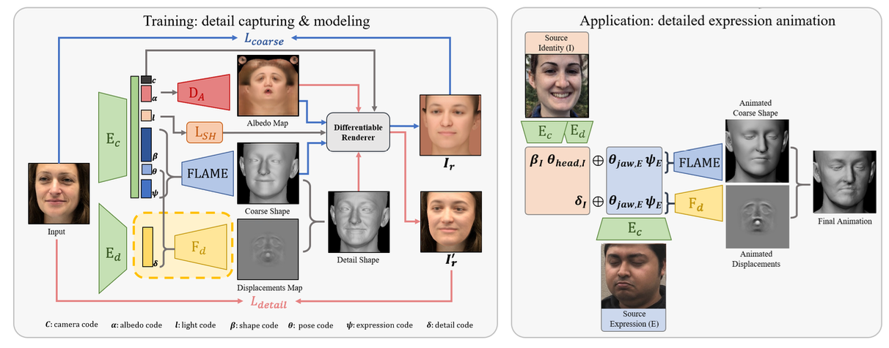
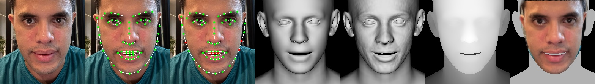
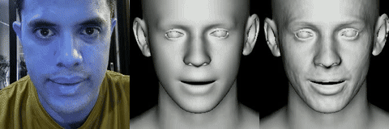

In the world of 3D computer vision, reconstructing a detailed, animatable 3D face from a single 2D image is one of the “holy grail” problems. DECA (Detailed Expression Capture and Animation) is a reliable method that tackles this challenge with impressive results ([Feng et al., 2021](https://arxiv.org/pdf/2012.04012)). It doesn’t just capture the coarse shape of the face, it captures fine details like wrinkles that appear during specific expressions, and it does so in a way that allows the face to be re-animated.

Reconstructing detailed 3D faces from single images isn’t just a research curiosity. It has profound implications across several domains:

- **Gaming**: Imagine RPGs where we can upload a selfie to generate a perfectly aligned 3D avatar of ourselves, complete with our unique skin texture and facial structure.
- **Animation & Visual Effects (VFX)**: DECA allows for the creation of high-fidelity digital doubles at a fraction of the cost of traditional 3D scanning. By capturing expression-dependent wrinkles, it enables more realistic performance transfer for animated characters.
- **Augmented Reality (AR) & Social Media**: Modern face filters often struggle with extreme poses or lighting. DECA’s robustness ensures that virtual makeup, glasses, or prosthetic effects stay perfectly pinned to the face even as the user moves dynamically.
- **Teleconferencing & Bandwidth Optimization**: Instead of streaming high-resolution video, a DECA-enabled system could transmit only the facial parameters (shape, expression, pose). The receiver than reconstructs the 3D face locally, potentially reducing bandwidth usage by orders of magnitude while maintaining visual quality.
- **Plastic Surgery & Healthcare**: Surgeons can use DECA to provide pre-operative visualizations of facial procedures, allowing patients to see potential outcomes based on their own unique facial geometry.

In this article, I’ll dissect how DECA works, exploring it architecture, the mathematical principles behind it, and the code that powers it.

## The Core Idea: Coarse-to-Fine

DECA operates on a coarse-to-fine principle. It doesn’t try to solve everything at once. Instead, it breaks the problem down into two stages:

1. **Coarse Reconstruction**: Estimate the underlying head shape, head pose, and facial expression using a statistical 3D face model (FLAME).
2. **Detail Reconstruction:** Predict a person-specific detail map (displacement map) that adds high-frequency details (like forehead wrinkles or crow’s feet) to the coarse mesh.



## The FLAME Model

At the heart of DECA is the FLAME (Faces Learned with Articulated Model and Expressions) model ([Li et al. 2017](https://download.is.tue.mpg.de/flame/flame_paper.pdf)). FLAME is a parametric model, meaning it generates a 3D mesh based on a set of low-dimensional parameters.

Mathematically, a 3D mesh $M$ with $N$ vertices is generated as:

$$
M(\beta, \theta, \psi) = W \left(T_r(\beta, \theta, \psi), J(\beta), \theta, \mathcal{W} \right)
$$

where:

- $\beta$ (Shape parameters): Controls identity-specific shape (e.g., big nose, wide jaw).
- $\psi$ (Expression parameters): Controls facial expressions (e.g., smile, frown).
- $\theta$ (Pose parameters): Controls the rotation of the neck and jaw.

I discussed about FLAME in more details in my [previous article](https://app.notion.com/p/Unmasking-FLAME-The-Articulated-3D-Face-Model-Powered-by-Apple-MLX-2f8a59d373608031b513fb39205f7021?pvs=21).

In DECA, the goal of the neural network is to predict these parameters ($\beta$, $\psi$, $\theta$) along with camera parameters $c$ and lighting $l$ from a single input image.

## Coarse Reconstruction Stream

The coarse stream is a straightforward encoder-decoder architecture.

### The Encoder

DECA uses a ResNet-50 backbone to extract a 2048-dimensional feature vector from the input image. This vector is then projected down to the parameter space of the FLAME model.

Here is the implementation of the encoder with PyTorch:

```python
class ResnetEncoder(nn.Module):
	def __init__(self, outsize, last_op=None):
	  super(ResnetEncoder, self).__init__()
    feature_size = 2048
		self.encoder = resnet.load_ResNet50Model() # Backbone
		### regressor
		self.layers = nn.Sequential(
	    nn.Linear(feature_size, 1024),
			nn.ReLU(),
			nn.Linear(1024, outsize) # Projects to n_shape + n_exp + n_pose + ...
    )
		self.last_op = last_op

    def forward(self, inputs):
			features = self.encoder(inputs)
			parameters = self.layers(features)
			if self.last_op:
				parameters = self.last_op(parameters)
			return parameters
```

### The Decoder

Once the parameters are predicted, DECA uses a differentiable renderer $(\mathcal{R})$. This allows the model to “draw” the 3D face back into 2D ($I_r$). By comparing this rendered image to the original input image, the network learns to align the 3D model to the 2D photo. This analysis-by-synthesis loop allows the model to learn without 3D ground truth by minimizing the photometric difference between the input image and the rendering.

The rendering process involves 3 primary components:

1. **Geometry Rendering**: The FLAME model generates vertices $M \in \mathbb{R}^{3N}$ which are projected into 2D image space using an orthographic camera model $c=[s, t_x, t_y]$:

$$
v=s\cdot \Pi (M_i) + t
$$

where $\Pi$ is the 3D-to-2D projection matrix.

1. **Albedo Mapping**: A UV albedo map $A(\alpha)$ is generated from the predicted albedo parameters $\alpha$. This map represents the intrinsic surface color of the face.
2. **Shading & Lighting**: DECA uses Spherical Harmonics (SH) to model global illumination. The shaded face image $B$ in UV coordinates is computed as:

$$
\begin{equation}B(\alpha, \mathbf{1}, N_{\mathrm{uv}})_{i, j} = A(\alpha)_{i,j} \odot \sum_{k=1}^{9} \mathbf{1}_k H_k (N_{i,j}) \end{equation}
$$

where:

- $N_{i,j}$ is the surface normal at pixel $(i,j)$ in UV space.
- $H_k:\mathbb{R}^3 \rightarrow \mathbb{R}$ are the SH basis functions.
- $\mathbf{1}_k \in \mathbb{R}^3$ are the predicted lighting coefficients.

The final rendered image is then produced by the rendering function:

$$
I_r = \mathcal{R}(M, B, c)
$$

## Detail Reconstruction Stream

This is where DECA shines. A standard parametric model is too smooth. To capture wrinkles, DECA also predicts a UV displacement map.

The detail reconstruction uses another encoder to extract a latent detail code $\delta$. This code, combined with the expression $\psi$ and pose $\theta$ parameters, is fed into a generator.

Why include expression and pose? Because wrinkles are dynamic. A forehead wrinkle appears when we raise our eyebrows. By conditioning the generator on expression, DECA learns expression-dependent details.

Here is the implementation of the detail reconstruction through `Generator` class below.

```python
class Generator(nn.Module):
    def __init__(self, latent_dim=100, out_channels=1, out_scale=0.01, sample_mode = 'bilinear'):
        super(Generator, self).__init__()
        self.out_scale = out_scale
        
        self.init_size = 32 // 4 
        self.l1 = nn.Sequential(nn.Linear(latent_dim, 128 * self.init_size ** 2))
        self.conv_blocks = nn.Sequential(
            # Upsampling layers to generate a high-res displacement map
            nn.BatchNorm2d(128),
            nn.Upsample(scale_factor=2, mode=sample_mode), 
            nn.Conv2d(128, 128, 3, stride=1, padding=1),
            # ... (more layers) ...
            nn.Conv2d(16, out_channels, 3, stride=1, padding=1),
            nn.Tanh(),
        )

    def forward(self, noise):
        out = self.l1(noise)
        out = out.view(out.shape[0], 128, self.init_size, self.init_size)
        img = self.conv_blocks(out)
        return img * self.out_scale
```

The output is a displacement map $D$. The final detailed mesh vertices $V_{\mathrm{detail}}$ are calculated by displacing the coarse vertices $V_{\mathrm{coarse}}$ along their normals $N_{\mathrm{uv}}$:

$$
\begin{equation}V_{\mathrm{detail}} = V_{\mathrm{coarse}} + D \odot N_{\mathrm{uv}}\end{equation}
$$





## Training: The Loss Functions

DECA uses a complex combination of loss functions to train these networks without requiring 3D ground truth (unsupervised learning).

**Landmark Loss ($L_{\mathrm{lmk}}$)**: ****Ensures the projected 3D keypoints match the 2D facial landmarks detected in the image.

```python
def landmark_loss(predicted_landmarks, landmarks_gt, weight=1.):
    if torch.is_tensor(landmarks_gt) is not True:
        real_2d = torch.cat(landmarks_gt).cuda()
    else:
        real_2d = torch.cat([landmarks_gt, torch.ones((landmarks_gt.shape[0], 68, 1)).cuda()], dim=-1)

    loss_lmk_2d = batch_kp_2d_l1_loss(real_2d, predicted_landmarks)
    return loss_lmk_2d * weight
```

**Photometric Loss ($L_{\mathrm{pho}}$)**: ****Computes the pixel-wise difference between the input image and the rendered 3D face. This forces the texture and shape to match the input.

**Identity Loss ($L_{\mathrm{id}}$)**: ****Uses a pretrained Face Recognition network (like ResNet50 trained on VGGFace2) to extract feature vectors. The loss minimizes the cosine distance between the features of the input image and the rendered image. This ensures the reconstructed 3D face "looks like" the person.

```python
class VGGFace2Loss(nn.Module):
    # ...
    def forward(self, gen, tar, is_crop=True):
        gen = self.transform(gen)
        tar = self.transform(tar)

        gen_out = self.reg_features(gen)
        tar_out = self.reg_features(tar)
        # Cosine similarity loss
        loss = self._cos_metric(gen_out, tar_out).mean()
        return loss
```

**Detail Loss ($L_{\mathrm{mrf}}$)**: ****Since pixel-wise difference doesn't work well for high-frequency details (due to slight misalignments), DECA uses an **ID-MRF loss**. This matches local patches of features from the input image to the rendered detail image, effectively transferring the "style" (details) of the photo to the 3D model.

## **Putting It All Together: The Inference Process**

A critical distinction of DECA's architecture is that it is a **learning-based approach**, as opposed to traditional **optimization-based** methods. While optimization-based methods solve an energy minimization problem for *every* image (seconds or minutes), DECA's pipeline predicts all parameters in a single **forward pass** (milliseconds). This enables the real-time interaction and animation.


When DECA is run on a face image, the following sequence of operations occurs:

### Step 1: Preprocessing & Encoding

The input image $I$ is cropped and resized to $224 \times 224$. The ResNet-50 encoder predicts a vector of parameters $\Theta$:

$$
\Theta = \{ \beta, \psi, \theta, c, l, \delta \}
$$

where $\beta \in \mathbb{R}^{100}$ (shape), $\psi \in \mathbb{R}^{50}$ (expression), $\theta \in \mathbb{R}^{6}$ (pose), $c \in \mathbb{R}^{3}$ (camera), $l \in \mathbb{R}^{27}$ (lighting), and $\delta \in \mathbb{R}^{128}$ (detail).

### Step 2: FLAME Decoding (Coarse Geometry)

The FLAME model uses $\beta, \psi, \theta$ to generate the coarse vertices $V_{\mathrm{coarse}}$ in world coordinates.

### Step 3: Orthographic Projection

The camera parameters $c = [s, t_x, t_y]$ are used to project the 3D vertices into 2D Normalized Device Coordinates (NDC):

$$
V_{\mathrm{ndc}} = s \cdot (V_{coarse} + [t_x, t_y, 0]^\top)
$$

### Step 4: Detail Generation & Displacement

The detail encoder predicts $\delta$, which is combined with expression $\psi$ and pose $\theta$. The Generator outputs a UV displacement map $D$. The vertices are then updated through Equation (2).

### Step 5: Differentiable Rendering & Lighting

The final image is rendered using Spherical Harmonics (SH) lighting according to Equation (1).

## Custom C++ CPU Rasterizer

In standard DECA (and many modern 3D project), the rasterization step is typically handled by CUDA-based engines or heavy libraries like PyTorch3D. To achieve native, fast performance on a local machine (e.g., Apple Silicon) without these dependencies, I implemented a custom C++ CPU rasterizer that also leverages [PyTorch C++ API](https://docs.pytorch.org/cppdocs/).

### The Core Algorithm

The rasterizer uses a traditional Barycentric-based rasterization technique with Z-buffering. For every triangle in the mesh, we perform the following steps:

1. NDC to Raster Mapping: Vertices are transformed from Normalized Device Coordinates (NDC) to pixel coordinates:

$$
x_{\mathrm{pixel}} = x_{\mathrm{ndc}} \cdot \frac{W}{2} + \frac{W}{2} \\
y_{\mathrm{pixel}} = y_{\mathrm{ndc}} \cdot \frac{W}{2} + \frac{W}{2}
$$

1. Bounding Box Optimization: Instead of checking every pixel in the image, we only iterate over the pixels within the triangle’s actual screen-space bounding box.
2. Barycentric Weight Calculation: For each pixel $P$ in the bounding box, we calculate weights ($w_0, w_1, w_2$) such that:

$$
P = w_0 P_0 + w_1 P_1 + w_2 P_2
$$

The weights are computed using the dot products of vectors 

$$

v_0 = P_2 - P_0, v_1 = P_1 - P_0, v2 = P - P_0 \\
denom=(v_0 \cdot v_0)(v_1\cdot v_1)−(v_0 \cdot v_1)(v_0 \cdot v_1) \\
u = \frac{(v_1 \cdot v_1)(v_0 \cdot v_2) - (v_0 \cdot v_1)(v_1 \cdot v_2)}{denom} \\
v = \frac{(v_0 \cdot v_0)(v_1 \cdot v_2) - (v_0 \cdot v_1)(v_0 \cdot v_2)}{denom} \\
w_0 = 1 - u - v, \quad w_1 = v, \quad w_2 = u
$$

1. Point-in-Triangle Test: A pixel is “inside” if $w_i \ge 0$ for all $i$.
2. Perspective Correct Depth: To handle the 3D depth correctly during 2D projection, the inverse-depth interpolation is used:

$$
Z_p = \frac{1}{\frac{w_0}{z_0} + \frac{w_1}{z_1} + \frac{w_2}{z_2}}
$$

1. Z-Buffering: If the calculated $Z_p$ is smaller (closer to the camera) than the value currently in the depth buffer, the pixel is updated with new depth, triangle index, and barycentric coordinates.

The following is the C++ kernel implementation. 

```cpp
//standard_rasterize_cpu.cpp
#include <torch/extension.h>
#include <vector>
#include <cmath>
#include <algorithm>
#include <iostream>

// Helper struct for 2D points
template <typename T>
struct Point {
    T x, y;
};

// Barycentric weight calculation
template <typename T>
void barycentric_weight(T* w, Point<T> p, Point<T> p0, Point<T> p1, Point<T> p2) {
    Point<T> v0 = {p2.x - p0.x, p2.y - p0.y};
    Point<T> v1 = {p1.x - p0.x, p1.y - p0.y};
    Point<T> v2 = {p.x - p0.x, p.y - p0.y};

    T dot00 = v0.x * v0.x + v0.y * v0.y;
    T dot01 = v0.x * v1.x + v0.y * v1.y;
    T dot02 = v0.x * v2.x + v0.y * v2.y;
    T dot11 = v1.x * v1.x + v1.y * v1.y;
    T dot12 = v1.x * v2.x + v1.y * v2.y;

    T denom = dot00 * dot11 - dot01 * dot01;
    T invDenom = (denom == 0) ? 0 : 1 / denom;

    T u = (dot11 * dot02 - dot01 * dot12) * invDenom;
    T v = (dot00 * dot12 - dot01 * dot02) * invDenom;

    w[0] = 1 - u - v;
    w[1] = v;
    w[2] = u;
}

void standard_rasterize_cpu_kernel(
    const torch::Tensor& face_vertices,
    torch::Tensor& depth_buffer,
    torch::Tensor& triangle_buffer,
    torch::Tensor& baryw_buffer,
    int h, int w
) {
    // face_vertices: [B, F, 3, 3]
    // depth_buffer: [B, H, W]
    // triangle_buffer: [B, H, W]
    // baryw_buffer: [B, H, W, 3]

    auto B = face_vertices.size(0);
    auto F = face_vertices.size(1);

    // Get accessors for efficient element access
    // Assuming float input as per standard renderer usage
    auto face_vertices_a = face_vertices.accessor<float, 4>();
    auto depth_buffer_a = depth_buffer.accessor<float, 3>();
    auto triangle_buffer_a = triangle_buffer.accessor<int, 3>();
    auto baryw_buffer_a = baryw_buffer.accessor<float, 4>();

    for (int b = 0; b < B; ++b) {
        for (int f = 0; f < F; ++f) {
            float p0x = face_vertices_a[b][f][0][0];
            float p0y = face_vertices_a[b][f][0][1];
            float p0z = face_vertices_a[b][f][0][2];

            float p1x = face_vertices_a[b][f][1][0];
            float p1y = face_vertices_a[b][f][1][1];
            float p1z = face_vertices_a[b][f][1][2];

            float p2x = face_vertices_a[b][f][2][0];
            float p2y = face_vertices_a[b][f][2][1];
            float p2z = face_vertices_a[b][f][2][2];

            // Calculate bounding box for the triangle
            int x_min = std::max(0, (int)std::ceil(std::min({p0x, p1x, p2x})));
            int x_max = std::min(w - 1, (int)std::floor(std::max({p0x, p1x, p2x})));
            int y_min = std::max(0, (int)std::ceil(std::min({p0y, p1y, p2y})));
            int y_max = std::min(h - 1, (int)std::floor(std::max({p0y, p1y, p2y})));

            if (x_min > x_max || y_min > y_max) continue;

            Point<float> p0 = {p0x, p0y};
            Point<float> p1 = {p1x, p1y};
            Point<float> p2 = {p2x, p2y};

            for (int y = y_min; y <= y_max; ++y) {
                for (int x = x_min; x <= x_max; ++x) {
                    Point<float> p = {(float)x, (float)y};
                    float bw[3];
                    barycentric_weight(bw, p, p0, p1, p2);

                    // Check if pixel is inside the triangle
                    if (bw[0] > 0 && bw[1] >= 0 && bw[2] >= 0) {
                        // Perspective correct depth interpolation
                        float zp = 1.0f / (bw[0] / p0z + bw[1] / p1z + bw[2] / p2z);
                        
                        // Z-buffer test
                        if (zp < depth_buffer_a[b][y][x]) {
                            depth_buffer_a[b][y][x] = zp;
                            triangle_buffer_a[b][y][x] = f;
                            baryw_buffer_a[b][y][x][0] = bw[0];
                            baryw_buffer_a[b][y][x][1] = bw[1];
                            baryw_buffer_a[b][y][x][2] = bw[2];
                        }
                    }
                }
            }
        }
    }
}

void standard_rasterize(
    torch::Tensor face_vertices,
    torch::Tensor depth_buffer,
    torch::Tensor triangle_buffer,
    torch::Tensor baryw_buffer,
    int h, int w
) {
    standard_rasterize_cpu_kernel(face_vertices, depth_buffer, triangle_buffer, baryw_buffer, h, w);
}

PYBIND11_MODULE(TORCH_EXTENSION_NAME, m) {
    m.def("standard_rasterize", &standard_rasterize, "Standard Rasterize (CPU)");
}

```

```python
from torch.utils.cpp_extension import load
...

try:
	standard_rasterize_cpu_module = load(
    name='standard_rasterize_cpu', 
    sources=[source_path],
    verbose=True
	)
  _standard_rasterize_cpu_impl = standard_rasterize_cpu_module.standard_rasterize
  print(f"[set_rasterizer] Successfully loaded standard rasterizer extension.")
except Exception as e:
  print(f"[set_rasterizer] Error loading C++ extension: {e}")
  raise
...
```

By wrapping this C++ implementation as a PyTorch extension, a rendering speed that makes DECA feel incredibly fluid on Macbooks.

<video controls preload="metadata" width="100%"><source src="media/demo_viser.mp4" type="video/mp4">Your browser does not support embedded video.</video>

## Conclusion

DECA represents a considerable milestone in 3D facial mesh reconstruction. By combining robust coarse shape estimation with detailed, expression-driven displacement mapping, it bridges the gap between static mesh reconstruction and realistic animation.

With the native Apple Silicon port leveraging PyTorch capabilities to run on the CPU/MPS devices, we can run DECA without requiring CUDA GPU.

*For the full source code and implementation details, check out my forked [DECA repository](https://github.com/ghif/DECA_pt-apple).*
