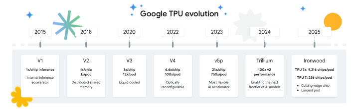
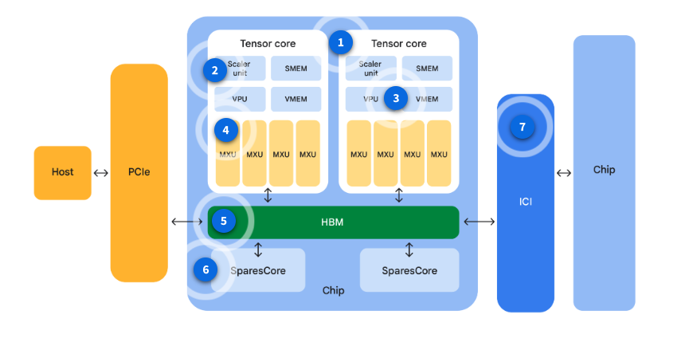

3D Gaussian Splatting (3DGS) has emerged as a state-of-the-art technique for real-time radiance field rendering, offering a compelling alternative to neural volume integration methods like NeRF. In the previous [attempt](https://app.notion.com/p/Beyond-the-Triangle-Building-a-3D-Gaussian-Splatting-Engine-from-Scratch-in-JAX-2dca59d37360803b9ad8ec11ab117758?pvs=21), I implemented the 3DGS algorithm purely in JAX. However, that version was a naive approach and did not fully harness JAX’s performance on accelerators. There is still plenty of room to improve runtime.

This article discusses how to further optimize 3DGS across multiple Tensor Processing Units (TPUs). In general, the strategy involves restructuring the rasterization implementation and exploiting batched data parallelism. The [`jax-gs`](https://github.com/ghif/jax-gs) project addresses these challenges by reformulating 3DGS within the JAX framework and leveraging XLA (Accelerated Linear Algebra) to compile the entire training and rendering pipeline into highly optimized machine code. 

This transition from a dynamic, CUDA-centric model to a static-shape, JIT-compiled architecture allows `jax-gs` to exploit the massive parallel processing power of TPUs while maintaining numerical stability and structural consistency. The codebase is also research-friendly that benefits from JAX’s composable transformations (e.g., `vmap`, `pmap`, `grad`).

## About Tensor Processing Units (TPUs)

Before diving into the optimization strategy, let’s briefly discuss the hardware accelerator itself. A basic understanding of TPU architecture will help us plan the optimization more effectively.

TPUs are Google's custom-developed application-specific integrated circuits (ASICs) designed specifically to accelerate machine learning workloads. Unlike general-purpose GPUs, TPUs are architected around the requirements of deep learning, prioritizing high-throughput matrix multiplications and low-latency interconnects.

### TPU Evolution

Since their debut in 2015, TPUs have evolved from specialized inference engines into the backbone of global AI:



- **TPU v1:** A pure inference chip that powered Google Search and AlphaGo
- **TPU v2:** The first version capable of larger-scale training, introducing the **bfloat16** format.
- **TPU v3:** Doubled performance and introduced liquid cooling to handle the heat of massive scale.
- **TPU v4:** Introduced **3D Torus** network topology and **SparseCore** for embedding acceleration.
- **TPU v5:** Split into v5e (efficient/cost-optimized) and v5p (performance flagship for models like Gemini).
- **Trillium / TPU v6e:** The recent generation, featuring a 256x256 MXU and 4.7x the peak compute of v5e.
- **Ironwood / TPU7x:** Employs a dual-chiplet architecture and 192GB of HBM3e, optimized for massive-scale inference and frontier “reasoning” models.

Here are the key architectural innovations in TPUs.

- **Systolic Array & MXU**: Unlike the many-core SIMT architecture of GPUs, TPUs use a systolic array design where data flows through a grid of multiply-accumulators (MXUs). This minimizes memory access during matrix multiplications.
- **Optical Circuit Switching (OCS)**: Starting with TPU v4, Google replaced traditional electronic switches with OCS, allowing the interconnect topology (3D Torus) to be reconfigured dynamically. This facilitates Inter-chip interconnect (ICI) resiliency by routing around optical faults.

Unlike general-purpose GPUs, TPUs are built around **Matrix Multiplication Units (MXUs)**. These hardware blocks use a systolic array design to perform massive matrix multiplications with incredibly high throughput.

### TPU Chips, Pods, and Slices

A TPU chip is specifically engineered with key components to accelerate machine learning (ML) workloads. The following is the schematic architecture of a TPU chip:



1. **TensorCore:** The primary processing unit, handling the bulk of the computational acceleration. Each TPU chip contains one or more cores. The exact number varies depending on the chip version.
2. **Scalar unit:** Handles control flow, calculates memory addresses, and manages other essential “housekeeping” operations.
3. **Vector Processing Unit (VPU) and Vector Memory (VMEM):** Together form a Vector Unit, used for general computations that aren’t matrix multiplications, such as activation functions and softmax.
4. **Matrix-multiply units (MXUs):** The workhorses, providing the bulk of the computational power. They are structured as systolic arrays of multiply-accumulators. 
5. **High Bandwidth Memory (HBM) access interface:** Providing fast access to memory for the TPU.
6. **BarnaCore/SparseCore:** Specialized dataflow processors designed to accelerate computations involving sparse data in deep learning tasks (e.g., embedding computation).
7. **Inter-chip-interconnect (ICI):** Enabling seamless communication between multiple TPU chips.

While a single TPU chip is powerful, real-world AI models often require even more compute. This is where TPU cubes, pods and slices come in.

#### TPU cube

A cube is a physical unit that contains 64 chips. It is a 4x4x4 topology of interconnected TPU chips. This is only applicable to 3D topologies (beginning with TPU v4). They are also known as a “rack”.

**TPU pod**

A pod is a collection of TPUs that are physically grouped together and connected by a specialized, high-speed network. The total number of TPU chips within a pod varies by TPU version. Imagine a data center as a city. A TPU pod is like a dedicated, super-fast neighborhood within that city, designed specifically for AI compute.

**TPU slice**

A slice is a subset of chips within a single TPU pod, all connected by incredibly fast ICI. A TPU slice refers to any group of TPUs ranging from 4 chips up to the size of a Superpod. Continuing the city analogy, if a TPU pod is a neighborhood, then a slice is like a tighly integrated block or a cluster of interconnected buildings within that neighborhood, where information (data) can be shared almost instantly between the residents (chips).

.png)

In this article, we mainly use the Trillium (v6e) to support 3D Gaussian Splatting computation.

### Accessing Cloud TPU in GCP

One way to access TPUs is through Cloud TPU VMs in GCP. Below is the `gcloud` command to create a queued TPU VM with a v6e-4 slice (the “-4” suffix denotes the number of chips in the TPU slice). 

```bash
gcloud alpha compute tpus queued-resources create tpu-southamerica-queue \
    --zone=southamerica-east1-c \
    --accelerator-type=v6e-4 \
    --runtime-version=v2-alpha-tpuv6e \
    --node-id=my-tpu-node \
    --provisioning-model=flex-start \
    --max-run-duration=96h \
    --valid-until-duration=96h \
    --labels=purpose=flex-start
```

This queue uses the flex-start provisioning model, meaning resources start on demand from the queue rather than being pinned up front. This option can reduce cost and administrative overhead. It can also improve resource sharing and orchestration for teams. Multiple users or jobs can request capacity from the same queue instead of each user reserving an expensive dedicated node. Tradeoffs to be aware of include startup latency while the queued resource is provisioned, zone-dependent availability, and applicable policies and quotas.

In the command example above, the cloud TPU instance targets the zone at `southamerica-east1-c` and will be available for 4 days (`96h`).

## Optimization Strategy

The initial implementation used a traditional deep learning training loop structure:

```python
for i in pbar:
	idx = random.randin(0, len(jax_cameras)-1)
	cam = jax_cameras[idx]
	target = jax_targets[idx]
	
	# Single step dispatched to device
	state, loss, metrics = train_step(state, target, cam.W2C, camera_static, optimizer)
	
	if i % 100 == 0:
		img = render(state[0], jax_cameras[0]) # Synchronous render
		save_ply(...) # Symchronous I/O
	
```

While functional, this approach has a few drawbacks or fails to capitalize on JAX’s core strengths.

1. **Dispatch Overhead:** Python has to tell the TPU what to do at every step.
2. **Host-Device Communication:** Sampling images on the CPU and sending them to the TPU creates a bottleneck.
3. **Synchronous I/O:** The entire training process pauses to wait for disk writes.

To achieve faster performance, we must transition to a JAX-native architecture designed for TPU efficiency. The primary goal of `jax-gs` is to minimize host-accelerator communication and maximize the utilization of TPU systolic arrays (MXUs). We achieve this through several core optimization approaches that restructure the training and rendering pipeline into high-throughput, block-compile execution units.

### Action I: JIT-Compiles Training Blocks

In JAX, every Python-to-accelerator dispatch incurs a non-trivial overhead. To mitigate this, we aggregate multiple training iterations into a single `jax.lax.scan` loop, which is then JIT-compiled into a single XLA graph.

```python
# From train.py
@partial(jax.jit, static_argnums=(4, 5, 6, 7, 8))
def train_block(state, rng_key, all_targets, all_w2cs, steps_per_block, camera_static, optimizer, fast_tpu_rasterizer, sh_degree):
    def one_step(carry, _):
        state, key = carry
        key, subkey = jax.random.split(key)
        
        # Sample camera index
        idx = jax.random.randint(subkey, (), 0, all_targets.shape[0])
        target = all_targets[idx]
        w2c = all_w2cs[idx]
        
        # Perform training step
        state, loss, metrics = train_step(state, target, w2c, camera_static, optimizer, fast_tpu_rasterizer=fast_tpu_rasterizer, sh_degree=sh_degree)
        
        return (state, key), loss

    # The entire loop runs on the TPU as a single XLA program
    (state, rng_key), losses = jax.lax.scan(one_step, (state, rng_key), None, length=steps_per_block)
    return state, rng_key, losses
```

This effectively deletes dispatch overhead from the performance equation. The TPU runs for *m* iterations without ever looking back at the host.

### Action II: On-Device Data & Sampling

To avoid the bottleneck of transferring images and camera matrices from the CPU host to the TPU device on every iteration, we store the entire dataset on-device memory. Index sampling for mini-batches is performed using `jax.random` primitives directly on the TPU, ensuring that the training loop remains entirely self-contained within the accelerator.

```python
# From train.py
# 1. Prepare data on device (all images and matrices loaded once)
all_targets = jnp.stack(jax_targets)
all_w2cs = jnp.stack([c.W2C for c in jax_cameras])

# 2. Inside the JIT-compiled train_block:
# Sampling happens entirely on-device
idx = jax.random.randint(subkey, (), 0, all_targets.shape[0])
target = all_targets[idx]
w2c = all_w2cs[idx]
```

### Action III: Asynchronous I/O

While the TPU handles the intensive computation, monitoring progress requires periodic rendering of validation views and saving `.ply` snapshots. We offload these tasks to a background thread pool on the host CPU, preventing I/O operations from blocking the primary training pipeline.

```python
# Background executor for I/O and rendering
executor = concurrent.futures.ThreadPoolExecutor(max_workers=1)

# Inside training loop:
if curr_iter % 1000 == 0:
    snap_gaussians_dict = get_active_gaussians(curr_state)
    fut = executor.submit(
        save_artifacts_task, 
        snap_gaussians_dict, curr_iter, progress_dir, ply_path, 
        jax_cameras[0], fast_tpu_rasterizer, render, save_ply, sh_degree
    )
```

### Action IV: Hardware-Specific Rasterization (CPU/GPU vs. TPU)

A critical realization during development was that the optimal JAX code for a GPU is not always the optimal code for a TPU. To maximize performance across platforms, we implemented two distinct rasterizers: `rasterizer.py` (standard) and `rasterizer_tpu.py` (TPU-optimized).

The core differences lie in how they structure memory access and vectorization for the XLA compiler:

**Vectorization Strategy (Nested vs. Flat)**

- **Standard (`rasterizer.py`)**: Uses a nested approach. It parallelizes over tiles using `jax.vmap`, and inside that, parallelizes over the 256 pixels within the tile using another `jax.vmap`. This is natural and works well on GPUs.

```python
# From jax_gs/renderer/rasterizer.py
def rasterize_single_tile(tile_idx):
    # ... logic for one tile ...
    def blend_pixel(p_coord, p_valid):
        # ... blending logic for one pixel ...
        return final_color

    # Parallelize over pixels in the tile
    tile_image = jax.vmap(blend_pixel)(pixel_coords, pixel_valid)
    return tile_image.reshape(tile_size, tile_size, 3)

# Parallelize over all tiles in the image
all_tiles = jax.vmap(rasterize_single_tile)(jnp.arange(num_tiles))
```

- **TPU (`rasterizer_tpu.py`)**: TPUs prefer massive, continuous matrix operations to saturate their Matrix Multiply Units (MXUs). The TPU rasterizer flattens the tile and pixel dimensions into a single massive axis (`[num_tiles, 256]`). The core blending loop (`scan_fn`) processes a single Gaussian across *all pixels in all tiles simultaneously*.

```python
# From jax_gs/renderer/rasterizer_tpu.py
# Pre-calculate global pixel coordinates for EVERY pixel in the image, 
# grouped by tile. Shape: [num_tiles, 256]
px = (tx[:, None] * TILE_SIZE).astype(jnp.float32) + (idx % TILE_SIZE)[None, :].astype(jnp.float32) + 0.5
py = (ty[:, None] * TILE_SIZE).astype(jnp.float32) + (idx // TILE_SIZE)[None, :].astype(jnp.float32) + 0.5

@jax.checkpoint
def scan_fn(carry, i):
    # Vectorized across [num_tiles, 256] flat dimension
    dx = px - mu_x 
    dy = py - mu_y
    # ... blending logic ...
```

**Memory Access Patterns (Random vs. Broadcasted Gather)**

- **Standard**: Inside the inner loop, it dynamically slices (`jnp.take`) the specific Gaussians that overlap the current tile.
- **TPU:** Dynamic slicing inside a fast loop is terrible for TPU performance. Instead, we use a *Broadcasted Gather*. Before the loop starts, we prefetch all Gaussian parameters for every tile into massive tensors (e.g., `[num_tiles, BLOCK_SIZE, 3` for colors).

```python
# From jax_gs/renderer/rasterizer_tpu.py
# BROADCASTED GATHER: Construct indices for all Gaussians across all tiles.
# Resulting shape: [num_tiles, BLOCK_SIZE]
all_tile_indices = tile_starts[:, None] + jnp.arange(BLOCK_SIZE)[None, :]

# Prefetch Gaussian data for all tiles at once
tile_gids = valid_ids[all_tile_indices] 
g_means = means2D[tile_gids]            # [num_tiles, BLOCK_SIZE, 2]
g_cols = colors[tile_gids]              # [num_tiles, BLOCK_SIZE, 3]

@jax.checkpoint
def scan_fn(carry, i):
    # Processes the i-th Gaussian for ALL pixels in ALL tiles simultaneously
    # No random access lookups here!
    mu_x = g_means[:, i, 0][:, None] # [num_tiles, 1]
    dx = px - mu_x                   # [num_tiles, 256]
    # ... blending logic ...
```

**Memory Efficiency (`jax.checkpoint`)**

Because the TPU rasterizer trades memory for speed via the Broadcasted Gather, it risks Out-Of-Memory (OOM) errors during the backward pass (autodiff). We solve this by heavily applying `@jax.checkpoint` to the inner `scan` loop. This forces JAX to discard intermediate activations during the forward pass and recompute them on-the-fly during backpropagation, keeping memory scaling linear rather than exploding.

### Action V: Multi-TPU Parallelism

For large-scale scenes or faster convergence, we utilize `jax.pmap` for data-parallel training across multiple TPU cores. Gradients and metrics are synchronized across the high-speed Torus network using `jax.lax.pmean`.

```python
# From train_parallel.py
@partial(jax.pmap, axis_name="batch", ...)
def train_block(state, ...):
    # ... computation ...
    def one_step(carry, inputs):
        # ... train_step_internal performs pmean on gradients ...
        return state, (loss, metrics)

    state, (losses, metrics) = jax.lax.scan(one_step, state, (batch_targets, batch_w2cs))
    avg_metrics = jax.tree_util.tree_map(lambda x: jnp.mean(x, axis=0), metrics)
    return state, losses, avg_metrics

# From jax_gs/training/trainer.py
# Gradients and metrics are averaged across devices
grads = jax.tree_util.tree_map(lambda x: jax.lax.pmean(x, axis_name='batch'), grads)
loss = jax.lax.pmean(loss, axis_name='batch')
metrics = jax.tree_util.tree_map(lambda x: jax.lax.pmean(x, axis_name='batch'), metrics)
```

Adaptive density control (cloning/splitting/pruning) is performed by unreplicating the state to a single “authoritative” device, executing the logic, and then re-broadcasting the result.

## Benchmark Results

Our benchmarks on the LLFF `room` dataset (504x378 resolution) demonstrate the massive performance gains achieved by our JAX-native optimizations. On a **Google Cloud TPU v6e-4 (Trillium)**, we observed the following:

### Rasterizer Optimization

The "Fast TPU Rasterizer" achieves a **~100x speedup** over the standard JAX implementation by maximizing MXU utilization and minimizing HBM latency.

| **Metric** | **Standard Rasterizer** | **Fast TPU Rasterizer** | **Speedup** |
| --- | --- | --- | --- |
| **Throughput (Steady State)** | ~0.09 it/s | ~9.6 it/s | ~107x |
| **Convergence Time (3k steps)** | ~9.2 hours | ~5.2 minutes | ~107x faster |

### Multi-Device Scaling

By utilizing `jax.pmap` and `jax.lax.scan` , we achieve near-linear scaling across multiple TPU cores. The efficiency remains high even as the complexity of the scene increases.

| **Phase** | **Active Gaussians** | **Single Device Throughput** | **Multi-Device (4 TPUs)** | **Scaling Efficiency** |
| --- | --- | --- | --- | --- |
| **SH Degree 0** | ~17.5k | 9.6 img/s | 38.4 img/s | 4.0x |
| **SH Degree 1** | ~34k | 6.6 img/s | 21.6 img/s | 3.3x |

The "Fast TPU Rasterizer" achieves near-peak MXU saturation by replacing irregular memory access patterns with contiguous tensor operations, while `train_parallel.py` effectively hides communication overhead at scale.

<video controls preload="metadata" width="100%"><source src="media/fern_wiggle.mp4" type="video/mp4">Your browser does not support embedded video.</video>

<video controls preload="metadata" width="100%"><source src="media/room_final_ref_wiggle.mp4" type="video/mp4">Your browser does not support embedded video.</video>

## Conclusion

The transformation of 3D Gaussian Splatting into a static-shape, JIT-compatible architecture within JAX enables efficient training and rendering on modern accelerators. By prioritizing systolic array saturation, minimizing host-device communication, and leveraging the low-latency TPU interconnects, [`jax-gs`](https://github.com/ghif/jax-gs) provides a robust and scalable foundation for the next generation of radiance field research.

## Acknowledgments

Google Cloud credits are provided for this project. **#TPUSprint**
