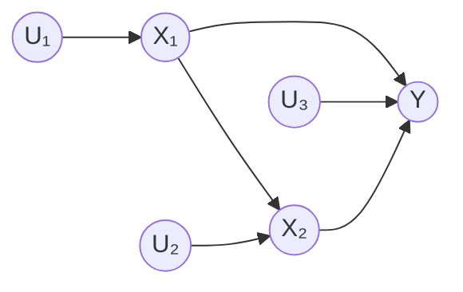
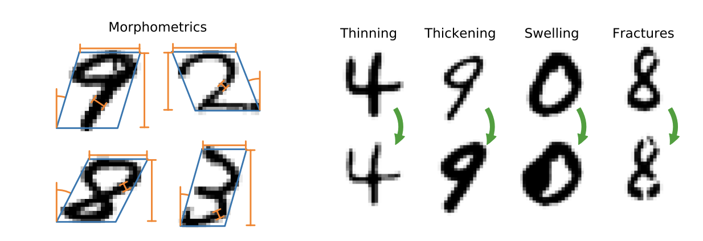
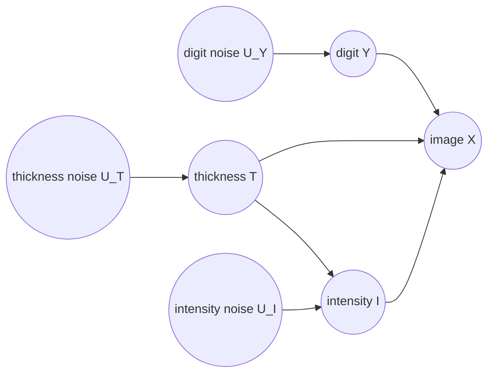
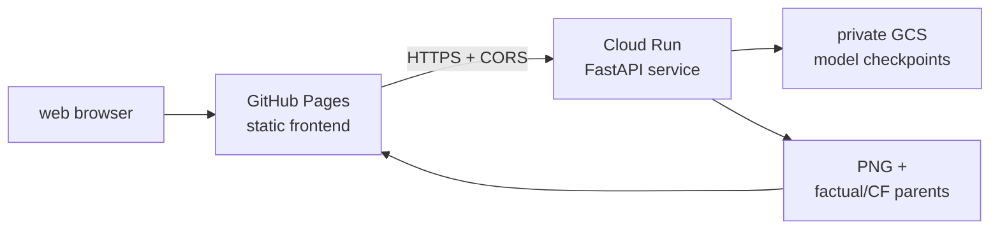

Many image generation tasks sound causal before they are formalized. What would a chest radiograph look like if an abnormality were absent? What would this face look like under different lighting? What would this handwritten digit look like if it were thinner, while still preserving the writer’s style?

An ordinary conditional generator can create a plausible image with a requested attribute. That’s useful, but it doesn’t answer the individual-level question behind explanation, simulation, and intervention: what would have happened to this observed sample if one cause had been different? Suppose an image has thickness 3.6 and intensity 245. Drawing a digit with thickness 2.1 is not the same as asking:

> What would this same handwritten digit have looked like if its thickness had been 2.1?
> 

This “same” carries most of the difficulty. **A useful answer should preserve the observation-specific factors that the intervention does not cause, e.g., writing style, pose, fine image detail, and other latent variation, while changing the target variable and only its causal descendants**. A model that changes everything is an editor or a model that preserves the wrong things is not a causal explanation either.

Consider a clinical decision-support system reviewing a chest radiograph for pneumonia. Asking for an image that merely **looks less like pneumonia** may also alter the patient’s anatomy, image positioning, or acquisition conditions, making it impossible to tell what visual evidence drove the prediction. A meaningful counterfactual instead asks: “What would this same patient’s radiograph look like if the pneumonia-related finding were absent?” That question requires a causal intervention on the finding while preserving the patient-specific anatomy and unrelated imaging factors.

This is why causal and counterfactual modeling is relevant. It makes the assumptions behind a “what if” image explicit: which factors are causes, which variation belongs to the observed individual, and which change is being contemplated. That does not guarantee a correct answer — the causal graph and mechanisms must still be justified — but it gives the questions a meaning that ordinary conditional generation lacks.

In this article, we take a close look at an image counterfactual method of ([Ribeiro et al. 2023](https://proceedings.mlr.press/v202/de-sousa-ribeiro23a.html)) — they also share the code implementation here: https://github.com/biomedia-mira/causal-gen

We port the code to be a pure JAX/Flax implementation with not merely a translation of APIs, but also creating a cleaner path to efficient execution on TPU hardware: https://github.com/ghif/causal-genx/

## A. Causal Modeling Foundations

### A.1. Observation vs. Intervention: Seeing vs. Doing

To appreciate causal inference, one should understand the difference between **observation (”seeing”)** and **intervention** **(”doing”)**. Observation means watching the world naturally unfold and collecting data without changing anything. When we observe, we might ask:

> Given that I just noticed event $A$ happening, how likely is it that event $B$ is also happening?
> 

This type of question is typically answered formally through probabilistic models, through a conditional distribution $P(B | A)$.

Let us use the **rooster (A) and sunrise (B) analogy**. Imagine a rooster that crows every morning right before the sun rises. For every single day for 10 years, we write down two things:

- Did the rooster crow? (Yes)
- Did the sun rise? (Yes)

We can statistically conclude 100% correlation: $P(B = \texttt{Sunrise} | A =\texttt{Rooster crow}) = 1.0$. If we stay purely in the world of observation, the data tells us that the rooster crowing and the sunrise are tightly linked. But, does the rooster *cause* the sun to rise?

Intervention means stepping into the world, breaking the natural routine, and forcing a variable to take a specific value regardless of what normally happens. When we intervene, we are asking

> If I actively step in and force $A$ to happen, what will happen to $B$?
> 

Mathematically, Judea Pearl ([Pearl 1995](https://www.jstor.org/stable/2337329)) represented this using the **do-operator**: $\operatorname{do}(A = \texttt{Rooster crow})$.

In a real world, we can test if the rooster actually causes the sunrise by performing this intervention:

1. Scenario A (Forced Silence): We step in and hold the rooster’s beak shut at 5:00 AM, i.e., $\operatorname{do}(A = \texttt{Rooster silent})$. Does the sun still rise? Yes.
2. Scenario B (Forced Crowing): We wake the rooster up at 2:00 AM in pitch darkness and force it to crow, i.e., $\operatorname{do}(A = \texttt{Rooster crow})$. Does the sun immediately rise? No.

Through intervention, we discover that:

- Observational probability: $P(B=\texttt{Sunrise} | A=\texttt{Rooster crow}) = \texttt{High}$
- Interventional probability: $P(B=\texttt{Sunrise} | \operatorname{do}(A = \texttt{Rooster crow})) = \texttt{Unchanged}$

By stepping in, we cut the connection and proved the rooster does not control the sun 🙂

### A.2. From Probability to Causal Mechanism

More formally, a traditional probabilistic graphical model (PGM) represents a joint distribution such as $p(x_1,\ldots,x_n)$ and uses conditioning, for example $p(Y\mid X=x)$, to answer predictive or diagnostic questions. A causal framework adds the claim that the graph’s arrows correspond to data-generating mechanisms. That extra claim gives meaning to an intervention $do(X:=x)$ and to a unit-level counterfactual; conditioning alone cannot distinguish “units that happened to have $X=x$” from “the same unit after its cause was set to $x$.” Even two DAG factorizations with the same observational distribution can imply different interventions ([Pearl 2009](https://www.cambridge.org/core/books/causality/B0046844FAE10CBF274D4ACBDAEB5F5B), [Koller & Friedman 2009](https://www.amazon.com/dp/0262013193)).

Pearl introduced a causal framework called Structural Causal Model (SCM), which adds the missing semantic layer: it is a model of how variables are generated, not merely how they co-occur ([Petters et al. 2017](https://www.amazon.com/dp/0262037319)). The model can be represented as a tuple 

$$
\mathcal M=\langle\mathcal X,\mathcal U,\mathcal F,P(\mathcal U)\rangle
$$

where $\mathcal X=\{X_1,\ldots,X_N\}$ is the set of **endogenous variables** generated by the model; $\mathcal U=\{U_1,\ldots,U_N\}$ is the set of **exogenous variables**, representing background causes and individual-specific randomness; $\mathcal F=\{f_1,\ldots,f_N\}$ is the set of structural mechanisms; and $P(\mathcal U)$ specifies how causal worlds are distributed. Each endogenous variable is assigned one mechanism,

$$
X_k := f_k (\operatorname{pa}_k, U_k), \tag{2}

$$

where $\operatorname{pa}_k$ denotes the direct endogenous parents of $X_k$. The associated DAG records this mechanism-level dependency: an arrow $X_j\to X_k$ means that changing $X_j$ can change the input to $f_k$, not merely that the variables are statistically associated.

Let’s consider a simple example of an SCM with 3 endogenous variables $X_1, X_2, Y$ drawn as a graph below:



In this example, the mechanisms are $X_1:=f_1(U_1)$, $X_2:=f_2(X_1,U_2)$, and $Y:=f_Y(X_1,X_2,U_3)$. Solid arrows between endogenous variables encode the causal graph; the arrows from $U_1,U_2,U_3$ represent background influences/noises that are not generated by another endogenous mechanism.

In the common acyclic Markovian case, which is a useful assumption in practice, the exogenous variables are mutually independent,

$$
P(\mathcal U)=\prod_{k=1}^{N}P(U_k),
$$

and the mechanisms induce the familiar observational factorization

$$
P_{\mathcal M}(x_1,\ldots,x_N)=\prod_{k=1}^{N}P(x_k\mid\operatorname{pa}_k).\tag{3}
$$

The factorization alone is not what makes the model causal. Its causal meaning comes from the invariance assumption: a mechanism remains in force unless an intervention explicitly replaces it. This distinction is summarized below.

| **Question** | **Standard Probabilistic Model** | **Structural Causal Model** |
| --- | --- | --- |
| What is likely after observing X=x? | Computes p(Y | X = x) | Computes p(Y | X = x) as well |
| What happens after setting X:=x? | Not defined without extra causal assumptions | Replaces the mechanism for X and computes p(Y | do(X = x)) |
| What would have happened to this sample if X had differed? | Cannot preserve an individual’s latent realization by conditioning alone | Abducts exogenous factors, intervenes, then predicts a counterfactual |

That distinction separates **association from intervention**. Pearl’s ladder of causation makes the distinction even more clearly:

1. **Association (seeing):** use observed data to evaluate $P(Y\mid X=x)$. This answers what is likely among units for which $X=x$ was observed.
2. **Intervention (doing):** evaluate $P(Y\mid do(X=x))$. The expression $do(X=x)$ replaces the mechanism for $X$ with the constant assignment $X:=x$, while leaving all other mechanisms intact. This answers what would occur after actively setting $X$. 
3. **Counterfactuals (imagining):** evaluate $P(Y_{do(A=\widetilde a)}\mid E=e)$. This asks what would have occurred in the same factual unit under a different action. 

The third level requires more than graph surgery because the question is tied to a particular observation. Its answer follows the **abduction–action–prediction** procedure:

1. **Abduction:** condition on the factual evidence $E=e$ to infer the exogenous state, $P(u\mid E=e)$. This recovers the background realization that makes the observed unit distinct.
2. **Action:** form the intervened SCM by replacing the selected structural assignment with $do(A:=\widetilde a)$. All non-intervened mechanisms and the abducted exogenous state are retained.
3. **Prediction:** evaluate the modified mechanisms in causal order with that same $u$. The resulting value or distribution is the counterfactual outcome. 

Formally, this produces

$$
P\!\left(Y_{do(A=\widetilde a)}\mid E=e\right)=\int P\!\left(Y_{do(A=\widetilde a)}\mid u\right)P(u\mid E=e)\,du.\tag{4}
$$

### A.3. Classical Causal Models

The SCM equations above are abstract. These can be made concrete through classical statistical models, for examples:

**Linear structural-equation models (SEM).** In a linear SEM, a causal mechanism is written as $X_k = \beta^\top \operatorname{pa}_k + U_k$. Abduction is residual estimation $\hat{U}_k= X_k - \beta^\top \operatorname{pa}_k$ . Action replaces the selected equation by a constant and prediction evaluates the descendants using the same residuals. These models are attractive for econometrics, mediation, and small tabular systems because coefficients have direct effect interpretations and inference can be closed form ([Bollen 1989](https://www.amazon.com/dp/0471011711)). This is one of the simplest SCM frameworks but can be less suitable when mechanisms are strongly non-linear or multimodal.

**Discrete Bayesian networks.** A Bayesian network with conditional probability tables can perform the same operations exactly on small discrete graphs. Posterior inference over unobserved variables is the abduction step, graph surgery implements the intervention, and variable elimination or belief propagation computes the post-intervention distribution. Pearl’s early probabilistic-inference framework and the Lauritzen–Spiegelhalter junction-tree algorithm established practical procedures for these computations ([Pearl 1988](https://www.sciencedirect.com/book/monograph/9780080514895/probabilistic-reasoning-in-intelligent-systems), [Lauritzen 1988](https://www.eecis.udel.edu/~shatkay/Course/papers/Lauritzen1988.pdf)). The limitation is computational and representational: exact inference can grow exponentially with graph width, and finite tables do not naturally express continuous, high-dimensional mechanisms.

**Additive-noise and LiNGAM models.** Additive-noise models use $X_k=f_k(\operatorname{pa}_k)+U_k$, where independence between the residual $U_k$ and the parents can identify directions under suitable assumptions. Linear Non-Gaussian Acyclic Model (LiNGAM) specializes this idea to linear non-Gaussian systems and exploits non-Gaussian asymmetry for causal discovery ([Shimizu et al. 2006](https://www.jmlr.org/papers/volume7/shimizu06a/shimizu06a.pdf)). Once the functions and graph are known, residual inversion gives abduction, replacing a mechanism gives action, and downstream evaluation gives prediction. These models are useful when causal discovery and interpretable low-dimensional mechanisms matter more than expressive generation.

**Potential outcomes.** Rubin’s framework represents the outcomes a unit would have under alternative treatments, $Y(a)$ and $Y(a')$, even though only one is observed ([Rubin 1972](https://onlinelibrary.wiley.com/doi/epdf/10.1002/j.2333-8504.1972.tb00631.x)). Covariate adjustment, matching, or randomized assignment provides the abduction/identification link from observed data to a unit or population; choosing $a'$ is the action; and estimating $Y(a')$ is prediction. This framework is foundational for treatment-effect estimation, but it does not by itself prescribe a generative mechanism for every downstream variable. SCMs provide the graph-structured mechanism view that connects such potential outcomes across multiple variables.

While the fore-mentioned approaches differ in assumptions and inference procedures, each has the common causal operations: **abduction-action-prediction**.

## B. Towards Causal Deep Learning

Classical causal models are powerful precisely because their assumptions are explicit. Linear SEMs expose interpretable path coefficients, Bayesian networks support exact of approximate inference on compact graphs, and additive-noise models can identify directions under suitable distributional assumptions. Their common weakness is that the mechanisms are usually linear, table-based, or hand-designed. As the variables become high-dimensional and heterogeneous, these mechanisms struggle to represent nonlinear dependencies, multimodal uncertainty, latent factors, and complex observation process. Inference can also become expensive: exact graphical-model algorithms scale poorly with graph width, while direct inversion of a high-dimensional mechanism is rarely available.

Deep learning offers a natural response to these limitations. Neural networks provide flexible approximations to nonlinear structural assignments. Variational inference ([Jordan et al. 1999](https://people.eecs.berkeley.edu/~jordan/papers/variational-intro.pdf)) turns hidden-state estimation into an amortized encoder, and hierarchical generative models distribute information across multiple scales (…). Instead of specifying eery conditional density manually, a model can learn a mechanism from data while retaining a causal graph that determines which mechanisms may respond to an intervention. This is especially important when the outcome is not a single scalar but a rich observation whose individual-specific details must be preserved in a counterfactual.

Deep learning does not automatically make a model causal. Unsupervised representations are generally non-identifiable ([Locatello et al. 2019](https://arxiv.org/pdf/1811.12359)), and a predictor that is accurate under observation may still fail under intervention. The goal of causal deep learning is therefore more precise: combine expressive learned mechanisms with explicit graph structure, identifiable or supervised anchors where possible, and an inference procedure that recovers the factual latent state before changing a cause. These requirements motivated the early neural causal-generative models discussed next and eventually led to tractable deep structural causal models.

### B.1. Early Deep Causal Generative Models

The first generation of deep causal models established that neural generative models could represent causal variables, but each addressed only part of the counterfactual problem.

**CEVAE** introduced a variational autoencoder for causal effect inference with a latent confounder ([Louizos et al. 2017](https://arxiv.org/pdf/1705.08821)). Its encoder performs approximate abduction of the latent confounder, while treatment and outcome decoders represent the structural mechanisms. CEVAE is useful for estimating treatment effects from observational tabular data, but its latent-variable design is not intended to preserve fine-grained identity in a high-dimensional observation.

**CausalGAN** imposed a known causal graph on an implicit GAN generator ([Kocaoglu et al. 2018](https://arxiv.org/pdf/1709.02023)). Sampling parent variables and feeding them through the generator provides an intervention mechanism, and the adversarial objective encourages realistic samples. However, GAN generation is not naturally invertible: recovering the latent realization of a particular factual sample is difficult, so counterfactual identity preservation is not guaranteed.

**CausalVAE** and related causal-disentanglement models placed causal variables in a structured latent space and used weak supervision or graph constraints to encourage the desired dependencies ([Yang et al. 2020](https://arxiv.org/pdf/2004.08697)). They improve controllable generation, but latent disentanglement alone does not ensure that a factual exogenous realization can be abducted exactly or that all non-descendant details remain unchanged.

Taken together, these early approaches left several gaps. Adversarial generators made factual latent recovery difficult, latent-variable models could depend on strong identifiability or confounding assumptions, and shallow VAE decoders often underfit fine-scale variation. Many methods also modeled only a small number of direct cause–effect relationships, without a general procedure for inverting every mechanism and reusing the same exogenous realization after an intervention. A more complete approach therefore needs tractable abduction, expressive conditional likelihoods, and explicit residual preservation across a whole causal graph.

### B.2. Deep Structural Causal Models

Those requirements motivate deep structural causal model (DSCM) by ([Pawlowski et al. 2020](https://arxiv.org/pdf/2006.06485)). Unlike the earlier neural causal generators, Deep SCM treats every node as a modular structural assignment that can be composed according to a causal DAG, selects a mechanism class according to the trade-off between expressive likelihoods and invertibility, and makes abduction tractable enough to execute the complete abduction–action–prediction procedure. It is therefore not merely a neural generator with causal labels, but a way to construct a counterfactual-capable SCM from learned deep mechanisms while preserving the semantics of the original graph.

The central technical problem is still abduction: after observing a factual value, the model must infer the exogenous noise that produced it. DSCMs address this with several mechanism classes rather than one fixed architecture. The following subsections explain those classes, their training objectives, and how their different abduction operations are composed during counterfactual inference.

#### **The common structural assignment**

For every endogenous variable $X_i$ in a DAG, the SCM retains the assignment

$$
X_i=f_i(\epsilon_i;\operatorname{pa}_i),\qquad \epsilon_i\sim P(\epsilon_i),
\tag{B.1}
$$

where $\operatorname{pa}_i$ are the parents and $\epsilon_i$ is variable-specific exogenous noise. A counterfactual for an intervention $do(A:=\widetilde a)$ follows the same three steps as a classical SCM:

1. **Abduction:** infer $P(\epsilon_i\mid x_i,\operatorname{pa}_i)$ for the factual unit.
2. **Action:** replace the mechanism for $A$ with the intervention and leave the other mechanisms unchanged.
3. **Prediction:** propagate the abducted noise through the modified graph.

The challenge is that a nonlinear neural causal mechanism $f_i$ may not be invertible and may not have a tractable likelihood. DSCM therefore organize deep mechanisms according to how they solve this abduction problem.

#### Invertible explicit mechanisms

The first class uses a conditional normalizing flow directly as the structural mechanism in equation (B.1) with $f_i$ invertible in $\epsilon_i$. Its conditional density is evaluated exactly by the change-of-variables identity,

$$
p(x_i\mid\operatorname{pa}_i)=p_\epsilon\!\left(f_i^{-1}(x_i;\operatorname{pa}_i)\right)\left|\det\frac{\partial f_i^{-1}(x_i;\operatorname{pa}_i)}{\partial x_i}\right|.
$$

The same inverse gives exact abduction,

$$
\epsilon_i=f_i^{-1}(x_i;\operatorname{pa}_i). \tag{B.2}
$$

This is the precise role of normalizing flows in the DSCM framework: they are invertible probabilistic structural mechanisms, not the causal graph itself. Their likelihood can be optimized by exact maximum likelihood. ([Rezende and Mohamed 2016](https://arxiv.org/pdf/1505.05770)) provide the general normalizing-flow foundation, while ([Trippe and Turner 2018](https://arxiv.org/pdf/1802.04908)) discuss conditional flow constructions.

#### Amortised explicit mechanisms for high-dimensional variables

A full flow can be expensive when $X_i$ is a high-dimensional observation such as an image. DSCMs therefore decompose the mechanism into a high-level non-invertible part and a low-level invertible part:

$$
X_i=h_i\!\left(U_i;\,g_i(Z_i,\operatorname{pa}_i),\operatorname{pa}_i\right),\qquad\epsilon_i=(U_i,Z_i),
$$

with independent priors $P(U_i)P(Z_i)$. The roles are:

- $g_i$ captures high-level structure and may be a neural decoder.
- $h_i$ is an invertible low-level transformation, often a conditional affine flow.
- $Z_i$ is a high-level latent noise variable.
- $U_i$ is low-level residual noise that can be inverted exactly.

Conditioned on $Z_i$, the low-level likelihood remains tractable:

$$
p(x_i\mid z_i,\operatorname{pa}_i)=p_U\!\left(h_i^{-1}(x_i;g_i(z_i,\operatorname{pa}_i),\operatorname{pa}_i)\right)\left|\det\frac{\partial h_i^{-1}}{\partial x_i}\right|.
$$

However, $Z_i$ must be marginalized to obtain $p(x_i\mid\operatorname{pa}_i)$, which is generally intractable. DSCM introduces an amortized posterior $Q_\eta(z_i\mid x_i,\operatorname{pa}_i)$, usually produced by an encoder, and optimizes the conditional ELBO:

$$
\log p(x_i\mid\operatorname{pa}_i)\ge\mathbb E_{Q_\eta}\left[\log p(x_i\mid z_i,\operatorname{pa}_i)\right]-D_{\mathrm{KL}}\left[Q_\eta(z_i\mid x_i,\operatorname{pa}_i)\,\|\,P(Z_i)\right].
$$

This is the DSCM's key construction for structured high-dimensional data: the decoder handles global structure, the low-level flow preserves an exactly invertible residual, and the encoder supplies approximate abduction for the high-level noise.

#### Amortised implicit mechanisms

The third class removes the explicit-likelihood requirement. A non-invertible mechanism $f_j$ is paired with an encoder $e_j(x_j;\operatorname{pa}_j)$ and trained adversarially. The discriminator distinguishes encoded real tuples

$$
(x_j,e_j(x_j;\operatorname{pa}_j),\operatorname{pa}_j)
$$

from generated tuples

$$
(f_j(\epsilon_j;\operatorname{pa}_j),\epsilon_j,\operatorname{pa}_j).
$$

This class can represent flexible mechanisms, but it does not provide an exact likelihood or exact noise inversion. It is therefore a different tractability trade-off from the flow-based and amortised-explicit classes.

#### Mathematical training objective

Let $\Theta_i$ denote the parameters of mechanism $f_i$. Under the Markovian SCM assumption, the observational distribution factorizes over the graph:

$$
p_\Theta(x)=\prod_{i=1}^{K}p_{\Theta_i}(x_i\mid\operatorname{pa}_i).
$$

The training objective is therefore a sum of mechanism objectives,

$$
\mathcal L_{\mathrm{DSCM}}(\Theta)=-\sum_{i=1}^{K}\mathbb E_{\mathcal D}\left[\ell_i(\Theta_i;x_i,\operatorname{pa}_i)\right],
$$

where $\ell_i$ depends on the mechanism class. For an invertible explicit mechanism,

$$
\ell_i=\log p_{\Theta_i}(x_i\mid\operatorname{pa}_i)
$$

is the exact change-of-variables log-likelihood. For an amortised explicit mechanism, the contribution is its conditional ELBO,

$$
\ell_i=\mathbb E_{Q_{\eta_i}(z_i\mid x_i,\operatorname{pa}_i)}\left[\log p_{\Theta_i}(x_i\mid z_i,\operatorname{pa}_i)\right]-D_{\mathrm{KL}}\!\left(Q_{\eta_i}(z_i\mid x_i,\operatorname{pa}_i)\,\|\,P(Z_i)\right).
$$

For an amortised implicit mechanism, $\ell_i$ is replaced by the corresponding conditional adversarial objective. Thus, Deep SCM training is one joint objective over the chosen mechanisms; it is not a universal sequence of parent-model and image-model stages. In the amortised explicit case, $g_i$, $h_i$, and the encoder parameters $\eta_i$ are learned together through the equation above.

#### **Counterfactual inference**

The trained mechanisms implement the same abduction–action–prediction sequence introduced above. For each observed node $X_i=x_i$, use an exact inverse when available, infer the high-level latent with $Q_\eta$ and invert $h_i$ for an amortised explicit mechanism, or use the encoder representation for an amortised implicit mechanism. The resulting noise estimates are reused after the intervention; changing them would generate a different unit rather than a counterfactual of the observed one.

Mathematically, let $\widehat{\epsilon}$ denote the factual noise inferred from $x$. The intervention changes only the structural assignment for $A$:

$$
f_A^{\,do}(\epsilon_A;\operatorname{pa}_A)=\widetilde a,\qquad f_i^{\,do}=f_i\quad(i\neq A).
$$

where $F_{G_{do}}$ means evaluating the modified assignments in topological order. For an amortised explicit node, $\widehat z_i$ is sampled from $Q_{\eta_i}$ and $\widehat u_i$ is then obtained by inverting $h_i$; for a flow node, $\widehat\epsilon_i$ is obtained directly by (B.2). The only approximation in the idealized formula comes from the variational or encoder-based abduction used by non-invertible mechanisms.

#### **Algorithm: fitting and using a DSCM**

The following pseudocode summarizes the mechanism-level procedure in DSCMs. The mechanism type may be invertible explicit, amortised explicit, or amortised implicit; the corresponding objective and abduction operation are selected accordingly.

```markdown

Algorithm 1: Deep Structural Causal Model

Input:
    DAG G = (V, E)
    Observational samples D = {x^(n)}
    Mechanism type M_i for every variable X_i

Training:
    for every variable X_i, define X_i = f_i(epsilon_i ; pa_i)
    choose the mechanism-specific contribution ell_i
        (exact likelihood, ELBO, or adversarial objective)
    jointly maximize the sum of all ell_i terms

Counterfactual query: do(A := a_tilde) for factual x
    # Abduction
    for each variable X_i in topological order do
        if f_i is invertible then
            epsilon_i <- f_i^{-1}(x_i ; pa_i)
        else if f_i is amortised explicit then
            sample or infer z_i ~ Q_eta_i(. | x_i, pa_i)
            u_i <- h_i^{-1}(x_i ; g_i(z_i, pa_i), pa_i)
        else
            epsilon_i <- e_i(x_i, pa_i)       # approximate abduction
        end if
    end for
		# Action and prediction
    replace the assignment for A by A := a_tilde
    for each descendant X_i in topological order do
        x_i_tilde <- f_i(epsilon_i ; pa_i_tilde)
    end for

Output: counterfactual sample x_tilde
```

The pseudocode makes the division of labour explicit: the training objective is joint over the selected mechanisms, while the abduction operation depends on each mechanism's invertibility. DSCM is therefore a mechanism-level framework whose defining choice is the trade-off between expressive structural assignments and tractable abduction.

## **C. Causal-Gen: High-fidelity Image Counterfactuals**

DSCM makes neural structural mechanisms counterfactual-capable: it provides a graph of learned assignments, tractable or amortised abduction, and reuse of factual exogenous noise after an intervention. That solves the problem of **counterfactual validity**, but it does not guarantee **counterfactual effectiveness** for high-fidelity images.

There are three practical failure modes. First, the image likelihood can be optimized mainly through latent variables or pixel residuals, so changing a causal parent produces a plausible reconstruction but barely changes the requested attribute. Second, a high-dimensional decoder can bypass the intended causal pathway: the graph says that a parent should change, yet the generated image hides that change in an unconstrained latent or residual channel. Third, forcing the parent change strongly enough to become visible can damage identity, texture, or other factual details. The generic abduction–action–prediction recipe tells us how to construct a valid counterfactual, but it supplies no separate observable loss that measures whether the requested visual effect is actually present.

Causal-Gen ([Ribeiro et al. 2023](https://arxiv.org/pdf/2306.15764)) is needed precisely to close this gap. It retains the DSCM semantics while adding a practical training organization through modular staged optimization: a low-dimensional causal parent PGM makes interventions explicit, supervised image-to-parent predictors measure the attributes expressed by generated images, and a fourth, counterfactual fine-tuning process improves those measured effects without abandoning factual fidelity. 

Below are the detailed training stages; each can run independently / in parallel, except the finetuning.

### **C.1. Training stage 1: Causal parent PGM**

The first process learns the low-dimensional causal distribution that will drive the image mechanism. Let $P=(P_1,\ldots,P_K)$ denote the endogenous parent variables. Causal-Gen factorizes their distribution according to the chosen DAG,

$$
p_\omega(P)=\prod_{k=1}^{K}p_{\omega_k}(P_k\mid\operatorname{pa}_k),
$$

and represents each continuous mechanism with an invertible map,

$$
P_k=g_{\omega_k}(U_k;\operatorname{pa}_k),\qquad U_k\sim p_{U_k}.
$$

The parent objective is maximum likelihood,

$$
\mathcal L_{\mathrm{PGM}}(\omega)=-\mathbb E_{P\sim\mathcal D}\left[\sum_{k=1}^{K}\log p_{\omega_k}(P_k\mid\operatorname{pa}_k)\right].
$$

For a continuous mechanism, the density is evaluated by change of variables and abduction uses the inverse $u_k=g_{\omega_k}^{-1}(p_k;\operatorname{pa}_k)$. Categorical parents use a categorical mechanism rather than a continuous flow. The resulting PGM determines how an intervention propagates to descendants; it does not generate pixels.

### **C.2. Training stage 2: Supervised anticausal predictors**

The second process learns predictors in the reverse observational direction. Given an image $X$, a predictor estimates the parent attributes expressed by that image,

$$
q_\psi(P\mid X)=\prod_{k=1}^{K}q_{\psi_k}(P_k\mid X,\operatorname{child}(P_k)).
$$

The predictor objective is supervised negative log-likelihood,

$$
\mathcal L_{\mathrm{pred}}(\psi)=-\mathbb E_{(X,P)\sim\mathcal D}\log q_\psi(P\mid X).
$$

These predictors are not structural causal mechanisms and do not replace the PGM. They serve two roles: infer attributes from a factual image when those attributes are not supplied, and provide a frozen, differentiable measurement of whether a generated counterfactual expresses the requested parent values. This is a practical addition by (Ribeiro et al. 2023) beyond the generic DSCM formulation.

### **C.3. Training stage 3: Conditional hierarchical image model**

The third process learns the high-dimensional observation mechanism conditioned on the causal parents. Let $Z_{1:L}$ be the hierarchical latent variables and $X$ the image:

$$
Z_{1:L}\sim p_\theta(z_{1:L}\mid P),\qquad X\sim p_\theta(x\mid Z_{1:L},P).
$$

The latent prior is factorized top-down,

$$
p_\theta(z_{1:L}\mid P)=p_\theta(z_L\mid P)\prod_{\ell=1}^{L-1}p_\theta(z_\ell\mid z_{>\ell},P),
$$

and an inference network approximates the factual posterior,

$$
q_\phi(z_{1:L}\mid X,P)=q_\phi(z_L\mid X,P)\prod_{\ell=1}^{L-1}q_\phi(z_\ell\mid z_{>\ell},X,P).
$$

The image model is trained with the conditional negative ELBO,

$$
\mathcal L_{\mathrm{HVAE}}(\theta,\phi)=-\mathbb E_{q_\phi(Z\mid X,P)}\left[\log p_\theta(X\mid Z,P)\right]+\beta D_{\mathrm{KL}}\left(q_\phi(Z\mid X,P)\,\|\,p_\theta(Z\mid P)\right).
$$

This is the image-generation component inherited from the amortised explicit Deep SCM idea: the encoder provides approximate abduction of high-level latent noise, while the decoder models the conditional image likelihood. In Causal-Gen, the image model is trained as its own process using factual image–parent pairs; it does not learn the parent PGM or the supervised predictors.

### C.4. Training stage 4: Counterfactual fine-tuning

The fourth process is a principal practical addition. A generic image likelihood can be good even when changing a parent produces little visible change, because latent variables or residual pathways may explain away the intervention. Causal-Gen addresses this gap with a **constrained alignment layer**: the parent PGM specifies the causal change, the image model renders it, the predictors measure whether it is visible, and a fidelity constraint protects the factual identity. The PGM and predictors remain fixed; only the image-model parameters are adjusted so these signals agree.

For an intervention producing $\widetilde P$, let $\mathcal L_{\mathrm{cf}}$ be the frozen predictors' negative log-probability of the requested counterfactual attributes. Fine-tuning solves a constrained problem,

$$
\min_{\theta,\phi}\;\mathcal L_{\mathrm{cf}}(\theta,\phi;\psi)\quad\text{subject to}\quad\mathcal L_{\mathrm{HVAE}}(\theta,\phi)\leq\tau,
$$

or its Lagrangian form,

$$
\mathcal J(\theta,\phi,\lambda)=\mathcal L_{\mathrm{cf}}+\lambda\left(\mathcal L_{\mathrm{HVAE}}-\tau\right),\qquad \lambda\geq0.
$$

The constraint prevents the effectiveness objective from producing an image that satisfies the requested attribute but no longer represents the factual individual. If the pretrained image model already expresses interventions clearly, the alignment stage makes only small updates; it is needed when observational likelihood leaves a gap between causal intent and visible effect.

### **C.5 Inference: abduction, intervention, and rendering**

After the four training processes, Causal-Gen composes the learned components for a counterfactual query. Given a factual image $X=x$, factual parents $P=p$, and intervention $do(P_A:=\widetilde p_A)$:

1. **Abduce parent noise.** Invert each continuous PGM mechanism to obtain $u_k=g_{\omega_k}^{-1}(p_k;\operatorname{pa}_k)$; infer missing factual attributes with $q_\psi(P\mid X)$ when necessary.
2. **Abduce image latents and residual.** Infer or sample $Z\sim q_\phi(Z\mid x,p)$. Decode the factual state to obtain $(\mu_\theta,\sigma_\theta)$ and compute

$$
u_X=(x-\mu_\theta(Z,p))\oslash\sigma_\theta(Z,p).
$$

1. **Apply the intervention.** Replace the selected parent mechanism and propagate all unchanged mechanisms with the same parent noises, producing $\widetilde p$.
2. **Select the effect.** For a direct effect, retain the factual $Z$; for a total effect, evaluate the latent mechanism under $\widetilde p$ while reusing the same latent exogenous noise.
3. **Render.** Decode under the intervened parents and reuse the factual residual:

$$
\widetilde x   =\widetilde\mu_\theta(\widetilde Z,\widetilde p)   +\widetilde\sigma_\theta(\widetilde Z,\widetilde p)\odot u_X.
$$

The low-dimensional PGM supplies causal propagation, the HVAE supplies high-dimensional image generation, the predictors measure whether the requested effect is visible, and fine-tuning aligns effectiveness with factual fidelity. This is how Causal-Gen extends the DSCM foundation without changing its abduction–action–prediction semantics.

## **D. Causal-Gen Implementation on MorphoMNIST**

Now let us dive deeper into how Causal-Gen is applied to the MorphoMNIST image dataset. We will move from the dataset’s measured attributes to the four Causal-Gen components, and then ask how an intervention can change one attribute while preserving the rest of the observed digit.

MorphoMNIST is an MNIST-derived grayscale-digit benchmark augmented with morphometric measurements ([Castro et al. 2019](https://arxiv.org/pdf/1809.10780)). Each example combines a raster digit, its class label, and measurements that describe how that digit is drawn. This pairing matters: the class label identifies the digit, whereas thickness and intensity provide continuous attributes on which Causal-Gen can intervene and condition the image mechanism.



The raw observation is a single-channel $28\times28$ digit image. The benchmark is deliberately small enough to inspect directly, yet it separates a full pixel realization from interpretable, low-dimensional attributes. That separation is what lets Causal-Gen distinguish “draw another plausible digit” from “change this particular digit under an intervention.”

### D.1. MorphoMNIST Causal Variables

For Causal-Gen, the digit label is the categorical variable $Y$, alongside two measured morphology variables: thickness $T$ and intensity $I$. In the implemented low-dimensional PGM, $Y$ and $T$ are separate parent variables, and thickness drives intensity; the image-parent contract then makes all three variables direct inputs to $X$:

$$
Y \longrightarrow X,\qquad T \longrightarrow I,\qquad T \longrightarrow X,\quad I \longrightarrow X, \\ p(Y,T,I)=p(Y)p(T)p(I\mid T).
$$



Here, **thickness** is the width-like morphological measurement and **intensity** is the brightness measurement recorded alongside the image. Thus an intervention such as $do(T=t')$ means “set the digit's thickness to $t^\prime$”; intensity is then a downstream property that should be regenerated consistently. The digit $Y$ is also a direct parent of the image $X$, so changing the class can change the rendered digit even when the morphology values are held fixed. The continuous attributes are normalized to $[-1,1]$, and the image mechanism receives the parent state $(T,I,Y)$, with $Y$ represented by its ten digit classes.

The Causal-Gen setting treats $(T,I,Y)$ as the low-dimensional parent state for the image mechanism. The parent PGM propagates thickness to intensity, the image model maps all three parents directly to pixels, and the predictor checks whether the requested attribute is visible in those pixels.

### D.2. Code Implementation with JAX

The code implementation of Causal Gen is provided by the original authors, written in [PyTorch](https://pytorch.org/) and [Pyro](https://pyro.ai/examples/intro_long.html): [https://github.com/biomedia-mira/causal-gen](https://github.com/biomedia-mira/causal-gen). It already provides the complete recipe: the parent PGM, supervised image-to-attribute predictors, conditional image model, counterfactual fine-tuning, and inference.

We port the code into a pure JAX version to make the same workflow practical across CPUs, GPUs, and TPUs through one compiled array-programming stack: [https://github.com/ghif/causal-genx](https://github.com/ghif/causal-genx). JAX/XLA can compile the numerically intensive training steps, while explicit parameter trees, optimizer state, random keys, moving averages, and checkpoint state make accelerator exectuion and multi-device replication easier to reason about. The rewrite also removes the Pyro runtime dependency from deployment and creates a native Flax/Optax/Orbax implementation that can be tested against the original numerical behaviour. 

| **Stage** | **Artifact** | **Purpose on MorphoMNIST** |
| --- | --- | --- |
| 1 | Parent SCM | Fits the thickness and intensity mechanisms used to make intervened parent vectors. |
| 2 | Image-to-parent predictor | Reads thickness, intensity, and digit from an image; used as an effectiveness critic. |
| 3 | Conditional HVAE | Generates $X^*$ from the 12-value parent vector while retaining image-level variation in latents. |
| 4 | Counterfactual fine-tuning | Updates only the HVAE so edited images satisfy the frozen predictor without losing reconstruction quality. |

#### Stage 1 - Fit the parent SCM

For observed $(t,i,y)$, the PGM minimizes the negative log likelihood of the implemented mechanisms:

$$
\mathcal L_{\rm scm}=-\mathbb E[\log p(Y)+\log p(T)+\log p(I\mid T)].
$$

```python
def scm_loss(graphdef, params, batch):
    model = materialize_nnx(graphdef, params)
    logp = model.log_prob(
        batch["thickness"], batch["intensity"], batch["digit"]
    )
    loss = -jnp.mean(logp["joint"])
    return loss, {f"logp({name})": jnp.mean(logp[name])
                  for name in ("digit", "thickness", "intensity")}
```

Architecturally, the parent model is a hybrid rather than a pure neural network: digit uses learned categorical logits, thickness uses a monotonic rational-quadratic spline flow, and intensity uses an affine conditional flow whose location and scale are predicted by a small two-hidden-layer dense network (an MLP). The Flax NNX module keeps these pieces in one parameter graph. A compact architecture sketch is:

```python
class ParentSCM(nnx.Module):
    def __init__(self, rngs):
        self.digit_logits = nnx.Param(jnp.zeros((1, 10)))
        self.unnormalized_widths = nnx.Param(jax.random.normal(rngs.params(), (1, 4)))
        self.unnormalized_heights = nnx.Param(jax.random.normal(rngs.params(), (1, 4)))
        self.unnormalized_derivatives = nnx.Param(jax.random.normal(rngs.params(), (1, 3)))
        self.context0 = nnx.Linear(1, 32, rngs=rngs)
        self.context1 = nnx.Linear(32, 32, rngs=rngs)
        self.context_out = nnx.Linear(32, 2, rngs=rngs)

    def intensity_params(self, thickness):
        h = jax.nn.gelu(self.context0(thickness[..., None]))
        h = jax.nn.gelu(self.context1(h))
        return jnp.split(self.context_out(h), 2, axis=-1)
```

At counterfactual time the SCM first recovers the factual noise for thickness and intensity. Reusing intensity's noise after $do(T=t')$ produces the descendant intensity $I'$ associated with the requested thickness, rather than copying the factual intensity.

#### **Stage 2 — Train the predictor (image critic)**

The predictor is not a second causal model. It learns to estimate the MorphoMNIST variables from pixels: $q(T\mid X,I)$, $q(I\mid X)$, and $q(Y\mid X)$. The conditioning $I$ in the thickness head follows the dataset’s $T\rightarrow I$ relationship. Its supervised negative log likelihood makes it a differentiable check that a generated image visibly has the requested thickness, intensity, and digit.

The predictor is a convolutional neural network: each `CNNEncoder` uses six strided convolutional blocks, BatchNorm, global spatial averaging, and dense output layers. The thickness head receives intensity as a one-dimensional context; the intensity and digit heads use the image alone. It minimizes the supervised negative log likelihood of the three attributes. There is no KL term here; the predicted scales are made positive and the CNN’s BatchNorm statistics are carried as mutable state:

```python
def predictor_loss(model, batch):
    logp = model.anticausal_log_probs(
        x=batch["x"], thickness=batch["thickness"],
        intensity=batch["intensity"], digit=batch["digit"],
    )
    return -jnp.mean(logp["joint"]), logp
```

The three heads share the convolutional encoder pattern but expose the graph-aware inputs required by the predictors:

```python
class MorphoPredictor(nnx.Module):
    def __init__(self, rngs):
        self.thickness = CNNEncoder(num_outputs=2, context_dim=1, rngs=rngs)
        self.intensity = CNNEncoder(num_outputs=2, context_dim=0, rngs=rngs)
        self.digit = CNNEncoder(num_outputs=10, context_dim=0, rngs=rngs)

    def __call__(self, x, intensity):
        t_loc, t_raw = jnp.split(self.thickness(x, intensity), 2, -1)
        i_loc, i_raw = jnp.split(self.intensity(x), 2, -1)
        return {"thickness": (jnp.tanh(t_loc), t_raw),
                "intensity": (jnp.tanh(i_loc), i_raw),
                "digit_logits": self.digit(x)}
```

#### **Stage 3 — Train the conditional image HVAE**

The HVAE is a hierarchical convolutional variational autoencoder. Its encoder and decoder are built from convolutional residual `Block`s at multiple resolutions; decoder blocks parameterize the Gaussian latent priors and posteriors, while `DGaussNet` is a convolutional output head for the discretized-Gaussian pixel likelihood. It models $p_\theta(X\mid T,I,Y,Z)$, conditioning on measured morphology and digit while latent variables $Z$ retain stroke shape, placement, and other detail not represented by the three parents. Its objective is the usual reconstruction-plus-rate objective. The Flax module is composed from these three network families:

```python
class ConditionalHVAE(nnx.Module):
    def __init__(self, rngs, context_dim=12):
        self.encoder = Encoder(input_channels=1, input_res=32, rngs=rngs)
        self.decoder = Decoder(context_dim=context_dim, rngs=rngs)
        self.likelihood = DGaussNet(input_channels=1, rngs=rngs)

    def loss(self, x, parents, beta=1.0, rng=None):
        acts = self.encoder(x)
        features, stats = self.decoder(
            parents=parents, x=acts, rng=rng, training=True
        )
        nll = self.likelihood.nll(features, x).mean()
        kl = sum(jnp.sum(s["kl"], axis=(1, 2, 3)).mean()
                 for s in stats)
        kl = kl / np.prod(x.shape[1:])
        return nll + beta * kl, {"nll": nll, "kl": kl}
```

The HVAE regularizer is the hierarchical KL term, weighted by $\beta$. With `kl_free_bits > 0`, each latent block applies a floor to its KL contribution before summation. The supplied MorphoMNIST configuration uses `cond_prior: true`, so the prior networks also receive the parent state.

#### **Stage 4 — Fine-tune for an effective edit**

Stage 4 introduces no new architecture: it reuses the spline-plus-MLP PGM, convolutional predictor, and hierarchical convolutional HVAE. The SCM and predictor are frozen. For a factual batch, the code creates an intervened parent vector with the SCM, abducts the HVAE latents, renders with the intervened parents, and asks the predictor to recognize those new MorphoMNIST attributes. Only HVAE parameters and a non-negative Lagrange multiplier are optimized:

```python
def counterfactual_loss(vae, pgm, predictor, batch, intervention,
                        lmbda, beta, elbo_constraint, damping, rng):
    vae_out, cf = counterfactual_forward(
        vae, pgm, batch, intervention, beta=beta, rng=rng
    )
    aux_loss = -jnp.mean(predictor.model_anticausal(**cf)["joint"])
    constraint = elbo_constraint - vae_out["elbo"]
    loss = aux_loss - (
        lmbda - damping * jax.lax.stop_gradient(constraint)
    ) * constraint
    return loss, {"aux_loss": aux_loss, "constraint": constraint}
```

The auxiliary loss asks the frozen predictor to recognize the intervened attributes. The damped Lagrangian keeps the HVAE negative ELBO near its factual constraint; only the HVAE parameters and non-negative multiplier are optimized, while the PGM and predictor remain frozen. AdamW weight decay is applied in the optimizer transformation rather than added to any of these loss expressions.

In JAX, freezing the model weights is expressed by the arguments that a loss closes over and the arguments passed to `value_and_grad`. Stage 4 captures the PGM and predictor bundles as constants, so their parameters receive no gradient and no optimizer state:

```python
def frozen_cf_loss(vae_params, lmbda, batch, intervention, rng):
    vae = Bundle(vae_graphdef, vae_params)       # trainable argument
    # pgm_bundle and predictor_bundle are captured, frozen values.
    out = _cf_forward(
        args, vae, pgm_bundle, predictor_bundle, batch, intervention, rng,
        beta=args.beta, alpha=args.alpha, lmbda=lmbda,
        cf_particles=args.cf_particles, training=True,
    )
    return out["loss"], out

(loss, out), (vae_grads, lmbda_grads) = jax.value_and_grad(
    frozen_cf_loss, argnums=(0, 1), has_aux=True
)(vae_params, lmbda, batch, intervention, rng)
```

#### Example of Counterfactual Query

For a thickness edit, the operational sequence is simple:

1. Read factual $x,t,i,y$ and infer the SCM noise plus HVAE latents.
2. Apply $do(T=t')$.
3. Recompute $i'$ through the implemented thickness-to-intensity mechanism with the factual intensity noise held fixed.
4. Decode the factual latents under $[t',i',y]$ and reuse the factual pixel residual.

The result changes the morphology selected by the intervention while aiming to keep digit identity and incidental visual detail stable. A direct intervention on intensity, $do(I=i')$, instead bypasses that descendant calculation. A digit edit changes the digit parent supplied to the image model; as noted above, the current PGM does not automatically derive a new thickness from digit.

### D.3. JAX Training and Inference Workflows

We provide an intuitive CLI for running the complete training pipeline with [`causal-genx`](https://github.com/ghif/causal-genx) by setting appropriate configurations. It is compatible to run on CPU, GPU, or TPU. 

```bash
cd causal-genx

# Parent SCM/PGM
python scripts/run.py train-scm --config configs/morphomnist_scm.yaml dataset.root=/path/to/morphomnist

# Predictor
python scripts/run.py train-predictor --config configs/morphomnist_predictor.yaml dataset.root=/path/to/morphomnist

# HVAE image generator
python scripts/run.py train-image-model --config configs/morphomnist_image_model.yaml dataset.root=/path/to/morphomnist

# Counterfactual finetuning
python scripts/run.py finetune-counterfactual --config configs/morphomnist_counterfactual.yaml dataset.root=/path/to/morphomnist
```

This workflow will generate a few trained model artifact that will be used later for the inference workflow / counterfactual image generation.

Our JAX version also improves steady-state throughput on simple benchmarks. On matched CPU settings, the parent PGM rises from 3,563 samples per second in the original PyTorch implementation to 25,685 samples per second in JAX (about 7.2x), while HVAE rises from 17.1 to 179.4 samples per second (about 10.5x). 

That significant performance gain shows that the JAX implementation is a substantially optimized execution path for this workload, including compilation, batching, and state-management choices. They should not be read as a claim that “core JAX” is always faster than PyTorch: performance depends on the model, kernels, backend, configuration, threading, input pipeline, and warm-up policy — there may be a room for optimizing the speed of the original PyTorch implementation.

#### Scaling from one TPU core to a v6e-4

On TPU, the same HVAE workload reached about 382 samples/s on a single TPU v6e-1 at batch size 128 and about 7,418 samples/s on a four-chip v6e-4 at global batch size 512 after warm-up. This scale-up gain is achieved through the following strategy: replicate the model state once, split each global batch across the four chips, and average gradients inside the compiled step. Thus, a batch of 512 becomes four local batches of 128, while the optimizer and EMA update remain synchronous. The global batch must be divisible by the number of local devices:

```python
use_tpu_pmap = (
    args.accelerator == "tpu"
    and jax.local_device_count() > 1
    and args.execution_mode != "single_device"
)
devices = jax.local_devices() if use_tpu_pmap else []
device_count = len(devices) if use_tpu_pmap else 1
if use_tpu_pmap and args.bs % device_count:
    raise ValueError("global batch must be divisible by local device count")
```

The input pipeline reshapes the leading batch dimension and places the shards on a one-dimensional device mesh. Replicating parameters and optimizer state keeps the training loop free of host-side copies:

```python
mesh = jax.sharding.Mesh(np.asarray(devices), ("devices",))
sharding = jax.sharding.NamedSharding(
    mesh, jax.sharding.PartitionSpec("devices")
)

def shard_batch(x):
    per_device = x.shape[0] // len(devices)
    return jax.device_put(
        x.reshape((len(devices), per_device) + x.shape[1:]), sharding
    )
```

The following is a shortened version of the repository’s `pmap` step. It performs the same loss and optimizer update as the single-device step, but uses collective reductions for data-parallel synchronization. The state is replicated before the first call and stays resident on the TPU; the production function also updates EMA parameters and skips unsafe non-finite updates:

```python
def pmap_step(params, opt_state, batch, rng):
    (loss, aux), grads = jax.value_and_grad(loss_fn, has_aux=True)(
        params, batch, rng
    )
    grads = jax.lax.pmean(grads, axis_name="devices")
    aux = jax.tree_util.tree_map(
        lambda value: jax.lax.pmean(value, axis_name="devices"), aux
    )
    updates, opt_state = tx.update(grads, opt_state, params)
    return optax.apply_updates(params, updates), opt_state, aux

train_step = jax.pmap(
    pmap_step, axis_name="devices", in_axes=(0, 0, 0, 0), devices=devices
)
```

Only compact metrics are copied back to the host after each step (the trainer reads the first local replica), avoiding an unnecessary all-device gather.

The v6e-4 result is therefore a scaling outcome of replication, sharding, collective gradient averaging, and a larger global batch.

### D.4. Interactive Counterfactual Demo

We also build a simple web prototype that turns the inference pipeline into a small demonstration of interactive, counterfactual image generation: [https://ghif.github.io/causal-genx/](https://ghif.github.io/causal-genx/). All the trained model checkpoints are stored in Google Cloud Storage (GCS), which are then served via a backend FastAPI service deployed on Cloud Run with a CPU-only machine. The backend APIs are then utilized by a web frontend in a Github service.

The browser-to-cloud request flow is:



<video controls preload="metadata" width="100%"><source src="media/counterfactual-digit-demo-compressed.mp4" type="video/mp4">Your browser does not support embedded video.</video>

<video controls preload="metadata" width="100%"><source src="media/render-counterfactual.mov" type="video/quicktime">Your browser does not support embedded video.</video>

In “**Generate image**” tab, the page sends digit, thickness, intensity, and seed values to the generation endpoint. The parent SCM can supply the linked intensity after a thickness change. In “**Render counterfactual**”, the page uploads or selects a 28 x 28 or 32 x 32 grayscale digit, asks the service to infer factual parents, and then submits one physical-unit intervention. The backend performs abduction, intervention, and rendering, returning a Base64 PNG together with factual and counterfactual parent values for display.

## **Conclusion and Acknowledgement**

Our attempt on implementing a counterfactual image generation with a pure JAX approach (causal-genx) keeps the original causal-gen scientific recipe intact: an invertible parent SCM, supervised image-to-parent predictors, a hierarchical image model, and constrained counterfactual fine-tuning, but turns that recipe into an accelerator-ready, inspectable system. Relative to the original PyTorch/Pyro implementation, this work contributes a native JAX/Flax/Optax/Orbax codebase with explicit parameter, optimizer, EMA, random-key, and checkpoint state; a single workflow that runs on CPU, GPU, single-core TPU, and replicated multi-core TPU; and a documented four-stage MorphoMNIST implementation whose losses, architectures, intervention semantics, and freeze/unfreeze boundaries can be read directly from the code.

The result is more than a framework translation. Compilation and batch-sharding choices in JAX make the workload practical at scale. The same artifacts can be served through the interactive GitHub Pages and Google Cloud Run demo, allowing a user to inspect factual parents, apply an intervention, and compare the resulting image with its source. These additions improve portability, throughput, and usability.

We thank the authors of the original [Causal-Gen](https://github.com/biomedia-mira/causal-gen) work for releasing the PyTorch/Pyro reference implementation that made this port and its numerical checks possible. We also gratefully acknowledge Google for providing the cloud credits used for TPU experiments and the public demonstration. The Causal-GenX repository extends that foundation as an open, reproducible engineering companion: the original work supplies the causal blueprint, while this implementation supplies a modern accelerator and deployment path for exploring it.