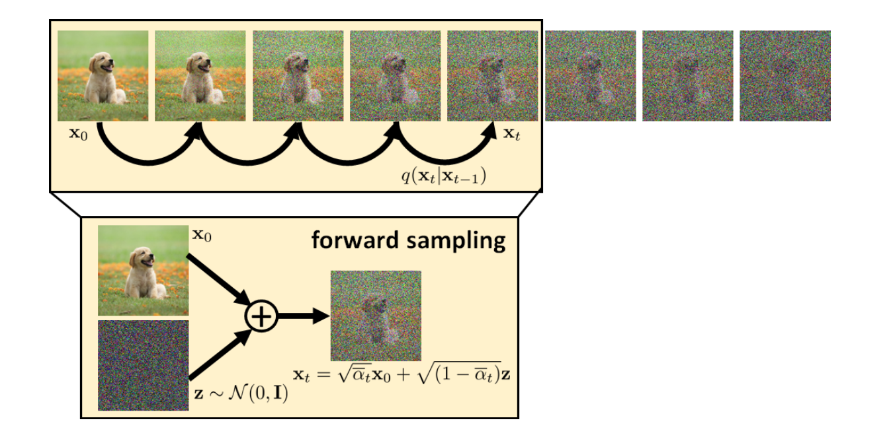
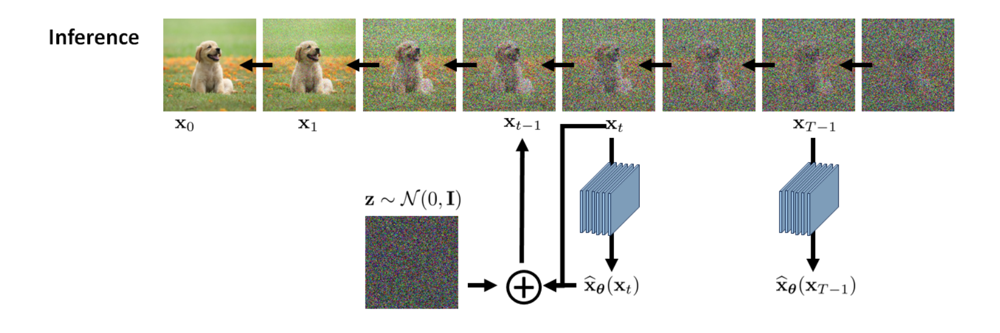
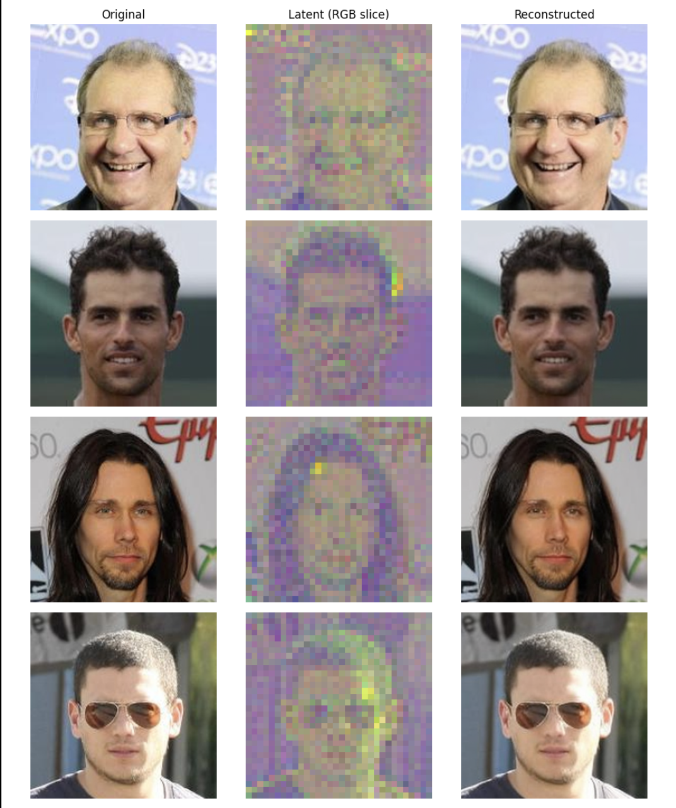
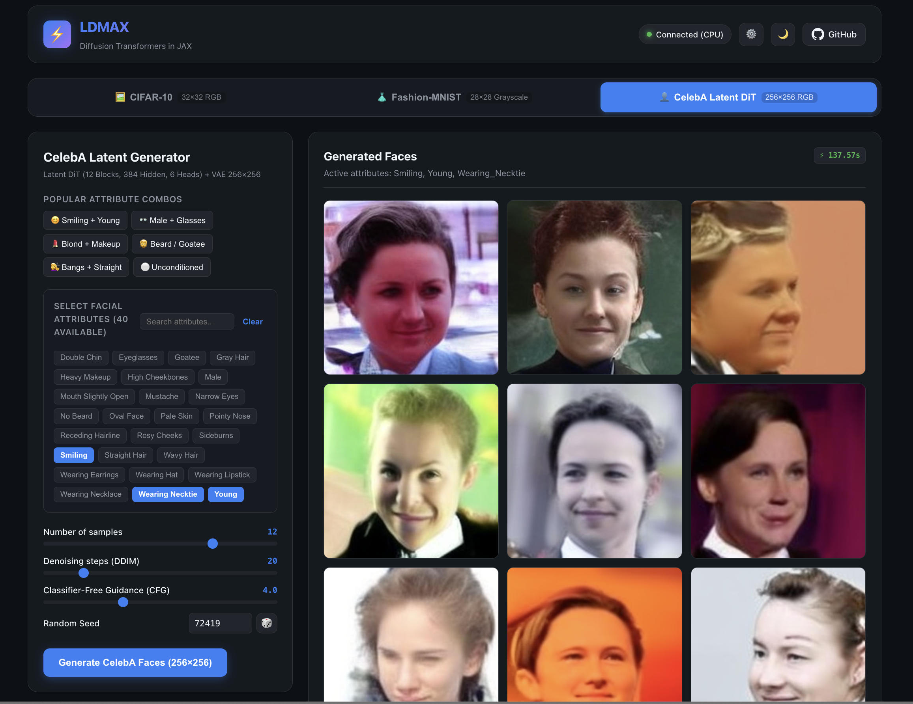

::: {.callout-tip}
**Open-Source Code Repository**:
All implementation code, configuration files, training pipelines, and evaluation scripts demonstrated in this article are available in the **[LDMAX (Latent Diffusion Models in JAX)](https://github.com/ghif/ldmax)** repository:
- 🐙 **GitHub**: [**github.com/ghif/ldmax**](https://github.com/ghif/ldmax)
- ⚡ **Core Stack**: JAX, Flax NNX, Optax, Orbax, Google Grain
- A simple GUI for generating images from the trained models is also provided at [**LDMAX GUI**](https://ghif.github.io/ldmax/).
:::


---

## 1. Introduction: The Visual Generative Revolution

Over the past decade, artificial intelligence has undergone a profound algorithmic evolution in how machines learn to synthesize visual data. What began with blurry $64 \times 64$ faces has rapidly evolved into photorealistic image synthesis, cinematic video generation, and controllable 3D asset creation powering models like **Stable Diffusion 3**, **Midjourney v6**, **Flux**, OpenAI's **Sora**, and Google's **Imagen**.

To understand why modern generative models work so well, we must trace the algorithmic journey from early Variational Autoencoders and Generative Adversarial Networks to modern Diffusion Transformers.

```{mermaid}
%%{init: {'theme': 'base', 'themeVariables': {'background': '#ffffff', 'primaryColor': '#2563eb', 'primaryTextColor': '#ffffff', 'primaryBorderColor': '#1d4ed8', 'lineColor': '#64748b', 'textColor': '#ffffff', 'titleColor': '#ffffff', 'secondaryColor': '#db2777', 'tertiaryColor': '#f59e0b', 'cScale0': '#2563eb', 'cScale1': '#db2777', 'cScale2': '#f59e0b', 'cScale3': '#16a34a', 'cScale4': '#7c3aed', 'cScale5': '#0891b2', 'cScaleLabel0': '#ffffff', 'cScaleLabel1': '#ffffff', 'cScaleLabel2': '#ffffff', 'cScaleLabel3': '#ffffff', 'cScaleLabel4': '#ffffff', 'cScaleLabel5': '#ffffff'}}}%%
timeline
    title The Evolution of Visual Generative AI
    2014 : GANs (Goodfellow et al.) : VAEs (Kingma & Welling)
    2018 : Progressive GAN & BigGAN : Normalizing Flows (Glow)
    2020 : DDPM (Ho et al.) : Pixel-Space Diffusion
    2022 : Latent Diffusion (Rombach et al.) : Stable Diffusion & DALL-E 2
    2023 : Diffusion Transformers - DiT (Peebles & Xie) : ControlNet
    2024 - Present : Stable Diffusion 3 : Flux (Black Forest Labs) : OpenAI Sora
```

---

### 1.1 The Algorithmic Evolution: From VAEs and GANs to Diffusion

Every visual generative approach tries to answer the same fundamental question: **how can a computer imagine and create realistic images that never existed before?** 

Let's explore how the field evolved through five distinct phases, using relatable real-world analogies.

#### Phase 1: Variational Autoencoders (The Cautious Painter)
* **The Metaphor**: Imagine asking an artist to paint a portrait purely from a hazy, compressed memory. 
* **How It Works**: A Variational Autoencoder ([Kingma & Welling, 2013](https://arxiv.org/abs/1312.6114); [Rezende et al., 2014](https://arxiv.org/abs/1401.4082)) compresses an image into a smooth, compact summary (a "latent code") and then tries to reconstruct the original picture from that summary.
* **Why It Struggled**: When the model is unsure of the exact location of a sharp eyelash or a strand of hair, it gets penalized heavily for guessing the wrong spot. To play it safe and minimize its penalty, the painter takes the mathematical average of all possible details. The result is a smooth, recognizable face, but one that looks permanently smudged and blurry.

#### Phase 2: Generative Adversarial Networks (The Art Forger vs. The Detective)
* **The Metaphor**: Imagine a high-stakes duel between an ambitious Art Forger (the Generator) and a sharp-eyed Museum Detective (the Discriminator) ([Goodfellow et al., 2014](https://arxiv.org/abs/1406.2661); [Radford et al., 2015](https://arxiv.org/abs/1511.06434)).
* **How It Works**: The forger starts with random static and tries to produce a fake painting. The detective inspects both real masterpieces and forgeries, trying to spot the fakes. As the detective gives feedback, the forger learns how to paint razor-sharp, realistic textures ([Karras et al., 2019](https://arxiv.org/abs/1812.04948)).
* **The Pitfalls**:
  1. **Mode Collapse**: The forger might discover that the detective has a blind spot for one specific style of cat. Instead of learning to paint horses, landscapes, and people, the forger keeps painting that exact same cat over and over.
  2. **Fragile Dynamics**: If the detective gets too smart too quickly, the forger receives zero useful feedback and completely gives up. If the forger dominates, the detective learns nothing. Keeping both in balance is notoriously unstable.

#### Phase 3: Autoregressive Models (The Pixel-by-Pixel Typewriter)
* **The Metaphor**: Imagine creating a high-resolution mural using a colored typewriter, placing one tiny colored dot at a time from top-left to bottom-right ([van den Oord et al., 2016](https://arxiv.org/abs/1606.05328); [Ramesh et al., 2021](https://arxiv.org/abs/2102.12092)).
* **How It Works**: Each new dot is chosen based on all the dots that came before it, similar to how Large Language Models generate text word-by-word.
* **Why It Struggled**: While the images are sharp and coherent, generating a single image requires hundreds of thousands of sequential steps. You cannot place pixel number 50,000 until you have carefully chosen the first 49,999, creating an excruciating inference bottleneck.

#### Phase 4: The Diffusion Paradigm (The Sandcastle in the Wind)
* **The Metaphor**: Imagine building an intricate sandcastle on the beach. A desert wind gradually blows sand grains around until the castle slowly dissolves into a formless, smooth sand dune (the **Forward Process**).
* **How It Works**: If you record that process and teach a master sculptor how the wind moves sand grains at every step ([Sohl-Dickstein et al., 2015](https://arxiv.org/abs/1503.03585); [Ho et al., 2020](https://arxiv.org/abs/2006.11239)), you can hand that sculptor a random pile of sand (pure Gaussian noise) and have them **reverse the wind's erosion step-by-step** to sculpt a brand-new, breathtaking sandcastle.
* **The Breakthrough**: Because the model only has to predict "how much noise was added right now," training is simple, stable, and covers the entire variety of the data without mode collapse ([Dhariwal & Nichol, 2021](https://arxiv.org/abs/2105.05233)).

#### Phase 5: Latent Diffusion & Transformers (The Architect's Sketchbook)
* **The Metaphor**: Why sculpt every individual microscopic grain of sand (raw pixels) from scratch?
* **How It Works**: A master architect first sketches broad structural blueprints on a pocket sketchbook (the compact **Latent Space** compressed by a VAE) ([Rombach et al., 2022](https://arxiv.org/abs/2112.10752)). A powerful Transformer (DiT) refines this blueprint ([Peebles & Xie, 2023](https://arxiv.org/abs/2212.09748)), and once the layout is perfected, a dedicated high-resolution renderer converts the sketch into a pristine, photorealistic canvas ([Esser et al., 2024](https://arxiv.org/abs/2403.03206)).

---

### 1.2 Comparison of Generative Paradigms: Pros & Cons

| Generative Paradigm | Core Philosophy | Training Stability | Visual Diversity | Texture Sharpness | Generation Speed | Scalability to Text Prompts |
| :--- | :--- | :--- | :--- | :--- | :--- | :--- |
| **VAE** | Compress to smooth latent summary & reconstruct | 🟢 Very Stable | 🟡 Moderate | 🔴 Blurry (Averaging effect) | 🟢 Instant (Single pass) | 🔴 Poor |
| **GAN** | Adversarial game (Art Forger vs. Detective) | 🔴 Very Fragile (Mode collapse) | 🔴 Low (Mode dropping) | 🟢 Razor-sharp textures | 🟢 Instant (Single pass) | 🟡 Moderate |
| **Autoregressive (DALL-E 1)** | Predict pixels dot-by-dot sequentially | 🟢 Stable | 🟢 High | 🟢 Sharp | 🔴 Extremely Slow (Sequential) | 🟢 Good |
| **Pixel Diffusion (DDPM)** | Step-by-step noise removal on raw pixels | 🟢 Extremely Stable | 🟢 Exceptional (Full dataset) | 🟢 High fidelity | 🟡 Moderate (50–1000 steps) | 🟡 High (Heavy compute) |
| **Latent DiT (Modern SOTA)** | Diffusion on compact blueprints with Transformers | 🟢 Extremely Stable | 🟢 Exceptional (Full dataset) | 🟢 State-of-the-Art | 🟢 Fast with DDIM/Flow (20–30 steps) | 🟢 State-of-the-Art (DiT + Text + CFG) |

---

### 1.3 Why Modern Diffusion-Based Models Won the Generative Race

Modern diffusion-based models have become the undisputed foundation of visual generative AI because they resolve the historical trade-offs of generative modeling:

1. **No Adversarial Balancing Act**: Training is a smooth, predictable regression task. The model continuously improves without the wild oscillations or sudden crashes common in GANs.
2. **True Visual Diversity**: The model learns the entire distribution of images, preventing mode collapse and ensuring rare concepts are faithfully represented.
3. **Intuitive Steering via Guidance**: We can easily steer the generated images with text prompts, class tags, or sketches using Classifier-Free Guidance (CFG) ([Ho & Salimans, 2022](https://arxiv.org/abs/2207.12598)).
4. **Unified Transformer Architecture**: By moving from specialized convolutional U-Nets to Diffusion Transformers (DiT), diffusion models inherit the exact same scaling laws, parallelism, and hardware efficiency that power modern LLMs.

In the following sections, we will build this entire modern stack from the ground up using **JAX** and **Flax NNX**.

---

## 2. The Modern Toolkit: JAX and Flax NNX (A PyTorch-Friendly Mental Model)

To build generative models with complete transparency and extreme performance, we use **JAX** ([Bradbury et al., 2018](https://github.com/jax-ml/jax)) and **Flax NNX** ([Heek et al., 2024](https://github.com/google/flax)).

If you come from a **PyTorch** background, you might have heard that JAX is strictly functional, requiring you to manually pass parameter dictionaries (`params`) in and out of every function call (as in classic Flax Linen or Haiku). 

**Flax NNX completely changes the game.**

Flax NNX introduces a reference-based, object-oriented API that feels virtually identical to PyTorch's `torch.nn.Module`, while retaining the full speed of JAX's XLA compiler:

```{mermaid}
%%{init: {'theme': 'base', 'themeVariables': {'background': '#0a0c10', 'primaryColor': '#f97316', 'primaryTextColor': '#ffffff', 'primaryBorderColor': '#fdba74', 'lineColor': '#cbd5e1', 'textColor': '#f9fafb', 'secondaryColor': '#059669', 'tertiaryColor': '#2563eb', 'clusterBkg': '#111827', 'clusterBorder': '#64748b', 'titleColor': '#f9fafb', 'edgeLabelBackground': '#0a0c10'}}}%%
flowchart LR
    classDef pytorch fill:#c2410c,stroke:#fdba74,color:#ffffff,stroke-width:2px;
    classDef nnx fill:#047857,stroke:#6ee7b7,color:#ffffff,stroke-width:2px;
    classDef bridge fill:#1d4ed8,stroke:#93c5fd,color:#ffffff,stroke-width:2px;

    subgraph PyTorchStyle ["PyTorch Mental Model (OOP)"]
        A["class Model(nn.Module)"] --> B["self.fc = nn.Linear(...)"]
        B --> C["y = model(x)"]
        C --> D["loss.backward() + opt.step()"]
    end
    class A,B,C,D pytorch;

    subgraph FlaxNNX ["Flax NNX Mental Model (OOP + JAX Speed)"]
        E["class Model(nnx.Module)"] --> F["self.fc = nnx.Linear(...)"]
        F --> G["y = model(x)"]
        G --> H["@nnx.jit train_step + opt.update()"]
    end
    class E,F,G,H nnx;

    PyTorchStyle -.->|"Familiar OOP Ergonomics"| FlaxNNX
```

### PyTorch vs. Flax NNX: Side-by-Side Comparison

| Concept | PyTorch | Flax NNX |
| :--- | :--- | :--- |
| **Base Class** | `class Net(torch.nn.Module)` | `class Net(flax.nnx.Module)` |
| **Layer Attributes** | `self.fc = torch.nn.Linear(32, 64)` | `self.fc = nnx.Linear(32, 64, rngs=rngs)` |
| **Forward Call** | `def forward(self, x): ...` | `def __call__(self, x): ...` |
| **Parameters** | Stored inside object (`self.fc.weight`) | Stored inside object (`self.fc.kernel`) |
| **Optimizer** | `optimizer = torch.optim.AdamW(model.parameters(), lr=1e-3)` | `optimizer = nnx.Optimizer(model, optax.adamw(1e-3))` |
| **Compilation** | `torch.compile(model)` | `@nnx.jit` (Native XLA graph compilation) |
| **Randomness** | Global seed (`torch.manual_seed`) | Explicit PRNG keys (`nnx.Rngs(seed)`) |

### Complete Code Example: Simple MLP Regression

To see how intuitive Flax NNX is for a PyTorch practitioner, let's build and train a Multi-Layer Perceptron (MLP) for non-linear regression.

```{mermaid}
%%{init: {'theme': 'base', 'themeVariables': {'background': '#0a0c10', 'primaryColor': '#1f2937', 'primaryTextColor': '#f9fafb', 'primaryBorderColor': '#60a5fa', 'lineColor': '#9ca3af', 'textColor': '#f9fafb', 'secondaryColor': '#111827', 'tertiaryColor': '#172033', 'clusterBkg': '#111827', 'clusterBorder': '#64748b', 'titleColor': '#f9fafb', 'edgeLabelBackground': '#0a0c10'}}}%%
flowchart TD
    x_in["Input Data (x ∈ ℝ¹)"] --> layer1["Layer 1: nnx.Linear(1, 32)"]
    layer1 --> act1["Activation: nnx.relu"]
    act1 --> layer2["Layer 2: nnx.Linear(32, 32)"]
    layer2 --> act2["Activation: nnx.relu"]
    act2 --> layer3["Output Layer: nnx.Linear(32, 1)"]
    layer3 --> y_pred["Prediction (ŷ ∈ ℝ¹)"]
```

```python
import jax
import jax.numpy as jnp
from flax import nnx
import optax

# 1. Define the Neural Network (Looks just like a PyTorch nn.Module!)
class SimpleMLP(nnx.Module):
    def __init__(self, in_features: int, hidden_features: int, out_features: int, *, rngs: nnx.Rngs):
        self.layer1 = nnx.Linear(in_features, hidden_features, rngs=rngs)
        self.layer2 = nnx.Linear(hidden_features, hidden_features, rngs=rngs)
        self.out = nnx.Linear(hidden_features, out_features, rngs=rngs)

    def __call__(self, x: jax.Array) -> jax.Array:
        x = nnx.relu(self.layer1(x))
        x = nnx.relu(self.layer2(x))
        return self.out(x)

# 2. Instantiate Model and Optax Optimizer
# We provide an explicit RNG stream for deterministic weight initialization
rngs = nnx.Rngs(params=42)
model = SimpleMLP(in_features=1, hidden_features=32, out_features=1, rngs=rngs)
optimizer = nnx.Optimizer(model, optax.adamw(learning_rate=0.01))

# 3. Define the JIT-Compiled Training Step
# @nnx.jit compiles the forward pass, gradient calculation, and weight update into a single XLA kernel
@nnx.jit
def train_step(model: SimpleMLP, optimizer: nnx.Optimizer, x_batch: jax.Array, y_batch: jax.Array) -> jax.Array:
    def loss_fn(model: SimpleMLP):
        predictions = model(x_batch)
        return jnp.mean((predictions - y_batch) ** 2)

    # Compute loss and gradients simultaneously with autodiff
    loss, grads = nnx.value_and_grad(loss_fn)(model)
    
    # Update model parameters in-place (just like optimizer.step() in PyTorch)
    optimizer.update(model, grads)
    return loss

# 4. Generate Synthetic Data and Run the Training Loop
key = jax.random.key(0)
x_train = jax.random.uniform(key, shape=(256, 1), minval=-2.0, maxval=2.0)
y_train = jnp.sin(x_train) + 0.1 * jax.random.normal(key, shape=(256, 1))

for epoch in range(1, 201):
    loss = train_step(model, optimizer, x_train, y_train)
    if epoch % 50 == 0:
        print(f"Epoch {epoch:3d} | Loss: {loss:.6f}")
```

If you know PyTorch, you already know 90% of Flax NNX! The difference is that `@nnx.jit` gives you seamless XLA acceleration and TPU/GPU optimization out of the box. We will build our full **Diffusion Transformer (DiT)** on top of this exact same pattern.

---

## 3. Diffusion Models: Core Intuition, Mathematical Foundations & Algorithms

Imagine dropping a drop of blue ink into a glass of clear water. Over time, the ink particles disperse randomly until the water turns into a uniform, foggy blue broth. In image terms, we gradually add Gaussian noise over $T$ timesteps until the original image $x_0$ becomes unrecognizable pure noise $x_T \sim \mathcal{N}(0, \mathbf{I})$ ([Sohl-Dickstein et al., 2015](https://arxiv.org/abs/1503.03585)).

What if you could record that diffusion process and play the video in reverse? If you had a neural network smart enough to predict exactly how much noise was added at each instant, you could start with pure random static and gently sculpt it back into a crisp, high-resolution image ([Ho et al., 2020](https://arxiv.org/abs/2006.11239)).

The following short animation illustrates this reverse-diffusion intuition: a structured image gradually emerges from an initially chaotic noise field.

```{=html}
<video controls preload="metadata" width="100%">
  <source src="media/reverse_diffusion_analogy.mp4" type="video/mp4">
  Your browser does not support embedded video.
</video>
```

*Reverse-diffusion analogy generated with Gemini.*

```{mermaid}
%%{init: {'theme': 'base', 'themeVariables': {'background': '#0a0c10', 'primaryColor': '#1f2937', 'primaryTextColor': '#f9fafb', 'primaryBorderColor': '#60a5fa', 'lineColor': '#9ca3af', 'textColor': '#f9fafb', 'secondaryColor': '#111827', 'tertiaryColor': '#172033', 'clusterBkg': '#111827', 'clusterBorder': '#64748b', 'titleColor': '#f9fafb', 'edgeLabelBackground': '#0a0c10'}}}%%
flowchart LR
    A["Clean Data (x₀)"] -->|"Forward Diffusion (Add Noise)"| B["Slight Noise (x₁)"]
    B -->|"Forward Diffusion"| C["Heavy Noise (xₜ)"]
    C -->|"Forward Diffusion"| D["Pure Noise (x_T)"]
    D -->|"Reverse Denoising (p_θ)"| C
    C -->|"Reverse Denoising (p_θ)"| B
    B -->|"Reverse Denoising (p_θ)"| A
```

Behind this physical intuition lies an elegant probabilistic framework. Let's examine the mathematical logic and algorithms step-by-step.

---

### 3.1 The Forward (Noising) Process & Closed-Form Shortcut

The forward diffusion process is a non-learnable Markov chain that gradually adds Gaussian noise to an initial data point $x_0 \sim q(x_0)$ over $T$ discrete timesteps according to a pre-defined variance schedule $\beta_1, \beta_2, \dots, \beta_T \in (0, 1)$:

$$q(x_t \mid x_{t-1}) = \mathcal{N}\left(x_t; \, \sqrt{1 - \beta_t} \, x_{t-1}, \, \beta_t \mathbf{I}\right)$$

Using $\alpha_t = 1 - \beta_t$, each single-step noise addition is $x_t = \sqrt{\alpha_t} \, x_{t-1} + \sqrt{1 - \alpha_t} \, \epsilon_{t-1}$ with $\epsilon_{t-1} \sim \mathcal{N}(0, \mathbf{I})$.

#### Deriving the Closed-Form Shortcut ($q(x_t \mid x_0)$)
Rather than simulating $t$ sequential additions, we can jump directly from $x_0$ to any timestep $x_t$. Unrolling the recurrence for the first two steps:

$$\begin{aligned}
x_1 &= \sqrt{\alpha_1} x_0 + \sqrt{1 - \alpha_1} \epsilon_0 \\
x_2 &= \sqrt{\alpha_2} x_1 + \sqrt{1 - \alpha_2} \epsilon_1 \\
    &= \sqrt{\alpha_1 \alpha_2} \, x_0 + \underbrace{\sqrt{\alpha_2(1 - \alpha_1)} \epsilon_0 + \sqrt{1 - \alpha_2} \epsilon_1}_{\text{Combined variance: } \alpha_2(1 - \alpha_1) + (1 - \alpha_2) = 1 - \alpha_1 \alpha_2}
\end{aligned}$$

Because the sum of two independent Gaussians is Gaussian, defining the cumulative product **$\bar{\alpha}_t = \prod_{s=1}^t \alpha_s$** yields the closed-form shortcut:

$$q(x_t \mid x_0) = \mathcal{N}\left(x_t; \, \sqrt{1 - \bar{\alpha}_t} \, \epsilon + \sqrt{\bar{\alpha}_t} \, x_0, \, (1 - \bar{\alpha}_t)\mathbf{I}\right) \implies \mathbf{x_t = \sqrt{\bar{\alpha}_t} \, x_0 + \sqrt{1 - \bar{\alpha}_t} \, \epsilon}$$

{fig-alt="Forward process" fig-cap="Forward process."}

---

### 3.2 The Reverse (Denoising) Process & Sampling Algorithms

To generate brand-new images, we start with pure Gaussian noise $x_T \sim \mathcal{N}(0, \mathbf{I})$ and sample backwards through the reverse transition $q(x_{t-1} \mid x_t)$.

While $q(x_{t-1} \mid x_t)$ alone is intractable, conditioning on $x_0$ makes the posterior tractable via **Bayes' Rule**:

$$q(x_{t-1} \mid x_t, x_0) = q(x_t \mid x_{t-1}, x_0) \frac{q(x_{t-1} \mid x_0)}{q(x_t \mid x_0)} = \mathcal{N}\left(x_{t-1}; \, \tilde{\mu}_t(x_t, x_0), \, \tilde{\beta}_t \mathbf{I}\right)$$

Where the posterior mean is:

$$\tilde{\mu}_t(x_t, x_0) = \frac{\sqrt{\bar{\alpha}_{t-1}}\beta_t}{1 - \bar{\alpha}_t} x_0 + \frac{\sqrt{\alpha_t}(1 - \bar{\alpha}_{t-1})}{1 - \bar{\alpha}_t} x_t$$

Substituting $x_0 = \frac{x_t - \sqrt{1 - \bar{\alpha}_t} \epsilon}{\sqrt{\bar{\alpha}_t}}$ allows the model to compute the denoising mean directly from its noise prediction $\epsilon_\theta$:

$$\tilde{\mu}_t(x_t, \epsilon) = \frac{1}{\sqrt{\alpha_t}} \left( x_t - \frac{\beta_t}{\sqrt{1 - \bar{\alpha}_t}} \epsilon_\theta(x_t, t, y) \right)$$

This confirms that **learning to predict the added noise $\epsilon$ is mathematically sufficient to compute the exact reverse denoising mean $\tilde{\mu}_t$**.

#### Reverse Sampling Algorithms

$$\begin{array}{l}
\hline
\textbf{Algorithm 1: Stochastic Sampling (DDPM Reverse Process)} \\
\hline
\textbf{Input:} \text{ Trained noise model } \epsilon_\theta, \text{ conditioning } y, \text{ schedule parameters } \{\beta_t, \alpha_t, \bar{\alpha}_t, \sigma_t\}_{t=1}^T \\
\textbf{Output:} \text{ Generated clean sample } x_0 \\
\hline
\mathbf{1:} \quad x_T \sim \mathcal{N}(0, \mathbf{I}) \quad &\text{\color{gray}// Initialize with pure standard Gaussian noise} \\
\mathbf{2:} \quad \textbf{for } t = T \textbf{ down to } 1 \textbf{ do} \\
\mathbf{3:} \quad\quad \hat{\epsilon} = \epsilon_\theta(x_t, t, y) \quad &\text{\color{gray}// Model predicts noise component} \\
\mathbf{4:} \quad\quad \tilde{\mu}_t = \frac{1}{\sqrt{\alpha_t}} \left( x_t - \frac{\beta_t}{\sqrt{1 - \bar{\alpha}_t}} \hat{\epsilon} \right) \quad &\text{\color{gray}// Calculate posterior mean} \\
\mathbf{5:} \quad\quad \textbf{if } t > 1 \textbf{ then } z \sim \mathcal{N}(0, \mathbf{I}) \textbf{ else } z = 0 \\
\mathbf{6:} \quad\quad x_{t-1} = \tilde{\mu}_t + \sigma_t \, z \quad &\text{\color{gray}// Step back to previous timestep} \\
\mathbf{7:} \quad \textbf{end for} \\
\mathbf{8:} \quad \textbf{return } x_0 \\
\hline
\end{array}$$

$$\begin{array}{l}
\hline
\textbf{Algorithm 2: Fast Deterministic Sampling (DDIM with Classifier-Free Guidance)} \\
\hline
\textbf{Input:} \text{ Model } \epsilon_\theta, \text{ condition } y, \text{ null condition } \varnothing, \text{ scale } w \ge 1.0, \text{ sub-sequence } \{\tau_S, \tau_{S-1}, \dots, \tau_1\} \\
\textbf{Output:} \text{ Generated clean sample } x_0 \\
\hline
\mathbf{1:} \quad x_{\tau_S} \sim \mathcal{N}(0, \mathbf{I}) \quad &\text{\color{gray}// Start from standard Gaussian noise} \\
\mathbf{2:} \quad \textbf{for } i = S \textbf{ down to } 1 \textbf{ do} \\
\mathbf{3:} \quad\quad t = \tau_i, \quad t_{\text{prev}} = \tau_{i-1} \quad (\text{where } \tau_0 = 0, \, \bar{\alpha}_0 = 1.0) \\
\mathbf{4:} \quad\quad \hat{\epsilon}_{\text{cond}} = \epsilon_\theta(x_t, t, y), \quad \hat{\epsilon}_{\text{uncond}} = \epsilon_\theta(x_t, t, \varnothing) \\
\mathbf{5:} \quad\quad \hat{\epsilon} = \hat{\epsilon}_{\text{uncond}} + w \cdot \left( \hat{\epsilon}_{\text{cond}} - \hat{\epsilon}_{\text{uncond}} \right) \quad &\text{\color{gray}// Extrapolate via CFG} \\
\mathbf{6:} \quad\quad \hat{x}_0 = \frac{x_t - \sqrt{1 - \bar{\alpha}_t} \, \hat{\epsilon}}{\sqrt{\bar{\alpha}_t}} \quad &\text{\color{gray}// Predict clean data sample} \\
\mathbf{7:} \quad\quad \mathbf{d}_{x_t} = \sqrt{1 - \bar{\alpha}_{t_{\text{prev}}}} \, \hat{\epsilon} \quad &\text{\color{gray}// Direction pointing to } x_t \\
\mathbf{8:} \quad\quad x_{t_{\text{prev}}} = \sqrt{\bar{\alpha}_{t_{\text{prev}}}} \, \hat{x}_0 + \mathbf{d}_{x_t} \quad &\text{\color{gray}// Deterministic DDIM transition} \\
\mathbf{9:} \quad \textbf{end for} \\
\mathbf{10:} \quad \textbf{return } x_0 \\
\hline
\end{array}$$

{fig-alt="Reverse process" fig-cap="Reverse process."}

---

### 3.3 The Training Objective & Algorithm

Now that the physical forward and reverse mechanisms are clear, how do we actually train the neural network $\epsilon_\theta$?

Instead of simulating the full forward chain, we exploit the closed-form shortcut $x_t = \sqrt{\bar{\alpha}_t} x_0 + \sqrt{1 - \bar{\alpha}_t}\epsilon$. For every batch:
1. We sample random timesteps $t \sim \mathcal{U}(1, T)$ and standard Gaussian noise $\epsilon \sim \mathcal{N}(0, \mathbf{I})$.
2. We construct the noisy batch $x_t$ in a single $\mathcal{O}(1)$ operation.
3. We feed $(x_t, t, y)$ into our neural network $\epsilon_\theta$ and minimize the simplified Mean Squared Error (MSE) loss:

$$\mathcal{L}_{\text{simple}}(\theta) = \mathbb{E}_{t \sim \mathcal{U}(1, T), \, x_0 \sim q(x_0), \, \epsilon \sim \mathcal{N}(0, \mathbf{I})} \left[ \| \epsilon - \epsilon_\theta(x_t, t, y) \|^2 \right]$$

$$\begin{array}{l}
\hline
\textbf{Algorithm 3: Training a Diffusion Model (DDPM Objective)} \\
\hline
\textbf{Input:} \text{ Clean data distribution } q(x_0), \text{ conditioning } y, \text{ schedule } \{\bar{\alpha}_1, \dots, \bar{\alpha}_T\}, \text{ neural network } \epsilon_\theta, \text{ learning rate } \eta \\
\hline
\mathbf{1:} \quad \textbf{repeat} \\
\mathbf{2:} \quad\quad x_0 \sim q(x_0), \quad y \sim q(y \mid x_0) \quad &\text{\color{gray}// Sample clean training batch and labels} \\
\mathbf{3:} \quad\quad t \sim \text{Uniform}(\{1, 2, \dots, T\}) \quad &\text{\color{gray}// Sample random discrete timesteps} \\
\mathbf{4:} \quad\quad \epsilon \sim \mathcal{N}(0, \mathbf{I}) \quad &\text{\color{gray}// Sample standard Gaussian target noise} \\
\mathbf{5:} \quad\quad x_t = \sqrt{\bar{\alpha}_t} \, x_0 + \sqrt{1 - \bar{\alpha}_t} \, \epsilon \quad &\text{\color{gray}// Closed-form forward shortcut} \\
\mathbf{6:} \quad\quad \hat{\epsilon} = \epsilon_\theta(x_t, t, y) \quad &\text{\color{gray}// Model predicts noise added at timestep } t \\
\mathbf{7:} \quad\quad \theta \leftarrow \theta - \eta \, \nabla_\theta \|\epsilon - \hat{\epsilon}\|^2 \quad &\text{\color{gray}// Take gradient descent step on MSE loss} \\
\mathbf{8:} \quad \textbf{until converged} \\
\hline
\end{array}$$

---

## 4. The Modern Backbone: Diffusion Transformers (DiT)

For years, the convolutional **U-Net** was the undisputed backbone of diffusion models—from the original DDPM ([Ho et al., 2020](https://arxiv.org/abs/2006.11239)) to Stable Diffusion 1.5 and SDXL ([Rombach et al., 2022](https://arxiv.org/abs/2112.10752)). 

However, modern state-of-the-art visual generative architectures (such as DiT by [Peebles & Xie, 2023](https://arxiv.org/abs/2212.09748), Stable Diffusion 3 by [Esser et al., 2024](https://arxiv.org/abs/2403.03206), FLUX by Black Forest Labs, and OpenAI Sora) have systematically replaced U-Nets with **Diffusion Transformers (DiT)**.

The architectural contrast is easiest to see visually: U-Net repeatedly contracts and expands a spatial feature map with long skip connections, while DiT patchifies a latent representation into a sequence and processes it through a uniform stack of transformer blocks.

.](media/unet-architecture.png){fig-alt="U-Net architecture with a contracting encoder path, bottleneck, expanding decoder path, and skip connections" fig-cap="Convolutional U-Net: hierarchical spatial processing with skip connections."}

.](media/dit-architecture.png){fig-alt="Diffusion Transformer architecture showing latent patchification, repeated DiT blocks, and conditioning" fig-cap="DiT: a flat sequence of latent patches processed by transformer blocks."}

---

### 4.1 Moving Beyond the U-Net: Limitations of the Legacy Backbone

The classical U-Net architecture was originally developed for biomedical image segmentation ([Ronneberger et al., 2015](https://arxiv.org/abs/1505.04597)) and adapted for generative modeling:

* **How U-Net Works**: It processes images through a contracting encoder path (repeated $3\times 3$ convolutions and spatial downsamplings), a bottleneck, and an expanding decoder path with long skip connections and cross-attention blocks.
* **Why U-Net Stumbled**:
  1. **Non-Uniform Inductive Biases**: Convolutions enforce strict local translation invariance. While great for local edges, they cannot easily establish global semantic relationships between distant parts of an image without dozens of downsampling layers.
  2. **Asymmetric Compute Allocation**: High-resolution outer layers in U-Nets consume massive amounts of GPU memory and FLOPs processing spatial pixel coordinates, while the actual semantic reasoning is confined to the bottleneck layers.
  3. **Brittle Scaling Laws**: Scaling a U-Net involves balancing channel multipliers, attention resolutions, and skip connections heuristics. Doubling U-Net parameters does not consistently yield proportional sample improvements.
  4. **Hardware Inefficiencies**: Spatial convolutions with varied tensor dimensions map poorly to modern tensor cores (TPUs/GPUs) compared to standard dense matrix multiplications (GEMMs).

---

### 4.2 What DiT Contributes & Offers Compared to U-Net

[Peebles & Xie (2023)](https://arxiv.org/abs/2212.09748) demonstrated that diffusion models do not need convolutional inductive biases. By adopting a pure Vision Transformer ([Dosovitskiy et al., 2020](https://arxiv.org/abs/2010.11929)) backbone, DiT inherits the revolutionary paradigm of treating visual representations as sequences of patch tokens processed by standard Transformer encoders.

.](media/vit-architecture.png){fig-alt="Vision Transformer architecture diagram showing patch extraction, linear projection, position embeddings, and transformer encoder blocks" fig-cap="Vision Transformer (ViT): the architectural foundation that replaced convolutions with patch tokenization and standard Transformer encoders." width="90%"}

Building directly on this ViT foundation, DiT introduces four transformative benefits:

1. **Empirical Scaling Laws for Generation**: DiT is the first generative vision architecture to follow strict, predictable power-law scaling (analogous to LLMs). As model size ($S, B, L, XL$) and compute (GFLOPs) increase, Frechet Inception Distance (FID) drops monotonically.
2. **Isotropic, Clean Architecture**: Instead of asymmetrical contracting and expanding pathways, DiT consists of a single homogeneous stack of identical transformer blocks operating on sequences of flattened patch tokens.
3. **Adaptive Layer Normalization (adaLN-Zero)**: Rather than using compute-heavy cross-attention for class conditioning or timestep embeddings, DiT modulates every single layer's scale, shift, and dimension gating dynamically via zero-initialized linear projections.
4. **Global Attention from Layer 1**: Every patch token can attend to every other patch across the entire image at every layer, enabling coherent global composition from the very first step.

#### U-Net vs. Diffusion Transformer (DiT) Comparison

| Feature | Convolutional U-Net | Diffusion Transformer (DiT) |
| :--- | :--- | :--- |
| **Core Primitive** | $3 \times 3$ Convolutions + Skip Connections | Multi-Head Self-Attention + MLP |
| **Architecture Shape** | Asymmetrical contracting/expanding "U" shape | Isotropic, flat sequence of $N$ identical blocks |
| **Receptive Field** | Grows gradually through downsampling | Global across all tokens from Layer 1 |
| **Conditioning Mechanism** | Cross-attention + addition in ResNet blocks | Dynamic scale, shift & gate via **adaLN-Zero** |
| **Compute Scaling** | Plateaus with empirical heuristics | Strict Power-Law scaling (More compute = Better quality) |
| **Hardware Mapping** | Fragmented memory access patterns | Optimized GEMM matrix operations (FlashAttention, TPUs) |

---

### 4.3 How DiT Works: Token Flow and adaLN-Zero

```{mermaid}
%%{init: {'theme': 'base', 'themeVariables': {'background': '#0a0c10', 'primaryColor': '#1f2937', 'primaryTextColor': '#f9fafb', 'primaryBorderColor': '#60a5fa', 'lineColor': '#9ca3af', 'textColor': '#f9fafb', 'secondaryColor': '#111827', 'tertiaryColor': '#172033', 'clusterBkg': '#111827', 'clusterBorder': '#64748b', 'titleColor': '#f9fafb', 'edgeLabelBackground': '#0a0c10'}}}%%
flowchart TD
    x_in["Input Image / Latents (H × W × C)"] --> patch["Patchify & Linear Projection<br/>(p × p Patches → Tokens)"]
    patch --> pos["Add 2D Sinusoidal Positional Embeddings"]
    
    pos --> block1["DiT Block 1 (Self-Attention + adaLN-Zero)"]
    block1 --> blockN["DiT Block N (Stack of Identical Blocks)"]
    
    cond["Conditioning (t_emb + y_emb)"] -->|"adaLN Modulation (Scale, Shift, Gate)"| block1 & blockN
    
    blockN --> final["Final Layer (adaLN-Zero + Linear Projection)"]
    final --> unpatch["Unpatchify → Output Noise Prediction (ε_θ)"]
```

1. **Patchification**: The 2D spatial input of shape $(H, W, C)$ is divided into a grid of non-overlapping patches of size $p \times p$ and linearly projected into a sequence of $T = (H/p) \times (W/p)$ tokens with embedding dimension $d$.
2. **2D Sinusoidal Positional Embeddings**: Pre-computed sinusoidal coordinates are added to each token to preserve spatial 2D geometry.
3. **The adaLN-Zero Modulation Block**: Conditioning $c = \text{Embed}(t) + \text{Embed}(y)$ is passed through a SiLU activation and a linear layer initialized to **zero** to produce 6 modulation factors: $\gamma_1, \beta_1, \alpha_1$ (for Self-Attention) and $\gamma_2, \beta_2, \alpha_2$ (for the MLP).

$$\text{modulate}(x, \beta, \gamma) = x \odot (1 + \gamma) + \beta$$

```{mermaid}
%%{init: {'theme': 'base', 'themeVariables': {'background': '#0a0c10', 'primaryColor': '#1f2937', 'primaryTextColor': '#f9fafb', 'primaryBorderColor': '#60a5fa', 'lineColor': '#9ca3af', 'textColor': '#f9fafb', 'secondaryColor': '#111827', 'tertiaryColor': '#172033', 'clusterBkg': '#111827', 'clusterBorder': '#64748b', 'titleColor': '#f9fafb', 'edgeLabelBackground': '#0a0c10'}}}%%
flowchart TD
    x_in["Token Input (x)"] --> norm1["LayerNorm"]
    c["Conditioning (c = t_emb + y_emb)"] --> adaln["adaLN Modulation<br/>(SiLU + Linear)"]
    
    adaln -->|"Scale γ₁, Shift β₁"| mod1["Modulate"]
    norm1 --> mod1
    mod1 --> mha["Multi-Head Self-Attention"]
    
    mha --> gate1["Gate (α₁)"]
    adaln -->|"Gate α₁"| gate1
    
    x_in --> add1["(+)"]
    gate1 --> add1
    
    add1 --> norm2["LayerNorm"]
    norm2 --> mod2["Modulate"]
    adaln -->|"Scale γ₂, Shift β₂"| mod2
    mod2 --> mlp["Feed-Forward MLP (GELU)"]
    
    mlp --> gate2["Gate (α₂)"]
    adaln -->|"Gate α₂"| gate2
    
    add1 --> add2["(+)"]
    gate2 --> add2
    
    add2 --> x_out["Token Output (x)"]
```

::: {.callout-tip}
**The Zero-Initialization Trick (adaLN-Zero)**: Because the modulation layer weights and biases are initialized to zero, $\gamma = 0$, $\beta = 0$, and the gating factor $\alpha = 0$ at initialization. Each transformer block acts as an exact **identity function** ($x_{\text{out}} = x_{\text{in}}$) at step 0, completely preventing vanishing or exploding gradients when training deep transformer backbones.
:::


---

## 5. Scaling to High Resolutions: Latent Diffusion Models (LDMs)

With the DiT architecture in place, how do we scale diffusion models to large images ($512 \times 512$ or $1024 \times 1024$) without running out of memory?

Training diffusion models directly in native pixel space works for small images ($28 \times 28$ Fashion-MNIST or $32 \times 32$ CIFAR-10), but pixel space suffers from high-frequency redundancy (e.g., thousands of individual pixels in a uniform background carry almost zero semantic information).

.](media/latent-diffusion-encoder-decoder.png){fig-alt="Diagram showing an encoder mapping an image into latent space, a diffusion process operating on the latent representation, and a decoder reconstructing an image" fig-cap="Latent diffusion separates perceptual compression from diffusion-based generation. Source: Rombach et al. (2022), Figure 1." width="100%"}

```{mermaid}
%%{init: {'theme': 'base', 'themeVariables': {'background': '#0a0c10', 'primaryColor': '#7c3aed', 'primaryTextColor': '#ffffff', 'primaryBorderColor': '#a78bfa', 'lineColor': '#cbd5e1', 'textColor': '#f9fafb', 'secondaryColor': '#0f766e', 'tertiaryColor': '#c2410c', 'clusterBkg': '#111827', 'clusterBorder': '#64748b', 'titleColor': '#f9fafb', 'edgeLabelBackground': '#0a0c10'}}}%%
flowchart TD
    classDef image fill:#2563eb,stroke:#93c5fd,color:#ffffff,stroke-width:2px;
    classDef encoder fill:#059669,stroke:#6ee7b7,color:#ffffff,stroke-width:2px;
    classDef latent fill:#d97706,stroke:#fcd34d,color:#ffffff,stroke-width:2px;
    classDef diffusion fill:#7c3aed,stroke:#c4b5fd,color:#ffffff,stroke-width:2px;
    classDef decoder fill:#db2777,stroke:#f9a8d4,color:#ffffff,stroke-width:2px;
    classDef output fill:#0891b2,stroke:#67e8f9,color:#ffffff,stroke-width:2px;

    subgraph Compression ["Stage 1: Perceptual Compression (Pixel ↔ Latent)"]
        img_in["High-Res Image (x₀)<br/>(512 × 512 × 3)"]
        vae_enc["VAE Encoder (Frozen)"]
        z0["Latent Representation (z₀)<br/>(64 × 64 × 4)<br/><b>[64× Spatial Data Compression]</b>"]
        
        img_in --> vae_enc --> z0
    end
    class img_in image;
    class vae_enc encoder;
    class z0 latent;

    subgraph Diffusion ["Stage 2: Semantic Latent Diffusion"]
        zt["Noisy Latent (zₜ)<br/>(64 × 64 × 4)"]
        dit["Diffusion Transformer (DiT)<br/>Noise Predictor (ε_θ)"]
        z_denoised["Denoised Latent (ẑ₀)<br/>(64 × 64 × 4)"]
        
        z0 -.->|"Forward Noise"| zt
        zt --> dit --> z_denoised
    end
    class zt latent;
    class dit diffusion;
    class z_denoised diffusion;

    subgraph Reconstruction ["Stage 3: Image Reconstruction"]
        vae_dec["VAE Decoder (Frozen)"]
        img_out["Generated Image (x̂₀)<br/>(512 × 512 × 3)"]
        
        z_denoised --> vae_dec --> img_out
    end
    class vae_dec decoder;
    class img_out output;
```

**Latent Diffusion** ([Rombach et al., 2022](https://arxiv.org/abs/2112.10752)) decouples generative modeling into two distinct, specialized phases:

1. **Perceptual Compression (VAE)**: A pre-trained Autoencoder compresses an image into a compact latent representation $z_0$ (e.g. downsampling by a factor of 8 from $512 \times 512 \times 3 \to 64 \times 64 \times 4$).

2. **Semantic Modeling (Diffusion Transformer)**: The DiT operates exclusively inside this compressed, perceptually rich latent manifold.

{fig-alt="Original images, latent representations, and VAE reconstructed images" fig-cap="Visualizing perceptual compression: original pixel space vs. compact latent space and reconstructed outputs." width="85%"}

In `src/utils/vae.py`, we use Hugging Face's `FlaxAutoencoderKL` with a standard scaling factor ($0.18215$) to normalize latents to unit variance:

```python
# From src/utils/vae.py
class VAEManager:
    """Manages the pre-trained VAE for latent diffusion."""
    def __init__(self, model_id: str = "enterprise-explorers/sd-vae-ft-mse-flax", dtype: jnp.dtype = jnp.float32):
        self.model, self.params = FlaxAutoencoderKL.from_pretrained(model_id, dtype=dtype)
        self.scaling_factor = 0.18215

    def encode(self, images: jax.Array, key: jax.Array) -> jax.Array:
        # Convert NHWC -> NCHW for the VAE encoder
        if images.shape[-1] == 3:
            images = jnp.transpose(images, (0, 3, 1, 2))
        latent_dist = self.model.apply({"params": self.params}, images, method=self.model.encode).latent_dist
        latents = latent_dist.sample(key=key)
        # Convert back to NCHW -> NHWC and scale to unit variance
        latents = jnp.transpose(latents, (0, 2, 3, 1))
        return latents * self.scaling_factor

    def decode(self, latents: jax.Array) -> jax.Array:
        latents = latents / self.scaling_factor
        latents = jnp.transpose(latents, (0, 3, 1, 2))
        images = self.model.apply({"params": self.params}, latents, method=self.model.decode).sample
        return jnp.transpose(images, (0, 2, 3, 1))
```

This cuts training compute requirements by **$60\times$ to $100\times$**, allowing high-quality synthesis on standard hardware.

---

## 6. Step-by-Step Implementation in JAX & Flax NNX

Let's look at the actual code implementation from `ldmax`.

### Step 1: Modulation & The adaLN-Zero DiT Block

In `src/models/dit/blocks.py`, we implement the adaptive modulation and the transformer block. The output projection of the modulation network is initialized with zeros (`jax.nn.initializers.zeros`), ensuring that the transformer initially acts as an identity function:

```python
# From src/models/dit/blocks.py
def modulate(x: jax.Array, shift: jax.Array, scale: jax.Array) -> jax.Array:
    """Modulate the input using scale and shift parameters."""
    return x * (1 + scale.reshape(scale.shape[0], 1, scale.shape[1])) + shift.reshape(shift.shape[0], 1, shift.shape[1])

class DiTBlock(nnx.Module):
    """A single Diffusion Transformer block with AdaLN-Zero."""
    def __init__(
        self,
        hidden_size: int,
        num_heads: int,
        mlp_ratio: float = 4.0,
        compute_dtype: Optional[jnp.dtype] = None,
        rngs: Optional[nnx.Rngs] = None,
    ):
        self.norm1 = nnx.LayerNorm(num_features=hidden_size, dtype=jnp.float32, param_dtype=jnp.float32, rngs=rngs)
        self.attn = nnx.MultiHeadAttention(
            num_heads=num_heads,
            in_features=hidden_size,
            qkv_features=hidden_size,
            out_features=hidden_size,
            dtype=compute_dtype,
            param_dtype=jnp.float32,
            rngs=rngs,
        )
        self.norm2 = nnx.LayerNorm(num_features=hidden_size, dtype=jnp.float32, param_dtype=jnp.float32, rngs=rngs)
        
        mlp_hidden_size = int(hidden_size * mlp_ratio)
        self.mlp = nnx.Sequential(
            nnx.Linear(hidden_size, mlp_hidden_size, dtype=compute_dtype, param_dtype=jnp.float32, rngs=rngs),
            nnx.gelu,
            nnx.Linear(mlp_hidden_size, hidden_size, dtype=compute_dtype, param_dtype=jnp.float32, rngs=rngs),
        )
        
        # AdaLN modulation: 6 parameters (scale/shift/gate for attention and MLP)
        self.adaLN_modulation = nnx.Sequential(
            nnx.silu,
            nnx.Linear(
                hidden_size, 6 * hidden_size,
                dtype=compute_dtype,
                param_dtype=jnp.float32,
                kernel_init=jax.nn.initializers.zeros,
                bias_init=jax.nn.initializers.zeros,
                rngs=rngs,
            )
        )

    def __call__(self, x: jax.Array, c: jax.Array) -> jax.Array:
        # Split conditioning vector into 6 modulation factors
        modulation = self.adaLN_modulation(c)
        shift1, scale1, gate1, shift2, scale2, gate2 = jnp.split(modulation, 6, axis=1)
        
        # Self-Attention path
        h = modulate(self.norm1(x), shift1, scale1)
        h = self.attn(h, decode=False)
        x = x + gate1.reshape(gate1.shape[0], 1, gate1.shape[1]) * h
        
        # MLP path
        h = modulate(self.norm2(x), shift2, scale2)
        h = self.mlp(h)
        x = x + gate2.reshape(gate2.shape[0], 1, gate2.shape[1]) * h
        
        return x
```

### Step 2: Patchify, Positional Embedding, and Forward Pass

In `src/models/dit/dit.py`, the `DiT` model converts spatial grids into sequences of patches, applies 2D sinusoidal embeddings, passes through the stack of `DiTBlock` layers, and projects back with `unpatchify`:

```python
# From src/models/dit/dit.py
class DiT(nnx.Module):
    """Diffusion Transformer."""
    def __init__(
        self,
        input_size: int = 32,
        patch_size: int = 2,
        in_channels: int = 4,
        hidden_size: int = 128,
        depth: int = 4,
        num_heads: int = 4,
        num_classes: int = 10,
        label_mode: str = "class",
        ...
    ):
        self.patch_size = patch_size
        self.x_embedder = nnx.Linear(patch_size * patch_size * in_channels, hidden_size, ...)
        self.t_embedder = TimestepEmbedder(hidden_size, ...)
        self.y_embedder = LabelEmbedder(num_classes, hidden_size, label_mode=label_mode, ...)
        
        # Fixed 2D sin-cos positional embeddings
        grid_size = input_size // patch_size
        pos_embed = get_2d_sincos_pos_embed(hidden_size, grid_size)
        self.pos_embed = nnx.Param(pos_embed)
        
        self.blocks = nnx.List([DiTBlock(hidden_size, num_heads, ...) for _ in range(depth)])
        self.final_layer = FinalLayer(hidden_size, patch_size, in_channels, ...)
 
    def patchify(self, x: jax.Array) -> jax.Array:
        p = self.patch_size
        n, h, w, c = x.shape
        x = x.reshape(n, h // p, p, w // p, p, c).transpose(0, 1, 3, 2, 4, 5)
        return x.reshape(n, (h // p) * (w // p), p * p * c)

    def __call__(self, x: jax.Array, t: jax.Array, y: jax.Array, rngs: Optional[nnx.Rngs] = None) -> jax.Array:
        x = self.patchify(x)
        x = self.x_embedder(x) + self.pos_embed
        
        # Combine timestep and class embeddings into conditioning vector c
        t_emb = self.t_embedder(t)
        y_emb = self.y_embedder(y, train=rngs is not None, rngs=rngs)
        c = t_emb + y_emb
        
        for block in self.blocks:
            x = block(x, c)
            
        x = self.final_layer(x, c)
        return self.unpatchify(x)
```

### Step 3: Pure JIT-Compiled Training Step with Flax NNX

In `src/training/step.py`, we implement the training loss and gradient update wrapped in `@nnx.jit`:

```python
# From src/training/step.py
def compute_loss(model: Any, latents: jax.Array, labels: jax.Array, key: jax.Array, train: bool = True) -> jax.Array:
    noise_key, time_key, model_key = jax.random.split(key, 3)
    noise = jax.random.normal(noise_key, latents.shape, dtype=jnp.float32)
    t = jax.random.randint(time_key, (latents.shape[0],), 0, NUM_TRAIN_TIMESTEPS)

    # Forward diffusion shortcut: x_t = sqrt(alpha_bar)*x_0 + sqrt(1-alpha_bar)*noise
    sqrt_alphas_cumprod = jnp.sqrt(ALPHAS_CUMPROD[t])[:, None, None, None]
    sqrt_one_minus_alphas = jnp.sqrt(1.0 - ALPHAS_CUMPROD[t])[:, None, None, None]
    noisy_latents = sqrt_alphas_cumprod * latents + sqrt_one_minus_alphas * noise

    # Predict noise with DiT
    pred_noise = model(noisy_latents, t, labels, rngs=nnx.Rngs(model_key) if train else None)
    return jnp.mean((pred_noise - noise) ** 2)

@nnx.jit
def train_step(model: Any, optimizer: nnx.Optimizer, latents: jax.Array, labels: jax.Array, rng_key: jax.Array) -> Dict[str, jax.Array]:
    def loss_fn(model):
        return compute_loss(model, latents, labels, rng_key)

    loss, grads = nnx.value_and_grad(loss_fn)(model)
    optimizer.update(model, grads)
    return {"loss": loss}
```

---

## 7. Deterministic Fast Sampling with DDIM & CFG

Generating images using 1,000 steps with standard DDPM is slow. In `src/training/sampler.py`, we implement the **Denoising Diffusion Implicit Models (DDIM)** sampler ([Song et al., 2020](https://arxiv.org/abs/2010.02502)), allowing high-quality generation in just 25–50 steps.

With **Classifier-Free Guidance (CFG)** ([Ho & Salimans, 2022](https://arxiv.org/abs/2207.12598)), we run both conditional and unconditional branches in a single forward pass by concatenating the batch.

Intuitively, CFG asks the model for two opinions about the same noisy image: **What would I denoise without a class instruction?** and **What would I denoise if I were asked for class $y$?** The unconditional prediction captures the general direction toward a plausible image, while the conditional prediction contains that general direction plus the details associated with $y$. Subtracting the unconditional prediction from the conditional one isolates the class-specific direction, and adding that direction back with extra weight steers the sample toward the requested class:

$$\hat{\epsilon} = \epsilon_{\mathrm{uncond}} + w\left(\epsilon_{\mathrm{cond}} - \epsilon_{\mathrm{uncond}}\right).$$

The guidance scale $w$ controls the trade-off. At $w = 1$, the result follows the conditional prediction normally. Larger values emphasize class fidelity and can make the requested concept more recognizable, but excessively large values may reduce diversity or introduce oversaturated, unnatural details. In practice, CFG is like turning up a spotlight on the requested condition: moderate intensity improves focus, while too much intensity washes out the scene.

```{mermaid}
%%{init: {'theme': 'base', 'themeVariables': {'background': '#0a0c10', 'primaryColor': '#1f2937', 'primaryTextColor': '#f9fafb', 'primaryBorderColor': '#60a5fa', 'lineColor': '#9ca3af', 'textColor': '#f9fafb', 'secondaryColor': '#111827', 'tertiaryColor': '#172033', 'clusterBkg': '#111827', 'clusterBorder': '#64748b', 'titleColor': '#f9fafb', 'edgeLabelBackground': '#0a0c10'}}}%%
flowchart LR
    subgraph Inputs ["Sampling Inputs"]
        xt["Noisy Sample (xₜ, t)"]
        y_cond["Class Label (y)"]
        y_null["Null Label (∅)"]
    end

    xt & y_cond --> eps_cond["ε_θ(xₜ, t, y)<br/><b>[Conditional Branch]</b>"]
    xt & y_null --> eps_uncond["ε_θ(xₜ, t, ∅)<br/><b>[Unconditional Branch]</b>"]

    eps_uncond --> formula["Guided Extrapolation:<br/><b>ε̂ = ε_uncond + w · (ε_cond - ε_uncond)</b>"]
    eps_cond --> formula
    formula --> out["Sharp Guided Vector (ε̂)"]
```

```python
# From src/training/sampler.py
class DDIMSampler:
    def sample(self, model_fn, shape, rng_key, num_inference_steps=50, y=None, null_y=None, cfg_scale=1.5):
        key, subkey = jax.random.split(rng_key)
        x = jax.random.normal(subkey, shape)
        indices = jnp.linspace(self.num_train_timesteps - 1, 0, num_inference_steps).astype(jnp.int32)

        for i in range(len(indices)):
            t_idx = indices[i]
            prev_t_idx = indices[i+1] if i+1 < len(indices) else -1
            t = jnp.full((shape[0],), t_idx)

            # CFG forward pass: evaluate conditional and null tokens together
            if cfg_scale > 1.0 and y is not None and null_y is not None:
                x_in = jnp.concatenate([x, x], axis=0)
                t_in = jnp.concatenate([t, t], axis=0)
                y_in = jnp.concatenate([y, null_y], axis=0)
                
                eps_all = model_fn(x_in, t_in, y_in)
                eps_cond, eps_uncond = jnp.split(eps_all, 2, axis=0)
                eps = eps_uncond + cfg_scale * (eps_cond - eps_uncond)
            else:
                eps = model_fn(x, t, y)

            alpha_t = self.get_alpha_cumprod(t_idx)
            alpha_prev = self.get_alpha_cumprod(prev_t_idx)

            # 1. Predict clean latent x_0
            pred_x0 = (x - jnp.sqrt(1.0 - alpha_t) * eps) / jnp.sqrt(alpha_t)
            
            # 2. Compute direction to x_t and advance to previous timestep
            dir_xt = jnp.sqrt(1.0 - alpha_prev) * eps
            x = jnp.sqrt(alpha_prev) * pred_x0 + dir_xt

        return x
```

---

## 8. Hands-on: Running Training & Sampling in LDMAX

Ready to run these models on your own machine or cloud accelerator? The `ldmax` repository provides modular YAML configs and CLI dispatchers for training and inference across datasets.

### Environment Setup
First, ensure you are working within the project environment with your `PYTHONPATH` configured:

```bash
conda activate ldmax
export PYTHONPATH=.
```

---

### Example 1: Training Raw-Pixel Fashion-MNIST DiT
Train a compact 4-layer DiT directly on $28 \times 28 \times 1$ grayscale images without a VAE:

The animation below shows class-conditional Fashion-MNIST sample grids saved during training, from step 0 through step 27,000. The frames come from the [GCS sample directory](https://console.cloud.google.com/storage/browser/diffjax/models/fashion-mnist_ccond_tpu-v4_12-08-2026/checkpoints/samples).

```{=html}
<video controls preload="metadata" width="100%">
  <source src="media/fashion-mnist-dit-training-samples.mp4" type="video/mp4">
  Your browser does not support embedded video.
</video>
```

*Fashion-MNIST DiT samples across training checkpoints (55 frames, 8 frames per second).* 

```bash
# Launch training on Fashion-MNIST
PYTHONPATH=. python scripts/train_fashion_mnist.py \
    --config configs/fashion_mnist.yaml \
    --output_dir models/fashion_mnist_run
```

**Configuration snippet (`configs/fashion_mnist.yaml`):**
```yaml
model:
  conditioning: "class"    # "class" for class-conditional, "unconditional" for general
  input_size: 28
  patch_size: 2
  in_channels: 1
  hidden_size: 128
  depth: 4
  num_heads: 4
  num_classes: 10

training:
  learning_rate: 0.0002
  batch_size: 64
  total_steps: 10000
  ema_decay: 0.999
```

---

### Example 2: Training Native-Pixel CIFAR-10 DiT
Train a class-conditional DiT on $32 \times 32 \times 3$ color images:

The animation below shows class-conditional CIFAR-10 sample grids saved during training, from step 0 through step 335,000. The frames come from the [GCS sample directory](https://console.cloud.google.com/storage/browser/diffjax/models/cifar10_pixel_ccond_tpu_15-08-2026/checkpoints/samples).

```{=html}
<video controls preload="metadata" width="100%">
  <source src="media/cifar10-dit-training-samples.mp4" type="video/mp4">
  Your browser does not support embedded video.
</video>
```

*CIFAR-10 DiT samples across training checkpoints (336 frames, 8 frames per second).* 

```bash
PYTHONPATH=. python scripts/train_cifar10.py \
    --config configs/cifar10_pixel.yaml \
    --output_dir models/cifar10_pixel_run
```

---

### Example 3: Training Latent Diffusion on CelebA
For high-resolution datasets like CelebA ($128 \times 128 \times 3$), images are encoded using the pre-trained VAE into latent vectors of shape $16 \times 16 \times 4$. The DiT trains entirely within this compressed latent space:

The animation below shows the CelebA class-conditional sample grids saved during training, from step 0 through step 310,000. The frames come from the [GCS sample directory](https://console.cloud.google.com/storage/browser/diffjax/models/celeba_ldm_ccond_tpu-v6e-1_18-08-2026/checkpoints/samples).

```{=html}
<video controls preload="metadata" width="100%">
  <source src="media/celeba-ldm-training-samples.mp4" type="video/mp4">
  Your browser does not support embedded video.
</video>
```

*CelebA latent diffusion samples across training checkpoints (156 frames, 8 frames per second).* 

```bash
PYTHONPATH=. python scripts/train_celeba.py \
    --config configs/celeba.yaml \
    --output_dir models/celeba_run
```

---

### Example 4: Resuming Training from Orbax Checkpoints
The repository uses Orbax checkpointing with automated validation of NNX model and EMA states. To resume an interrupted training session seamlessly:

```bash
PYTHONPATH=. python scripts/train_fashion_mnist.py \
    --config configs/fashion_mnist.yaml \
    --output_dir models/fashion_mnist_run \
    --resume_from models/fashion_mnist_run/checkpoints/5000
```

---

### Example 5: Sampling and Generating Images
Once trained, generate class-conditional sample grids (e.g., class ID 7 for Sneakers or class ID 1 for Trousers) using DDIM sampling:

```bash
# Generate Sneaker samples (Class 7) with CFG scale 1.5
PYTHONPATH=. python scripts/sample_fashion_mnist.py \
    --config configs/fashion_mnist.yaml \
    --checkpoint models/fashion_mnist_run/checkpoints/10000 \
    --class_id 7 \
    --num_inference_steps 50 \
    --cfg_scale 1.5 \
    --output_path samples/fashion_mnist_sneakers.png
```

### Interactive GUI: Simulating Class-Conditional Sampling

To make the class-conditional generation process easier to explore, I also built a small browser-based GUI for LDMAX: [**ghif.github.io/ldmax**](https://ghif.github.io/ldmax/). It provides an interactive view of the same sampling ideas implemented in the JAX pipelines, without requiring you to start from a command-line script.

{fig-alt="Screenshot of the LDMAX GUI showing tabs for CIFAR-10, Fashion-MNIST, and CelebA Latent DiT alongside class presets, sliders, and generation controls" fig-cap="LDMAX interactive web interface for simulating and experimenting with class-conditional diffusion sampling." width="100%"}

The interface currently exposes three generators:

- **CIFAR-10**: a raw-pixel DiT that generates $32 \times 32$ RGB images.
- **Fashion-MNIST**: a raw-pixel DiT that generates $28 \times 28$ grayscale items.
- **CelebA**: a latent-space DiT that denoises compressed representations and decodes them into $256 \times 256$ faces with a VAE.

For the class-conditional models, the GUI lets you select a class or combine several classes with adjustable influence weights. This makes classifier-free guidance more tangible: instead of treating the class label as an invisible argument passed to a script, you can change the conditioning and immediately compare the resulting samples. You can also control the number of generated samples, DDIM denoising steps, CFG scale, and random seed.

The sampling loop starts from Gaussian noise and repeatedly applies the model's denoising prediction. Increasing the number of DDIM steps generally gives the sampler more opportunities to refine the image, while the CFG scale controls how strongly the result follows the selected class condition. The random seed makes the experiment reproducible, so changing one parameter at a time becomes a simple way to study the effect of the sampling process.

The application is intentionally a lightweight visualization and experimentation layer around the LDMAX training code. The **Backend Settings** control connects the interface to a running FastAPI inference service, while the underlying models remain the same raw-pixel and latent DiT variants used by the command-line examples above. Try the interactive sampler here: [**Open the LDMAX GUI**](https://ghif.github.io/ldmax/).

---

## 9. Key Takeaways & Best Practices for JAX Practitioners

1. **Keep Imports and Tracing Pure**: Avoid calling hardware operations like `jnp.array` at module import time; construct tensors inside functions to prevent multiprocessing deadlocks with Grain or Hugging Face data loaders.
2. **Master adaLN-Zero**: Initializing modulation projection weights and biases to zero ensures smooth, stable transformer training without gradient explosions.
3. **Exploit Latent Compression**: Whenever training on larger images ($>64\times 64$), use a pre-trained frozen VAE encoder to handle spatial compression so your transformer can focus on learning semantic structure.
4. **Leverage `nnx.jit` and Optax**: Flax NNX simplifies state management—you get the intuitive feel of PyTorch with the compilation speed and safety of JAX.

---

## 10. References & Key Literature

Here is the foundational literature tracing the development of generative modeling and diffusion architectures:

1. **Variational Autoencoders**:
   * Kingma, D. P., & Welling, M. (2013). *Auto-Encoding Variational Bayes*. ICLR 2014. [arXiv:1312.6114](https://arxiv.org/abs/1312.6114)
   * Rezende, D. J., Mohamed, S., & Wierstra, D. (2014). *Stochastic Backpropagation and Approximate Inference in Deep Generative Models*. ICML 2014. [arXiv:1401.4082](https://arxiv.org/abs/1401.4082)

2. **Generative Adversarial Networks (GANs)**:
   * Goodfellow, I., Pouget-Abadie, J., Mirza, M., Xu, B., Warde-Farley, D., Ozair, S., Courville, A., & Bengio, Y. (2014). *Generative Adversarial Nets*. NeurIPS 2014. [arXiv:1406.2661](https://arxiv.org/abs/1406.2661)
   * Radford, A., Metz, L., & Chintala, S. (2015). *Unsupervised Representation Learning with Deep Convolutional Generative Adversarial Networks (DCGAN)*. ICLR 2016. [arXiv:1511.06434](https://arxiv.org/abs/1511.06434)
   * Karras, T., Laine, S., & Aila, T. (2019). *A Style-Based Generator Architecture for Generative Adversarial Networks (StyleGAN)*. CVPR 2019. [arXiv:1812.04948](https://arxiv.org/abs/1812.04948)

3. **Autoregressive & Flow Models**:
   * van den Oord, A., Kalchbrenner, N., Espeholt, L., Vinyals, O., & Kavukcuoglu, K. (2016). *Conditional Image Generation with PixelCNN Decoders*. NeurIPS 2016. [arXiv:1606.05328](https://arxiv.org/abs/1606.05328)
   * Kingma, D. P., & Dhariwal, P. (2018). *Glow: Generative Flow with Invertible 1x1 Convolutions*. NeurIPS 2018. [arXiv:1807.03039](https://arxiv.org/abs/1807.03039)
   * Ramesh, A., Pavlov, M., Goh, G., Gray, S., Voss, C., Radford, A., Chen, M., & Sutskever, I. (2021). *Zero-Shot Text-to-Image Generation (DALL·E 1)*. ICML 2021. [arXiv:2102.12092](https://arxiv.org/abs/2102.12092)

4. **Diffusion Probabilistic Models & Score-Based Generative Models**:
   * Sohl-Dickstein, J., Weiss, E., Khanwalkar, N., & Sompolinsky, H. (2015). *Deep Unsupervised Learning using Nonequilibrium Thermodynamics*. ICML 2015. [arXiv:1503.03585](https://arxiv.org/abs/1503.03585)
   * Song, Y., & Ermon, S. (2019). *Generative Modeling by Estimating Gradients of the Data Distribution*. NeurIPS 2019. [arXiv:1907.05600](https://arxiv.org/abs/1907.05600)
   * Ho, J., Jain, A., & Abbeel, P. (2020). *Denoising Diffusion Probabilistic Models (DDPM)*. NeurIPS 2020. [arXiv:2006.11239](https://arxiv.org/abs/2006.11239)
   * Song, J., Meng, C., & Ermon, S. (2020). *Denoising Diffusion Implicit Models (DDIM)*. ICLR 2021. [arXiv:2010.02502](https://arxiv.org/abs/2010.02502)
   * Dhariwal, P., & Nichol, A. (2021). *Diffusion Models Beat GANs on Image Synthesis*. NeurIPS 2021. [arXiv:2105.05233](https://arxiv.org/abs/2105.05233)
   * Ho, J., & Salimans, T. (2022). *Classifier-Free Diffusion Guidance*. NeurIPS 2021 Workshop. [arXiv:2207.12598](https://arxiv.org/abs/2207.12598)

5. **Vision Transformers, Latent Diffusion & Diffusion Transformers (DiT)**:
   * Dosovitskiy, A., Beyer, L., Kolesnikov, A., Weissenborn, D., Zhai, X., Unterthiner, T., Dehghani, M., Minderer, M., Heigold, G., Gelly, S., Uszkoreit, J., & Houlsby, N. (2020). *An Image is Worth 16x16 Words: Transformers for Image Recognition at Scale (ViT)*. ICLR 2021. [arXiv:2010.11929](https://arxiv.org/abs/2010.11929)
   * Rombach, R., Blattmann, A., Lorenz, D., Esser, P., & Ommer, B. (2022). *High-Resolution Image Synthesis with Latent Diffusion Models (Stable Diffusion)*. CVPR 2022. [arXiv:2112.10752](https://arxiv.org/abs/2112.10752)
   * Peebles, W., & Xie, S. (2023). *Scalable Diffusion Models with Transformers (DiT)*. ICCV 2023. [arXiv:2212.09748](https://arxiv.org/abs/2212.09748)
   * Lipman, Y., Chen, R. T. Q., Ben-Hamu, H., Nicklas, M., & Le, M. (2023). *Flow Matching for Generative Modeling*. ICLR 2023. [arXiv:2210.02747](https://arxiv.org/abs/2210.02747)
   * Esser, P., Kulal, S., Blattmann, A., Entezari, R., Müller, J., Saini, H., Levi, Y., Lorenz, D., Sauer, A., Boesel, F., Podell, D., Dockhorn, T., Zheng, Z., & Ommer, B. (2024). *Scaling Rectified Flow Transformers for High-Resolution Image Synthesis (Stable Diffusion 3)*. ICML 2024. [arXiv:2403.03206](https://arxiv.org/abs/2403.03206)
